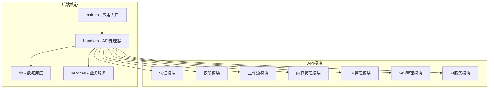
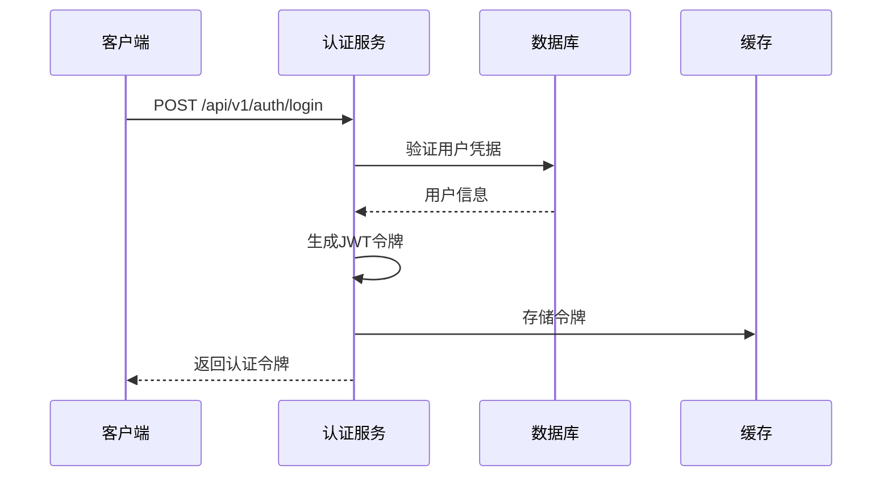
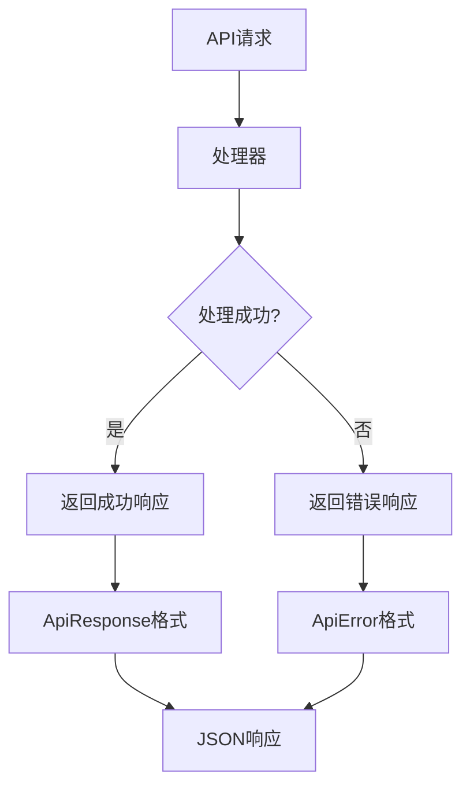
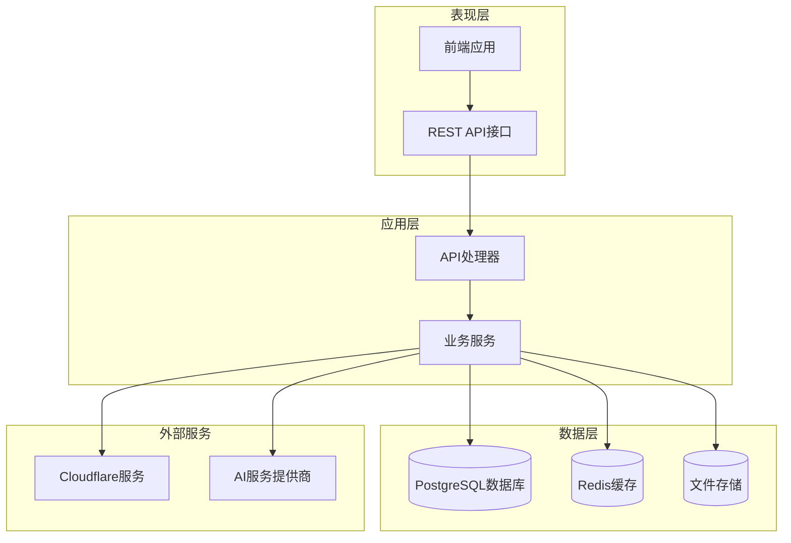
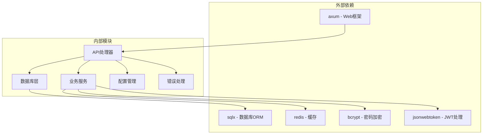

# API接口文档

<cite>
**本文档引用的文件**
- [main.rs](file://backend/core/src/main.rs)
- [auth.rs](file://backend/core/src/api/handlers/auth.rs)
- [user_role.rs](file://backend/core/src/api/handlers/user_role.rs)
- [role.rs](file://backend/core/src/api/handlers/role.rs)
- [workflow_engine.rs](file://backend/core/src/api/handlers/workflow_engine.rs)
- [workflow.rs](file://backend/core/src/api/handlers/workflow.rs)
- [cms.rs](file://backend/core/src/api/handlers/cms.rs)
- [hr.rs](file://backend/core/src/api/handlers/hr.rs)
- [gis.rs](file://backend/core/src/api/handlers/gis.rs)
- [organization.rs](file://backend/core/src/api/handlers/organization.rs)
- [dict.rs](file://backend/core/src/api/handlers/dict.rs)
- [dashboard.rs](file://backend/core/src/api/handlers/dashboard.rs)
- [website.rs](file://backend/core/src/api/handlers/website.rs)
- [schedule.rs](file://backend/core/src/api/handlers/schedule.rs)
- [help.rs](file://backend/core/src/api/handlers/help.rs)
- [ai.rs](file://backend/core/src/api/handlers/ai.rs)
- [approval_comment.rs](file://backend/core/src/api/handlers/approval_comment.rs)
</cite>

## 目录
1. [简介](#简介)
2. [项目结构](#项目结构)
3. [核心组件](#核心组件)
4. [架构概览](#架构概览)
5. [详细组件分析](#详细组件分析)
6. [依赖关系分析](#依赖关系分析)
7. [性能考虑](#性能考虑)
8. [故障排除指南](#故障排除指南)
9. [结论](#结论)

## 简介

POMP系统是一个基于Rust和Axum框架构建的企业管理系统后端服务。该系统提供了完整的API接口文档，涵盖了用户认证、权限管理、工作流管理、内容管理、HR管理、GIS管理、AI服务等多个业务模块。

系统采用RESTful API设计，支持JSON格式的数据交换，具有良好的扩展性和安全性。所有API接口都遵循统一的响应格式，包含状态码、消息和数据结构。

## 项目结构

后端服务采用模块化设计，主要分为以下几个核心部分：



**图表来源**
- [main.rs:1-372](file://backend/core/src/main.rs#L1-L372)
- [auth.rs:1-640](file://backend/core/src/api/handlers/auth.rs#L1-L640)

**章节来源**
- [main.rs:1-372](file://backend/core/src/main.rs#L1-L372)

## 核心组件

### API版本管理

系统采用 `/api/v1/` 版本前缀，确保API的向后兼容性和版本演进能力：

- **版本策略**: 所有API路径均以 `/api/v1/` 开头
- **兼容性保证**: 新增功能不影响现有API
- **废弃处理**: 通过版本迁移策略处理过时接口

### 认证机制

系统采用JWT（JSON Web Token）进行用户认证：



**图表来源**
- [auth.rs:82-202](file://backend/core/src/api/handlers/auth.rs#L82-L202)

### 错误处理

系统采用统一的错误响应格式：



**图表来源**
- [auth.rs:14-18](file://backend/core/src/api/handlers/auth.rs#L14-L18)

**章节来源**
- [auth.rs:1-640](file://backend/core/src/api/handlers/auth.rs#L1-L640)

## 架构概览

系统采用分层架构设计，各层职责明确：



**图表来源**
- [main.rs:42-270](file://backend/core/src/main.rs#L42-L270)

## 详细组件分析

### 用户认证接口

#### 登录接口
- **方法**: POST
- **路径**: `/api/v1/auth/login`
- **请求体**:
  ```json
  {
    "username": "string",
    "password": "string"
  }
  ```
- **响应体**:
  ```json
  {
    "code": 200,
    "message": "登录成功",
    "data": {
      "token": "string",
      "user": {
        "id": "uuid",
        "username": "string",
        "email": "string",
        "name": "string",
        "phone": "string",
        "avatar": "string",
        "is_superuser": true,
        "is_active": true,
        "status": "string",
        "must_change_password": false,
        "password_changed_at": "datetime",
        "last_login_at": "datetime",
        "created_at": "datetime",
        "updated_at": "datetime"
      }
    }
  }
  ```

#### 注册接口
- **方法**: POST
- **路径**: `/api/v1/auth/register`
- **请求体**:
  ```json
  {
    "username": "string",
    "password": "string",
    "email": "string",
    "name": "string"
  }
  ```

#### 修改密码接口
- **方法**: POST
- **路径**: `/api/v1/auth/change-password`
- **请求头**: `Authorization: Bearer <token>`
- **请求体**:
  ```json
  {
    "old_password": "string",
    "new_password": "string"
  }
  ```

**章节来源**
- [auth.rs:82-333](file://backend/core/src/api/handlers/auth.rs#L82-L333)

### 权限管理接口

#### 角色管理
- **获取所有角色**: GET `/api/v1/roles`
- **创建角色**: POST `/api/v1/roles`
- **获取角色详情**: GET `/api/v1/roles/{id}`
- **更新角色**: PUT `/api/v1/roles/{id}`
- **删除角色**: DELETE `/api/v1/roles/{id}`

#### 权限分配
- **获取角色权限**: GET `/api/v1/roles/{id}/permissions`
- **分配权限**: POST `/api/v1/roles/{id}/permissions`

#### 用户角色管理
- **获取用户角色**: GET `/api/v1/users/{user_id}/roles`
- **分配用户角色**: POST `/api/v1/users/{user_id}/roles`
- **移除用户角色**: DELETE `/api/v1/users/{user_id}/roles/{role_id}`
- **检查管理员权限**: GET `/api/v1/users/{user_id}/check-admin`

**章节来源**
- [role.rs:35-251](file://backend/core/src/api/handlers/role.rs#L35-L251)
- [user_role.rs:27-117](file://backend/core/src/api/handlers/user_role.rs#L27-L117)

### 工作流接口

#### 工作流引擎
- **获取所有工作流**: GET `/api/v1/workflows`
- **创建工作流**: POST `/api/v1/workflows`
- **获取工作流详情**: GET `/api/v1/workflows/{id}`
- **更新工作流**: PUT `/api/v1/workflows/{id}`
- **删除工作流**: DELETE `/api/v1/workflows/{id}`

#### 工作流步骤管理
- **获取工作流步骤**: GET `/api/v1/workflows/{id}/steps`
- **调整审批人**: POST `/api/v1/workflow-steps/adjust-approver`
- **调整超时设置**: POST `/api/v1/workflow-steps/adjust-timeout`

#### 审批任务
- **创建审批任务**: POST `/api/v1/approval/tasks`
- **获取所有任务**: GET `/api/v1/approval/tasks`
- **获取任务详情**: GET `/api/v1/approval/tasks/{id}`
- **审批任务**: POST `/api/v1/approval/tasks/{id}/approve`
- **拒绝任务**: POST `/api/v1/approval/tasks/{id}/reject`

#### 审批模板
- **获取模板列表**: GET `/api/v1/approval/templates`
- **创建模板**: POST `/api/v1/approval/templates`
- **删除模板**: DELETE `/api/v1/approval/templates/{id}`
- **应用模板**: POST `/api/v1/approval/templates/{id}/apply`

**章节来源**
- [workflow_engine.rs:28-474](file://backend/core/src/api/handlers/workflow_engine.rs#L28-L474)

### 内容管理接口

#### CMS文章管理
- **获取文章分类**: GET `/api/v1/cms/categories`
- **创建文章分类**: POST `/api/v1/cms/categories`
- **获取文章列表**: GET `/api/v1/cms/articles`
- **创建文章**: POST `/api/v1/cms/articles`
- **获取文章详情**: GET `/api/v1/cms/articles/{id}`
- **更新文章**: PUT `/api/v1/cms/articles/{id}`
- **提交审核**: POST `/api/v1/cms/articles/{id}/submit-review`
- **审核文章**: POST `/api/v1/cms/articles/{id}/review`
- **获取文章审核记录**: GET `/api/v1/cms/articles/{id}/reviews`
- **获取待审核文章**: GET `/api/v1/cms/articles/pending-review`
- **获取已审核文章**: GET `/api/v1/cms/articles/reviewed`

#### 公开CMS接口
- **获取公开文章**: GET `/api/v1/cms/public/articles`

**章节来源**
- [cms.rs:29-337](file://backend/core/src/api/handlers/cms.rs#L29-L337)

### HR管理接口

#### 员工管理
- **获取员工列表**: GET `/api/v1/hr/employees`
- **创建员工**: POST `/api/v1/hr/employees`
- **获取员工详情**: GET `/api/v1/hr/employees/{id}`
- **更新员工**: PUT `/api/v1/hr/employees/{id}`
- **删除员工**: DELETE `/api/v1/hr/employees/{id}`

#### 考勤管理
- **员工签到**: POST `/api/v1/hr/attendance/check-in`
- **员工签退**: POST `/api/v1/hr/attendance/check-out`
- **获取考勤记录**: GET `/api/v1/hr/attendance/records`
- **获取今日考勤**: GET `/api/v1/hr/attendance/today`
- **获取考勤统计**: GET `/api/v1/hr/attendance/statistics`
- **获取月度考勤**: GET `/api/v1/hr/attendance/month`

#### 请假管理
- **创建请假申请**: POST `/api/v1/hr/leave`
- **获取请假记录**: GET `/api/v1/hr/leave`

**章节来源**
- [hr.rs:71-800](file://backend/core/src/api/handlers/hr.rs#L71-L800)

### GIS管理接口

#### 客户管理
- **获取客户列表**: GET `/api/v1/gis/customers`
- **创建客户**: POST `/api/v1/gis/customers`
- **获取客户详情**: GET `/api/v1/gis/customers/{id}`
- **更新客户**: PUT `/api/v1/gis/customers/{id}`
- **删除客户**: DELETE `/api/v1/gis/customers/{id}`

#### 项目管理
- **获取项目列表**: GET `/api/v1/gis/projects`
- **创建项目**: POST `/api/v1/gis/projects`
- **获取项目详情**: GET `/api/v1/gis/projects/{id}`
- **更新项目**: PUT `/api/v1/gis/projects/{id}`
- **删除项目**: DELETE `/api/v1/gis/projects/{id}`

#### 仓库管理
- **获取仓库列表**: GET `/api/v1/gis/warehouses`
- **创建仓库**: POST `/api/v1/gis/warehouses`
- **获取仓库详情**: GET `/api/v1/gis/warehouses/{id}`
- **更新仓库**: PUT `/api/v1/gis/warehouses/{id}`
- **删除仓库**: DELETE `/api/v1/gis/warehouses/{id}`

#### 人员管理
- **获取人员列表**: GET `/api/v1/gis/personnel`
- **创建人员**: POST `/api/v1/gis/personnel`
- **获取人员详情**: GET `/api/v1/gis/personnel/{id}`
- **更新人员**: PUT `/api/v1/gis/personnel/{id}`
- **删除人员**: DELETE `/api/v1/gis/personnel/{id}`
- **更新人员位置**: PUT `/api/v1/gis/personnel/{id}/location`

**章节来源**
- [gis.rs:27-290](file://backend/core/src/api/handlers/gis.rs#L27-L290)

### 组织架构接口

#### 部门管理
- **获取部门列表**: GET `/api/v1/departments`
- **创建部门**: POST `/api/v1/departments`
- **获取部门详情**: GET `/api/v1/departments/{id}`
- **更新部门**: PUT `/api/v1/departments/{id}`
- **删除部门**: DELETE `/api/v1/departments/{id}`
- **获取部门子部门**: GET `/api/v1/departments/{id}/children`
- **更新部门状态**: PATCH `/api/v1/departments/{id}/status`

#### 职位管理
- **获取职位列表**: GET `/api/v1/organization/positions`
- **创建职位**: POST `/api/v1/organization/positions`
- **获取职位详情**: GET `/api/v1/organization/positions/{id}`
- **更新职位**: PUT `/api/v1/organization/positions/{id}`
- **删除职位**: DELETE `/api/v1/organization/positions/{id}`

#### 职位级别管理
- **获取职位级别列表**: GET `/api/v1/organization/position-levels`
- **创建职位级别**: POST `/api/v1/organization/position-levels`
- **获取职位级别详情**: GET `/api/v1/organization/position-levels/{id}`
- **更新职位级别**: PUT `/api/v1/organization/position-levels/{id}`
- **删除职位级别**: DELETE `/api/v1/organization/position-levels/{id}`

#### 审批规则管理
- **获取审批规则列表**: GET `/api/v1/organization/approval-rules`
- **创建审批规则**: POST `/api/v1/organization/approval-rules`
- **获取审批规则详情**: GET `/api/v1/organization/approval-rules/{id}`
- **更新审批规则**: PUT `/api/v1/organization/approval-rules/{id}`
- **删除审批规则**: DELETE `/api/v1/organization/approval-rules/{id}`

**章节来源**
- [organization.rs:53-748](file://backend/core/src/api/handlers/organization.rs#L53-L748)

### 字典管理接口

#### 字典类型管理
- **获取字典类型**: GET `/api/v1/dicts/categories`
- **创建字典类型**: POST `/api/v1/dicts/categories`
- **按编码获取字典类型**: GET `/api/v1/dicts/categories/{code}`
- **按分类获取字典项**: GET `/api/v1/dicts/categories/{code}/items`
- **获取字典项列表**: GET `/api/v1/dicts/items`
- **创建字典项**: POST `/api/v1/dicts/items`
- **获取所有字典**: GET `/api/v1/dicts/all`
- **初始化默认字典**: POST `/api/v1/dicts/init`
- **初始化默认字典**: POST `/api/v1/dicts/init-defaults`

**章节来源**
- [dict.rs:29-178](file://backend/core/src/api/handlers/dict.rs#L29-L178)

### 仪表板接口

#### 统计数据
- **获取仪表板统计**: GET `/api/v1/dashboard/stats`
- **获取生产趋势**: GET `/api/v1/dashboard/production-trend`
- **获取部门分布**: GET `/api/v1/dashboard/department-distribution`
- **获取考勤汇总**: GET `/api/v1/dashboard/attendance-summary`
- **获取审批统计**: GET `/api/v1/dashboard/approval-stats`
- **获取请假类型分布**: GET `/api/v1/dashboard/leave-type-distribution`

**章节来源**
- [dashboard.rs:49-298](file://backend/core/src/api/handlers/dashboard.rs#L49-L298)

### 网站管理接口

#### 网站设置
- **获取网站设置**: GET `/api/v1/website/settings`
- **更新网站设置**: PUT `/api/v1/website/settings`

#### 网站生成
- **生成静态网站**: POST `/api/v1/website/generate`
- **预览网站**: POST `/api/v1/website/preview`

#### 网站部署
- **部署网站**: POST `/api/v1/website/deploy`
- **获取部署历史**: GET `/api/v1/website/deployments`

**章节来源**
- [website.rs:79-567](file://backend/core/src/api/handlers/website.rs#L79-L567)

### 日程管理接口

#### 日程事件
- **获取日程列表**: GET `/api/v1/schedule/events`
- **创建日程**: POST `/api/v1/schedule/events`
- **获取日程详情**: GET `/api/v1/schedule/events/{id}`
- **更新日程**: PUT `/api/v1/schedule/events/{id}`
- **删除日程**: DELETE `/api/v1/schedule/events/{id}`

**章节来源**
- [schedule.rs:63-260](file://backend/core/src/api/handlers/schedule.rs#L63-L260)

### 帮助中心接口

#### 分类管理
- **获取分类列表**: GET `/api/v1/help/categories`
- **创建分类**: POST `/api/v1/help/categories`
- **获取分类详情**: GET `/api/v1/help/categories/{id}`
- **更新分类**: PUT `/api/v1/help/categories/{id}`
- **删除分类**: DELETE `/api/v1/help/categories/{id}`
- **获取分类及文章**: GET `/api/v1/help/categories/{id}/articles`

#### 文章管理
- **获取文章列表**: GET `/api/v1/help/articles`
- **创建文章**: POST `/api/v1/help/articles`
- **获取文章详情**: GET `/api/v1/help/articles/{id}`
- **更新文章**: PUT `/api/v1/help/articles/{id}`
- **删除文章**: DELETE `/api/v1/help/articles/{id}`
- **按Slug获取文章**: GET `/api/v1/help/articles/slug/{slug}`
- **搜索文章**: GET `/api/v1/help/search`
- **初始化默认帮助内容**: POST `/api/v1/help/init`
- **初始化默认帮助内容**: POST `/api/v1/help/init-defaults`

**章节来源**
- [help.rs:30-186](file://backend/core/src/api/handlers/help.rs#L30-L186)

### AI服务接口

#### 图像生成
- **生成图像**: POST `/api/v1/ai/generate-image`
- **请求体**:
  ```json
  {
    "prompt": "string",
    "width": 512,
    "height": 512,
    "num_images": 1,
    "style": "string"
  }
  ```
- **响应体**:
  ```json
  {
    "images": ["string"],
    "backend": "string",
    "prompt": "string"
  }
  ```

#### AI服务状态
- **获取AI服务状态**: GET `/api/v1/ai/status`

#### 文档AI优化
- **文档AI优化**: POST `/api/v1/document-ai/optimize`
- **请求体**:
  ```json
  {
    "content": "string",
    "doc_type": "string"
  }
  ```

**章节来源**
- [ai.rs:38-100](file://backend/core/src/api/handlers/ai.rs#L38-L100)

### 审批意见AI接口

#### 生成审批意见
- **生成审批意见**: POST `/api/v1/approval-comment/generate`
- **请求体**:
  ```json
  {
    "application_content": "string",
    "decision": "string",
    "tone": "string",
    "length": "string",
    "style": "string",
    "approval_type": "string",
    "applicant_name": "string"
  }
  ```

#### 优化审批意见
- **优化审批意见**: POST `/api/v1/approval-comment/optimize`
- **请求体**:
  ```json
  {
    "original_comment": "string",
    "application_content": "string",
    "decision": "string",
    "style": "string"
  }
  ```

**章节来源**
- [approval_comment.rs:32-106](file://backend/core/src/api/handlers/approval_comment.rs#L32-L106)

## 依赖关系分析

系统各模块之间的依赖关系如下：



**图表来源**
- [Cargo.toml:15-49](file://backend/core/Cargo.toml#L15-L49)

**章节来源**
- [Cargo.toml:15-49](file://backend/core/Cargo.toml#L15-L49)

## 性能考虑

### 缓存策略
- **Redis缓存**: 用户会话和热点数据缓存
- **数据库连接池**: 连接复用和并发控制
- **响应缓存**: 静态数据和查询结果缓存

### 数据库优化
- **索引优化**: 关键查询字段建立索引
- **分页查询**: 大数据量场景下的分页处理
- **批量操作**: 减少数据库往返次数

### API优化
- **请求验证**: 输入参数验证和过滤
- **错误处理**: 统一的错误响应格式
- **资源限制**: 请求频率和大小限制

## 故障排除指南

### 常见错误类型

#### 认证相关错误
- **401 未授权**: 无效的JWT令牌或缺少认证头
- **403 禁止访问**: 用户权限不足
- **422 参数验证失败**: 请求参数格式不正确

#### 数据库相关错误
- **500 服务器内部错误**: 数据库连接失败或查询异常
- **409 冲突**: 数据重复或约束冲突

#### 业务逻辑错误
- **404 资源不存在**: 请求的资源ID无效
- **429 请求过于频繁**: 超过API速率限制

### 调试建议

1. **启用调试日志**: 在开发环境中启用详细的日志输出
2. **检查环境变量**: 确保所有必需的环境变量已正确配置
3. **验证数据库连接**: 检查PostgreSQL和Redis连接状态
4. **测试API端点**: 使用curl或Postman测试关键API端点

**章节来源**
- [auth.rs:136-202](file://backend/core/src/api/handlers/auth.rs#L136-L202)

## 结论

POMP系统的API接口设计遵循RESTful原则，具有良好的模块化结构和清晰的职责分离。系统提供了全面的企业管理功能，涵盖了从用户认证到业务流程管理的各个方面。

通过统一的响应格式、完善的错误处理机制和灵活的权限控制，该系统为前端开发者和第三方集成者提供了可靠的API使用体验。同时，系统的版本管理和向后兼容性策略确保了API的长期稳定性和可维护性。

建议在实际使用中：
1. 严格遵守API文档中的参数规范
2. 正确处理各种状态码和错误响应
3. 合理使用缓存和分页机制
4. 及时关注API版本更新和废弃接口迁移