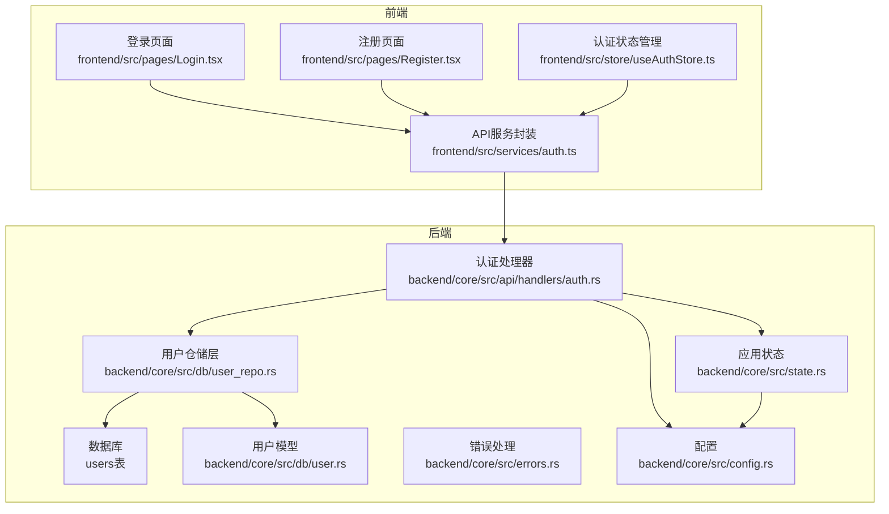
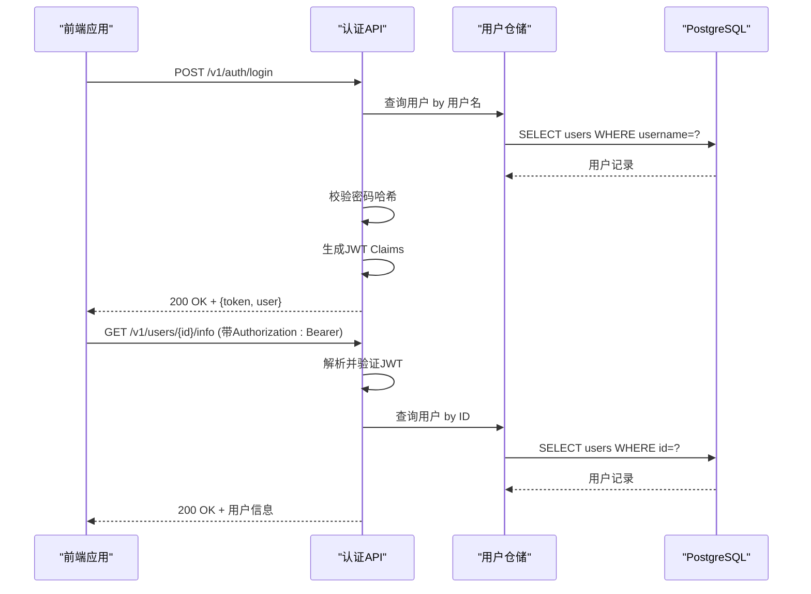
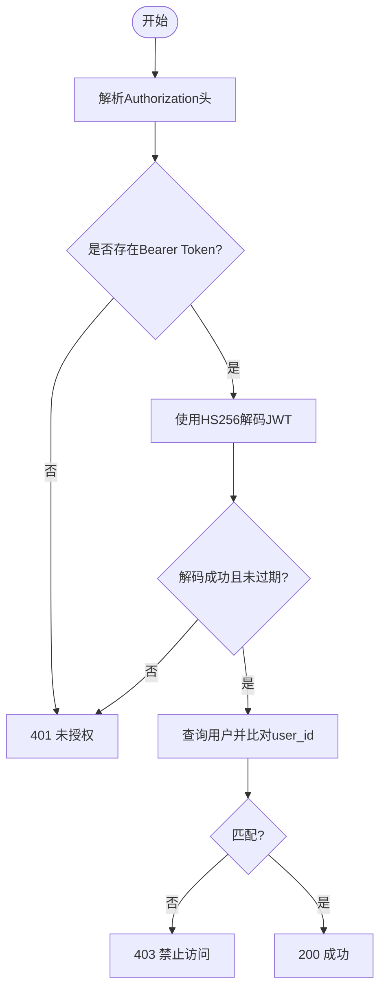
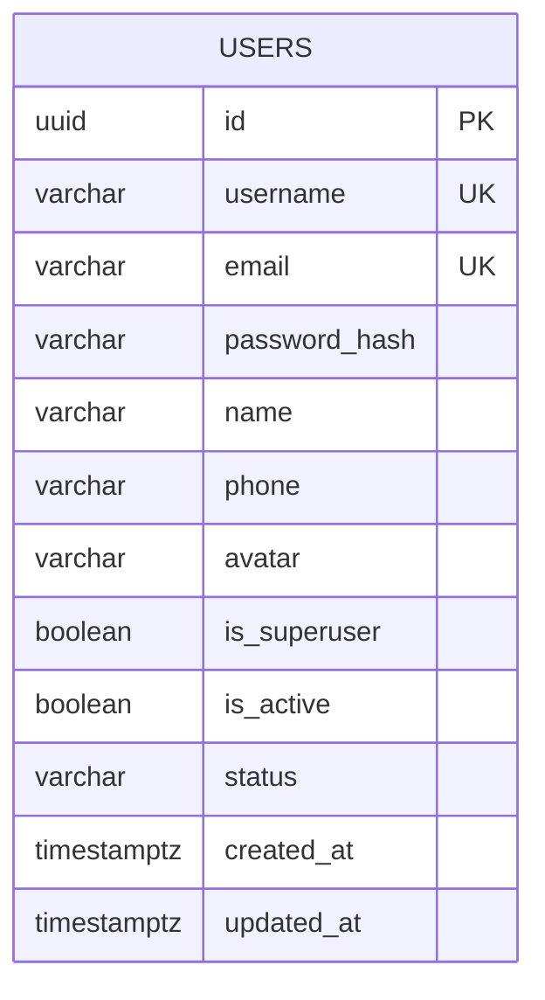
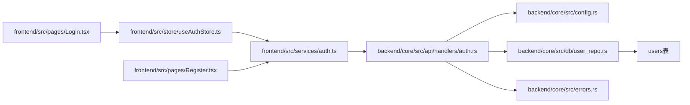

# 用户认证接口

<cite>
**本文档引用的文件**
- [backend/core/src/api/handlers/auth.rs](file://backend/core/src/api/handlers/auth.rs)
- [backend/core/src/db/user.rs](file://backend/core/src/db/user.rs)
- [backend/core/src/db/user_repo.rs](file://backend/core/src/db/user_repo.rs)
- [backend/core/src/config.rs](file://backend/core/src/config.rs)
- [backend/core/src/state.rs](file://backend/core/src/state.rs)
- [backend/core/src/errors.rs](file://backend/core/src/errors.rs)
- [backend/core/sqlx/migrations/00000000000000_create_users_table.up.sql](file://backend/core/sqlx/migrations/00000000000000_create_users_table.up.sql)
- [frontend/src/services/auth.ts](file://frontend/src/services/auth.ts)
- [frontend/src/store/useAuthStore.ts](file://frontend/src/store/useAuthStore.ts)
- [frontend/src/pages/Login.tsx](file://frontend/src/pages/Login.tsx)
- [frontend/src/pages/Register.tsx](file://frontend/src/pages/Register.tsx)
- [frontend/src/components/ProtectedRoute.tsx](file://frontend/src/components/ProtectedRoute.tsx)
</cite>

## 目录
1. [简介](#简介)
2. [项目结构](#项目结构)
3. [核心组件](#核心组件)
4. [架构总览](#架构总览)
5. [详细接口文档](#详细接口文档)
6. [依赖关系分析](#依赖关系分析)
7. [性能考量](#性能考量)
8. [故障排查指南](#故障排查指南)
9. [结论](#结论)

## 简介
本文件为用户认证系统的完整API接口文档，覆盖登录、注册、密码修改、用户信息查询等认证相关接口。重点说明JWT令牌的生成、验证与刷新机制，以及前后端交互流程。同时提供请求参数、响应格式、状态码、错误处理示例，并给出安全注意事项（密码加密、CSRF防护、会话管理等）。

## 项目结构
认证系统由后端Rust服务与前端TypeScript/React组成，采用Axum框架提供REST API，PostgreSQL存储用户数据，bcrypt进行密码哈希，jsonwebtoken实现JWT令牌签发与校验。

**图表来源**
- [frontend/src/pages/Login.tsx:1-115](file://frontend/src/pages/Login.tsx#L1-L115)
- [frontend/src/pages/Register.tsx:1-183](file://frontend/src/pages/Register.tsx#L1-L183)
- [frontend/src/store/useAuthStore.ts:1-147](file://frontend/src/store/useAuthStore.ts#L1-L147)
- [frontend/src/services/auth.ts:1-133](file://frontend/src/services/auth.ts#L1-L133)
- [backend/core/src/api/handlers/auth.rs:1-640](file://backend/core/src/api/handlers/auth.rs#L1-L640)
- [backend/core/src/db/user_repo.rs:1-541](file://backend/core/src/db/user_repo.rs#L1-L541)
- [backend/core/src/db/user.rs:1-55](file://backend/core/src/db/user.rs#L1-L55)
- [backend/core/src/config.rs:1-116](file://backend/core/src/config.rs#L1-L116)
- [backend/core/src/state.rs:1-88](file://backend/core/src/state.rs#L1-L88)
- [backend/core/src/errors.rs:1-106](file://backend/core/src/errors.rs#L1-L106)
- [backend/core/sqlx/migrations/00000000000000_create_users_table.up.sql:1-26](file://backend/core/sqlx/migrations/00000000000000_create_users_table.up.sql#L1-L26)

**章节来源**
- [backend/core/src/api/handlers/auth.rs:1-640](file://backend/core/src/api/handlers/auth.rs#L1-L640)
- [frontend/src/services/auth.ts:1-133](file://frontend/src/services/auth.ts#L1-L133)

## 核心组件
- 认证处理器：提供登录、注册、密码修改、用户信息查询等接口，负责JWT签发与校验。
- 用户仓储层：封装数据库操作，包括用户查询、创建、更新、审批等。
- 用户模型：定义数据库字段与序列化结构。
- 配置模块：读取JWT密钥、过期时长、数据库连接等配置。
- 应用状态：聚合配置、数据库连接池、Redis客户端等全局资源。
- 错误处理：统一返回格式与HTTP状态映射。

**章节来源**
- [backend/core/src/api/handlers/auth.rs:73-80](file://backend/core/src/api/handlers/auth.rs#L73-L80)
- [backend/core/src/db/user_repo.rs:1-541](file://backend/core/src/db/user_repo.rs#L1-L541)
- [backend/core/src/db/user.rs:5-22](file://backend/core/src/db/user.rs#L5-L22)
- [backend/core/src/config.rs:3-46](file://backend/core/src/config.rs#L3-L46)
- [backend/core/src/state.rs:10-20](file://backend/core/src/state.rs#L10-L20)
- [backend/core/src/errors.rs:82-105](file://backend/core/src/errors.rs#L82-L105)

## 架构总览
后端通过Axum路由分发到认证处理器，处理器调用仓储层访问数据库；前端通过API服务封装调用后端接口，使用本地存储保存JWT并在请求头中携带。

**图表来源**
- [backend/core/src/api/handlers/auth.rs:82-202](file://backend/core/src/api/handlers/auth.rs#L82-L202)
- [backend/core/src/db/user_repo.rs:117-141](file://backend/core/src/db/user_repo.rs#L117-L141)
- [frontend/src/services/auth.ts:72-75](file://frontend/src/services/auth.ts#L72-L75)
- [frontend/src/services/auth.ts:124-127](file://frontend/src/services/auth.ts#L124-L127)

## 详细接口文档

### 登录接口
- 方法与路径
  - POST /v1/auth/login
- 请求体
  - username: 字符串，必填
  - password: 字符串，必填
- 响应体
  - 成功：包含token与user对象
  - 失败：错误信息
- 状态码
  - 200：登录成功
  - 401：用户名或密码错误
  - 403：用户未激活
  - 500：服务器内部错误
- 安全说明
  - 使用HS256算法签名JWT，密钥来自配置
  - 密码使用bcrypt校验
- 请求示例
  - POST /v1/auth/login
  - Body: {"username":"demo","password":"password"}
- 响应示例
  - 成功：{"success":true,"data":{"token":"...","user":{...}},"error":null}
  - 失败：{"success":false,"data":null,"error":"Invalid username or password"}

**章节来源**
- [backend/core/src/api/handlers/auth.rs:82-202](file://backend/core/src/api/handlers/auth.rs#L82-L202)
- [backend/core/src/config.rs:14-18](file://backend/core/src/config.rs#L14-L18)
- [backend/core/src/db/user_repo.rs:117-141](file://backend/core/src/db/user_repo.rs#L117-L141)

### 注册接口
- 方法与路径
  - POST /v1/auth/register
- 请求体
  - username: 字符串，必填
  - password: 字符串，必填（至少6位）
  - email: 字符串，可选
  - name: 字符串，可选
- 响应体
  - 成功：包含用户信息与提示消息
  - 失败：错误信息
- 状态码
  - 201：注册成功（等待审批）
  - 400：用户名或邮箱已存在
  - 500：服务器内部错误
- 安全说明
  - 密码使用bcrypt哈希存储
  - 用户初始状态为pending，需管理员审批

**章节来源**
- [backend/core/src/api/handlers/auth.rs:297-333](file://backend/core/src/api/handlers/auth.rs#L297-L333)
- [backend/core/src/db/user_repo.rs:502-520](file://backend/core/src/db/user_repo.rs#L502-L520)

### 修改密码接口
- 方法与路径
  - POST /v1/auth/change-password
- 请求头
  - Authorization: Bearer {token}
- 请求体
  - old_password: 字符串，必填
  - new_password: 字符串，必填（至少6位）
- 响应体
  - 成功：{"message":"密码修改成功"}
  - 失败：错误信息
- 状态码
  - 200：修改成功
  - 400：旧密码错误或新密码不符合要求
  - 401：未授权（Token无效）
  - 404：用户不存在
  - 500：服务器内部错误
- 安全说明
  - 通过Authorization头传递JWT
  - 旧密码校验通过后对新密码进行bcrypt哈希

**章节来源**
- [backend/core/src/api/handlers/auth.rs:210-295](file://backend/core/src/api/handlers/auth.rs#L210-L295)

### 获取用户信息接口
- 方法与路径
  - GET /v1/users/{id}/info
- 请求头
  - Authorization: Bearer {token}
- 路径参数
  - id: 用户UUID
- 响应体
  - 成功：用户信息
  - 失败：错误信息
- 状态码
  - 200：获取成功
  - 401：未授权（Token无效或无Authorization头）
  - 403：Token有效但非本人信息
  - 500：服务器内部错误
- 安全说明
  - 仅允许本人查询自身信息
  - 通过claims.user_id与路径参数比对

**章节来源**
- [backend/core/src/api/handlers/auth.rs:335-370](file://backend/core/src/api/handlers/auth.rs#L335-L370)

### JWT令牌机制
- 生成
  - Claims包含sub、user_id、is_superuser、iat、exp
  - 使用HS256算法与配置中的jwt_secret签名
- 验证
  - 从Authorization头解析Bearer Token
  - 使用相同密钥与算法进行解码与校验
- 刷新
  - 当前代码未实现专用“刷新令牌”接口
  - 建议在前端到期前主动重新登录以获取新token
- 存储
  - 前端使用localStorage存储token与token_type
  - 请求时自动附加Authorization头

**图表来源**
- [backend/core/src/api/handlers/auth.rs:227-236](file://backend/core/src/api/handlers/auth.rs#L227-L236)
- [backend/core/src/api/handlers/auth.rs:344-356](file://backend/core/src/api/handlers/auth.rs#L344-L356)

**章节来源**
- [backend/core/src/api/handlers/auth.rs:73-80](file://backend/core/src/api/handlers/auth.rs#L73-L80)
- [backend/core/src/config.rs:14-18](file://backend/core/src/config.rs#L14-L18)
- [frontend/src/store/useAuthStore.ts:63-89](file://frontend/src/store/useAuthStore.ts#L63-L89)

### 数据模型与数据库结构
- 用户表结构（users）
  - 字段：id、username、email、password_hash、name、phone、avatar、is_superuser、is_active、status、created_at、updated_at
  - 索引：username、email、is_active、status、created_at
- 用户模型映射
  - Rust侧User结构与数据库字段一一对应
  - 前端User接口与后端UserResponse保持兼容

**图表来源**
- [backend/core/sqlx/migrations/00000000000000_create_users_table.up.sql:4-18](file://backend/core/sqlx/migrations/00000000000000_create_users_table.up.sql#L4-L18)
- [backend/core/src/db/user.rs:5-22](file://backend/core/src/db/user.rs#L5-L22)

**章节来源**
- [backend/core/sqlx/migrations/00000000000000_create_users_table.up.sql:1-26](file://backend/core/sqlx/migrations/00000000000000_create_users_table.up.sql#L1-L26)
- [backend/core/src/db/user.rs:5-22](file://backend/core/src/db/user.rs#L5-L22)

## 依赖关系分析
- 认证处理器依赖配置模块读取JWT密钥与过期时长，依赖仓储层访问数据库，依赖错误模块统一返回格式。
- 前端认证状态管理依赖API服务封装，API服务封装依赖Axios客户端，页面组件依赖状态管理与UI组件库。

**图表来源**
- [frontend/src/services/auth.ts:1-133](file://frontend/src/services/auth.ts#L1-L133)
- [frontend/src/store/useAuthStore.ts:1-147](file://frontend/src/store/useAuthStore.ts#L1-L147)
- [frontend/src/pages/Login.tsx:1-115](file://frontend/src/pages/Login.tsx#L1-L115)
- [frontend/src/pages/Register.tsx:1-183](file://frontend/src/pages/Register.tsx#L1-L183)
- [backend/core/src/api/handlers/auth.rs:1-640](file://backend/core/src/api/handlers/auth.rs#L1-L640)
- [backend/core/src/config.rs:1-116](file://backend/core/src/config.rs#L1-L116)
- [backend/core/src/db/user_repo.rs:1-541](file://backend/core/src/db/user_repo.rs#L1-L541)
- [backend/core/src/errors.rs:1-106](file://backend/core/src/errors.rs#L1-L106)

**章节来源**
- [backend/core/src/state.rs:10-20](file://backend/core/src/state.rs#L10-L20)
- [backend/core/src/errors.rs:54-78](file://backend/core/src/errors.rs#L54-L78)

## 性能考量
- 数据库查询
  - 用户名与邮箱建立唯一索引，提升登录与注册时的重复检查效率
  - 分页查询支持大列表加载，避免一次性返回过多数据
- 密码哈希
  - bcrypt默认成本适中，兼顾安全性与性能
- JWT
  - HS256算法开销较小，适合高并发场景
  - 建议合理设置过期时长，避免频繁签发

[本节为通用指导，无需特定文件引用]

## 故障排查指南
- 登录失败（401）
  - 检查用户名与密码是否正确
  - 确认用户状态为已激活
- 未授权（401）
  - 确认Authorization头格式为Bearer {token}
  - 检查token是否过期或被篡改
- 禁止访问（403）
  - 确认请求的目标用户ID与token中的user_id一致
- 服务器错误（500）
  - 查看后端日志定位具体异常
  - 检查数据库连接与SQL执行情况

**章节来源**
- [backend/core/src/api/handlers/auth.rs:136-201](file://backend/core/src/api/handlers/auth.rs#L136-L201)
- [backend/core/src/api/handlers/auth.rs:335-370](file://backend/core/src/api/handlers/auth.rs#L335-L370)
- [backend/core/src/errors.rs:54-78](file://backend/core/src/errors.rs#L54-L78)

## 结论
本认证系统提供了完整的登录、注册、密码修改与用户信息查询能力，采用JWT进行无状态鉴权，bcrypt保障密码安全。前端通过状态管理与受保护路由实现会话控制。建议后续完善令牌刷新机制与CSRF防护策略，进一步提升安全性与用户体验。