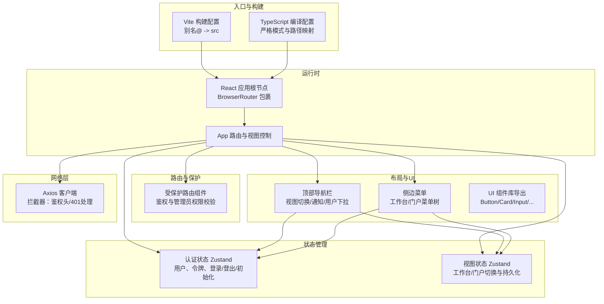
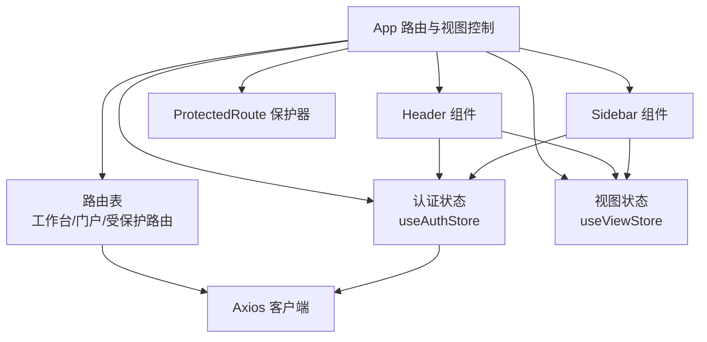
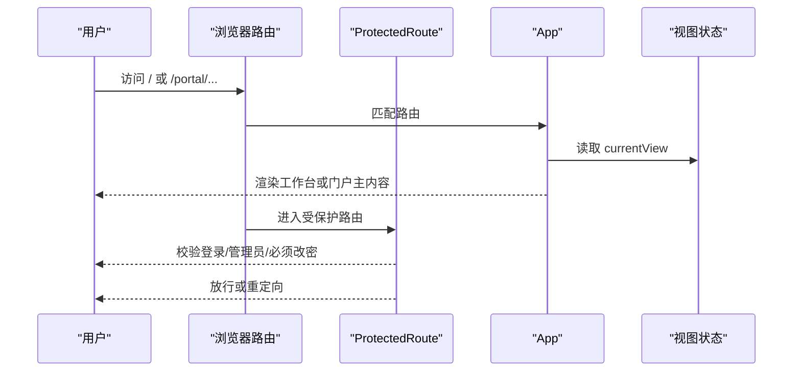
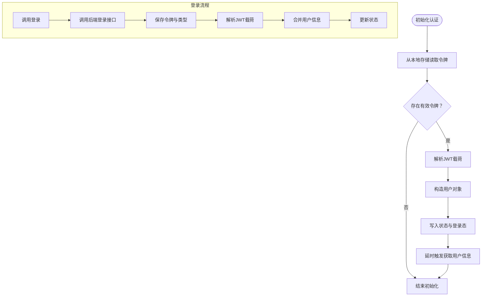
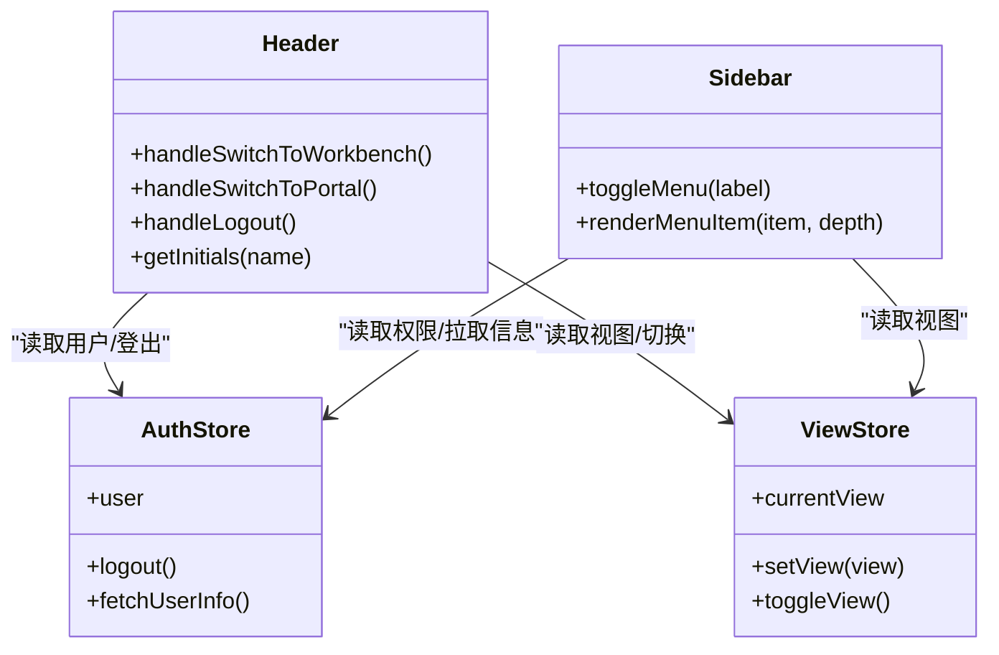
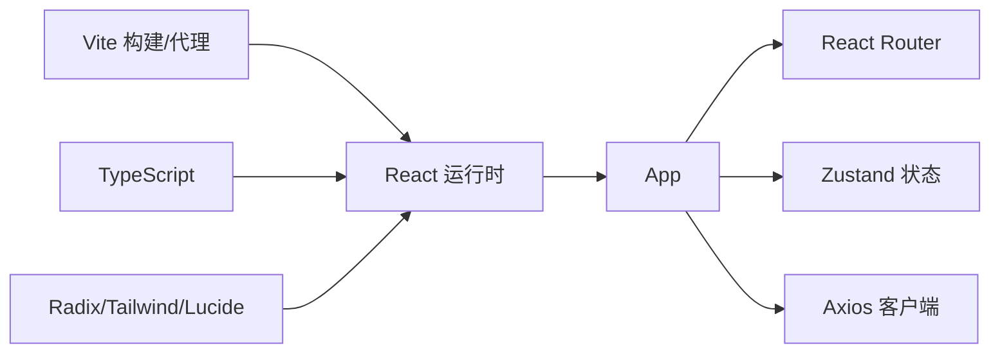

# 前端架构设计

<cite>
**本文档引用的文件**
- [package.json](file://frontend/package.json)
- [tsconfig.json](file://frontend/tsconfig.json)
- [vite.config.ts](file://frontend/vite.config.ts)
- [main.tsx](file://frontend/src/main.tsx)
- [App.tsx](file://frontend/src/App.tsx)
- [useAuthStore.ts](file://frontend/src/store/useAuthStore.ts)
- [useViewStore.ts](file://frontend/src/store/useViewStore.ts)
- [Header.tsx](file://frontend/src/components/layout/Header.tsx)
- [Sidebar.tsx](file://frontend/src/components/layout/Sidebar.tsx)
- [ProtectedRoute.tsx](file://frontend/src/components/ProtectedRoute.tsx)
- [ui/index.ts](file://frontend/src/components/ui/index.ts)
- [index.ts](file://frontend/src/types/index.ts)
- [utils.ts](file://frontend/src/lib/utils.ts)
- [client.ts](file://frontend/src/api/client.ts)
- [tailwind.config.js](file://frontend/tailwind.config.js)
</cite>

## 目录
1. [简介](#简介)
2. [项目结构](#项目结构)
3. [核心组件](#核心组件)
4. [架构总览](#架构总览)
5. [详细组件分析](#详细组件分析)
6. [依赖关系分析](#依赖关系分析)
7. [性能考虑](#性能考虑)
8. [故障排除指南](#故障排除指南)
9. [结论](#结论)
10. [附录](#附录)

## 简介
本文件面向POMP前端系统的架构设计与开发指导，围绕基于React + TypeScript的现代化前端体系展开，涵盖组件化设计理念、基础UI组件库、业务组件与页面组织、状态管理（Zustand）、路由系统、页面布局、响应式设计、TypeScript类型系统、组件通信与数据流、性能优化与最佳实践等内容。目标是帮助前端开发者快速理解并高效参与开发。

## 项目结构
前端采用Vite构建工具，React 18 + TypeScript作为核心框架，Tailwind CSS提供原子化样式，Radix UI提供无障碍基础组件，Zustand用于轻量状态管理，Axios封装HTTP客户端，并通过路由实现工作台与门户双视图模式。

**图表来源**
- [vite.config.ts:1-20](file://frontend/vite.config.ts#L1-L20)
- [tsconfig.json:1-25](file://frontend/tsconfig.json#L1-L25)
- [main.tsx:1-13](file://frontend/src/main.tsx#L1-L13)
- [App.tsx:1-356](file://frontend/src/App.tsx#L1-L356)
- [useAuthStore.ts:1-148](file://frontend/src/store/useAuthStore.ts#L1-L148)
- [useViewStore.ts:1-43](file://frontend/src/store/useViewStore.ts#L1-L43)
- [ProtectedRoute.tsx:1-30](file://frontend/src/components/ProtectedRoute.tsx#L1-L30)
- [Header.tsx:1-117](file://frontend/src/components/layout/Header.tsx#L1-L117)
- [Sidebar.tsx:1-308](file://frontend/src/components/layout/Sidebar.tsx#L1-L308)
- [client.ts:1-41](file://frontend/src/api/client.ts#L1-L41)

**章节来源**
- [package.json:1-60](file://frontend/package.json#L1-L60)
- [vite.config.ts:1-20](file://frontend/vite.config.ts#L1-L20)
- [tsconfig.json:1-25](file://frontend/tsconfig.json#L1-L25)
- [main.tsx:1-13](file://frontend/src/main.tsx#L1-L13)
- [App.tsx:1-356](file://frontend/src/App.tsx#L1-L356)

## 核心组件
- 路由与视图控制：App负责根据视图状态渲染工作台或门户主内容，并统一注册所有业务路由与通配符重定向。
- 受保护路由：ProtectedRoute对未登录、需改密、管理员权限进行校验，保障页面访问安全。
- 认证状态：useAuthStore管理登录态、用户信息、令牌解析与持久化，支持初始化、登录、登出、用户信息拉取。
- 视图状态：useViewStore管理当前视图类型（工作台/门户），并持久化到本地存储，支持切换与初始化标记。
- 布局组件：Header提供视图切换、搜索、通知与用户下拉；Sidebar根据当前视图与用户权限动态生成菜单树。
- UI组件库：通过集中导出统一暴露基础UI组件，便于跨页面复用。
- 类型系统：User、LoginRequest、LoginResponse、ApiResponse等接口定义贯穿API交互与状态模型。
- 网络层：Axios实例封装基础URL、超时、请求头注入与401自动跳转逻辑。

**章节来源**
- [App.tsx:1-356](file://frontend/src/App.tsx#L1-L356)
- [ProtectedRoute.tsx:1-30](file://frontend/src/components/ProtectedRoute.tsx#L1-L30)
- [useAuthStore.ts:1-148](file://frontend/src/store/useAuthStore.ts#L1-L148)
- [useViewStore.ts:1-43](file://frontend/src/store/useViewStore.ts#L1-L43)
- [Header.tsx:1-117](file://frontend/src/components/layout/Header.tsx#L1-L117)
- [Sidebar.tsx:1-308](file://frontend/src/components/layout/Sidebar.tsx#L1-L308)
- [ui/index.ts:1-14](file://frontend/src/components/ui/index.ts#L1-L14)
- [index.ts:1-32](file://frontend/src/types/index.ts#L1-L32)
- [client.ts:1-41](file://frontend/src/api/client.ts#L1-L41)

## 架构总览
系统采用“路由驱动 + 状态驱动”的双轴架构：
- 路由轴：以App为中心的路由表，按功能域划分工作台与门户两类页面，支持嵌套路由与参数化路由。
- 状态轴：以Zustand为核心的状态管理，分别维护认证态与视图态，二者共同决定主内容渲染与菜单展示。
- 布局轴：Header与Sidebar作为横纵布局组件，承载用户交互与导航。
- 网络轴：Axios拦截器统一处理鉴权头与401错误，确保会话一致性。

**图表来源**
- [App.tsx:1-356](file://frontend/src/App.tsx#L1-L356)
- [useAuthStore.ts:1-148](file://frontend/src/store/useAuthStore.ts#L1-L148)
- [useViewStore.ts:1-43](file://frontend/src/store/useViewStore.ts#L1-L43)
- [Header.tsx:1-117](file://frontend/src/components/layout/Header.tsx#L1-L117)
- [Sidebar.tsx:1-308](file://frontend/src/components/layout/Sidebar.tsx#L1-L308)
- [ProtectedRoute.tsx:1-30](file://frontend/src/components/ProtectedRoute.tsx#L1-L30)
- [client.ts:1-41](file://frontend/src/api/client.ts#L1-L41)

## 详细组件分析

### 路由系统与页面组织
- 根路由：登录、注册、修改密码、工作台首页、门户首页等。
- 工作台路由：用户管理、内容管理、网站管理、审批任务/历史、工作流设置、个人资料、HR管理、日程管理、系统配置中心、字典管理、角色管理、组织架构、生产文档管理、帮助中心、AI文档助手等。
- 门户路由：产品中心、公司概况、新闻公告、资质荣誉、联系我们、分类与文章详情等。
- 通配符：未匹配路由统一跳转至首页，避免白屏。
- 嵌套路由：审批、日程、生产文档等页面内部再细分标签页或子路由，提升用户体验。

**图表来源**
- [App.tsx:1-356](file://frontend/src/App.tsx#L1-L356)
- [ProtectedRoute.tsx:1-30](file://frontend/src/components/ProtectedRoute.tsx#L1-L30)
- [useViewStore.ts:1-43](file://frontend/src/store/useViewStore.ts#L1-L43)

**章节来源**
- [App.tsx:1-356](file://frontend/src/App.tsx#L1-L356)
- [ProtectedRoute.tsx:1-30](file://frontend/src/components/ProtectedRoute.tsx#L1-L30)

### 状态管理：Zustand 应用
- 认证状态（useAuthStore）
  - 数据：用户信息、令牌、登录态、取消控制器。
  - 行为：初始化（从本地存储与JWT解析恢复）、登录（写入令牌与用户信息）、登出（清理并中断请求）、获取用户信息（带中止控制与异常处理）、设置“必须改密”标志。
  - 复杂度：初始化O(1)，登录/登出O(1)，用户信息获取受网络影响。
- 视图状态（useViewStore）
  - 数据：currentView、isInitialized。
  - 行为：设置视图、切换视图、初始化标记；通过persist中间件持久化到localStorage。
  - 复杂度：O(1)。

**图表来源**
- [useAuthStore.ts:1-148](file://frontend/src/store/useAuthStore.ts#L1-L148)

**章节来源**
- [useAuthStore.ts:1-148](file://frontend/src/store/useAuthStore.ts#L1-L148)
- [useViewStore.ts:1-43](file://frontend/src/store/useViewStore.ts#L1-L43)

### 页面布局组件
- Header
  - 功能：视图切换按钮（工作台/门户）、搜索框、通知按钮、用户下拉菜单（个人资料、退出登录）。
  - 交互：根据视图状态与初始化状态控制按钮可用性；头像占位使用姓名首字母。
- Sidebar
  - 功能：根据currentView与用户权限动态生成菜单树；支持多级折叠；高亮当前路由。
  - 权限：requireAdmin字段控制管理员可见项；递归过滤空子菜单。
  - 用户信息：首次加载时拉取用户完整信息。

**图表来源**
- [Header.tsx:1-117](file://frontend/src/components/layout/Header.tsx#L1-L117)
- [Sidebar.tsx:1-308](file://frontend/src/components/layout/Sidebar.tsx#L1-L308)
- [useAuthStore.ts:1-148](file://frontend/src/store/useAuthStore.ts#L1-L148)
- [useViewStore.ts:1-43](file://frontend/src/store/useViewStore.ts#L1-L43)

**章节来源**
- [Header.tsx:1-117](file://frontend/src/components/layout/Header.tsx#L1-L117)
- [Sidebar.tsx:1-308](file://frontend/src/components/layout/Sidebar.tsx#L1-L308)

### 基础UI组件库
- 组件集合：Button、Card、Input、Label、Toast、Dialog、Switch、Badge、Textarea、Dropdown、Tabs、Checkbox、Chart容器与统计卡片等。
- 导出方式：通过集中导出文件统一暴露，便于按需引入与版本管理。
- 设计原则：基于Radix UI与Tailwind CSS，遵循可组合、可扩展、可定制的设计理念。

**章节来源**
- [ui/index.ts:1-14](file://frontend/src/components/ui/index.ts#L1-L14)

### TypeScript 类型系统
- 用户类型：User包含标识、凭证、属性与状态字段，覆盖登录态与权限需求。
- 登录请求/响应：LoginRequest与LoginResponse明确登录接口的数据契约。
- API响应：ApiResponse泛型封装通用响应结构，便于统一处理成功/失败与消息体。
- 严格编译：启用严格模式、未使用变量/参数检查、无switch穿透等规则，提升代码质量。

**章节来源**
- [index.ts:1-32](file://frontend/src/types/index.ts#L1-L32)
- [tsconfig.json:1-25](file://frontend/tsconfig.json#L1-L25)

### 网络层与安全
- Axios实例：基础URL指向代理前缀/api，统一超时与Content-Type。
- 请求拦截：自动注入Authorization头（Bearer令牌）。
- 响应拦截：401时清理本地令牌并跳转登录页（避免非登录页时的无限跳转）。
- 中止控制：用户信息获取支持AbortController，防止路由切换导致的竞态与内存泄漏。

**章节来源**
- [client.ts:1-41](file://frontend/src/api/client.ts#L1-L41)

### 响应式设计与样式
- Tailwind配置：主题色板、圆角、阴影、动画与缓动函数扩展，支持暗色模式与动画插件。
- 工具函数：cn函数结合clsx与tailwind-merge，简化类名合并与冲突处理。
- 布局：Header固定高度，Sidebar固定宽度，主内容自适应，保证在不同屏幕尺寸下的可用性。

**章节来源**
- [tailwind.config.js:1-182](file://frontend/tailwind.config.js#L1-L182)
- [utils.ts:1-6](file://frontend/src/lib/utils.ts#L1-L6)

## 依赖关系分析
- 构建与运行时：Vite提供开发服务器与代理；React负责渲染；TypeScript提供类型安全。
- 状态管理：Zustand提供轻量全局状态，避免过度拆分与样板代码。
- UI生态：Radix UI提供无障碍基础组件；Tailwind提供原子化样式；Lucide提供图标。
- 路由与保护：React Router DOM负责路由；ProtectedRoute统一处理鉴权。
- 网络层：Axios封装HTTP请求，拦截器统一处理认证与错误。

**图表来源**
- [package.json:13-41](file://frontend/package.json#L13-L41)
- [vite.config.ts:1-20](file://frontend/vite.config.ts#L1-L20)
- [main.tsx:1-13](file://frontend/src/main.tsx#L1-L13)

**章节来源**
- [package.json:1-60](file://frontend/package.json#L1-L60)
- [vite.config.ts:1-20](file://frontend/vite.config.ts#L1-L20)

## 性能考虑
- 状态粒度：将认证与视图状态分离，避免无关组件重渲染；仅在必要区域订阅状态。
- 组件渲染：通过key强制切换工作台/门户主内容，确保路由切换时完全卸载旧组件，释放资源。
- 网络优化：请求拦截统一注入令牌，减少重复代码；401自动跳转避免无效重试。
- 图标与样式：使用轻量图标库与原子化CSS，减少打包体积与样式冲突。
- 开发体验：TypeScript严格模式与ESLint规则，提前发现潜在问题。

## 故障排除指南
- 登录后仍提示未登录
  - 检查本地存储是否正确写入token与token_type；确认JWT载荷解析是否成功。
  - 参考：[useAuthStore.ts:34-61](file://frontend/src/store/useAuthStore.ts#L34-L61)
- 401错误循环跳转
  - 确认响应拦截器在401时仅在非登录页跳转；检查路由守卫是否正确处理must_change_password。
  - 参考：[client.ts:22-38](file://frontend/src/api/client.ts#L22-L38)，[ProtectedRoute.tsx:9-27](file://frontend/src/components/ProtectedRoute.tsx#L9-L27)
- 视图切换无效
  - 确认isInitialized已标记且currentView可变更；检查Header按钮的条件判断。
  - 参考：[Header.tsx:29-41](file://frontend/src/components/layout/Header.tsx#L29-L41)，[useViewStore.ts:14-40](file://frontend/src/store/useViewStore.ts#L14-L40)
- 菜单不显示或为空
  - 检查requireAdmin与用户权限；确认filterMenuItems递归过滤逻辑。
  - 参考：[Sidebar.tsx:189-205](file://frontend/src/components/layout/Sidebar.tsx#L189-L205)

**章节来源**
- [useAuthStore.ts:1-148](file://frontend/src/store/useAuthStore.ts#L1-L148)
- [client.ts:1-41](file://frontend/src/api/client.ts#L1-L41)
- [ProtectedRoute.tsx:1-30](file://frontend/src/components/ProtectedRoute.tsx#L1-L30)
- [Header.tsx:1-117](file://frontend/src/components/layout/Header.tsx#L1-L117)
- [Sidebar.tsx:1-308](file://frontend/src/components/layout/Sidebar.tsx#L1-L308)

## 结论
该前端架构以React + TypeScript为基础，结合Zustand实现轻量状态管理，配合受保护路由与双视图设计，形成清晰的业务边界与可维护性。通过集中式UI组件库与Tailwind原子化样式，提升了开发效率与一致性。建议后续持续完善类型覆盖、测试用例与性能监控，以支撑更大规模的业务演进。

## 附录
- 最佳实践清单
  - 保持状态最小化与局部化，避免跨层级传递过多props。
  - 使用受保护路由统一处理鉴权，减少重复逻辑。
  - 利用Axios拦截器集中处理认证与错误，确保一致性。
  - 通过TypeScript严格模式与ESLint规则提升代码质量。
  - 对关键流程绘制序列图与流程图，便于团队协作与知识沉淀。