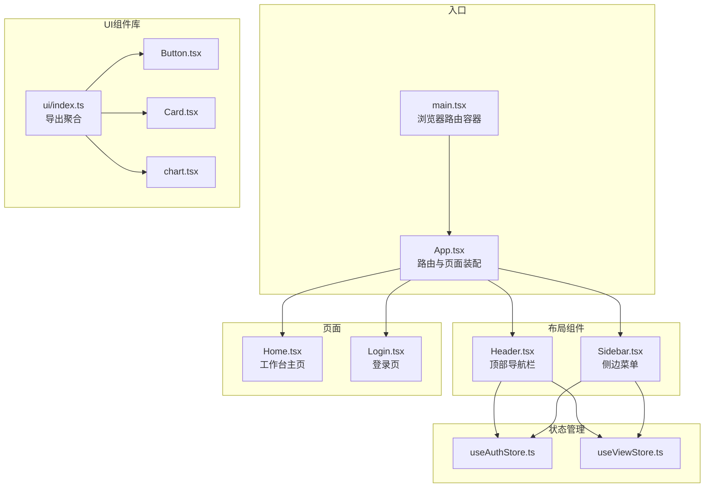
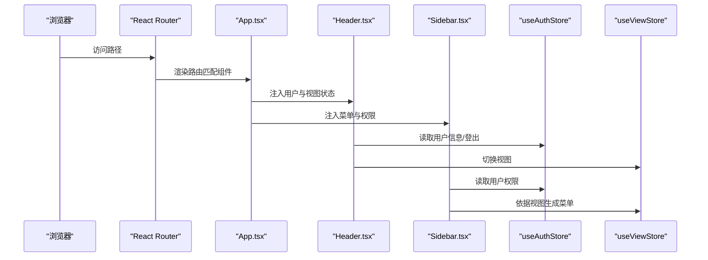
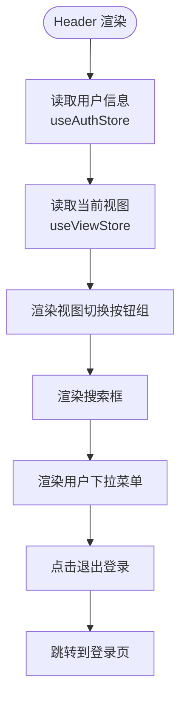
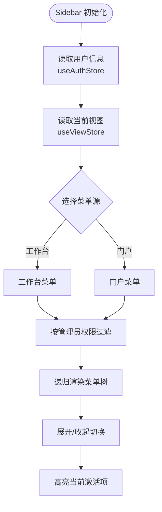
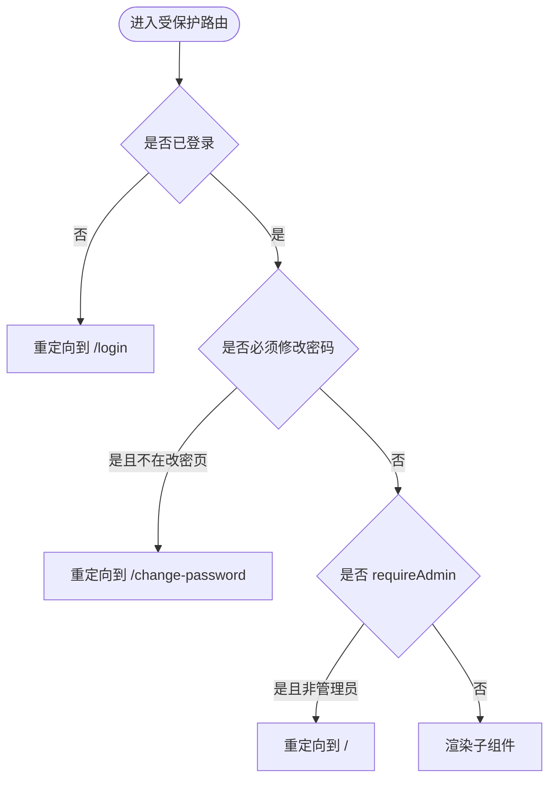
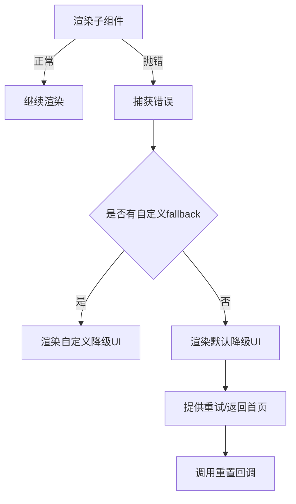
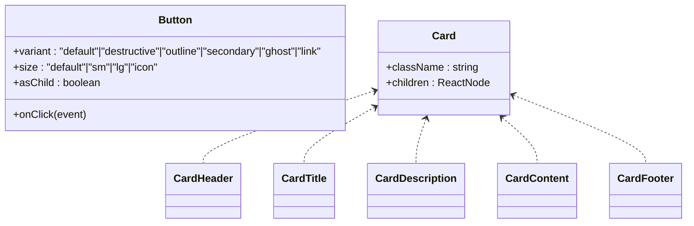
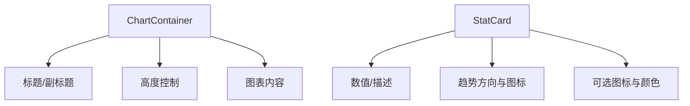
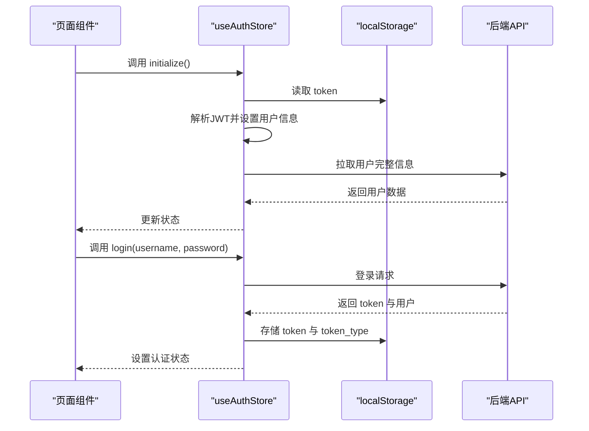
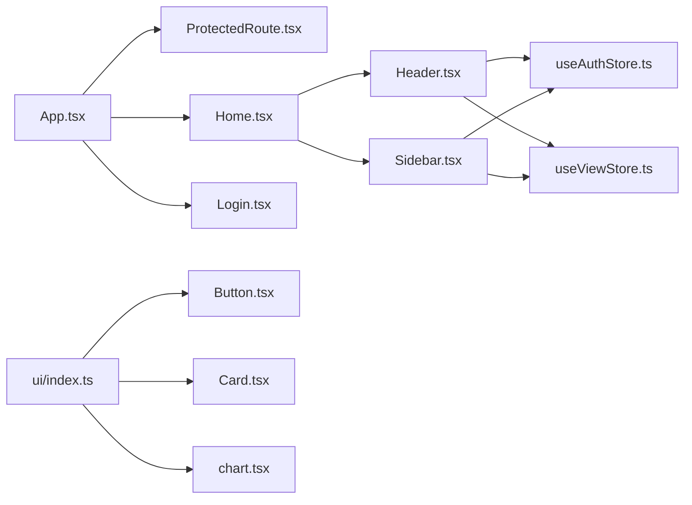

# 组件设计

<cite>
**本文引用的文件**
- [frontend/src/components/ui/index.ts](file://frontend/src/components/ui/index.ts)
- [frontend/src/components/layout/Header.tsx](file://frontend/src/components/layout/Header.tsx)
- [frontend/src/components/layout/Sidebar.tsx](file://frontend/src/components/layout/Sidebar.tsx)
- [frontend/src/components/ProtectedRoute.tsx](file://frontend/src/components/ProtectedRoute.tsx)
- [frontend/src/components/ErrorBoundary.tsx](file://frontend/src/components/ErrorBoundary.tsx)
- [frontend/src/components/ui/Button.tsx](file://frontend/src/components/ui/Button.tsx)
- [frontend/src/components/ui/Card.tsx](file://frontend/src/components/ui/Card.tsx)
- [frontend/src/components/ui/chart.tsx](file://frontend/src/components/ui/chart.tsx)
- [frontend/src/types/index.ts](file://frontend/src/types/index.ts)
- [frontend/src/store/useAuthStore.ts](file://frontend/src/store/useAuthStore.ts)
- [frontend/src/store/useViewStore.ts](file://frontend/src/store/useViewStore.ts)
- [frontend/src/App.tsx](file://frontend/src/App.tsx)
- [frontend/src/main.tsx](file://frontend/src/main.tsx)
- [frontend/src/lib/utils.ts](file://frontend/src/lib/utils.ts)
- [frontend/package.json](file://frontend/package.json)
- [frontend/src/pages/Home.tsx](file://frontend/src/pages/Home.tsx)
- [frontend/src/pages/Login.tsx](file://frontend/src/pages/Login.tsx)
</cite>

## 目录
1. [引言](#引言)
2. [项目结构](#项目结构)
3. [核心组件](#核心组件)
4. [架构总览](#架构总览)
5. [详细组件分析](#详细组件分析)
6. [依赖分析](#依赖分析)
7. [性能考虑](#性能考虑)
8. [故障排除指南](#故障排除指南)
9. [结论](#结论)
10. [附录](#附录)

## 引言
本文件面向POMP前端组件设计与实现，围绕基于React的组件化理念，系统阐述基础UI组件库的设计原则、业务组件的封装策略、组件复用机制、props接口设计、事件处理模式、状态管理集成，以及布局组件Header与Sidebar的设计思路与高阶组件ProtectedRoute的实现原理。同时提供组件开发最佳实践，包括命名规范、样式组织、可访问性支持，并结合实际代码路径展示组件使用与扩展方式。

## 项目结构
前端采用分层与按功能域组织的结构：
- components：基础UI组件与布局组件、高阶组件
- pages：页面级组件，负责业务场景拼装
- services：API服务封装
- store：Zustand状态管理
- types：全局类型定义
- lib：工具函数
- main.tsx/App.tsx：应用入口与路由配置

图表来源
- [frontend/src/main.tsx:1-13](file://frontend/src/main.tsx#L1-L13)
- [frontend/src/App.tsx:1-356](file://frontend/src/App.tsx#L1-L356)
- [frontend/src/components/layout/Header.tsx:1-117](file://frontend/src/components/layout/Header.tsx#L1-L117)
- [frontend/src/components/layout/Sidebar.tsx:1-308](file://frontend/src/components/layout/Sidebar.tsx#L1-L308)
- [frontend/src/components/ui/index.ts:1-14](file://frontend/src/components/ui/index.ts#L1-L14)
- [frontend/src/components/ui/Button.tsx:1-56](file://frontend/src/components/ui/Button.tsx#L1-L56)
- [frontend/src/components/ui/Card.tsx:1-79](file://frontend/src/components/ui/Card.tsx#L1-L79)
- [frontend/src/components/ui/chart.tsx:1-181](file://frontend/src/components/ui/chart.tsx#L1-L181)
- [frontend/src/store/useAuthStore.ts:1-148](file://frontend/src/store/useAuthStore.ts#L1-L148)
- [frontend/src/store/useViewStore.ts:1-43](file://frontend/src/store/useViewStore.ts#L1-L43)
- [frontend/src/pages/Home.tsx:1-337](file://frontend/src/pages/Home.tsx#L1-L337)
- [frontend/src/pages/Login.tsx:1-115](file://frontend/src/pages/Login.tsx#L1-L115)

章节来源
- [frontend/src/main.tsx:1-13](file://frontend/src/main.tsx#L1-L13)
- [frontend/src/App.tsx:1-356](file://frontend/src/App.tsx#L1-L356)

## 核心组件
- 基础UI组件库：通过统一的变体与尺寸体系，提供Button、Card、Input、Tabs、Dialog、Toast等组件，便于在不同业务场景下保持一致的视觉与交互体验。
- 布局组件：Header负责顶部导航、搜索、用户下拉菜单与视图切换；Sidebar负责根据当前视图动态生成菜单树并进行权限过滤。
- 高阶组件：ProtectedRoute用于路由级别的鉴权与管理员权限控制，配合登录态与“必须修改密码”策略。
- 错误边界：ErrorBoundary提供降级UI与重试能力，提升用户体验与可恢复性。
- 状态管理：useAuthStore集中处理登录、登出、用户信息拉取与令牌解析；useViewStore管理“工作台/门户”视图切换与持久化。

章节来源
- [frontend/src/components/ui/index.ts:1-14](file://frontend/src/components/ui/index.ts#L1-L14)
- [frontend/src/components/layout/Header.tsx:1-117](file://frontend/src/components/layout/Header.tsx#L1-L117)
- [frontend/src/components/layout/Sidebar.tsx:1-308](file://frontend/src/components/layout/Sidebar.tsx#L1-L308)
- [frontend/src/components/ProtectedRoute.tsx:1-30](file://frontend/src/components/ProtectedRoute.tsx#L1-L30)
- [frontend/src/components/ErrorBoundary.tsx:1-87](file://frontend/src/components/ErrorBoundary.tsx#L1-L87)
- [frontend/src/store/useAuthStore.ts:1-148](file://frontend/src/store/useAuthStore.ts#L1-L148)
- [frontend/src/store/useViewStore.ts:1-43](file://frontend/src/store/useViewStore.ts#L1-L43)

## 架构总览
整体采用“路由驱动 + 组件组合 + 状态管理”的架构：
- 路由层：App集中声明所有路由，使用ProtectedRoute包裹受保护页面。
- 组合层：页面组件组合布局组件与业务组件，形成完整的页面视图。
- 状态层：useAuthStore与useViewStore分别管理认证与视图状态，供布局与页面消费。
- UI层：通过ui/index.ts统一导出，避免各处重复导入，提升一致性与可维护性。

图表来源
- [frontend/src/App.tsx:1-356](file://frontend/src/App.tsx#L1-L356)
- [frontend/src/components/layout/Header.tsx:1-117](file://frontend/src/components/layout/Header.tsx#L1-L117)
- [frontend/src/components/layout/Sidebar.tsx:1-308](file://frontend/src/components/layout/Sidebar.tsx#L1-L308)
- [frontend/src/store/useAuthStore.ts:1-148](file://frontend/src/store/useAuthStore.ts#L1-L148)
- [frontend/src/store/useViewStore.ts:1-43](file://frontend/src/store/useViewStore.ts#L1-L43)

## 详细组件分析

### 布局组件：Header
- 设计要点
  - 视图切换：通过useViewStore在“工作台/门户”之间切换，按钮组呈现当前视图状态。
  - 用户信息：从useAuthStore读取用户头像、姓名、角色标识，支持头像占位与下拉菜单。
  - 搜索框：内置搜索输入，样式内联定位图标。
  - 通知与退出：提供通知按钮与登出入口，登出后跳转至登录页。
- props与事件
  - 无外部props，内部通过Button、Dropdown、Avatar等组件组合实现交互。
  - 事件处理集中在组件内部，不向外暴露回调。
- 可访问性
  - 图标按钮具备语义化图标与文本提示，建议在上层容器增加aria-label以增强可访问性。

图表来源
- [frontend/src/components/layout/Header.tsx:1-117](file://frontend/src/components/layout/Header.tsx#L1-L117)
- [frontend/src/store/useAuthStore.ts:1-148](file://frontend/src/store/useAuthStore.ts#L1-L148)
- [frontend/src/store/useViewStore.ts:1-43](file://frontend/src/store/useViewStore.ts#L1-L43)

章节来源
- [frontend/src/components/layout/Header.tsx:1-117](file://frontend/src/components/layout/Header.tsx#L1-L117)

### 布局组件：Sidebar
- 设计要点
  - 动态菜单：根据currentView选择工作台或门户菜单，再通过filterMenuItems按管理员权限过滤并移除空子树。
  - 展开/收起：使用useState维护展开集合，递归渲染子菜单，支持多级嵌套。
  - 激活态：根据当前URL高亮对应菜单项。
  - 用户信息：在侧边栏顶部显示当前用户与角色标识。
- 权限控制
  - requireAdmin字段用于标记仅管理员可见的菜单项。
- 性能注意
  - 菜单渲染使用递归，建议对深层菜单进行虚拟滚动优化（当前未实现）。

图表来源
- [frontend/src/components/layout/Sidebar.tsx:1-308](file://frontend/src/components/layout/Sidebar.tsx#L1-L308)
- [frontend/src/store/useAuthStore.ts:1-148](file://frontend/src/store/useAuthStore.ts#L1-L148)
- [frontend/src/store/useViewStore.ts:1-43](file://frontend/src/store/useViewStore.ts#L1-L43)

章节来源
- [frontend/src/components/layout/Sidebar.tsx:1-308](file://frontend/src/components/layout/Sidebar.tsx#L1-L308)

### 高阶组件：ProtectedRoute
- 设计要点
  - 登录态校验：未登录则重定向至登录页，并携带from地址以便登录后回跳。
  - 修改密码强制：若用户标记must_change_password且当前不在修改密码页，则强制跳转。
  - 管理员权限：requireAdmin为true时，非超级管理员重定向至根路径。
- 适用范围
  - 所有需要鉴权的页面均应被该高阶组件包裹。

图表来源
- [frontend/src/components/ProtectedRoute.tsx:1-30](file://frontend/src/components/ProtectedRoute.tsx#L1-L30)

章节来源
- [frontend/src/components/ProtectedRoute.tsx:1-30](file://frontend/src/components/ProtectedRoute.tsx#L1-L30)

### 错误边界：ErrorBoundary
- 设计要点
  - 捕获子树错误并提供降级UI，包含错误信息展示（开发环境）、重试与返回首页按钮。
  - 支持自定义fallback与重置回调。
- 适用范围
  - 建议在App根部或关键页面区域包裹，以提升稳定性与可恢复性。

图表来源
- [frontend/src/components/ErrorBoundary.tsx:1-87](file://frontend/src/components/ErrorBoundary.tsx#L1-L87)

章节来源
- [frontend/src/components/ErrorBoundary.tsx:1-87](file://frontend/src/components/ErrorBoundary.tsx#L1-L87)

### 基础UI组件库：Button与Card
- Button
  - 采用变体与尺寸的组合式设计，支持asChild以适配链接等场景，className合并使用工具函数。
  - props接口继承原生button属性并扩展variant/size/asChild。
- Card
  - 提供Card、CardHeader、CardTitle、CardDescription、CardContent、CardFooter的组合式卡片，便于快速搭建信息区块。
- 组织方式
  - 通过ui/index.ts统一导出，避免分散导入，提升一致性。

图表来源
- [frontend/src/components/ui/Button.tsx:1-56](file://frontend/src/components/ui/Button.tsx#L1-L56)
- [frontend/src/components/ui/Card.tsx:1-79](file://frontend/src/components/ui/Card.tsx#L1-L79)
- [frontend/src/components/ui/index.ts:1-14](file://frontend/src/components/ui/index.ts#L1-L14)

章节来源
- [frontend/src/components/ui/Button.tsx:1-56](file://frontend/src/components/ui/Button.tsx#L1-L56)
- [frontend/src/components/ui/Card.tsx:1-79](file://frontend/src/components/ui/Card.tsx#L1-L79)
- [frontend/src/components/ui/index.ts:1-14](file://frontend/src/components/ui/index.ts#L1-L14)

### 图表与统计组件：chart.tsx
- ChartContainer：封装图表容器，支持标题、副标题与高度控制。
- StatCard：封装统计卡片，支持趋势方向与图标颜色。
- 配色与默认配置：提供chartColors、chartGradientOptions、chartDefaults，便于在图表组件中复用。

图表来源
- [frontend/src/components/ui/chart.tsx:1-181](file://frontend/src/components/ui/chart.tsx#L1-L181)

章节来源
- [frontend/src/components/ui/chart.tsx:1-181](file://frontend/src/components/ui/chart.tsx#L1-L181)

### 状态管理：useAuthStore 与 useViewStore
- useAuthStore
  - 职责：登录、登出、初始化、用户信息拉取、解析JWT、设置“必须修改密码”。
  - 关键点：本地存储token与token_type；AbortController取消请求；派生用户信息。
- useViewStore
  - 职责：管理currentView（工作台/门户）、初始化标志、切换视图。
  - 关键点：持久化到localStorage，应用启动时自动初始化。

图表来源
- [frontend/src/store/useAuthStore.ts:1-148](file://frontend/src/store/useAuthStore.ts#L1-L148)
- [frontend/src/store/useViewStore.ts:1-43](file://frontend/src/store/useViewStore.ts#L1-L43)

章节来源
- [frontend/src/store/useAuthStore.ts:1-148](file://frontend/src/store/useAuthStore.ts#L1-L148)
- [frontend/src/store/useViewStore.ts:1-43](file://frontend/src/store/useViewStore.ts#L1-L43)

### 页面示例：Home（工作台）
- 设计要点
  - 组合Sidebar与Header，形成完整工作台布局。
  - 通过服务层API获取待审文章、配置统计等数据，使用Toast提示错误。
  - 快速入口、个人统计、待办审批、近期日程等模块化卡片。
- 交互与路由
  - 使用Link与Button进行页面跳转；部分操作直接使用window.location.href。

章节来源
- [frontend/src/pages/Home.tsx:1-337](file://frontend/src/pages/Home.tsx#L1-L337)

### 页面示例：Login（登录）
- 设计要点
  - 表单控件使用Input、Label、Button等UI组件，密码显隐切换。
  - 登录成功后根据must_change_password决定跳转路径。
  - 使用Toast进行错误提示。

章节来源
- [frontend/src/pages/Login.tsx:1-115](file://frontend/src/pages/Login.tsx#L1-L115)

## 依赖分析
- 组件依赖
  - Header与Sidebar依赖useAuthStore与useViewStore。
  - App路由依赖ProtectedRoute与页面组件。
  - UI组件通过ui/index.ts统一导出，降低耦合度。
- 外部依赖
  - React Router用于路由控制；Radix UI系列组件提供无障碍与可组合的底层能力；Tailwind与class-variance-authority提供样式与变体系统；Zustand提供轻量状态管理；Axios与自定义API客户端用于HTTP通信。

图表来源
- [frontend/src/App.tsx:1-356](file://frontend/src/App.tsx#L1-L356)
- [frontend/src/components/ProtectedRoute.tsx:1-30](file://frontend/src/components/ProtectedRoute.tsx#L1-L30)
- [frontend/src/components/layout/Header.tsx:1-117](file://frontend/src/components/layout/Header.tsx#L1-L117)
- [frontend/src/components/layout/Sidebar.tsx:1-308](file://frontend/src/components/layout/Sidebar.tsx#L1-L308)
- [frontend/src/store/useAuthStore.ts:1-148](file://frontend/src/store/useAuthStore.ts#L1-L148)
- [frontend/src/store/useViewStore.ts:1-43](file://frontend/src/store/useViewStore.ts#L1-L43)
- [frontend/src/components/ui/index.ts:1-14](file://frontend/src/components/ui/index.ts#L1-L14)
- [frontend/src/components/ui/Button.tsx:1-56](file://frontend/src/components/ui/Button.tsx#L1-L56)
- [frontend/src/components/ui/Card.tsx:1-79](file://frontend/src/components/ui/Card.tsx#L1-L79)
- [frontend/src/components/ui/chart.tsx:1-181](file://frontend/src/components/ui/chart.tsx#L1-L181)

章节来源
- [frontend/package.json:1-60](file://frontend/package.json#L1-L60)

## 性能考虑
- 路由与视图切换
  - App中通过key强制重新渲染主内容，确保工作台与门户切换时完全卸载旧DOM，避免状态污染。
- 请求与取消
  - useAuthStore在用户信息拉取中使用AbortController，登出时主动取消请求，防止竞态与内存泄漏。
- 菜单渲染
  - Sidebar使用递归渲染菜单树，建议对深层菜单引入虚拟滚动或懒加载以减少首屏渲染压力。
- 样式合并
  - 使用cn函数合并类名，避免重复样式导致的重绘与回流。

章节来源
- [frontend/src/App.tsx:44-50](file://frontend/src/App.tsx#L44-L50)
- [frontend/src/store/useAuthStore.ts:95-126](file://frontend/src/store/useAuthStore.ts#L95-L126)
- [frontend/src/components/layout/Sidebar.tsx:234-274](file://frontend/src/components/layout/Sidebar.tsx#L234-L274)
- [frontend/src/lib/utils.ts:1-6](file://frontend/src/lib/utils.ts#L1-L6)

## 故障排除指南
- 登录失败
  - 检查useAuthStore.login流程与后端响应；确认token写入localStorage与JWT解析逻辑。
- 必须修改密码循环跳转
  - 确认后端返回must_change_password字段与ProtectedRoute逻辑；确保在修改密码页不再被强制跳转。
- 菜单不显示或为空
  - 检查filterMenuItems过滤逻辑与requireAdmin字段；确认useAuthStore.user.isSuperuser正确传入。
- 菜单展开异常
  - 检查expandedMenus的Set更新逻辑与label唯一性；确认toggleMenu触发时机。
- 错误边界未生效
  - 确认ErrorBoundary包裹范围与子组件是否抛出错误；开发环境下可查看错误堆栈。

章节来源
- [frontend/src/store/useAuthStore.ts:63-89](file://frontend/src/store/useAuthStore.ts#L63-L89)
- [frontend/src/components/ProtectedRoute.tsx:17-24](file://frontend/src/components/ProtectedRoute.tsx#L17-L24)
- [frontend/src/components/layout/Sidebar.tsx:189-205](file://frontend/src/components/layout/Sidebar.tsx#L189-L205)
- [frontend/src/components/ErrorBoundary.tsx:22-28](file://frontend/src/components/ErrorBoundary.tsx#L22-L28)

## 结论
本设计以“路由驱动 + 组件组合 + 状态管理”为核心，通过统一的UI组件库与布局组件实现一致的交互与视觉体验；借助ProtectedRoute实现细粒度的权限控制；通过useAuthStore与useViewStore解耦认证与视图状态。整体架构清晰、职责明确、易于扩展与维护。

## 附录

### 组件开发最佳实践
- 命名规范
  - 组件文件采用帕斯卡命名（如Header.tsx），导出默认组件。
  - 类型定义统一放置于types/index.ts，避免分散。
- 样式组织
  - 使用Tailwind与class-variance-authority，通过变体与尺寸控制样式差异；使用cn函数合并类名。
  - UI组件通过ui/index.ts统一导出，避免各处重复导入。
- 可访问性
  - 为图标按钮提供aria-label或替代文本；为表单控件提供Label；为下拉菜单提供键盘导航支持。
- 错误处理
  - 在关键流程（登录、用户信息拉取）使用Toast提示错误；在页面级使用ErrorBoundary兜底。
- 性能优化
  - 对深层菜单使用虚拟滚动或懒加载；对频繁切换的视图使用key强制重建；对请求使用AbortController取消。

### 类型与接口
- User：用户基本信息与认证相关字段。
- LoginRequest/LoginResponse：登录请求与响应结构。
- ApiResponse<T>：统一API响应包装。

章节来源
- [frontend/src/types/index.ts:1-32](file://frontend/src/types/index.ts#L1-L32)