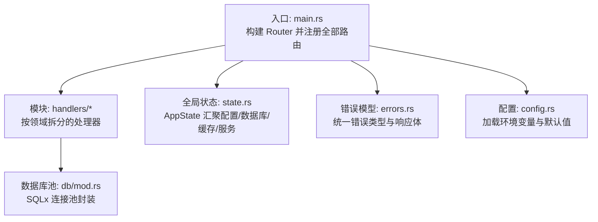
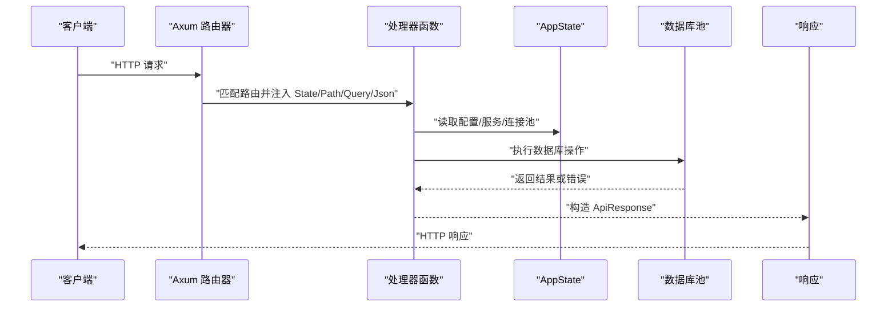
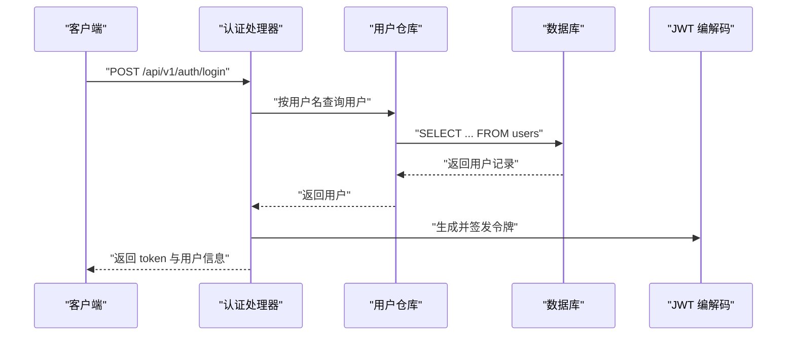
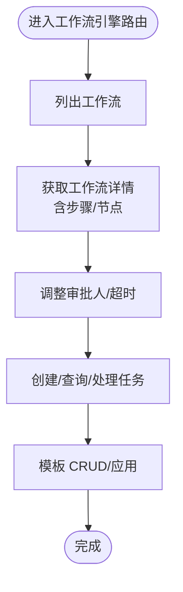
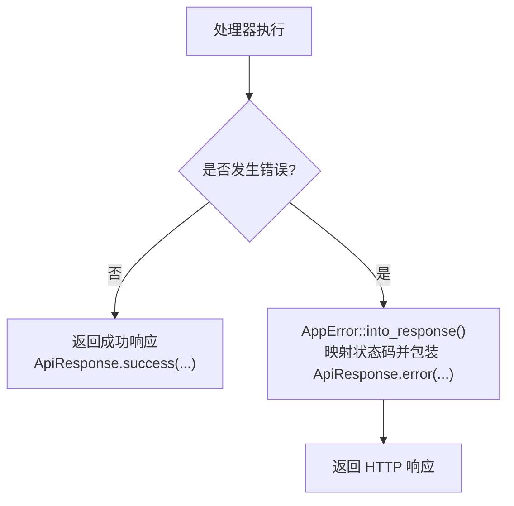
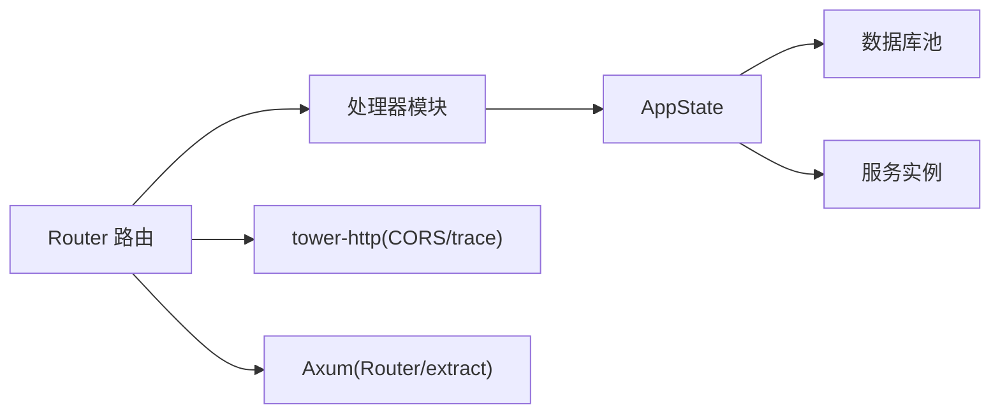

# API路由系统

<cite>
**本文引用的文件**
- [main.rs](file://backend/core/src/main.rs)
- [auth.rs](file://backend/core/src/api/handlers/auth.rs)
- [role.rs](file://backend/core/src/api/handlers/role.rs)
- [workflow_engine.rs](file://backend/core/src/api/handlers/workflow_engine.rs)
- [errors.rs](file://backend/core/src/errors.rs)
- [state.rs](file://backend/core/src/state.rs)
- [config.rs](file://backend/core/src/config.rs)
- [Cargo.toml](file://backend/core/Cargo.toml)
- [handlers/mod.rs](file://backend/core/src/api/handlers/mod.rs)
- [db/mod.rs](file://backend/core/src/db/mod.rs)
</cite>

## 目录
1. [引言](#引言)
2. [项目结构](#项目结构)
3. [核心组件](#核心组件)
4. [架构总览](#架构总览)
5. [详细组件分析](#详细组件分析)
6. [依赖关系分析](#依赖关系分析)
7. [性能考虑](#性能考虑)
8. [故障排查指南](#故障排查指南)
9. [结论](#结论)
10. [附录](#附录)

## 引言
本文件面向开发者，系统性阐述 POMP 后端基于 Axum 的 API 路由体系。内容涵盖路由层级组织、路径参数与查询参数处理、模块化路由划分（认证、权限、工作流、内容管理等）、中间件与错误处理机制、性能优化策略与安全防护、以及调试技巧。目标是帮助读者快速理解并高效扩展该路由系统。

## 项目结构
后端采用“入口路由聚合 + 模块化处理器”的分层组织方式：
- 入口文件集中定义所有路由与控制流
- 每个业务模块在 handlers 下独立实现，按领域拆分文件
- 错误类型统一收敛，响应体结构标准化
- 全局状态通过 AppState 注入，贯穿各处理器

图表来源
- [main.rs:42-270](file://backend/core/src/main.rs#L42-L270)
- [handlers/mod.rs:1-22](file://backend/core/src/api/handlers/mod.rs#L1-L22)
- [state.rs:10-26](file://backend/core/src/state.rs#L10-L26)
- [errors.rs:6-78](file://backend/core/src/errors.rs#L6-L78)
- [config.rs:96-115](file://backend/core/src/config.rs#L96-L115)
- [db/mod.rs:25-44](file://backend/core/src/db/mod.rs#L25-L44)

章节来源
- [main.rs:42-270](file://backend/core/src/main.rs#L42-L270)
- [handlers/mod.rs:1-22](file://backend/core/src/api/handlers/mod.rs#L1-L22)
- [state.rs:10-26](file://backend/core/src/state.rs#L10-L26)
- [errors.rs:6-78](file://backend/core/src/errors.rs#L6-L78)
- [config.rs:96-115](file://backend/core/src/config.rs#L96-L115)
- [db/mod.rs:25-44](file://backend/core/src/db/mod.rs#L25-L44)

## 核心组件
- 路由入口与控制流
  - 在入口文件中使用 Router::new() 构建应用，随后通过 route() 方法注册全部 REST 接口，覆盖物料库、CMS、媒体、AI、外勤记录、认证、角色权限、工作流引擎、组织架构、HR、字典、仪表盘、网站、GIS、日程、会议纪要、帮助中心等模块。
  - 所有路由均以 /api/v1 作为版本前缀，便于后续演进与灰度发布。
- 处理器与参数提取
  - 处理器函数统一使用 State、Path、Query、Json 等 Axum 提取器，分别注入全局状态、路径参数、查询参数与请求体。
  - 对 UUID 类型参数进行字符串到 Uuid 的转换与校验，避免非法 ID 导致的运行时异常。
- 错误与响应
  - 自定义 AppError 统一承载业务与基础设施错误，自动映射为标准 HTTP 状态码。
  - ApiResponse 标准化响应体结构，包含 success、data、error 字段，便于前端一致处理。
- 全局状态与配置
  - AppState 封装 Config、数据库连接池、Redis 客户端与各类服务实例，通过 with_state 注入到 Router。
  - Config 从 .env 加载并提供默认值，支持 JWT、数据库、Redis、AI 接口等配置项。

章节来源
- [main.rs:42-270](file://backend/core/src/main.rs#L42-L270)
- [auth.rs:82-202](file://backend/core/src/api/handlers/auth.rs#L82-L202)
- [role.rs:35-65](file://backend/core/src/api/handlers/role.rs#L35-L65)
- [workflow_engine.rs:28-38](file://backend/core/src/api/handlers/workflow_engine.rs#L28-L38)
- [errors.rs:6-78](file://backend/core/src/errors.rs#L6-L78)
- [state.rs:10-26](file://backend/core/src/state.rs#L10-L26)
- [config.rs:96-115](file://backend/core/src/config.rs#L96-L115)

## 架构总览
下图展示从客户端请求到处理器执行、再到数据库访问与响应返回的整体流程。

图表来源
- [main.rs:42-270](file://backend/core/src/main.rs#L42-L270)
- [auth.rs:82-202](file://backend/core/src/api/handlers/auth.rs#L82-L202)
- [state.rs:10-26](file://backend/core/src/state.rs#L10-L26)
- [db/mod.rs:25-44](file://backend/core/src/db/mod.rs#L25-L44)

## 详细组件分析

### 路由层级与组织
- 版本前缀
  - 所有业务路由均以 /api/v1 开头，便于未来引入 /api/v2 并保持向后兼容。
- 模块化分组
  - 按功能域划分：认证与用户、角色与权限、工作流与工作流引擎、内容管理（CMS/Website/Help）、物料库、外勤记录、HR、GIS、日程、字典、仪表盘、媒体、AI 等。
- 动态路由与静态路由混合
  - 使用 {id} 占位符处理资源路由；使用查询参数实现分页、筛选与搜索。
- 健康检查
  - 提供 /health 快速探测，返回标准 JSON 结构。

章节来源
- [main.rs:42-270](file://backend/core/src/main.rs#L42-L270)

### 路径参数与查询参数处理
- 路径参数
  - 处理器通过 Path<String> 接收资源 ID，随后尝试解析为 Uuid，并在失败时返回 BAD_REQUEST。
  - 示例：用户管理、角色管理、工作流引擎、组织架构、HR、GIS、日程等模块广泛使用该模式。
- 查询参数
  - 使用 Query<HashMap<String, String>> 或自定义结构体（如 PaginationParams）接收分页与筛选条件。
  - 示例：用户列表、角色列表、工作流列表等均支持 page/page_size 等参数。
- 请求体
  - 使用 Json<T> 提取请求体，配合 serde 的反序列化与校验。

章节来源
- [auth.rs:404-441](file://backend/core/src/api/handlers/auth.rs#L404-L441)
- [role.rs:16-25](file://backend/core/src/api/handlers/role.rs#L16-L25)
- [workflow_engine.rs:20-24](file://backend/core/src/api/handlers/workflow_engine.rs#L20-L24)

### 认证与权限模块路由
- 登录与注册
  - 登录：校验用户名/密码，签发 JWT；注册：校验唯一性并创建待审批用户。
  - 变体：支持 admin/admin123 快速登录用于演示。
- 密码管理
  - 修改密码：从 Authorization 头解析 JWT，校验旧密码，更新为新密码哈希。
- 用户信息与管理
  - 获取用户信息：校验 JWT 并限制仅能读取本人信息。
  - 管理员接口：批量查询、创建、更新、删除、启用/停用、审批用户等。
- 权限与角色
  - 角色 CRUD、角色权限关联、权限列表、用户角色管理等。
- 中间件与鉴权
  - 当前路由层未显式挂载全局中间件；鉴权通过在处理器内解析 Authorization 头并解码 JWT 实现。若需统一鉴权，可在 Router 上层叠加 Tower 层以实现认证中间件。

图表来源
- [main.rs:84-96](file://backend/core/src/main.rs#L84-L96)
- [auth.rs:82-202](file://backend/core/src/api/handlers/auth.rs#L82-L202)

章节来源
- [main.rs:84-96](file://backend/core/src/main.rs#L84-L96)
- [auth.rs:82-202](file://backend/core/src/api/handlers/auth.rs#L82-L202)
- [auth.rs:210-295](file://backend/core/src/api/handlers/auth.rs#L210-L295)
- [auth.rs:335-362](file://backend/core/src/api/handlers/auth.rs#L335-L362)
- [auth.rs:404-441](file://backend/core/src/api/handlers/auth.rs#L404-L441)

### 工作流与工作流引擎模块路由
- 工作流管理
  - 列表、系统/自定义过滤、详情、创建、更新、删除（系统工作流不可删）。
- 步骤与节点
  - 获取步骤/节点列表，支持动态调整审批人与超时配置。
- 审批任务
  - 创建任务、查询所有/我的/发起的任务、审批/拒绝、历史查询等。
- 模板
  - 模板 CRUD、应用模板创建任务。

图表来源
- [main.rs:112-136](file://backend/core/src/main.rs#L112-L136)
- [workflow_engine.rs:28-38](file://backend/core/src/api/handlers/workflow_engine.rs#L28-L38)
- [workflow_engine.rs:152-200](file://backend/core/src/api/handlers/workflow_engine.rs#L152-L200)

章节来源
- [main.rs:112-136](file://backend/core/src/main.rs#L112-L136)
- [workflow_engine.rs:28-38](file://backend/core/src/api/handlers/workflow_engine.rs#L28-L38)
- [workflow_engine.rs:152-200](file://backend/core/src/api/handlers/workflow_engine.rs#L152-L200)

### 内容管理与网站模块路由
- CMS
  - 分类与文章的增删改查、提交审核、审核、评论、待审/已审查询、公开接口等。
- 网站
  - 设置读写、生成/预览/部署、部署历史查询。
- 帮助中心
  - 分类与文章 CRUD、按 slug 查询、搜索、初始化默认数据等。

章节来源
- [main.rs:51-62](file://backend/core/src/main.rs#L51-L62)
- [main.rs:213-219](file://backend/core/src/main.rs#L213-L219)
- [main.rs:231-247](file://backend/core/src/main.rs#L231-L247)

### 其他模块路由概览
- 外勤记录：记录的增删改查、照片/音频上传与删除。
- HR：员工、职位、考勤、请假等。
- GIS：客户、项目、仓库、人员及其位置更新。
- 日程：事件的增删改查。
- 字典：分类与条目的增删改查、初始化默认数据。
- 仪表盘：多维度统计数据查询。
- 媒体：上传与列表。
- AI：图像生成、状态查询、文档优化等。
- 会议纪要：生成与优化。
- 物料库：物料的增删改查、爬取 URL。

章节来源
- [main.rs:74-83](file://backend/core/src/main.rs#L74-L83)
- [main.rs:164-182](file://backend/core/src/main.rs#L164-L182)
- [main.rs:248-269](file://backend/core/src/main.rs#L248-L269)
- [main.rs:222-227](file://backend/core/src/main.rs#L222-L227)
- [main.rs:196-206](file://backend/core/src/main.rs#L196-L206)
- [main.rs:206-212](file://backend/core/src/main.rs#L206-L212)
- [main.rs:66-67](file://backend/core/src/main.rs#L66-L67)
- [main.rs:68-72](file://backend/core/src/main.rs#L68-L72)
- [main.rs:228-230](file://backend/core/src/main.rs#L228-L230)
- [main.rs:44-50](file://backend/core/src/main.rs#L44-L50)

### 中间件系统
- CORS
  - 依赖 tower-http 的 cors 功能，可在 Router 层叠加 CORS 中间件以支持跨域。
- 日志与追踪
  - 使用 tracing-subscriber 初始化日志，入口处设置环境变量过滤级别。
- 性能监控
  - 可通过 tower-http 的 trace 中间件在 Router 层加入请求链路追踪。
- 认证中间件
  - 当前未在 Router 层统一挂载认证中间件；鉴权在处理器内手动解析 Authorization 头并解码 JWT。若需全局鉴权，建议在 Router 上层叠加 Tower 层以实现认证中间件。

章节来源
- [Cargo.toml:18](file://backend/core/Cargo.toml#L18)
- [main.rs:17-21](file://backend/core/src/main.rs#L17-L21)

### 错误处理机制
- 错误类型
  - AppError 覆盖数据库、Redis、外部服务、认证、授权、验证、未找到、内部错误、请求参数错误、字典服务、合同服务等场景。
- 状态码映射
  - 依据错误类型自动映射为 HTTP 状态码（如 UNAUTHORIZED、FORBIDDEN、BAD_REQUEST、NOT_FOUND、INTERNAL_SERVER_ERROR、BAD_GATEWAY）。
- 响应格式
  - ApiResponse 统一返回 success、data、error 字段，便于前端一致处理。
- 处理器中的错误传播
  - 处理器捕获底层错误并返回标准化响应；部分处理器直接返回状态码+JSON，遵循统一格式。

图表来源
- [errors.rs:54-78](file://backend/core/src/errors.rs#L54-L78)
- [auth.rs:301-333](file://backend/core/src/api/handlers/auth.rs#L301-L333)
- [role.rs:42-64](file://backend/core/src/api/handlers/role.rs#L42-L64)

章节来源
- [errors.rs:6-78](file://backend/core/src/errors.rs#L6-L78)
- [auth.rs:301-333](file://backend/core/src/api/handlers/auth.rs#L301-L333)
- [role.rs:42-64](file://backend/core/src/api/handlers/role.rs#L42-L64)

## 依赖关系分析
- 组件耦合
  - 路由层仅负责注册与参数提取，不直接持有业务逻辑；业务逻辑集中在各模块处理器。
  - 处理器通过 State 访问数据库池与服务实例，保持低耦合高内聚。
- 外部依赖
  - Axum 提供路由与提取器；tower-http 提供 CORS/trace/fs 等能力；sqlx 提供 PostgreSQL 访问；redis 提供缓存；jsonwebtoken 提供 JWT；bcrypt 提供密码哈希。
- 可能的循环依赖
  - handlers 与 state/db 之间为单向依赖，无循环导入风险。

图表来源
- [main.rs:42-270](file://backend/core/src/main.rs#L42-L270)
- [state.rs:10-26](file://backend/core/src/state.rs#L10-L26)
- [Cargo.toml:16-18](file://backend/core/Cargo.toml#L16-L18)

章节来源
- [main.rs:42-270](file://backend/core/src/main.rs#L42-L270)
- [state.rs:10-26](file://backend/core/src/state.rs#L10-L26)
- [Cargo.toml:16-18](file://backend/core/Cargo.toml#L16-L18)

## 性能考虑
- 连接池与并发
  - 数据库连接池最大连接数可调，默认 50；根据负载压测调整。
- 路由注册与编译
  - 将路由按模块拆分，减少单文件体积，利于增量编译与维护。
- 响应体与序列化
  - 使用统一 ApiResponse，避免重复序列化逻辑；对大对象分页返回。
- 中间件开销
  - 在 Router 层叠加 trace/CORS 等中间件会增加少量开销，建议生产环境按需开启。
- 缓存与降级
  - 对热点查询使用 Redis 缓存；对外部服务调用增加超时与熔断策略。

[本节为通用性能建议，无需特定文件引用]

## 故障排查指南
- 常见问题定位
  - 路由 404：确认路由前缀与路径是否正确；检查 handlers/mod.rs 是否导出路由。
  - 鉴权失败：核对 Authorization 头格式与 JWT 秘钥；确认处理器内解码逻辑。
  - 参数错误：检查 Path/Query/Json 的字段名与类型；必要时增加结构体校验。
  - 数据库错误：查看日志中的 SQLX 错误；确认连接池配置与迁移是否完成。
- 日志与追踪
  - 启动时已初始化 tracing；可通过环境变量调整日志级别。
- 错误响应一致性
  - 所有错误均通过 AppError 映射为标准 HTTP 状态码与 ApiResponse 结构，便于前端统一处理。

章节来源
- [main.rs:17-21](file://backend/core/src/main.rs#L17-L21)
- [errors.rs:54-78](file://backend/core/src/errors.rs#L54-L78)

## 结论
POMP 的 API 路由系统以 Axum 为核心，采用清晰的模块化组织与统一的错误/响应模型，具备良好的可维护性与扩展性。建议在现有基础上引入 Tower 层中间件（CORS/Trace），并在 Router 层增加统一认证中间件，进一步提升安全性与可观测性。同时，结合连接池与缓存策略，持续优化性能与稳定性。

[本节为总结性内容，无需特定文件引用]

## 附录
- 关键实现路径参考
  - 路由注册与控制流：[main.rs:42-270](file://backend/core/src/main.rs#L42-L270)
  - 认证处理器示例：[auth.rs:82-202](file://backend/core/src/api/handlers/auth.rs#L82-L202)
  - 角色管理处理器示例：[role.rs:35-65](file://backend/core/src/api/handlers/role.rs#L35-L65)
  - 工作流引擎处理器示例：[workflow_engine.rs:28-38](file://backend/core/src/api/handlers/workflow_engine.rs#L28-L38)
  - 错误模型与响应体：[errors.rs:6-78](file://backend/core/src/errors.rs#L6-L78)
  - 全局状态与构建器：[state.rs:10-26](file://backend/core/src/state.rs#L10-L26)
  - 配置加载：[config.rs:96-115](file://backend/core/src/config.rs#L96-L115)
  - 数据库池封装：[db/mod.rs:25-44](file://backend/core/src/db/mod.rs#L25-L44)
  - 依赖声明：[Cargo.toml:16-18](file://backend/core/Cargo.toml#L16-L18)