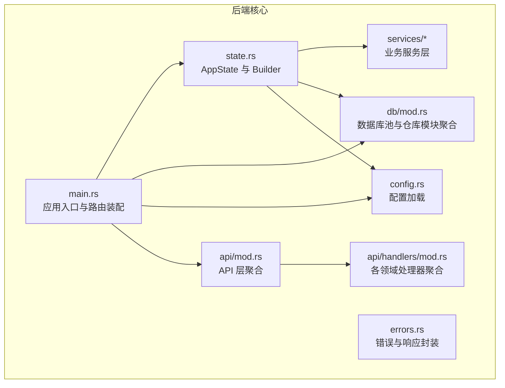
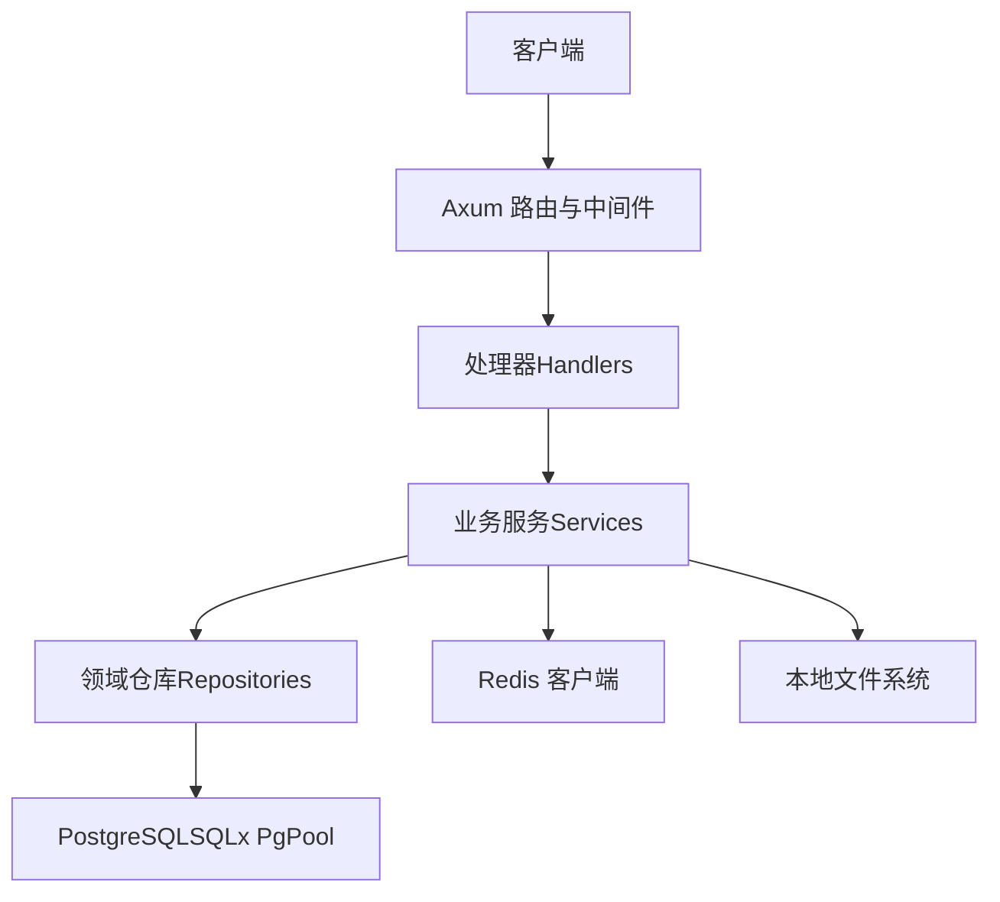
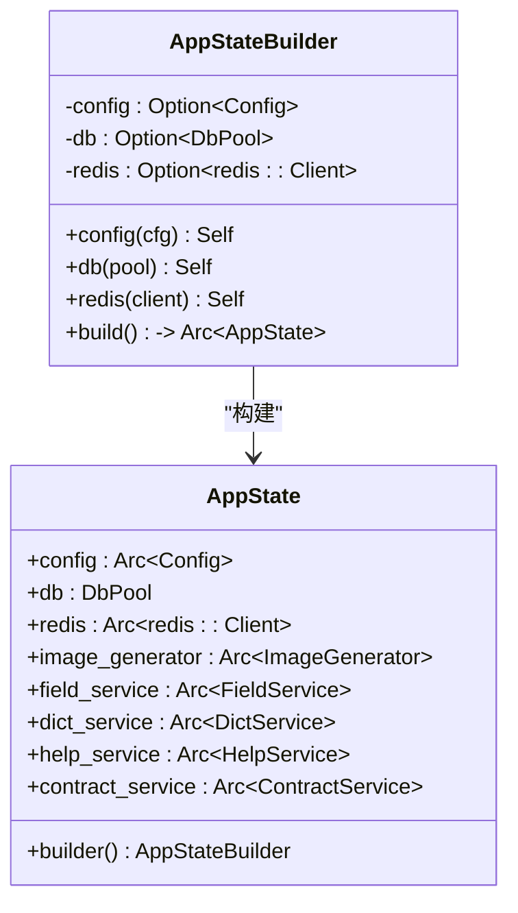
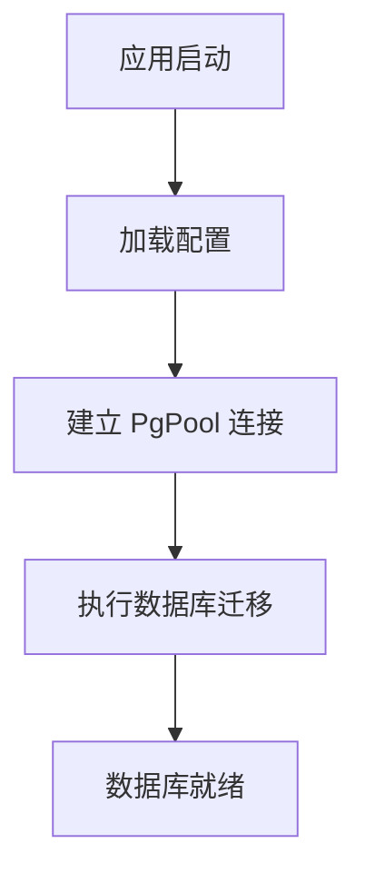
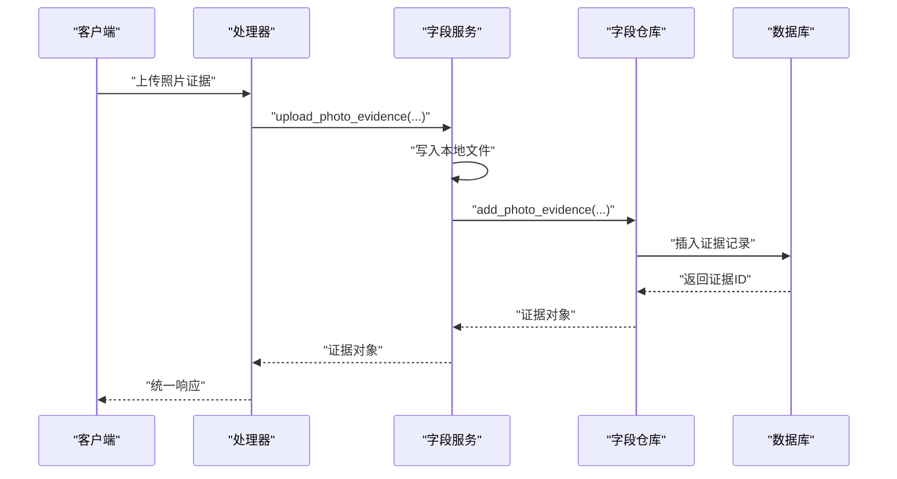
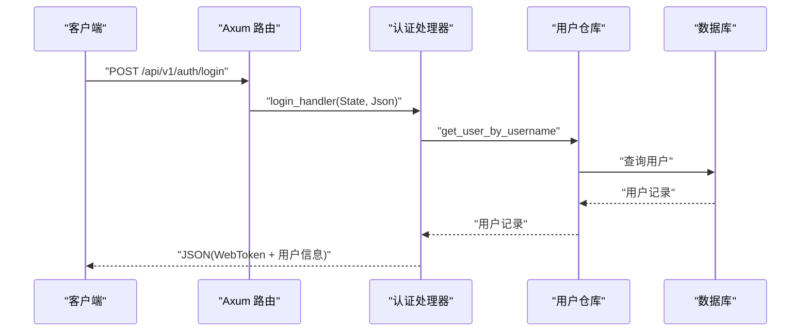
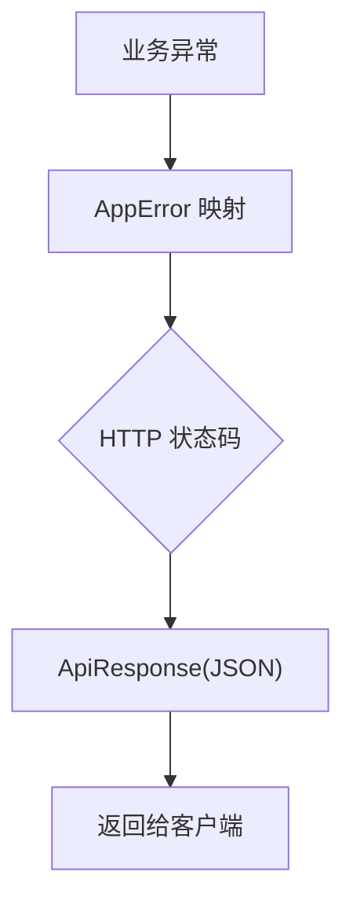
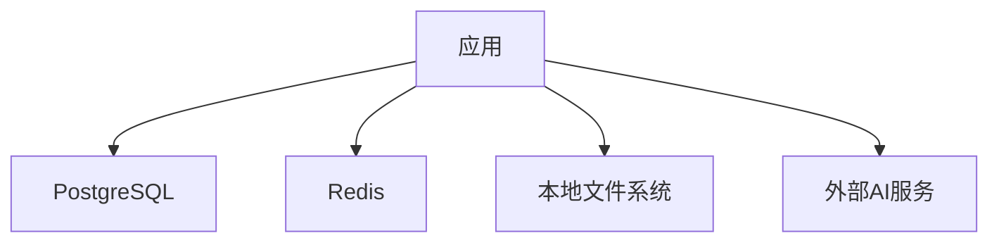
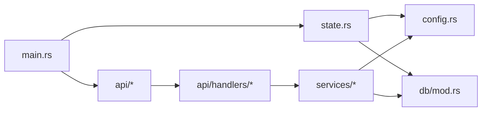

# 后端架构设计

<cite>
**本文引用的文件**
- [backend/core/src/main.rs](file://backend/core/src/main.rs)
- [backend/core/src/state.rs](file://backend/core/src/state.rs)
- [backend/core/src/config.rs](file://backend/core/src/config.rs)
- [backend/core/src/db/mod.rs](file://backend/core/src/db/mod.rs)
- [backend/core/src/api/mod.rs](file://backend/core/src/api/mod.rs)
- [backend/core/src/api/handlers/mod.rs](file://backend/core/src/api/handlers/mod.rs)
- [backend/core/src/api/handlers/auth.rs](file://backend/core/src/api/handlers/auth.rs)
- [backend/core/src/db/user_repo.rs](file://backend/core/src/db/user_repo.rs)
- [backend/core/src/services/field_service.rs](file://backend/core/src/services/field_service.rs)
- [backend/core/src/errors.rs](file://backend/core/src/errors.rs)
- [backend/core/Cargo.toml](file://backend/core/Cargo.toml)
- [docker/docker-compose.yml](file://docker/docker-compose.yml)
</cite>

## 目录
1. [引言](#引言)
2. [项目结构](#项目结构)
3. [核心组件](#核心组件)
4. [架构总览](#架构总览)
5. [详细组件分析](#详细组件分析)
6. [依赖关系分析](#依赖关系分析)
7. [性能考虑](#性能考虑)
8. [故障排查指南](#故障排查指南)
9. [结论](#结论)
10. [附录](#附录)

## 引言
本文件面向开发者与架构师，系统性阐述基于 Rust + Axum 的 POMP 后端系统架构设计。该系统采用 Clean Architecture 分层思想，将表现层、业务层与数据层清晰分离；通过 AppState 实现依赖注入与全局状态管理；以 Tokio 运行时驱动异步 IO；集成 PostgreSQL 数据库连接池、Redis 缓存与本地文件存储；提供统一的错误处理与响应封装。本文将从架构视角、组件关系、数据流、处理逻辑、集成点、错误处理与性能优化等方面进行深入解析。

## 项目结构
后端位于 backend/core，采用“库 + 可执行程序”的双工组织方式：
- 库模块导出公共类型与工具（配置、数据库、错误、状态），可被其他模块或测试复用
- 可执行程序负责启动服务、构建路由、初始化 AppState 并绑定到 Axum Router

图表来源
- [backend/core/src/main.rs:1-372](file://backend/core/src/main.rs#L1-L372)
- [backend/core/src/state.rs:1-88](file://backend/core/src/state.rs#L1-L88)
- [backend/core/src/config.rs:1-116](file://backend/core/src/config.rs#L1-L116)
- [backend/core/src/db/mod.rs:1-44](file://backend/core/src/db/mod.rs#L1-L44)
- [backend/core/src/api/mod.rs:1-2](file://backend/core/src/api/mod.rs#L1-L2)
- [backend/core/src/api/handlers/mod.rs:1-22](file://backend/core/src/api/handlers/mod.rs#L1-L22)

章节来源
- [backend/core/src/main.rs:1-372](file://backend/core/src/main.rs#L1-L372)
- [backend/core/src/lib.rs:1-12](file://backend/core/src/lib.rs#L1-L12)

## 核心组件
- 配置系统：集中管理数据库、Redis、JWT、AI 接口等配置项，支持从环境变量加载
- 数据库层：SQLx PgPool 连接池与领域仓库（如用户、字段记录等）模块化组织
- 业务服务层：封装领域业务逻辑（如外勤记录证据上传、文件存储、AI 图像生成等）
- 表现层（API Handlers）：Axum 路由处理器，接收请求、调用业务服务、返回统一响应
- 错误与响应：统一的 AppError 枚举与 ApiResponse 封装，自动映射 HTTP 状态码
- 全局状态 AppState：集中持有 Config、DbPool、Redis 客户端与业务服务实例，通过 Builder 注入

章节来源
- [backend/core/src/config.rs:1-116](file://backend/core/src/config.rs#L1-L116)
- [backend/core/src/db/mod.rs:1-44](file://backend/core/src/db/mod.rs#L1-L44)
- [backend/core/src/state.rs:1-88](file://backend/core/src/state.rs#L1-L88)
- [backend/core/src/errors.rs:1-106](file://backend/core/src/errors.rs#L1-L106)

## 架构总览
系统遵循 Clean Architecture 分层：
- 表现层：Axum Router 与 Handlers，负责请求接入、参数校验、调用业务层、返回响应
- 业务层：Service 对象封装领域规则与流程编排，依赖仓储与配置
- 数据层：SQLx 连接池与领域仓库，负责数据库读写与迁移
- 基础设施：Redis、文件系统、外部 AI 服务等

图表来源
- [backend/core/src/main.rs:42-270](file://backend/core/src/main.rs#L42-L270)
- [backend/core/src/state.rs:10-20](file://backend/core/src/state.rs#L10-L20)
- [backend/core/src/services/field_service.rs:1-223](file://backend/core/src/services/field_service.rs#L1-L223)

## 详细组件分析

### 依赖注入与全局状态管理（AppState）
- 设计理念：将所有跨模块共享的资源（配置、数据库、Redis、业务服务）收敛到 AppState，避免在各处理器中重复构造
- Builder 模式：按需注入 Config、DbPool、Redis 客户端，构建完成后统一放入 Arc，供处理器通过 State 提取
- 初始化策略：在构建 AppState 时创建业务服务实例，并在启动时尝试初始化默认帮助内容

图表来源
- [backend/core/src/state.rs:10-88](file://backend/core/src/state.rs#L10-L88)

章节来源
- [backend/core/src/state.rs:1-88](file://backend/core/src/state.rs#L1-L88)

### 配置系统（Config）
- 功能：集中管理服务端口、数据库连接、Redis 连接、JWT 密钥与过期时间、AI 接口地址与模型等
- 加载策略：优先从项目根目录 .env 加载，再从环境变量覆盖，最终反序列化为 Config 结构体

章节来源
- [backend/core/src/config.rs:1-116](file://backend/core/src/config.rs#L1-L116)

### 数据库层（SQLx PgPool 与领域仓库）
- 连接池：最大连接数、连接字符串来自配置，启动时建立并进行健康检查
- 仓库模块：按领域拆分（用户、字段记录、字典、帮助、合同、GIS、日程、工作流等），每个领域包含实体与仓库函数
- 迁移：启动时自动执行 SQLX 迁移脚本，保证数据库结构一致性

图表来源
- [backend/core/src/main.rs:23-28](file://backend/core/src/main.rs#L23-L28)
- [backend/core/src/db/mod.rs:30-44](file://backend/core/src/db/mod.rs#L30-L44)

章节来源
- [backend/core/src/db/mod.rs:1-44](file://backend/core/src/db/mod.rs#L1-L44)
- [backend/core/src/main.rs:23-28](file://backend/core/src/main.rs#L23-L28)

### 业务服务层（以字段记录为例）
- 职责：封装领域业务逻辑，协调仓储与基础设施（文件系统、数据库）
- 示例：字段记录服务支持创建、查询、更新、删除记录，以及照片与音频证据的上传、存储与关联
- 文件存储：证据文件写入本地 storage 目录，路径与元信息持久化至数据库

图表来源
- [backend/core/src/api/handlers/auth.rs:82-200](file://backend/core/src/api/handlers/auth.rs#L82-L200)
- [backend/core/src/services/field_service.rs:84-128](file://backend/core/src/services/field_service.rs#L84-L128)
- [backend/core/src/db/user_repo.rs:7-46](file://backend/core/src/db/user_repo.rs#L7-L46)

章节来源
- [backend/core/src/services/field_service.rs:1-223](file://backend/core/src/services/field_service.rs#L1-L223)
- [backend/core/src/db/user_repo.rs:1-200](file://backend/core/src/db/user_repo.rs#L1-L200)

### 表现层（Axum 路由与处理器）
- 路由组织：按领域拆分子模块（认证、CMS、字段、组织、HR、工作流、帮助、GIS、日程、媒体、网站等），主入口统一装配
- 处理器职责：参数提取、调用业务服务、错误转换、返回 ApiResponse
- 认证示例：登录处理器根据用户名密码校验，生成 JWT 并返回用户信息

图表来源
- [backend/core/src/main.rs:84-96](file://backend/core/src/main.rs#L84-L96)
- [backend/core/src/api/handlers/auth.rs:82-200](file://backend/core/src/api/handlers/auth.rs#L82-L200)
- [backend/core/src/db/user_repo.rs:117-141](file://backend/core/src/db/user_repo.rs#L117-L141)

章节来源
- [backend/core/src/main.rs:42-270](file://backend/core/src/main.rs#L42-L270)
- [backend/core/src/api/handlers/auth.rs:1-200](file://backend/core/src/api/handlers/auth.rs#L1-L200)
- [backend/core/src/api/handlers/mod.rs:1-22](file://backend/core/src/api/handlers/mod.rs#L1-L22)

### 错误处理与响应封装
- 错误体系：AppError 枚举覆盖数据库、Redis、外部服务、认证、授权、验证、未找到、内部错误、请求参数错误等
- 响应封装：ApiResponse 统一 success/data/error 字段，处理器返回 JSON 包裹
- 状态码映射：根据错误类型自动映射到合适的 HTTP 状态码

图表来源
- [backend/core/src/errors.rs:54-78](file://backend/core/src/errors.rs#L54-L78)
- [backend/core/src/errors.rs:82-105](file://backend/core/src/errors.rs#L82-L105)

章节来源
- [backend/core/src/errors.rs:1-106](file://backend/core/src/errors.rs#L1-L106)

### 异步编程模型与 Tokio 运行时
- 运行时：#[tokio::main] 启动异步运行时，所有网络 IO、数据库操作、外部服务调用均异步执行
- 连接池：SQLx PgPool 与 Redis 客户端均支持异步操作，配合 Tokio 的多核并发能力
- 文件系统：本地文件写入在服务线程中执行，注意生产环境建议迁移到对象存储（如 MinIO）

章节来源
- [backend/core/src/main.rs:16-16](file://backend/core/src/main.rs#L16-L16)
- [backend/core/Cargo.toml:20-20](file://backend/core/Cargo.toml#L20-L20)
- [backend/core/src/db/mod.rs:30-37](file://backend/core/src/db/mod.rs#L30-L37)

### 基础设施集成
- 数据库：PostgreSQL，连接池与迁移在启动时完成
- 缓存：Redis 客户端在 AppState 中注入，可用于会话、令牌、热点数据缓存
- 文件存储：证据文件写入 ./storage 目录，生产环境建议替换为 MinIO 或云存储
- 外部服务：配置中预留 AI 图像生成与文本模型接口，可在业务服务中调用

图表来源
- [backend/core/src/state.rs:14-14](file://backend/core/src/state.rs#L14-L14)
- [backend/core/src/config.rs:20-45](file://backend/core/src/config.rs#L20-L45)
- [docker/docker-compose.yml:1-50](file://docker/docker-compose.yml#L1-L50)

章节来源
- [backend/core/src/state.rs:1-88](file://backend/core/src/state.rs#L1-L88)
- [backend/core/src/config.rs:1-116](file://backend/core/src/config.rs#L1-L116)
- [docker/docker-compose.yml:1-50](file://docker/docker-compose.yml#L1-L50)

## 依赖关系分析
- 模块耦合：表现层仅依赖业务服务接口，业务层依赖仓储接口，仓储依赖 SQLx，降低对底层实现的耦合
- 外部依赖：Axum、SQLx、Redis、Tokio、Tracing 等，均通过 Cargo.toml 明确声明
- 运行时特性：启用 tokio full features、sqlx runtime-tokio-rustls、redis tokio-comp 等

图表来源
- [backend/core/src/main.rs:1-372](file://backend/core/src/main.rs#L1-L372)
- [backend/core/src/state.rs:1-88](file://backend/core/src/state.rs#L1-L88)
- [backend/core/src/api/mod.rs:1-2](file://backend/core/src/api/mod.rs#L1-L2)
- [backend/core/src/api/handlers/mod.rs:1-22](file://backend/core/src/api/handlers/mod.rs#L1-L22)

章节来源
- [backend/core/Cargo.toml:15-49](file://backend/core/Cargo.toml#L15-L49)

## 性能考虑
- 连接池大小：当前数据库连接池最大连接数为 50，建议根据 QPS 与数据库规格压测调整
- 异步 IO：Tokio 运行时充分利用异步特性，减少阻塞；注意避免在处理器中执行 CPU 密集型任务
- 缓存策略：Redis 可用于热点数据与会话缓存，建议针对高频查询增加缓存键空间与过期策略
- 文件存储：本地文件写入在高并发下可能成为瓶颈，建议迁移到对象存储并开启 CDN
- 序列化与日志：统一使用 serde_json，日志通过 tracing-subscriber 输出，建议在生产环境配置采样与级别过滤

## 故障排查指南
- 数据库连接失败：检查数据库 URL 与容器连通性，确认迁移是否成功
- Redis 连接失败：检查 Redis URL 与容器连通性
- JWT 签发失败：检查 JWT 秘钥配置与时间戳计算
- 文件写入失败：检查 storage 目录权限与磁盘空间
- 处理器报错：查看 AppError 映射的状态码与错误消息，定位具体异常类型

章节来源
- [backend/core/src/errors.rs:54-78](file://backend/core/src/errors.rs#L54-L78)
- [backend/core/src/api/handlers/auth.rs:102-112](file://backend/core/src/api/handlers/auth.rs#L102-L112)
- [backend/core/src/services/field_service.rs:94-108](file://backend/core/src/services/field_service.rs#L94-L108)

## 结论
本架构以 Clean Architecture 为核心，通过 AppState 实现依赖注入与全局状态管理，结合 Axum 的高性能异步模型与 SQLx/Redis 的基础设施，形成清晰、可扩展且易维护的后端系统。建议在生产环境中进一步完善缓存策略、对象存储迁移、监控与可观测性，并持续进行性能压测与容量规划。

## 附录
- 启动与部署：使用 docker-compose 启动 PostgreSQL、Redis、MinIO；应用通过可执行程序启动
- 配置文件：.env 位于项目根目录，包含数据库、Redis、AI 接口等配置项
- 路由清单：主入口集中注册各领域路由，便于统一管理与扩展

章节来源
- [docker/docker-compose.yml:1-50](file://docker/docker-compose.yml#L1-L50)
- [backend/core/src/config.rs:96-115](file://backend/core/src/config.rs#L96-L115)
- [backend/core/src/main.rs:42-270](file://backend/core/src/main.rs#L42-L270)