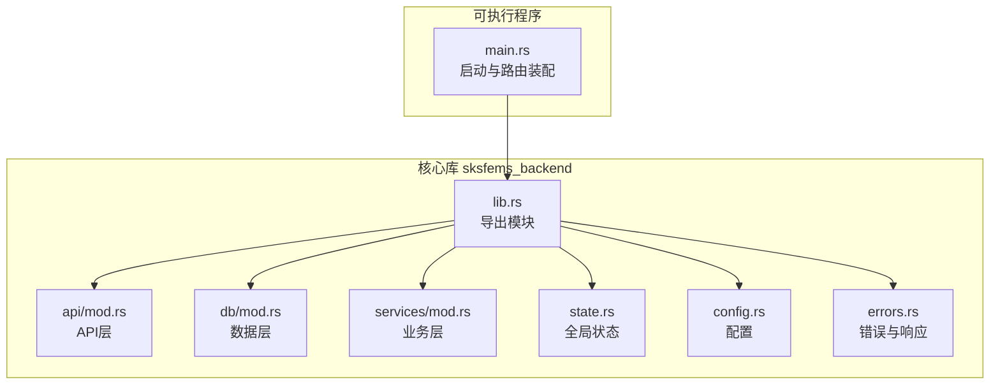
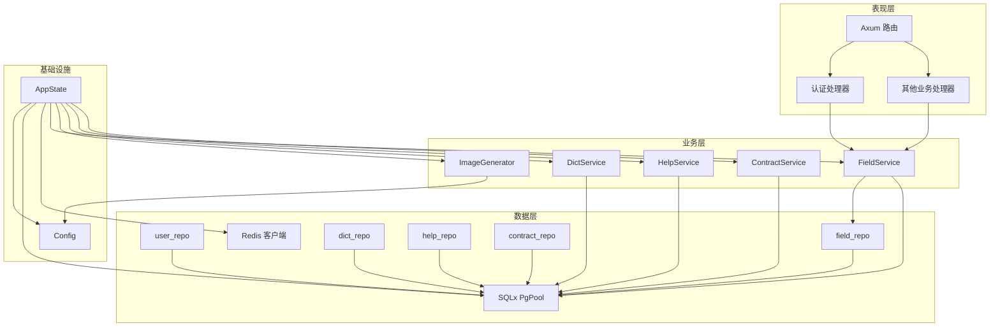
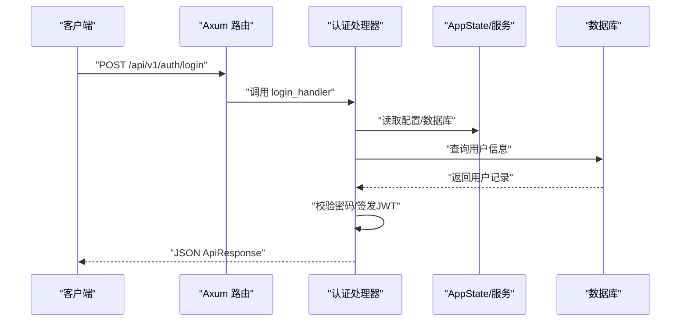
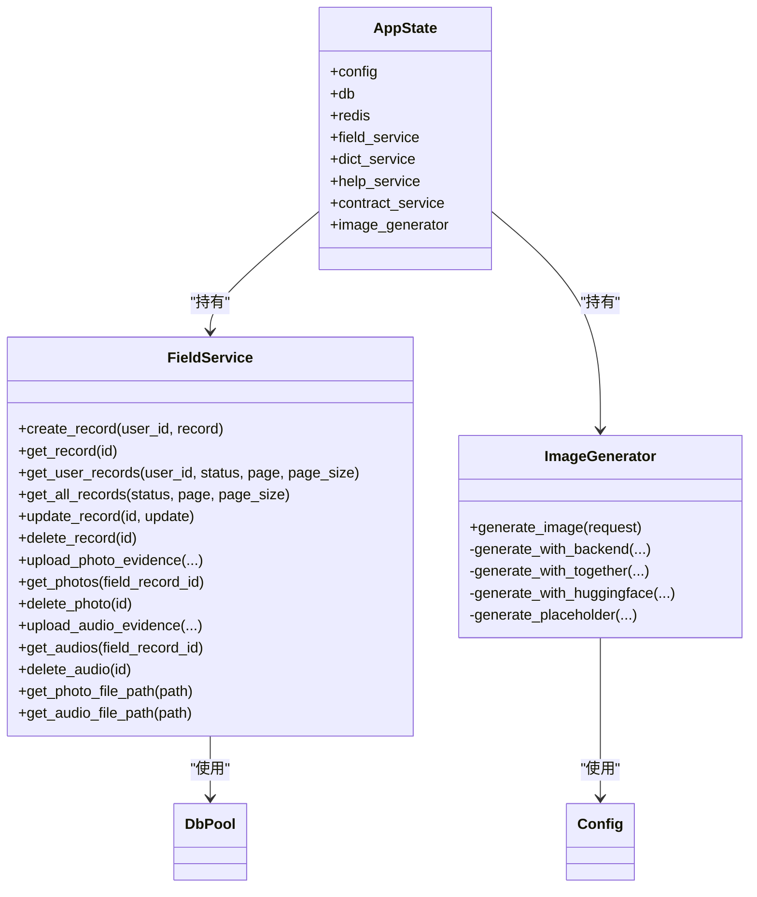
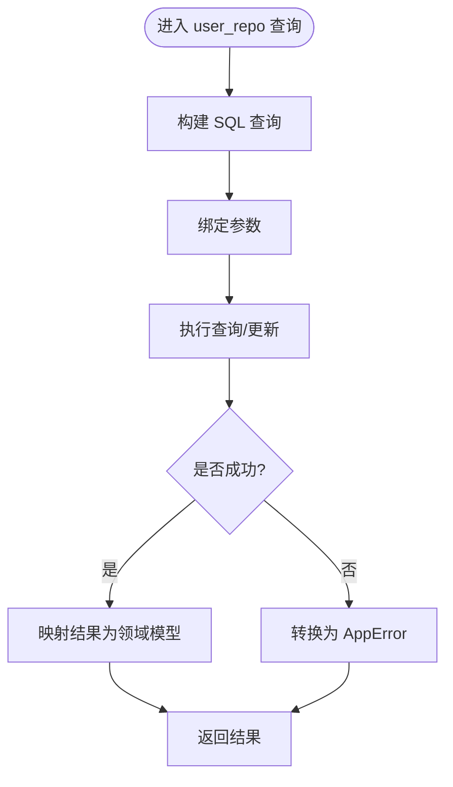
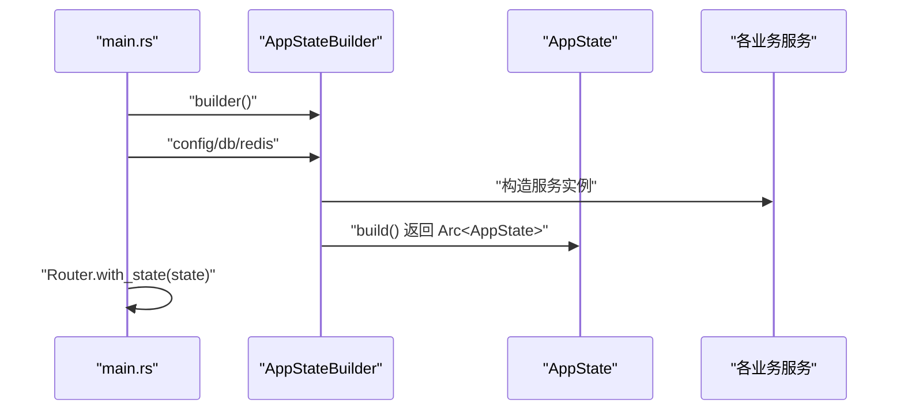
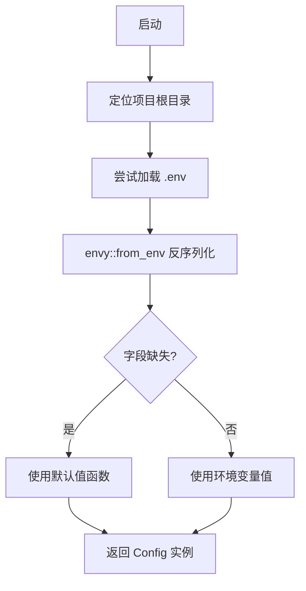
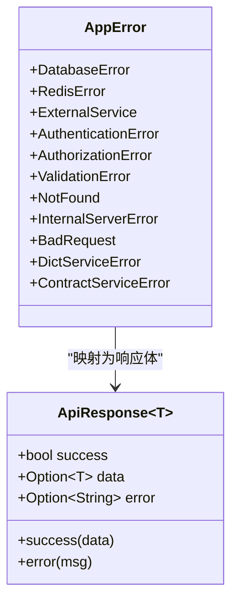
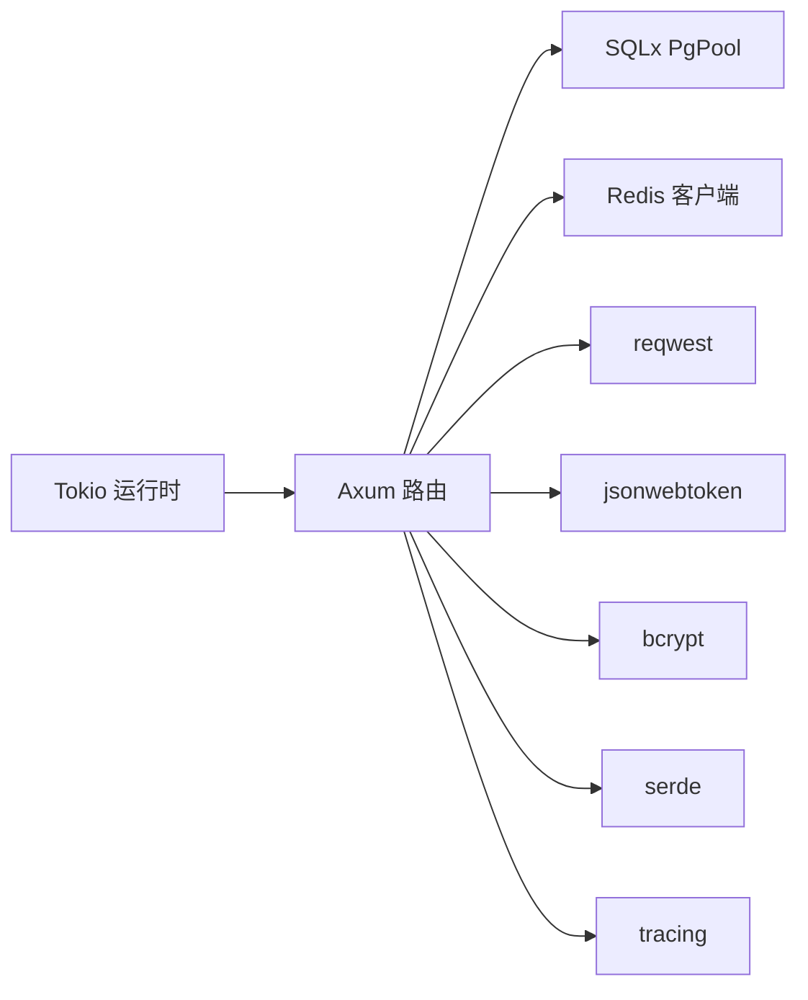

# 应用架构概览

<cite>
**本文引用的文件**
- [main.rs](file://backend/core/src/main.rs)
- [state.rs](file://backend/core/src/state.rs)
- [config.rs](file://backend/core/src/config.rs)
- [lib.rs](file://backend/core/src/lib.rs)
- [Cargo.toml](file://backend/core/Cargo.toml)
- [errors.rs](file://backend/core/src/errors.rs)
- [db/mod.rs](file://backend/core/src/db/mod.rs)
- [services/mod.rs](file://backend/core/src/services/mod.rs)
- [api/mod.rs](file://backend/core/src/api/mod.rs)
- [api/handlers/mod.rs](file://backend/core/src/api/handlers/mod.rs)
- [api/handlers/auth.rs](file://backend/core/src/api/handlers/auth.rs)
- [db/user_repo.rs](file://backend/core/src/db/user_repo.rs)
- [services/image_generator.rs](file://backend/core/src/services/image_generator.rs)
- [services/field_service.rs](file://backend/core/src/services/field_service.rs)
</cite>

## 目录
1. [引言](#引言)
2. [项目结构](#项目结构)
3. [核心组件](#核心组件)
4. [架构总览](#架构总览)
5. [详细组件分析](#详细组件分析)
6. [依赖分析](#依赖分析)
7. [性能考虑](#性能考虑)
8. [故障排查指南](#故障排查指南)
9. [结论](#结论)
10. [附录](#附录)

## 引言
本文件面向开发者与架构师，系统化阐述基于 Rust + Axum 的 Clean Architecture 分层设计与实现细节，覆盖表现层、业务层、数据层的职责划分与交互关系；详解 AppState 全局状态管理器的依赖注入与服务生命周期；说明 Tokio 异步运行时的配置与并发模型；剖析配置管理的加载、校验与热重载能力；并给出性能优化与扩展性设计建议，帮助快速理解与高效演进 POMP 后端架构。

## 项目结构
后端采用“库 + 可执行程序”的双目标组织方式，核心库对外暴露统一入口，可执行程序负责启动服务与路由装配。整体目录按“领域功能”进行分层与模块化组织，便于维护与扩展。

图表来源
- [lib.rs:1-12](file://backend/core/src/lib.rs#L1-L12)
- [main.rs:1-372](file://backend/core/src/main.rs#L1-L372)

章节来源
- [lib.rs:1-12](file://backend/core/src/lib.rs#L1-L12)
- [Cargo.toml:1-52](file://backend/core/Cargo.toml#L1-L52)

## 核心组件
- 表现层（API Handlers）：以 Axum 路由为中心，接收请求、解析参数、调用业务层、返回标准化响应。
- 业务层（Services）：封装领域业务规则与流程编排，如图像生成、外勤记录、字典与帮助内容管理等。
- 数据层（Repositories + SQLx）：封装数据库访问与事务边界，提供类型安全的查询与更新。
- 全局状态（AppState）：集中管理配置、数据库连接池、缓存客户端、服务实例与工具类，通过 Builder 模式构建与初始化。
- 配置系统（Config）：从 .env 加载键值，结合默认值与 serde 注解完成反序列化与类型校验。
- 错误与响应（AppError/ApiResponse）：统一错误语义与 HTTP 状态映射，提供一致的响应结构。

章节来源
- [main.rs:1-372](file://backend/core/src/main.rs#L1-L372)
- [state.rs:1-88](file://backend/core/src/state.rs#L1-L88)
- [config.rs:1-116](file://backend/core/src/config.rs#L1-L116)
- [errors.rs:1-106](file://backend/core/src/errors.rs#L1-L106)
- [db/mod.rs:1-44](file://backend/core/src/db/mod.rs#L1-L44)
- [services/mod.rs:1-8](file://backend/core/src/services/mod.rs#L1-L8)

## 架构总览
Clean Architecture 的分层边界清晰：表现层不直接依赖数据存储，业务层不感知网络协议，数据层不包含业务规则。通过依赖倒置与接口抽象，实现关注点分离与测试友好。

图表来源
- [main.rs:42-270](file://backend/core/src/main.rs#L42-L270)
- [state.rs:10-87](file://backend/core/src/state.rs#L10-L87)
- [db/mod.rs:25-44](file://backend/core/src/db/mod.rs#L25-L44)
- [services/mod.rs:1-8](file://backend/core/src/services/mod.rs#L1-L8)
- [api/handlers/auth.rs:82-202](file://backend/core/src/api/handlers/auth.rs#L82-L202)

## 详细组件分析

### 表现层：Axum 路由与处理器
- 启动流程：初始化日志、加载配置、建立数据库连接与迁移、初始化 Redis、构建 AppState 并装配路由。
- 路由组织：按功能域拆分，如认证、用户、角色、工作流、外勤记录、CMS、媒体、GIS、帮助中心等。
- 处理器职责：解析请求体/路径/查询参数，调用业务层服务，处理 AppError 并返回 ApiResponse。

图表来源
- [main.rs:42-96](file://backend/core/src/main.rs#L42-L96)
- [api/handlers/auth.rs:82-202](file://backend/core/src/api/handlers/auth.rs#L82-L202)

章节来源
- [main.rs:16-277](file://backend/core/src/main.rs#L16-L277)
- [api/handlers/auth.rs:1-640](file://backend/core/src/api/handlers/auth.rs#L1-L640)

### 业务层：服务与领域逻辑
- FieldService：外勤记录的增删改查、证据材料（照片/音频）上传与管理，本地文件系统存储与数据库关联。
- ImageGenerator：多后端图像生成（TogetherAI/HuggingFace/占位），自动降级与错误聚合。
- DictService/HelpService/ContractService：字典、帮助内容与合同相关业务的封装。

图表来源
- [services/field_service.rs:17-223](file://backend/core/src/services/field_service.rs#L17-L223)
- [services/image_generator.rs:76-309](file://backend/core/src/services/image_generator.rs#L76-L309)
- [state.rs:10-87](file://backend/core/src/state.rs#L10-L87)

章节来源
- [services/field_service.rs:1-223](file://backend/core/src/services/field_service.rs#L1-L223)
- [services/image_generator.rs:1-309](file://backend/core/src/services/image_generator.rs#L1-L309)

### 数据层：Repository 与 SQLx 连接池
- 连接池：PgPoolOptions 配置最大连接数，保证并发访问稳定性。
- Repositories：围绕实体提供 CRUD 与组合查询，统一错误转换为 AppError。
- 示例：用户仓库提供注册、登录、状态变更、分页查询等常用操作。

图表来源
- [db/user_repo.rs:1-541](file://backend/core/src/db/user_repo.rs#L1-L541)
- [db/mod.rs:30-44](file://backend/core/src/db/mod.rs#L30-L44)

章节来源
- [db/mod.rs:1-44](file://backend/core/src/db/mod.rs#L1-L44)
- [db/user_repo.rs:1-541](file://backend/core/src/db/user_repo.rs#L1-L541)

### 全局状态管理器 AppState：依赖注入与生命周期
- 设计理念：将配置、数据库、Redis、各业务服务实例统一注入，避免全局静态污染，便于测试与替换。
- Builder 模式：链式设置依赖，集中初始化与副作用（如帮助内容初始化），最终返回 Arc<AppState>。
- 生命周期：随进程启动构建，随应用退出释放；服务实例通过 Arc 共享，避免重复构造。

图表来源
- [main.rs:32-37](file://backend/core/src/main.rs#L32-L37)
- [state.rs:22-87](file://backend/core/src/state.rs#L22-L87)

章节来源
- [state.rs:1-88](file://backend/core/src/state.rs#L1-L88)
- [main.rs:32-37](file://backend/core/src/main.rs#L32-L37)

### 配置管理：加载、校验与默认值
- 加载顺序：优先从项目根目录 .env 加载，再从环境变量覆盖；结合 serde 注解与默认函数提供健壮的缺省值。
- 结构化配置：包含数据库、Redis、JWT、AI 服务（Together/HuggingFace/Ollama）、图片生成参数等。
- 扩展性：新增配置项只需在 Config 结构体中声明并提供默认函数，无需改动加载逻辑。

图表来源
- [config.rs:96-116](file://backend/core/src/config.rs#L96-L116)

章节来源
- [config.rs:1-116](file://backend/core/src/config.rs#L1-L116)

### 错误与响应：统一语义与状态码映射
- AppError：涵盖数据库、Redis、外部服务、认证、授权、验证、未找到、请求错误、内部错误等。
- IntoResponse：将错误映射为标准 HTTP 状态码与 JSON 响应体。
- ApiResponse：统一 success/data/error 字段，简化前端消费。

图表来源
- [errors.rs:6-106](file://backend/core/src/errors.rs#L6-L106)

章节来源
- [errors.rs:1-106](file://backend/core/src/errors.rs#L1-L106)

## 依赖分析
- 运行时：Tokio 全特性运行时，支持多线程与异步任务调度。
- Web 框架：Axum + tower + tower-http，提供高性能路由与中间件生态。
- 数据访问：SQLx Postgres 连接池，支持并发查询与迁移。
- 缓存：Redis 客户端，配合连接管理器与 tokio-compat。
- 工具与生态：reqwest、bcrypt、jsonwebtoken、serde、tracing 等。

图表来源
- [Cargo.toml:15-49](file://backend/core/Cargo.toml#L15-L49)

章节来源
- [Cargo.toml:1-52](file://backend/core/Cargo.toml#L1-L52)

## 性能考虑
- 连接池与并发：SQLx PgPool 最大连接数配置与合理的超时设置，避免阻塞与资源枯竭。
- 异步 I/O：Tokio 运行时充分利用异步网络与数据库驱动，减少阻塞调用。
- 业务降级：ImageGenerator 多后端自动切换与占位回退，提升可用性与稳定性。
- 缓存与会话：Redis 用于会话与热点数据缓存，需注意键空间与过期策略。
- 日志与追踪：tracing-subscriber 提供结构化日志与采样，辅助性能分析与问题定位。

## 故障排查指南
- 启动失败：检查 .env 是否正确加载、数据库连接串与凭据、Redis 地址可达性。
- 路由 404/500：确认路由注册与处理器导入无遗漏，查看日志中的错误堆栈。
- 数据库异常：核对迁移是否执行、连接池配置与慢查询日志。
- 外部服务错误：检查 AI 服务 API Key、URL 与配额限制，观察 ImageGenerator 的错误日志。
- 认证失败：核对 JWT 秘钥、过期时间与前端携带的 Authorization 头格式。

章节来源
- [main.rs:16-41](file://backend/core/src/main.rs#L16-L41)
- [errors.rs:54-78](file://backend/core/src/errors.rs#L54-L78)
- [services/image_generator.rs:141-160](file://backend/core/src/services/image_generator.rs#L141-L160)

## 结论
该架构以 Clean Architecture 为核心，借助 Axum 的高性能与 Rust 的内存安全，实现了清晰的分层、可测试的业务逻辑与稳定的基础设施集成。通过 AppState 的依赖注入与 Builder 模式，服务生命周期得到良好管理；配置系统提供灵活的默认值与环境覆盖；错误与响应体系统一了交互契约。建议在后续迭代中进一步完善配置热重载、监控埋点与可观测性，持续优化并发与缓存策略，增强弹性与可扩展性。

## 附录
- 关键实现路径参考
  - [main.rs 启动与路由装配:16-277](file://backend/core/src/main.rs#L16-L277)
  - [state.rs AppState 与 Builder:10-87](file://backend/core/src/state.rs#L10-L87)
  - [config.rs 配置加载与默认值:96-116](file://backend/core/src/config.rs#L96-L116)
  - [errors.rs 错误与响应:54-106](file://backend/core/src/errors.rs#L54-L106)
  - [db/mod.rs 连接池与工厂:30-44](file://backend/core/src/db/mod.rs#L30-L44)
  - [services/field_service.rs 外勤服务:17-223](file://backend/core/src/services/field_service.rs#L17-L223)
  - [services/image_generator.rs 图像生成:76-309](file://backend/core/src/services/image_generator.rs#L76-L309)
  - [api/handlers/auth.rs 认证处理器:82-202](file://backend/core/src/api/handlers/auth.rs#L82-L202)
  - [db/user_repo.rs 用户仓库:1-541](file://backend/core/src/db/user_repo.rs#L1-L541)