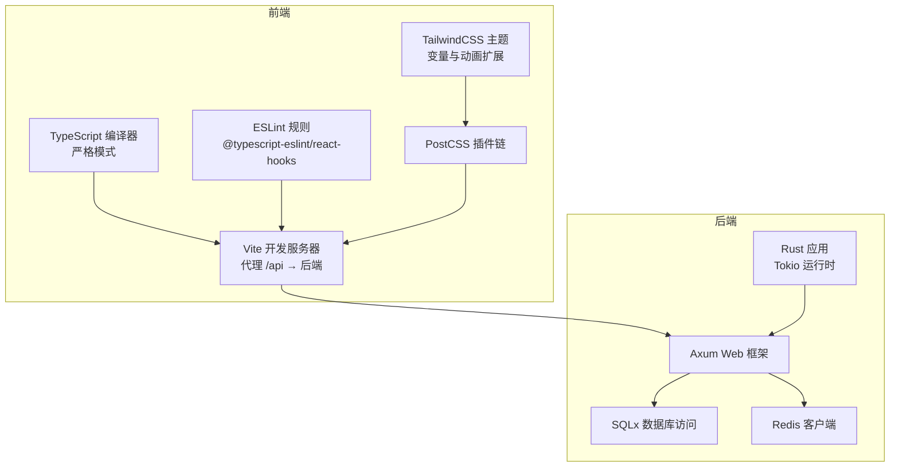
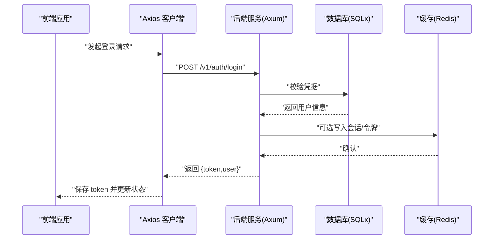
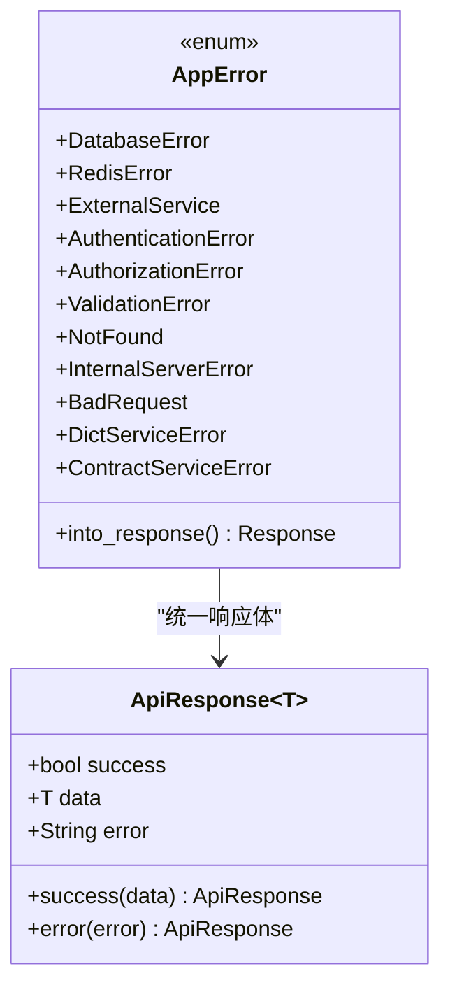
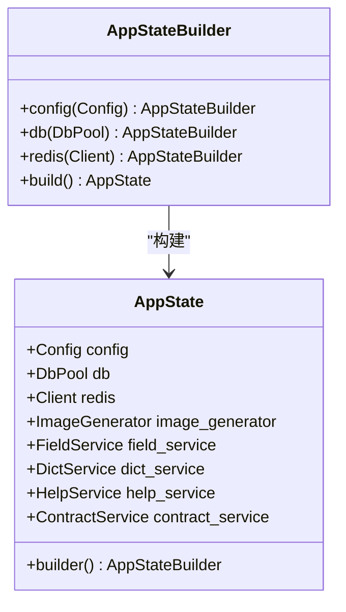
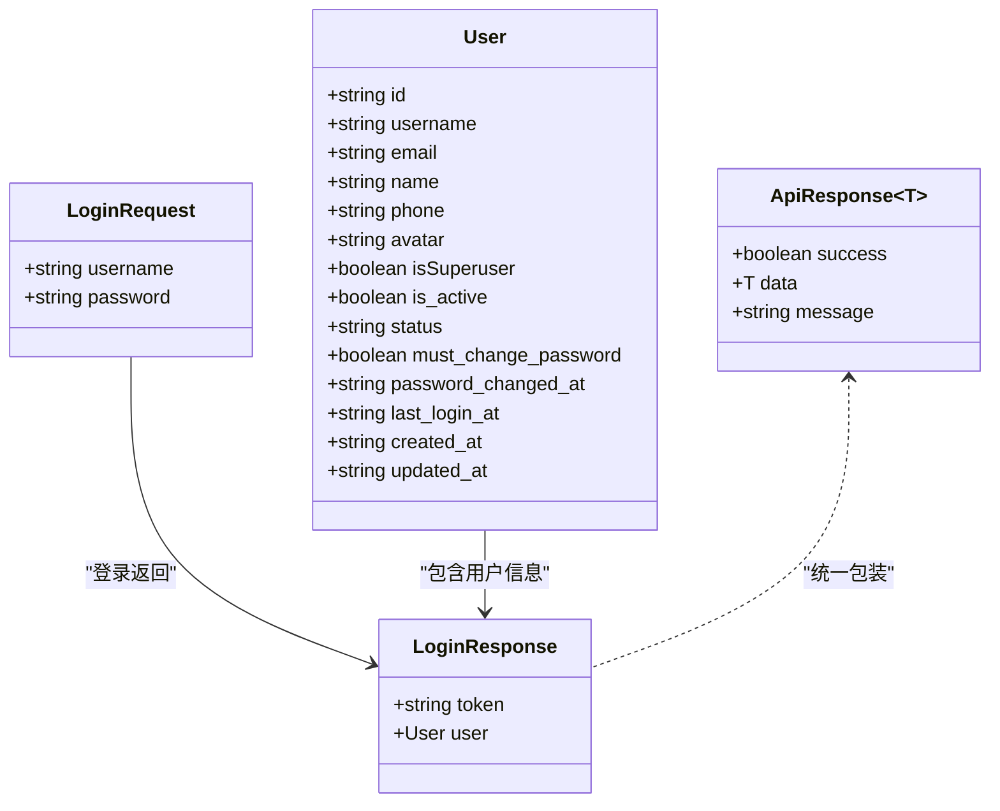
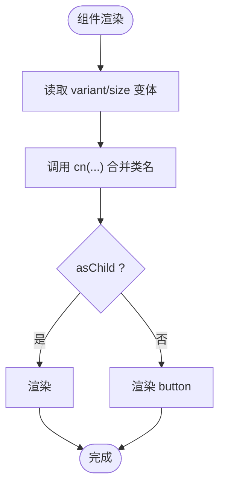
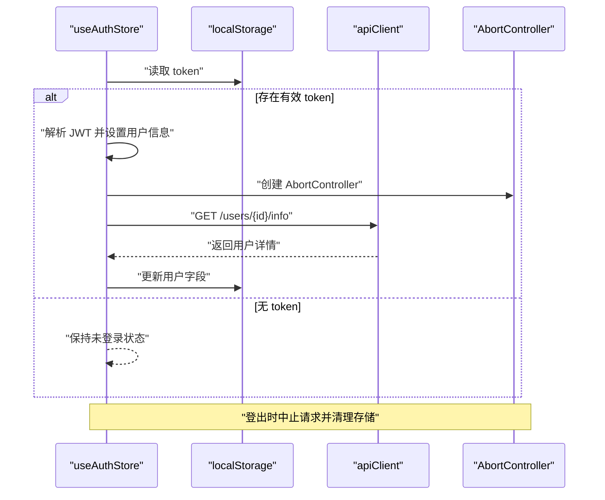
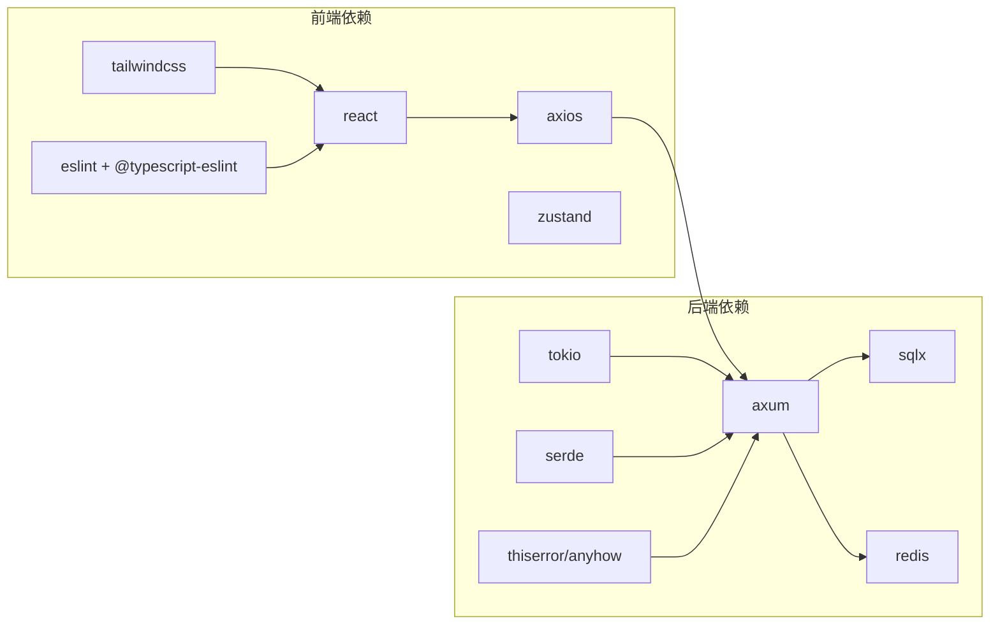

# 代码规范

<cite>
**本文引用的文件**
- [package.json](file://frontend/package.json)
- [tsconfig.json](file://frontend/tsconfig.json)
- [tailwind.config.js](file://frontend/tailwind.config.js)
- [.eslintrc.json](file://frontend/.eslintrc.json)
- [vite.config.ts](file://frontend/vite.config.ts)
- [postcss.config.js](file://frontend/postcss.config.js)
- [lib.rs](file://backend/core/src/lib.rs)
- [errors.rs](file://backend/core/src/errors.rs)
- [state.rs](file://backend/core/src/state.rs)
- [Cargo.toml](file://backend/core/Cargo.toml)
- [index.ts](file://frontend/src/types/index.ts)
- [utils.ts](file://frontend/src/lib/utils.ts)
- [Button.tsx](file://frontend/src/components/ui/Button.tsx)
- [useAuthStore.ts](file://frontend/src/store/useAuthStore.ts)
- [auth.ts](file://frontend/src/services/auth.ts)
</cite>

## 目录
1. [引言](#引言)
2. [项目结构](#项目结构)
3. [核心组件](#核心组件)
4. [架构总览](#架构总览)
5. [详细组件分析](#详细组件分析)
6. [依赖分析](#依赖分析)
7. [性能考虑](#性能考虑)
8. [故障排查指南](#故障排查指南)
9. [结论](#结论)
10. [附录](#附录)

## 引言
本文件为 POMP 项目的统一代码规范文档，覆盖 Rust 后端与 TypeScript/React 前端两部分。内容包括命名约定、模块组织、错误处理、异步编程最佳实践、TypeScript 类型与接口设计、泛型与装饰器使用建议、React 组件设计与 Hooks 使用、状态管理、CSS 与样式规范（TailwindCSS）、响应式与主题定制等。文档同时提供正反例对比与图示，帮助团队保持一致的代码风格与可维护性。

## 项目结构
- 前端采用 Vite + React + TypeScript + TailwindCSS 架构，通过别名路径简化导入；ESLint + TypeScript 编译器配置严格启用严格模式与未使用检查；PostCSS 集成 TailwindCSS 与 autoprefixer。
- 后端采用 Rust + Axum + SQLx + Redis + Tokio 异步运行时，模块化组织在 lib.rs 中导出公共 API，并以 AppState 管理共享资源与服务实例。

图表来源
- [vite.config.ts:1-20](file://frontend/vite.config.ts#L1-L20)
- [tsconfig.json:1-25](file://frontend/tsconfig.json#L1-L25)
- [.eslintrc.json:1-63](file://frontend/.eslintrc.json#L1-L63)
- [tailwind.config.js:1-182](file://frontend/tailwind.config.js#L1-L182)
- [Cargo.toml:1-52](file://backend/core/Cargo.toml#L1-L52)

章节来源
- [package.json:1-60](file://frontend/package.json#L1-L60)
- [tsconfig.json:1-25](file://frontend/tsconfig.json#L1-L25)
- [.eslintrc.json:1-63](file://frontend/.eslintrc.json#L1-L63)
- [tailwind.config.js:1-182](file://frontend/tailwind.config.js#L1-L182)
- [vite.config.ts:1-20](file://frontend/vite.config.ts#L1-L20)
- [postcss.config.js:1-7](file://frontend/postcss.config.js#L1-L7)
- [Cargo.toml:1-52](file://backend/core/Cargo.toml#L1-L52)

## 核心组件
- 前端类型系统：统一的用户、登录、响应体接口，便于跨页面与服务层复用。
- 前端工具函数：cn 合并类名，结合 class-variance-authority 与 tailwind-merge 实现变体与样式合并。
- 前端状态管理：Zustand Store 封装认证流程，包含本地存储、JWT 解析、并发请求控制与登出清理。
- 前端服务层：围绕 API 路径封装请求方法，统一返回结构与分页数据格式。
- 后端错误体系：集中化的 AppError 枚举与 IntoResponse 实现，统一 HTTP 状态码映射与响应体结构。
- 后端状态构建：AppStateBuilder 模式注入配置、数据库、Redis 与各业务服务，支持延迟初始化与日志追踪。

章节来源
- [index.ts:1-32](file://frontend/src/types/index.ts#L1-L32)
- [utils.ts:1-6](file://frontend/src/lib/utils.ts#L1-L6)
- [useAuthStore.ts:1-148](file://frontend/src/store/useAuthStore.ts#L1-L148)
- [auth.ts:1-133](file://frontend/src/services/auth.ts#L1-L133)
- [errors.rs:1-106](file://backend/core/src/errors.rs#L1-L106)
- [state.rs:1-88](file://backend/core/src/state.rs#L1-L88)

## 架构总览
前后端交互通过 Vite 代理到后端服务，前端通过 axios 客户端调用后端 REST 接口；后端以 Axum 提供路由与中间件，使用 SQLx 访问数据库、Redis 缓存，错误统一转换为标准化响应体。

图表来源
- [useAuthStore.ts:63-89](file://frontend/src/store/useAuthStore.ts#L63-L89)
- [auth.ts:72-75](file://frontend/src/services/auth.ts#L72-L75)
- [errors.rs:54-78](file://backend/core/src/errors.rs#L54-L78)

## 详细组件分析

### Rust 后端：错误处理与响应规范
- 错误类型设计：使用 thiserror 的枚举 AppError，覆盖数据库、Redis、外部服务、认证、授权、验证、未找到、内部错误、请求参数错误以及业务服务错误等场景。
- 响应映射：实现 IntoResponse，按错误类型映射到 HTTP 状态码，并统一返回 {success,data,error} 结构。
- 泛型封装：ApiResponse<T> 提供 success/error 工厂方法，便于在服务层快速构造一致的响应体。

图表来源
- [errors.rs:6-40](file://backend/core/src/errors.rs#L6-L40)
- [errors.rs:82-105](file://backend/core/src/errors.rs#L82-L105)

章节来源
- [errors.rs:1-106](file://backend/core/src/errors.rs#L1-L106)

### Rust 后端：应用状态与依赖注入
- AppState：聚合配置、数据库连接池、Redis 客户端、图像生成器与各业务服务，使用 Arc 共享。
- AppStateBuilder：链式构建器，按需注入依赖并在构建时初始化默认帮助内容，记录日志。

图表来源
- [state.rs:10-26](file://backend/core/src/state.rs#L10-L26)
- [state.rs:28-87](file://backend/core/src/state.rs#L28-L87)

章节来源
- [state.rs:1-88](file://backend/core/src/state.rs#L1-L88)

### TypeScript/React：类型与接口设计
- 用户与登录接口：统一定义 User、LoginRequest、LoginResponse、通用 ApiResponse<T>，保证前后端契约一致。
- 服务层接口：auth.ts 对应后端 API 路由，定义请求体与响应体泛型，便于类型推断与 IDE 支持。

图表来源
- [index.ts:1-32](file://frontend/src/types/index.ts#L1-L32)
- [auth.ts:3-70](file://frontend/src/services/auth.ts#L3-L70)

章节来源
- [index.ts:1-32](file://frontend/src/types/index.ts#L1-L32)
- [auth.ts:1-133](file://frontend/src/services/auth.ts#L1-L133)

### TypeScript/React：组件与样式规范
- Button 组件：使用 class-variance-authority 定义变体与尺寸，cn 合并类名，支持 asChild 透传元素语义。
- 样式工具：utils.ts 中的 cn 函数统一处理类名合并，避免重复与冲突。
- Tailwind 主题：tailwind.config.js 扩展颜色、圆角、阴影、过渡时间与动画，支持暗色模式与动画插件。

图表来源
- [Button.tsx:6-56](file://frontend/src/components/ui/Button.tsx#L6-L56)
- [utils.ts:4-6](file://frontend/src/lib/utils.ts#L4-L6)
- [tailwind.config.js:17-179](file://frontend/tailwind.config.js#L17-L179)

章节来源
- [Button.tsx:1-56](file://frontend/src/components/ui/Button.tsx#L1-L56)
- [utils.ts:1-6](file://frontend/src/lib/utils.ts#L1-L6)
- [tailwind.config.js:1-182](file://frontend/tailwind.config.js#L1-L182)

### TypeScript/React：状态管理与异步最佳实践
- Zustand Store：useAuthStore 封装认证状态、登录、登出、用户信息拉取与 JWT 解析；使用 AbortController 控制并发请求；本地存储持久化 token。
- 异步流程：登录成功后解析 JWT 并合并后端返回的用户信息；登出时中止进行中的请求并清理本地存储。

图表来源
- [useAuthStore.ts:40-61](file://frontend/src/store/useAuthStore.ts#L40-L61)
- [useAuthStore.ts:91-127](file://frontend/src/store/useAuthStore.ts#L91-L127)
- [useAuthStore.ts:136-144](file://frontend/src/store/useAuthStore.ts#L136-L144)

章节来源
- [useAuthStore.ts:1-148](file://frontend/src/store/useAuthStore.ts#L1-L148)

### TypeScript/React：ESLint 与构建配置
- ESLint：启用 @typescript-eslint、react-hooks、react-refresh 规则，禁止未使用变量与 console 警告级别放宽。
- TypeScript：严格模式、未使用检查、路径别名 @/* 映射 src 目录。
- Vite：代理 /api 到后端地址，别名 @ 指向 src。
- PostCSS：集成 tailwindcss 与 autoprefixer。

章节来源
- [.eslintrc.json:1-63](file://frontend/.eslintrc.json#L1-L63)
- [tsconfig.json:1-25](file://frontend/tsconfig.json#L1-L25)
- [vite.config.ts:1-20](file://frontend/vite.config.ts#L1-L20)
- [postcss.config.js:1-7](file://frontend/postcss.config.js#L1-L7)

## 依赖分析
- 前端依赖：React、Radix UI、Axios、TailwindCSS 生态、Zustand、日期工具等；开发依赖包括 TypeScript、ESLint、Vite、TailwindCSS、React 插件等。
- 后端依赖：Axum、SQLx、Redis、Tokio、Serde、thiserror、anyhow、tracing、reqwest、validator 等。

图表来源
- [package.json:13-58](file://frontend/package.json#L13-L58)
- [Cargo.toml:15-49](file://backend/core/Cargo.toml#L15-L49)

章节来源
- [package.json:1-60](file://frontend/package.json#L1-L60)
- [Cargo.toml:1-52](file://backend/core/Cargo.toml#L1-L52)

## 性能考虑
- 前端
  - 使用类变体与样式合并减少重复计算与 DOM 冲突。
  - 合理使用 AbortController 控制并发请求，避免竞态与内存泄漏。
  - Tailwind 动画与过渡时间变量统一管理，避免频繁重排。
- 后端
  - 使用 Arc 共享 AppState 与服务实例，降低锁竞争与拷贝成本。
  - AppStateBuilder 延迟初始化默认数据，仅在需要时执行，减少启动开销。
  - SQLx 连接池与 Redis 连接管理器配合 tokio 并发模型提升吞吐。

## 故障排查指南
- 前端
  - 登录失败：检查 axios 客户端是否正确代理 /api；确认后端返回的 token 是否写入 localStorage。
  - 用户信息拉取异常：查看控制台是否有 AbortError 或 CanceledError；确认请求是否被登出逻辑中断。
  - ESLint 报错：根据规则调整未使用变量命名前缀或移除 console.warn；确保 React Hooks 使用符合规则。
- 后端
  - 错误响应不一致：检查 AppError 的 into_response 实现与状态码映射。
  - 初始化失败：关注 AppStateBuilder 构建日志，确认数据库与 Redis 可用性。

章节来源
- [useAuthStore.ts:120-126](file://frontend/src/store/useAuthStore.ts#L120-L126)
- [.eslintrc.json:40-55](file://frontend/.eslintrc.json#L40-L55)
- [errors.rs:54-78](file://backend/core/src/errors.rs#L54-L78)
- [state.rs:78-83](file://backend/core/src/state.rs#L78-L83)

## 结论
本规范文档基于现有代码库提炼了前后端的关键约定与最佳实践，建议团队在新功能开发与重构过程中遵循以下原则：
- 前端：统一类型与接口、严格 ESLint 规则、合理使用 Zustand 与 Radix UI、TailwindCSS 变体与主题变量。
- 后端：集中化错误处理、依赖注入与状态管理、异步与并发安全、统一响应体结构。
通过持续的规范执行与审查，提升代码一致性与可维护性。

## 附录
- 正反例对比建议
  - 命名：优先使用动词短语描述行为（如 fetchUserInfo），避免模糊名词（如 userInfoGetter）。
  - Props：函数组件优先使用解构默认值与非空断言，避免深层嵌套；必要时使用 Partial 与 Omit 辅助类型。
  - Hooks：自定义 Hook 返回值保持稳定结构，副作用集中在 useEffect 内部，避免在渲染阶段产生副作用。
  - 样式：优先使用变体与尺寸组合，避免内联样式的硬编码；主题变量集中于 tailwind.config.js 的 extend 字段。
  - 错误：后端错误类型尽量细分，避免使用通用错误；前端对错误进行分类处理并反馈给用户。