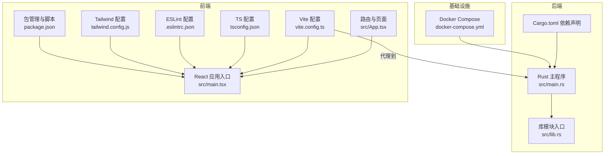
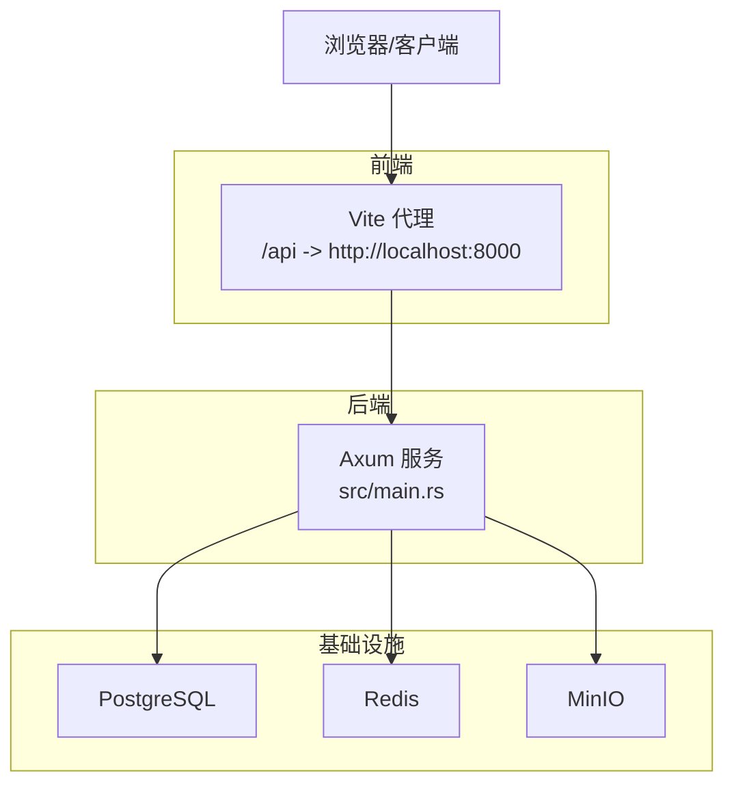
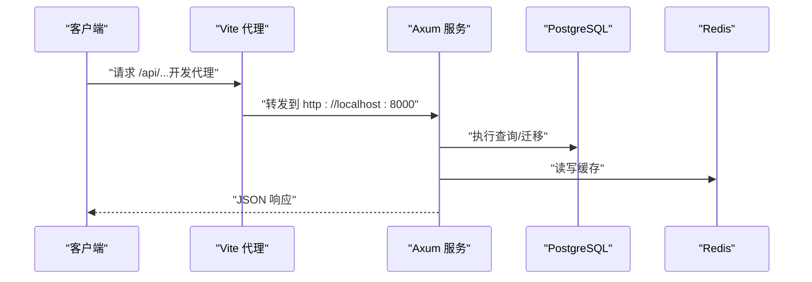
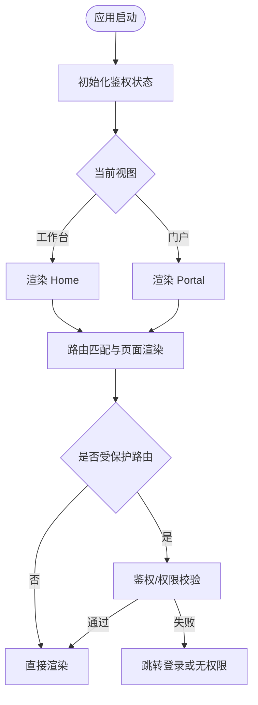
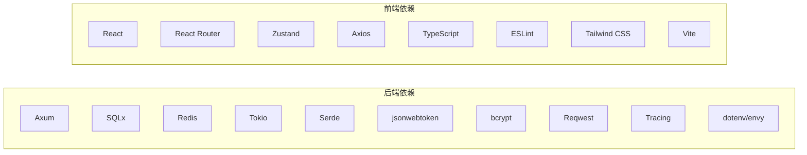

# 开发指南

<cite>
**本文引用的文件**
- [README.md](file://README.md)
- [.github/workflows/ci.yml](file://.github/workflows/ci.yml)
- [backend/core/Cargo.toml](file://backend/core/Cargo.toml)
- [backend/core/src/main.rs](file://backend/core/src/main.rs)
- [backend/core/src/lib.rs](file://backend/core/src/lib.rs)
- [frontend/package.json](file://frontend/package.json)
- [frontend/tsconfig.json](file://frontend/tsconfig.json)
- [frontend/.eslintrc.json](file://frontend/.eslintrc.json)
- [frontend/tailwind.config.js](file://frontend/tailwind.config.js)
- [frontend/vite.config.ts](file://frontend/vite.config.ts)
- [frontend/src/App.tsx](file://frontend/src/App.tsx)
- [frontend/src/main.tsx](file://frontend/src/main.tsx)
- [docker/docker-compose.yml](file://docker/docker-compose.yml)
</cite>

## 目录
1. [引言](#引言)
2. [项目结构](#项目结构)
3. [核心组件](#核心组件)
4. [架构总览](#架构总览)
5. [详细组件分析](#详细组件分析)
6. [依赖分析](#依赖分析)
7. [性能考虑](#性能考虑)
8. [故障排查指南](#故障排查指南)
9. [结论](#结论)
10. [附录](#附录)

## 引言
本开发指南面向 POMP 项目的后端（Rust/Axum）、前端（React/Vite）与基础设施团队，提供从开发环境搭建、代码规范、测试策略、调试与性能分析到分支管理与代码审查的工作流指导。目标是帮助新成员快速上手，同时为长期维护提供一致性的工程实践。

## 项目结构
项目采用前后端分离架构，后端基于 Rust 与 Axum，前端基于 React 与 Vite，配合 Docker Compose 提供本地数据库、缓存与对象存储等基础设施。

**图表来源**
- [backend/core/src/main.rs:1-372](file://backend/core/src/main.rs#L1-L372)
- [backend/core/src/lib.rs:1-12](file://backend/core/src/lib.rs#L1-L12)
- [backend/core/Cargo.toml:1-52](file://backend/core/Cargo.toml#L1-L52)
- [frontend/src/main.tsx:1-13](file://frontend/src/main.tsx#L1-L13)
- [frontend/src/App.tsx:1-356](file://frontend/src/App.tsx#L1-L356)
- [frontend/vite.config.ts:1-20](file://frontend/vite.config.ts#L1-L20)
- [frontend/tsconfig.json:1-25](file://frontend/tsconfig.json#L1-L25)
- [frontend/.eslintrc.json:1-63](file://frontend/.eslintrc.json#L1-L63)
- [frontend/tailwind.config.js:1-182](file://frontend/tailwind.config.js#L1-L182)
- [frontend/package.json:1-60](file://frontend/package.json#L1-L60)
- [docker/docker-compose.yml:1-50](file://docker/docker-compose.yml#L1-L50)

**章节来源**
- [README.md:24-41](file://README.md#L24-L41)
- [docker/docker-compose.yml:1-50](file://docker/docker-compose.yml#L1-L50)

## 核心组件
- 后端服务（Rust/Axum）
  - 通过主程序集中注册所有 API 路由，统一注入应用状态，提供健康检查与多模块业务接口。
  - 依赖管理集中在 Cargo.toml，涵盖 Web 框架、数据库连接、缓存、序列化、验证、日志与网络等。
- 前端应用（React/Vite）
  - 使用 React Router 管理页面路由，配合受保护路由组件实现权限控制。
  - Vite 提供开发服务器与代理，TypeScript 严格类型检查，ESLint/Tailwind 配置保证代码风格与样式一致性。
- 基础设施（Docker Compose）
  - 提供 PostgreSQL、Redis、MinIO 的本地开发环境，便于后端数据库迁移与缓存、对象存储联调。

**章节来源**
- [backend/core/src/main.rs:1-372](file://backend/core/src/main.rs#L1-L372)
- [backend/core/src/lib.rs:1-12](file://backend/core/src/lib.rs#L1-L12)
- [backend/core/Cargo.toml:1-52](file://backend/core/Cargo.toml#L1-L52)
- [frontend/src/App.tsx:1-356](file://frontend/src/App.tsx#L1-L356)
- [frontend/src/main.tsx:1-13](file://frontend/src/main.tsx#L1-L13)
- [frontend/vite.config.ts:1-20](file://frontend/vite.config.ts#L1-L20)
- [frontend/tsconfig.json:1-25](file://frontend/tsconfig.json#L1-L25)
- [frontend/.eslintrc.json:1-63](file://frontend/.eslintrc.json#L1-L63)
- [frontend/tailwind.config.js:1-182](file://frontend/tailwind.config.js#L1-L182)
- [frontend/package.json:1-60](file://frontend/package.json#L1-L60)
- [docker/docker-compose.yml:1-50](file://docker/docker-compose.yml#L1-L50)

## 架构总览
后端以 Axum Router 为中心，按模块划分路由，统一注入 AppState；前端通过 Vite 代理将 /api 请求转发至后端；Docker Compose 提供数据库、缓存与对象存储等依赖。

**图表来源**
- [backend/core/src/main.rs:42-270](file://backend/core/src/main.rs#L42-L270)
- [frontend/vite.config.ts:13-18](file://frontend/vite.config.ts#L13-L18)
- [docker/docker-compose.yml:4-46](file://docker/docker-compose.yml#L4-L46)

## 详细组件分析

### 后端：应用启动与路由组织
- 启动流程
  - 初始化日志订阅器，加载配置，建立数据库连接并执行迁移，初始化 Redis 客户端，构建应用状态，绑定端口并启动服务。
- 路由组织
  - 在主程序中集中注册各模块路由，覆盖物料库、CMS、媒体、外勤记录、认证、角色权限、工作流引擎与任务、组织架构、HR、字典、仪表盘、网站管理、公开文章、日程、会议纪要、帮助中心、GIS 等。
- 文档 AI 优化处理器
  - 提供文档内容生成与优化的示例接口，演示后端对内容型请求的处理与返回结构。

**图表来源**
- [backend/core/src/main.rs:16-41](file://backend/core/src/main.rs#L16-L41)
- [backend/core/src/main.rs:42-270](file://backend/core/src/main.rs#L42-L270)
- [frontend/vite.config.ts:13-18](file://frontend/vite.config.ts#L13-L18)

**章节来源**
- [backend/core/src/main.rs:1-372](file://backend/core/src/main.rs#L1-L372)

### 前端：路由与页面组织
- 路由与权限
  - 使用 React Router 管理页面路由，通过受保护路由组件实现登录态与管理员权限校验。
- 页面与视图
  - 包含工作台首页、门户页面、用户/角色/组织/系统配置、HR、审批任务与历史、工作流、内容与网站管理、帮助中心、日程、文档 AI 助手等页面。
- 开发体验
  - Vite 提供热更新与代理；TypeScript 严格模式；ESLint 规则限制未使用变量与控制台滥用；Tailwind 提供原子化样式与暗色主题支持。

**图表来源**
- [frontend/src/main.tsx:7-12](file://frontend/src/main.tsx#L7-L12)
- [frontend/src/App.tsx:35-50](file://frontend/src/App.tsx#L35-L50)
- [frontend/src/App.tsx:55-349](file://frontend/src/App.tsx#L55-L349)

**章节来源**
- [frontend/src/App.tsx:1-356](file://frontend/src/App.tsx#L1-L356)
- [frontend/src/main.tsx:1-13](file://frontend/src/main.tsx#L1-L13)

### 基础设施：Docker Compose
- 服务
  - PostgreSQL、Redis、MinIO，分别暴露必要端口并持久化数据卷。
- 健康检查
  - PostgreSQL 与 Redis 提供健康检查配置，便于容器编排与监控。

**章节来源**
- [docker/docker-compose.yml:1-50](file://docker/docker-compose.yml#L1-L50)

## 依赖分析
- 后端依赖
  - Web 框架与中间件：Axum、Tower、Tower-HTTP
  - 并发与运行时：Tokio
  - 数据库与 ORM：SQLx（PostgreSQL、迁移、宏）
  - 缓存：Redis（Tokio 连接、连接池）
  - 序列化与验证：Serde、Validator
  - 加解密与令牌：bcrypt、jsonwebtoken
  - 日志与可观测性：Tracing、Tracing-Subscriber
  - 网络与外部服务：Reqwest
  - 环境与配置：dotenv、envy
  - 文件与压缩：Multer、Zip、WalkDir、Tempfile
- 前端依赖
  - 框架与路由：React、React Router DOM
  - 状态管理：Zustand
  - UI 组件库：Radix UI、Ant Design 风格组件
  - 图表与地图：Recharts、OpenLayers
  - 工具库：Axios、Date-fns、Day.js、Lucide React
  - 构建与样式：Vite、Tailwind CSS、PostCSS、Autoprefixer
  - 类型与类型检查：TypeScript、@types/react、@types/node
  - 代码质量：ESLint、@typescript-eslint、React Hooks 规则

**图表来源**
- [backend/core/Cargo.toml:15-49](file://backend/core/Cargo.toml#L15-L49)
- [frontend/package.json:13-58](file://frontend/package.json#L13-L58)

**章节来源**
- [backend/core/Cargo.toml:1-52](file://backend/core/Cargo.toml#L1-L52)
- [frontend/package.json:1-60](file://frontend/package.json#L1-L60)

## 性能考虑
- 后端
  - 使用 Tokio 全功能运行时与 SQLx 连接池，避免阻塞 IO；启用迁移自动执行，减少冷启动时延。
  - 通过 Tracing/Subscriber 输出结构化日志，便于定位热点与慢查询。
- 前端
  - Vite 开发服务器提供快速热更新；TypeScript 严格模式减少运行时错误；Tailwind 原子类减少打包体积。
- 基础设施
  - Docker 卷持久化数据库与缓存数据，避免频繁重建；MinIO 控制台端口便于对象存储调试。

**章节来源**
- [backend/core/src/main.rs:16-41](file://backend/core/src/main.rs#L16-L41)
- [frontend/vite.config.ts:1-20](file://frontend/vite.config.ts#L1-L20)
- [docker/docker-compose.yml:1-50](file://docker/docker-compose.yml#L1-L50)

## 故障排查指南
- 后端
  - 健康检查：访问后端健康端点确认服务可用。
  - 数据库迁移：若迁移失败，检查迁移幂等性与数据库连接字符串。
  - 日志：查看启动日志与迁移日志，定位异常。
- 前端
  - 代理问题：确认 Vite 代理配置指向后端地址。
  - 类型与规则：执行类型检查与 ESLint，修复告警与错误。
- 基础设施
  - 容器健康：使用健康检查命令确认服务就绪。
  - 端口冲突：检查本地端口占用，必要时调整映射。

**章节来源**
- [backend/core/src/main.rs:279-284](file://backend/core/src/main.rs#L279-L284)
- [frontend/vite.config.ts:13-18](file://frontend/vite.config.ts#L13-L18)
- [frontend/.eslintrc.json:33-56](file://frontend/.eslintrc.json#L33-L56)
- [docker/docker-compose.yml:15-32](file://docker/docker-compose.yml#L15-L32)

## 结论
本指南提供了 POMP 项目从环境搭建到日常开发、测试与维护的完整路径。建议团队在开发过程中遵循本文的代码规范与工作流，确保前后端协同顺畅、基础设施稳定可靠。

## 附录

### A. 代码规范与最佳实践

- Rust（后端）
  - 格式与静态检查
    - 使用格式化工具与 Clippy，禁止警告作为 CI 合并门槛。
  - 错误处理
    - 使用统一错误类型与结果类型，避免 panic，确保可恢复与可观测。
  - 并发与异步
    - 使用 Tokio 运行时，避免阻塞操作；合理使用连接池与缓存。
  - 数据库
    - 迁移文件需幂等；遵循 README 中的迁移规范。
  - 日志
    - 使用结构化日志，区分环境级别，便于问题定位。
  - 依赖
    - 明确功能特性开关，避免引入不必要的依赖。

- TypeScript（前端）
  - 类型安全
    - 严格模式开启，禁用未使用变量与参数；类型检查不通过不得提交。
  - ESLint 规则
    - 遵循已配置规则，控制台仅允许 warn/error；React Hooks 规则严格。
  - 组件与状态
    - 使用受保护路由组件进行权限控制；状态管理采用轻量方案，避免过度设计。
  - 构建与样式
    - Vite 代理配置与 Tailwind 原子类结合，提升开发效率与可维护性。

- React 组件开发规范
  - 路由与页面
    - 页面组件按功能拆分，受保护路由组件统一处理鉴权与权限。
  - UI 组件
    - 使用 Radix UI 与原子类样式，保持一致的交互与视觉风格。
  - 请求与状态
    - API 客户端封装统一错误处理与重试策略；状态管理粒度适中。

**章节来源**
- [.github/workflows/ci.yml:27-37](file://.github/workflows/ci.yml#L27-L37)
- [backend/core/Cargo.toml:15-49](file://backend/core/Cargo.toml#L15-L49)
- [frontend/.eslintrc.json:33-56](file://frontend/.eslintrc.json#L33-L56)
- [frontend/tsconfig.json:14-17](file://frontend/tsconfig.json#L14-L17)
- [frontend/src/App.tsx:55-349](file://frontend/src/App.tsx#L55-L349)

### B. 开发流程与工作流

- 分支管理
  - 主干分支：main/master
  - 功能分支：feature/xxx
  - 修复分支：fix/xxx
  - 提交信息：参考项目规范，明确类型与简要描述。
- 代码审查
  - PR 至主干前需通过 CI 检查（格式、静态检查、测试、类型检查、Lint）。
- 测试策略
  - 后端：单元测试与集成测试，关注数据库迁移与关键业务逻辑。
  - 前端：组件测试与端到端测试（建议），确保路由与权限逻辑正确。
- 版本控制
  - 严格遵循提交信息规范，保持变更可追溯。

**章节来源**
- [README.md:106-115](file://README.md#L106-L115)
- [.github/workflows/ci.yml:12-63](file://.github/workflows/ci.yml#L12-L63)

### C. 调试技巧与工具使用

- IDE 配置
  - 后端：Rust Analyzer + Clangd（可选），启用格式化与静态检查。
  - 前端：VS Code + TypeScript/ESLint 插件，启用保存时格式化。
- 调试器
  - 后端：Rust GDB/Lldb 或 VS Code 调试器附加；利用日志与断点定位问题。
  - 前端：浏览器开发者工具断点调试；React DevTools 检查组件树与状态。
- 性能分析
  - 后端：Tracing 输出与数据库慢查询日志；Tokio Runtime 指标。
  - 前端：Vite 性能面板、React Profiler、网络面板分析请求耗时。

**章节来源**
- [.github/workflows/ci.yml:27-37](file://.github/workflows/ci.yml#L27-L37)
- [backend/core/src/main.rs:18-21](file://backend/core/src/main.rs#L18-L21)

### D. 测试策略

- 单元测试
  - 后端：针对服务层与工具函数编写单元测试，覆盖边界条件与错误路径。
  - 前端：针对纯函数与工具函数编写单元测试。
- 集成测试
  - 后端：使用测试数据库连接池执行端到端场景，覆盖关键业务流程。
  - 前端：使用端到端测试框架（建议）验证路由、权限与关键交互。
- 端到端测试
  - 建议使用端到端测试框架，覆盖登录、页面导航、权限控制与核心业务流程。

**章节来源**
- [.github/workflows/ci.yml:35-37](file://.github/workflows/ci.yml#L35-L37)
- [frontend/package.json:6-11](file://frontend/package.json#L6-L11)

### E. 开发环境配置与依赖管理

- 后端
  - Rust 工具链与 Cargo 依赖缓存，确保 CI 与本地一致。
- 前端
  - Node.js 版本与包管理器锁定，TypeScript 严格模式，ESLint 规则与类型检查。
- 基础设施
  - Docker Compose 启动数据库、缓存与对象存储，便于联调与迁移。

**章节来源**
- [.github/workflows/ci.yml:19-25](file://.github/workflows/ci.yml#L19-L25)
- [frontend/package.json:6-11](file://frontend/package.json#L6-L11)
- [docker/docker-compose.yml:1-50](file://docker/docker-compose.yml#L1-L50)