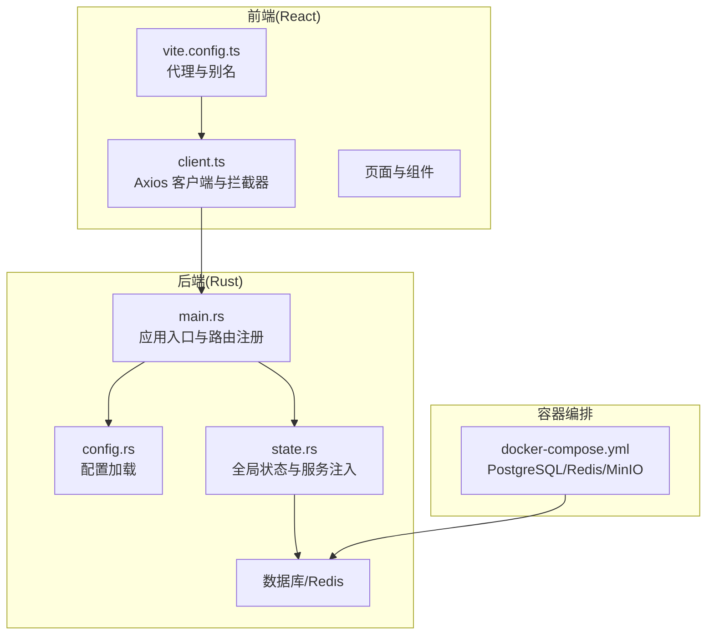
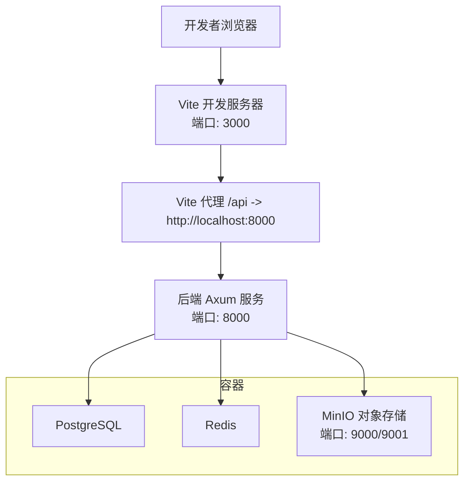
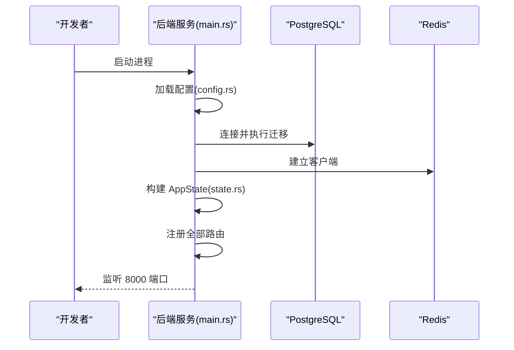
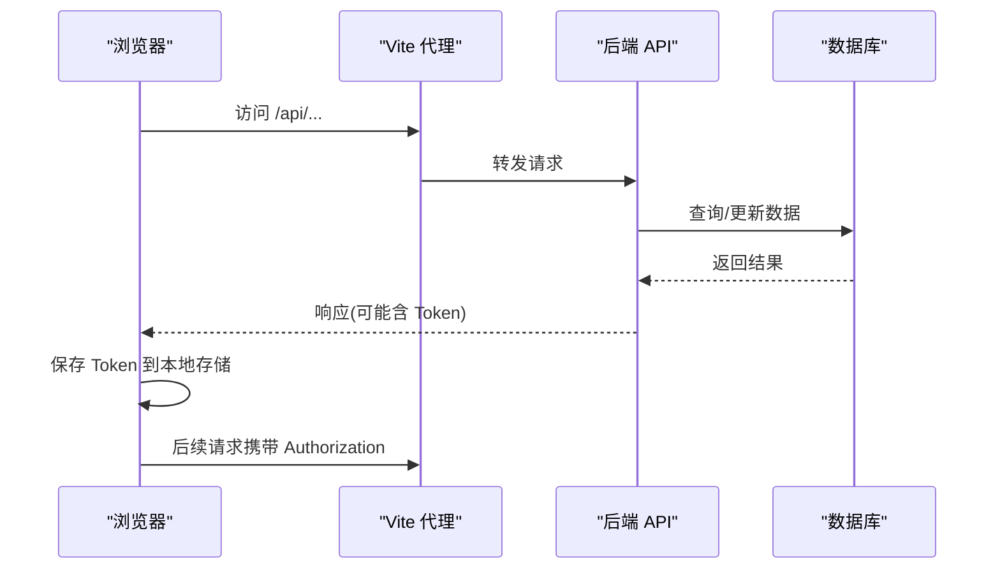
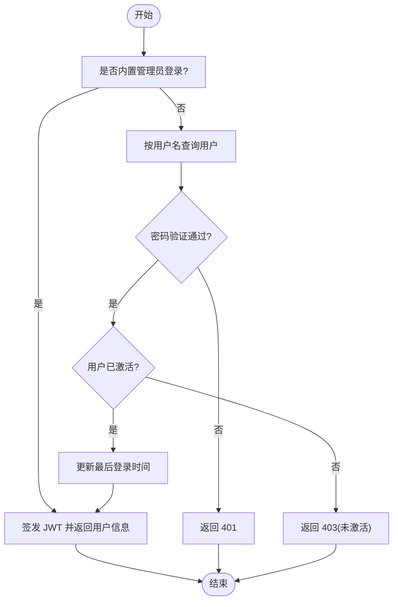
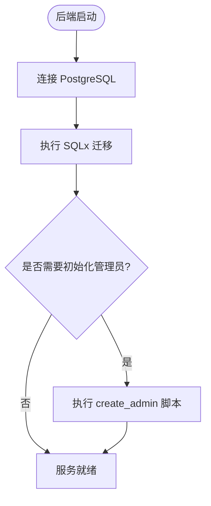
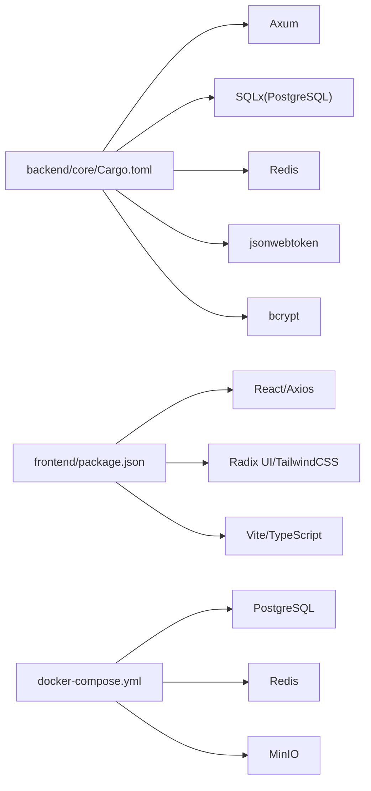

# 快速开始

<cite>
**本文引用的文件**   
- [docker-compose.yml](file://docker/docker-compose.yml)
- [Cargo.toml](file://backend/core/Cargo.toml)
- [main.rs](file://backend/core/src/main.rs)
- [config.rs](file://backend/core/src/config.rs)
- [state.rs](file://backend/core/src/state.rs)
- [client.ts](file://frontend/src/api/client.ts)
- [vite.config.ts](file://frontend/vite.config.ts)
- [Dockerfile](file://frontend/Dockerfile)
- [ci.yml](file://.github/workflows/ci.yml)
- [create_admin.rs](file://backend/core/scripts/create_admin.rs)
- [00000000000000_create_users_table.up.sql](file://backend/core/sqlx/migrations/00000000000000_create_users_table.up.sql)
- [auth.rs](file://backend/core/src/api/handlers/auth.rs)
</cite>

## 目录
1. [简介](#简介)
2. [项目结构](#项目结构)
3. [核心组件](#核心组件)
4. [架构总览](#架构总览)
5. [详细组件分析](#详细组件分析)
6. [依赖关系分析](#依赖关系分析)
7. [性能考虑](#性能考虑)
8. [故障排除指南](#故障排除指南)
9. [结论](#结论)
10. [附录](#附录)

## 简介
本指南面向新加入的开发者，帮助你在最短时间内完成 POMP 项目的环境搭建、本地开发与容器化部署，并提供基本使用示例与常见问题排查方法。项目采用前后端分离架构：后端基于 Rust 的 Axum 框架与 PostgreSQL/Redis，前端基于 React/Vite，使用 Docker Compose 编排数据库、缓存与对象存储。

## 项目结构
- 后端（Rust）位于 backend/core，包含 API 路由、数据库连接、配置加载、服务层与状态管理。
- 前端（React）位于 frontend，包含页面组件、API 客户端、UI 组件与构建配置。
- 容器编排位于 docker/docker-compose.yml，包含 PostgreSQL、Redis、MinIO。
- CI 流水线位于 .github/workflows/ci.yml，分别对后端与前端进行格式检查、类型检查、Lint 与测试。

**图表来源**
- [main.rs:16-277](file://backend/core/src/main.rs#L16-L277)
- [config.rs:96-115](file://backend/core/src/config.rs#L96-L115)
- [state.rs:22-87](file://backend/core/src/state.rs#L22-L87)
- [vite.config.ts:1-20](file://frontend/vite.config.ts#L1-L20)
- [client.ts:1-41](file://frontend/src/api/client.ts#L1-L41)
- [docker-compose.yml:1-50](file://docker/docker-compose.yml#L1-L50)

**章节来源**
- [main.rs:16-277](file://backend/core/src/main.rs#L16-L277)
- [config.rs:96-115](file://backend/core/src/config.rs#L96-L115)
- [state.rs:22-87](file://backend/core/src/state.rs#L22-L87)
- [vite.config.ts:1-20](file://frontend/vite.config.ts#L1-L20)
- [client.ts:1-41](file://frontend/src/api/client.ts#L1-L41)
- [docker-compose.yml:1-50](file://docker/docker-compose.yml#L1-L50)

## 核心组件
- 后端配置与启动
  - 配置加载：从项目根目录读取 .env 并通过环境变量注入，支持数据库、Redis、JWT、AI 接口等默认值。
  - 应用启动：初始化日志、连接数据库并执行 SQLx 迁移、建立 Redis 客户端、构建全局状态，监听 8000 端口。
- 前端代理与认证
  - Vite 代理：将 /api 前缀转发至后端 8000 端口，便于本地联调。
  - Axios 客户端：统一设置 baseURL、超时、请求头；自动携带本地存储的 Bearer Token；401 自动跳转登录。
- 容器编排
  - PostgreSQL：健康检查、持久化卷、端口映射。
  - Redis：健康检查、持久化卷、端口映射。
  - MinIO：对象存储服务，提供 Web 控制台与 API 端口。

**章节来源**
- [config.rs:96-115](file://backend/core/src/config.rs#L96-L115)
- [main.rs:16-41](file://backend/core/src/main.rs#L16-L41)
- [vite.config.ts:12-19](file://frontend/vite.config.ts#L12-L19)
- [client.ts:11-38](file://frontend/src/api/client.ts#L11-L38)
- [docker-compose.yml:3-50](file://docker/docker-compose.yml#L3-L50)

## 架构总览
下图展示了本地开发与容器化部署的关键交互路径：前端通过 Vite 代理访问后端 API，后端连接 PostgreSQL 与 Redis，MinIO 用于对象存储（如媒体资源）。

**图表来源**
- [vite.config.ts:12-19](file://frontend/vite.config.ts#L12-L19)
- [main.rs:39-41](file://backend/core/src/main.rs#L39-L41)
- [docker-compose.yml:3-50](file://docker/docker-compose.yml#L3-L50)

## 详细组件分析

### 后端启动与路由注册
- 启动流程
  - 初始化日志订阅器。
  - 加载配置并连接数据库，执行 SQLx 迁移。
  - 建立 Redis 客户端。
  - 构建 AppState（包含配置、数据库池、Redis 客户端与各服务实例）。
  - 注册所有 API 路由并监听 8000 端口。
- 关键点
  - 数据库迁移在启动时自动执行，确保表结构与索引就绪。
  - 健康检查路由 /health 可用于容器健康探针。
  - 路由覆盖认证、用户管理、字典、CMS、GIS、工作流、日程、HR、AI 等模块。

**图表来源**
- [main.rs:16-41](file://backend/core/src/main.rs#L16-L41)
- [config.rs:96-115](file://backend/core/src/config.rs#L96-L115)
- [state.rs:58-87](file://backend/core/src/state.rs#L58-L87)

**章节来源**
- [main.rs:16-41](file://backend/core/src/main.rs#L16-L41)
- [config.rs:96-115](file://backend/core/src/config.rs#L96-L115)
- [state.rs:58-87](file://backend/core/src/state.rs#L58-L87)

### 前端代理与认证流程
- 代理配置
  - 将 /api 请求转发到 http://localhost:8000，便于前后端联调。
- 认证流程
  - 登录成功后，前端将 Bearer Token 存入本地存储并在后续请求头中携带。
  - 若后端返回 401，前端清除本地 Token 并跳转到登录页。

**图表来源**
- [vite.config.ts:12-19](file://frontend/vite.config.ts#L12-L19)
- [client.ts:11-38](file://frontend/src/api/client.ts#L11-L38)

**章节来源**
- [vite.config.ts:12-19](file://frontend/vite.config.ts#L12-L19)
- [client.ts:11-38](file://frontend/src/api/client.ts#L11-L38)

### 认证与用户管理（登录/注册/改密）
- 登录
  - 支持内置管理员账户直登，或通过数据库用户凭用户名/密码登录。
  - 登录成功签发 JWT，包含用户标识、是否超级用户与过期时间。
- 注册
  - 校验用户名与邮箱唯一性，生成密码哈希并创建待审批用户。
- 修改密码
  - 需提供当前密码与新密码，校验旧密码正确性后更新。

**图表来源**
- [auth.rs:82-202](file://backend/core/src/api/handlers/auth.rs#L82-L202)

**章节来源**
- [auth.rs:82-202](file://backend/core/src/api/handlers/auth.rs#L82-L202)

### 数据库与初始化
- 数据库连接
  - 默认连接地址与凭据可在配置中调整，启动时建立连接池。
- 迁移与初始化
  - SQLx 迁移在启动时自动执行，确保 users 表与索引存在。
  - 可通过脚本创建默认管理员用户，便于首次登录。

**图表来源**
- [main.rs:23-28](file://backend/core/src/main.rs#L23-L28)
- [00000000000000_create_users_table.up.sql:1-26](file://backend/core/sqlx/migrations/00000000000000_create_users_table.up.sql#L1-L26)
- [create_admin.rs:6-46](file://backend/core/scripts/create_admin.rs#L6-L46)

**章节来源**
- [main.rs:23-28](file://backend/core/src/main.rs#L23-L28)
- [00000000000000_create_users_table.up.sql:1-26](file://backend/core/sqlx/migrations/00000000000000_create_users_table.up.sql#L1-L26)
- [create_admin.rs:6-46](file://backend/core/scripts/create_admin.rs#L6-L46)

## 依赖关系分析
- 后端依赖
  - Web 框架：Axum/Tower/Hyper
  - 数据库：SQLx(PostgreSQL)、连接池
  - 缓存：Redis
  - 安全：JWT、BCrypt
  - 工具：Serde、Anyhow、Tracing、Validator、Multer 等
- 前端依赖
  - React 生态：React、React Router、Axios
  - UI 组件：Radix UI、Recharts、TailwindCSS
  - 构建：Vite、TypeScript、ESLint、PostCSS、Tailwind
- 容器
  - PostgreSQL、Redis、MinIO

**图表来源**
- [Cargo.toml:15-49](file://backend/core/Cargo.toml#L15-L49)
- [package.json:13-58](file://frontend/package.json#L13-L58)
- [docker-compose.yml:3-50](file://docker/docker-compose.yml#L3-L50)

**章节来源**
- [Cargo.toml:15-49](file://backend/core/Cargo.toml#L15-L49)
- [package.json:13-58](file://frontend/package.json#L13-L58)
- [docker-compose.yml:3-50](file://docker/docker-compose.yml#L3-L50)

## 性能考虑
- 数据库连接池
  - 后端使用较大的最大连接数，适合并发请求场景；可根据部署环境调整。
- 缓存与会话
  - Redis 用于会话与缓存，建议在生产环境启用持久化与合理内存上限。
- 前端构建
  - 生产构建使用 Nginx 静态托管，建议开启 Gzip/HTTP/2 以提升传输效率。
- API 设计
  - 合理分页与索引可显著降低查询延迟；避免一次性返回大量数据。

**章节来源**
- [Cargo.toml:31-34](file://backend/core/Cargo.toml#L31-L34)
- [main.rs:30-37](file://backend/core/src/main.rs#L30-L37)
- [Dockerfile:19-41](file://frontend/Dockerfile#L19-L41)

## 故障排除指南
- 启动后端报数据库连接失败
  - 检查数据库容器是否健康运行，确认连接字符串与凭据。
  - 确认 SQLx 迁移已执行，必要时手动执行迁移。
- 前端无法访问后端 API
  - 确认 Vite 代理已将 /api 转发到 http://localhost:8000。
  - 检查跨域与 CORS 配置（Axum 已启用 CORS 中间件）。
- 登录后 401 被重定向到登录页
  - 检查本地存储中的 Token 是否存在且未过期。
  - 确认后端 JWT 密钥与过期时间配置一致。
- 容器健康检查失败
  - 查看 PostgreSQL/Redis 的健康探针输出，确认端口映射与卷挂载正确。
- CI 流水线失败
  - 后端：检查格式化、Clippy 与测试是否通过。
  - 前端：检查类型检查、Lint 与构建命令。

**章节来源**
- [main.rs:16-41](file://backend/core/src/main.rs#L16-L41)
- [vite.config.ts:12-19](file://frontend/vite.config.ts#L12-L19)
- [client.ts:22-38](file://frontend/src/api/client.ts#L22-L38)
- [docker-compose.yml:15-32](file://docker/docker-compose.yml#L15-L32)
- [ci.yml:12-63](file://.github/workflows/ci.yml#L12-L63)

## 结论
通过本指南，你可以在本地快速完成 Rust、Node.js、PostgreSQL、Redis 的环境准备，使用 Docker Compose 启动数据库与缓存服务，并通过 Vite 代理实现前后端联调。后端提供完善的认证与用户管理接口，配合数据库迁移与管理员初始化脚本，可快速进入业务开发。遇到问题时，可依据故障排除指南逐项定位。

## 附录

### 环境搭建步骤
- 安装 Rust 工具链
  - 使用稳定通道安装（参考 CI 工作流中的安装步骤）。
- 安装 Node.js 与包管理器
  - 使用 Node.js 20，安装依赖后可直接运行开发服务器。
- 准备数据库与缓存
  - 使用 Docker Compose 启动 PostgreSQL 与 Redis。
- 启动后端
  - 在 backend/core 目录下运行后端服务，自动执行数据库迁移。
- 启动前端
  - 在 frontend 目录下安装依赖并启动 Vite 开发服务器。
- 初始化管理员
  - 可选：运行管理员初始化脚本创建默认管理员账号。

**章节来源**
- [ci.yml:19-33](file://.github/workflows/ci.yml#L19-L33)
- [docker-compose.yml:3-50](file://docker/docker-compose.yml#L3-L50)
- [main.rs:16-41](file://backend/core/src/main.rs#L16-L41)
- [create_admin.rs:6-46](file://backend/core/scripts/create_admin.rs#L6-L46)

### Docker 容器化部署流程
- 后端镜像
  - 使用多阶段构建，生产镜像基于 Nginx 提供静态资源服务。
- 前端镜像
  - 构建完成后复制到 Nginx HTML 目录，暴露 80 端口。
- 服务启动顺序
  - 先启动数据库与缓存，再启动后端，最后启动前端。
- 环境变量
  - 后端通过 .env 与环境变量注入配置，注意数据库、Redis、JWT 等关键参数。

**章节来源**
- [Dockerfile:1-41](file://frontend/Dockerfile#L1-L41)
- [docker-compose.yml:3-50](file://docker/docker-compose.yml#L3-L50)
- [config.rs:96-115](file://backend/core/src/config.rs#L96-L115)

### 本地开发环境设置
- 前后端联调
  - Vite 代理将 /api 请求转发到后端 8000 端口。
- 热重载
  - Vite 默认启用热重载，修改前端代码即可实时预览。
- 调试技巧
  - 后端使用 Tracing 输出日志，前端通过浏览器开发者工具查看网络与控制台。

**章节来源**
- [vite.config.ts:12-19](file://frontend/vite.config.ts#L12-L19)
- [main.rs:17-21](file://backend/core/src/main.rs#L17-L21)

### 基本使用示例
- 用户注册与登录
  - 注册：提交用户名、密码、邮箱与姓名，等待审批。
  - 登录：使用用户名/密码或内置管理员账户登录，获取 Token。
- 基础数据操作
  - 通过认证后，可访问各类业务模块的 API（如用户管理、字典、CMS、GIS、工作流等）。
- 管理员初始化
  - 运行管理员初始化脚本，创建默认管理员账号，初始密码见脚本输出。

**章节来源**
- [auth.rs:297-333](file://backend/core/src/api/handlers/auth.rs#L297-L333)
- [auth.rs:82-202](file://backend/core/src/api/handlers/auth.rs#L82-L202)
- [create_admin.rs:6-46](file://backend/core/scripts/create_admin.rs#L6-L46)