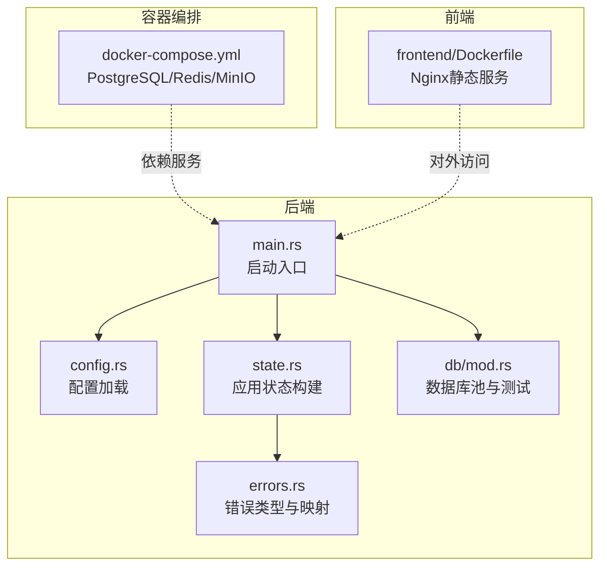
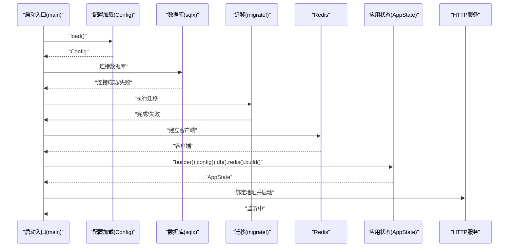
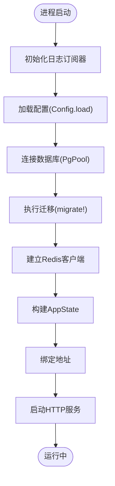
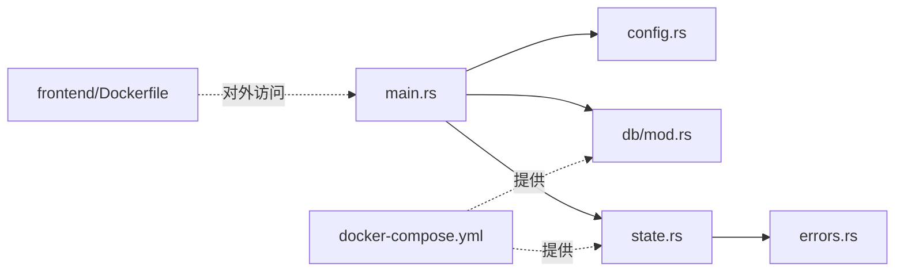

# 启动问题

<cite>
**本文引用的文件**
- [backend/core/src/main.rs](file://backend/core/src/main.rs)
- [backend/core/src/config.rs](file://backend/core/src/config.rs)
- [backend/core/src/state.rs](file://backend/core/src/state.rs)
- [backend/core/src/errors.rs](file://backend/core/src/errors.rs)
- [backend/core/src/db/mod.rs](file://backend/core/src/db/mod.rs)
- [backend/core/Cargo.toml](file://backend/core/Cargo.toml)
- [docker/docker-compose.yml](file://docker/docker-compose.yml)
- [frontend/Dockerfile](file://frontend/Dockerfile)
</cite>

## 目录
1. [引言](#引言)
2. [项目结构](#项目结构)
3. [核心组件](#核心组件)
4. [架构总览](#架构总览)
5. [详细组件分析](#详细组件分析)
6. [依赖分析](#依赖分析)
7. [性能考虑](#性能考虑)
8. [故障排除指南](#故障排除指南)
9. [结论](#结论)
10. [附录](#附录)

## 引言
本指南聚焦于 POMP 系统启动阶段的常见问题与系统化排障流程，覆盖配置文件错误、环境变量缺失、端口占用、依赖服务不可用等场景。文档基于后端主程序、配置加载、状态初始化、数据库与缓存连接、以及容器编排的实际实现进行分析，提供可执行的诊断步骤、常见错误码与解决方案，以及启动脚本与容器化部署的调试技巧。

## 项目结构
后端采用 Rust + Axum 框架，主程序负责初始化日志、加载配置、建立数据库与 Redis 连接、运行迁移、构建应用状态并启动 HTTP 服务；容器编排使用 docker-compose 管理 PostgreSQL、Redis、MinIO 等依赖；前端使用 Nginx 静态托管。

**图表来源**
- [backend/core/src/main.rs:16-41](file://backend/core/src/main.rs#L16-L41)
- [backend/core/src/config.rs:96-115](file://backend/core/src/config.rs#L96-L115)
- [backend/core/src/state.rs:22-86](file://backend/core/src/state.rs#L22-L86)
- [backend/core/src/db/mod.rs:25-44](file://backend/core/src/db/mod.rs#L25-L44)
- [docker/docker-compose.yml:1-50](file://docker/docker-compose.yml#L1-L50)
- [frontend/Dockerfile:19-41](file://frontend/Dockerfile#L19-L41)

**章节来源**
- [backend/core/src/main.rs:16-41](file://backend/core/src/main.rs#L16-L41)
- [backend/core/src/config.rs:96-115](file://backend/core/src/config.rs#L96-L115)
- [backend/core/src/state.rs:22-86](file://backend/core/src/state.rs#L22-L86)
- [backend/core/src/db/mod.rs:25-44](file://backend/core/src/db/mod.rs#L25-L44)
- [docker/docker-compose.yml:1-50](file://docker/docker-compose.yml#L1-L50)
- [frontend/Dockerfile:19-41](file://frontend/Dockerfile#L19-L41)

## 核心组件
- 启动入口与生命周期
  - 初始化日志订阅器，按环境变量动态设置日志级别
  - 加载配置并建立数据库连接，执行迁移
  - 建立 Redis 客户端
  - 构建应用状态（包含配置、数据库池、Redis 客户端及若干服务实例）
  - 绑定地址并启动 HTTP 服务
- 配置加载
  - 从项目根目录读取 .env 并通过环境变量反序列化为 Config 结构
  - 提供默认值（如数据库、Redis、JWT、AI 接口等）
- 应用状态
  - 通过 Builder 模式注入配置、数据库与 Redis，构建 AppState 并初始化部分服务
- 错误模型
  - 将数据库与 Redis 错误统一映射为服务器内部错误或网关错误，便于统一处理
- 数据库与连接测试
  - 提供数据库池创建与连接测试函数

**章节来源**
- [backend/core/src/main.rs:16-41](file://backend/core/src/main.rs#L16-L41)
- [backend/core/src/config.rs:96-115](file://backend/core/src/config.rs#L96-L115)
- [backend/core/src/state.rs:22-86](file://backend/core/src/state.rs#L22-L86)
- [backend/core/src/errors.rs:6-78](file://backend/core/src/errors.rs#L6-L78)
- [backend/core/src/db/mod.rs:25-44](file://backend/core/src/db/mod.rs#L25-L44)

## 架构总览
下图展示启动阶段的关键交互：主程序加载配置、连接数据库与 Redis、执行迁移、构建状态并启动服务。

**图表来源**
- [backend/core/src/main.rs:23-37](file://backend/core/src/main.rs#L23-L37)
- [backend/core/src/config.rs:96-115](file://backend/core/src/config.rs#L96-L115)
- [backend/core/src/db/mod.rs:25-44](file://backend/core/src/db/mod.rs#L25-L44)
- [backend/core/src/state.rs:58-86](file://backend/core/src/state.rs#L58-L86)

## 详细组件分析

### 启动流程与关键节点
- 日志初始化：按环境变量设置过滤器与格式层
- 配置加载：读取 .env 并从环境变量反序列化
- 数据库连接与迁移：建立连接后执行迁移
- Redis 客户端：创建客户端用于后续服务
- 应用状态构建：注入配置、数据库与 Redis，初始化若干服务
- 服务绑定与启动：绑定地址并启动 HTTP 服务

**图表来源**
- [backend/core/src/main.rs:16-41](file://backend/core/src/main.rs#L16-L41)
- [backend/core/src/config.rs:96-115](file://backend/core/src/config.rs#L96-L115)
- [backend/core/src/db/mod.rs:25-44](file://backend/core/src/db/mod.rs#L25-L44)
- [backend/core/src/state.rs:58-86](file://backend/core/src/state.rs#L58-L86)

**章节来源**
- [backend/core/src/main.rs:16-41](file://backend/core/src/main.rs#L16-L41)
- [backend/core/src/config.rs:96-115](file://backend/core/src/config.rs#L96-L115)
- [backend/core/src/db/mod.rs:25-44](file://backend/core/src/db/mod.rs#L25-L44)
- [backend/core/src/state.rs:58-86](file://backend/core/src/state.rs#L58-L86)

### 配置加载与默认值
- 配置结构包含服务器端口、数据库 URL、Redis URL、JWT 密钥与过期时间、AI 接口密钥与地址、本地 Ollama 接口等
- 默认值集中定义，若环境变量未提供则使用默认值
- 配置加载会尝试读取项目根目录下的 .env 文件并合并环境变量

**章节来源**
- [backend/core/src/config.rs:3-46](file://backend/core/src/config.rs#L3-L46)
- [backend/core/src/config.rs:48-94](file://backend/core/src/config.rs#L48-L94)
- [backend/core/src/config.rs:96-115](file://backend/core/src/config.rs#L96-L115)

### 应用状态与服务初始化
- AppStateBuilder 负责注入配置、数据库与 Redis
- 构建过程中初始化图像生成器、字段服务、字典服务、帮助服务、合同服务等
- 初始化帮助内容时若已存在会记录警告但不中断

**章节来源**
- [backend/core/src/state.rs:22-86](file://backend/core/src/state.rs#L22-L86)

### 错误模型与映射
- 数据库错误与 Redis 错误统一映射为服务器内部错误
- 外部服务错误映射为网关错误
- 认证、授权、验证、未找到、参数错误等映射为对应 HTTP 状态码

**章节来源**
- [backend/core/src/errors.rs:6-78](file://backend/core/src/errors.rs#L6-L78)

## 依赖分析
- 后端依赖
  - 数据库：sqlx(PostgreSQL)
  - 缓存：redis
  - Web：axum、tokio
  - 配置：dotenv、envy
  - 日志：tracing、tracing-subscriber
- 容器依赖
  - PostgreSQL、Redis、MinIO 通过 docker-compose 提供
- 前端依赖
  - Nginx 静态服务，暴露 80 端口

**图表来源**
- [backend/core/src/main.rs:16-41](file://backend/core/src/main.rs#L16-L41)
- [backend/core/src/config.rs:96-115](file://backend/core/src/config.rs#L96-L115)
- [backend/core/src/db/mod.rs:25-44](file://backend/core/src/db/mod.rs#L25-L44)
- [backend/core/src/state.rs:58-86](file://backend/core/src/state.rs#L58-L86)
- [docker/docker-compose.yml:1-50](file://docker/docker-compose.yml#L1-L50)
- [frontend/Dockerfile:19-41](file://frontend/Dockerfile#L19-L41)

**章节来源**
- [backend/core/Cargo.toml:15-52](file://backend/core/Cargo.toml#L15-L52)
- [docker/docker-compose.yml:1-50](file://docker/docker-compose.yml#L1-L50)
- [frontend/Dockerfile:19-41](file://frontend/Dockerfile#L19-L41)

## 性能考虑
- 数据库连接池最大连接数较高，适合并发场景，需配合数据库资源与网络带宽评估
- Redis 客户端为同步客户端，注意在异步上下文中避免阻塞
- 迁移在启动阶段执行，首次启动可能因迁移耗时导致启动延迟

[本节为通用指导，无需列出具体文件来源]

## 故障排除指南

### 一、启动失败的系统化诊断步骤
1. 检查日志
   - 确认日志订阅器是否正确初始化，观察启动阶段的日志输出
   - 关注配置加载、数据库连接、迁移、Redis 客户端、状态构建与服务绑定阶段的日志
2. 验证配置文件与环境变量
   - 确认项目根目录存在 .env 文件并包含必要键值
   - 使用配置加载路径与默认值对照，逐项核对关键键（数据库 URL、Redis URL、JWT 密钥、AI 接口密钥等）
3. 确认依赖服务可用
   - PostgreSQL：检查容器健康检查与端口映射
   - Redis：检查容器健康检查与端口映射
   - MinIO：检查容器健康检查与端口映射
4. 端口占用排查
   - 后端默认绑定地址为 0.0.0.0:8000，确认该端口未被占用
   - 前端 Nginx 默认暴露 80 端口，确认未被占用
5. 查看启动日志
   - 在容器环境中，使用容器日志命令查看启动阶段输出
   - 在本地开发环境，直接运行后端二进制并观察标准输出

**章节来源**
- [backend/core/src/main.rs:16-41](file://backend/core/src/main.rs#L16-L41)
- [backend/core/src/config.rs:96-115](file://backend/core/src/config.rs#L96-L115)
- [docker/docker-compose.yml:15-32](file://docker/docker-compose.yml#L15-L32)
- [frontend/Dockerfile:32-40](file://frontend/Dockerfile#L32-L40)

### 二、常见启动错误与解决方案
- 数据库连接失败
  - 现象：启动阶段数据库连接报错或迁移失败
  - 排查：确认数据库 URL 正确、凭据有效、网络可达、数据库已初始化且监听端口开放
  - 解决：修正 .env 中的数据库 URL 或数据库服务状态
- Redis 连接异常
  - 现象：Redis 客户端创建失败或后续服务调用报错
  - 排查：确认 Redis URL 正确、网络可达、容器健康检查通过
  - 解决：修正 .env 中的 Redis URL 或修复 Redis 服务
- 外部服务不可达
  - 现象：AI 接口或第三方服务返回网关错误
  - 排查：检查外部服务密钥与地址配置、网络连通性、服务可用性
  - 解决：补充或修正外部服务密钥与地址，确保网络可达
- 端口占用
  - 现象：服务绑定失败，提示地址已在使用
  - 排查：确认 8000（后端）与 80（前端）端口未被占用
  - 解决：释放端口或调整服务端口配置
- 配置文件语法错误
  - 现象：配置加载失败或默认值被错误覆盖
  - 排查：检查 .env 语法、键名拼写、布尔/数值格式
  - 解决：修正 .env 内容或环境变量设置

**章节来源**
- [backend/core/src/errors.rs:6-78](file://backend/core/src/errors.rs#L6-L78)
- [backend/core/src/config.rs:96-115](file://backend/core/src/config.rs#L96-L115)
- [docker/docker-compose.yml:15-32](file://docker/docker-compose.yml#L15-L32)

### 三、启动脚本调试技巧
- 使用最小化配置：先仅启用必要服务（数据库、Redis），验证基本连通性后再逐步增加其他依赖
- 分阶段启动：将启动流程拆分为“加载配置”、“连接数据库”、“执行迁移”、“连接 Redis”、“构建状态”、“启动服务”，逐段验证
- 输出关键信息：在每个关键节点打印配置摘要与连接结果，便于定位失败点
- 使用健康检查：利用 docker-compose 的健康检查与容器日志快速判断依赖服务状态

**章节来源**
- [backend/core/src/main.rs:23-37](file://backend/core/src/main.rs#L23-L37)
- [docker/docker-compose.yml:15-32](file://docker/docker-compose.yml#L15-L32)

### 四、容器化部署问题排查
- 依赖服务未就绪
  - 现象：后端启动即刻失败
  - 排查：查看 docker-compose 健康检查输出，确认数据库与 Redis 可用
  - 解决：等待健康检查通过后再启动后端服务
- 端口冲突
  - 现象：容器启动后无法访问
  - 排查：确认宿主机端口映射与容器内服务端口一致
  - 解决：修改 docker-compose 端口映射或释放宿主机端口
- 网络隔离
  - 现象：容器间无法通信
  - 排查：确认容器在同一网络中，服务名解析正确
  - 解决：使用 docker-compose 的服务名作为主机名，确保网络一致
- 前端静态资源不可用
  - 现象：访问 404 或页面空白
  - 排查：确认 Nginx 配置正确、构建产物已复制到容器内
  - 解决：重新构建并推送镜像，或检查 Nginx 配置文件

**章节来源**
- [docker/docker-compose.yml:1-50](file://docker/docker-compose.yml#L1-L50)
- [frontend/Dockerfile:19-41](file://frontend/Dockerfile#L19-L41)

## 结论
POMP 系统启动失败通常源于配置错误、依赖服务不可用或端口冲突。通过分阶段验证配置加载、数据库与 Redis 连接、迁移执行与服务绑定，结合 docker-compose 健康检查与容器日志，可快速定位并解决问题。建议在生产环境启用健康检查与日志轮转，并为数据库与缓存预留充足的资源与网络带宽。

[本节为总结性内容，无需列出具体文件来源]

## 附录
- 关键配置键参考
  - 数据库 URL：用于连接 PostgreSQL
  - Redis URL：用于连接 Redis
  - JWT 密钥与过期小时：用于签发与校验令牌
  - AI 接口密钥与地址：用于外部 AI 服务调用
  - Ollama 接口地址与模型：用于本地推理服务
- 常见错误码映射
  - 数据库/Redis 错误 → 500
  - 外部服务错误 → 502
  - 认证/授权/验证/未找到/参数错误 → 对应状态码

**章节来源**
- [backend/core/src/config.rs:3-46](file://backend/core/src/config.rs#L3-L46)
- [backend/core/src/errors.rs:54-78](file://backend/core/src/errors.rs#L54-L78)