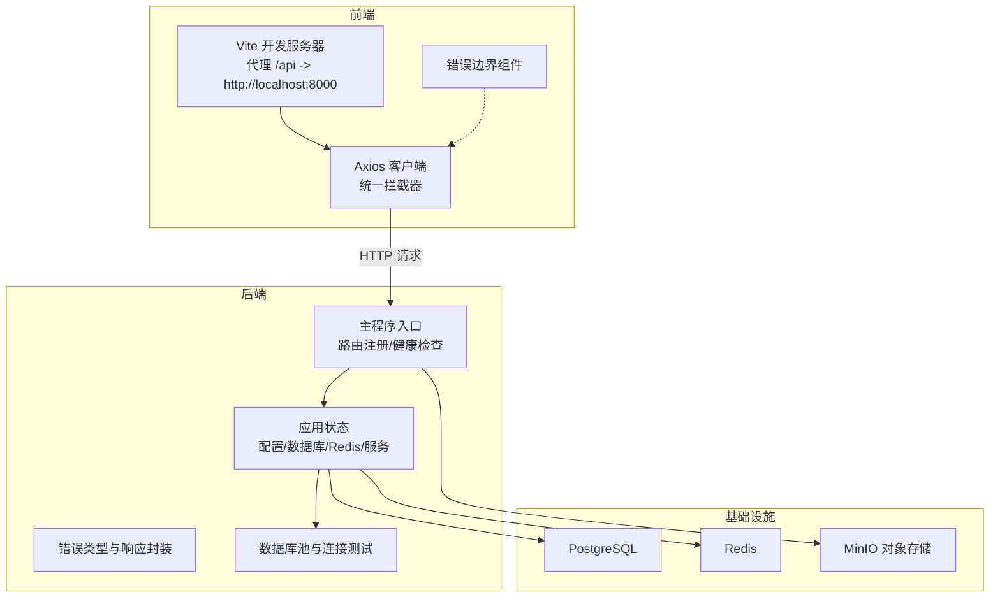
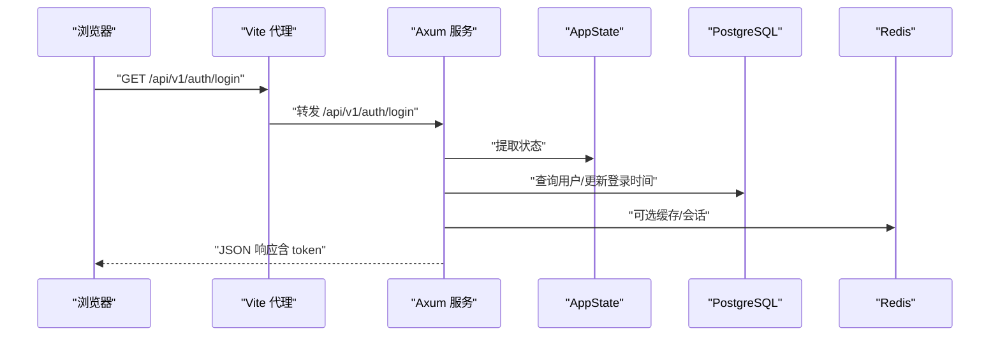
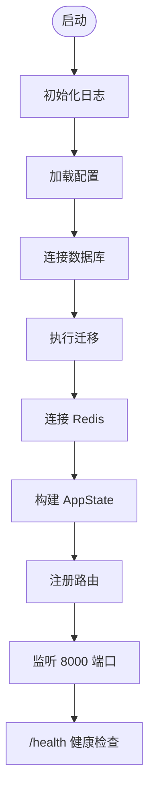
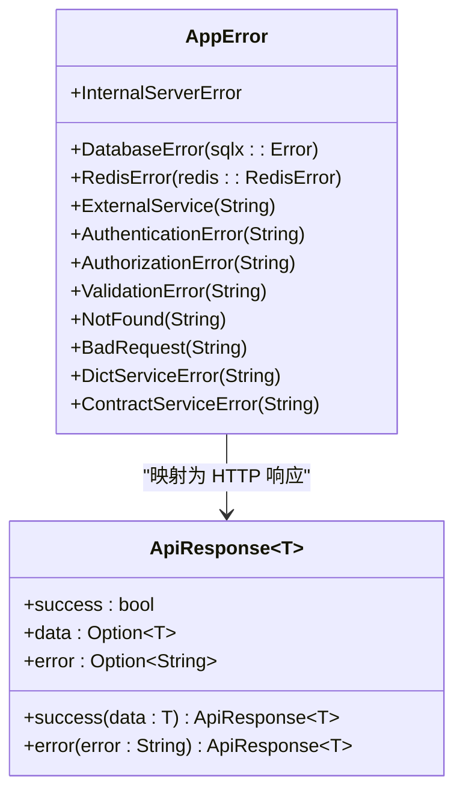
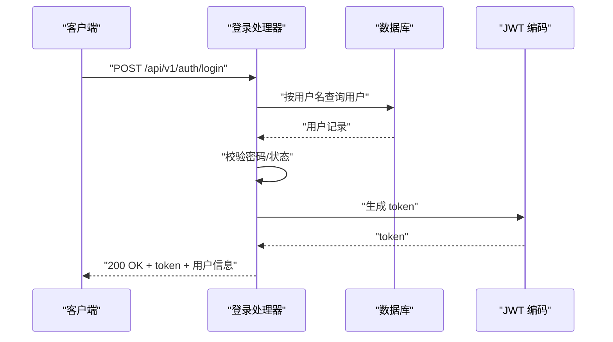
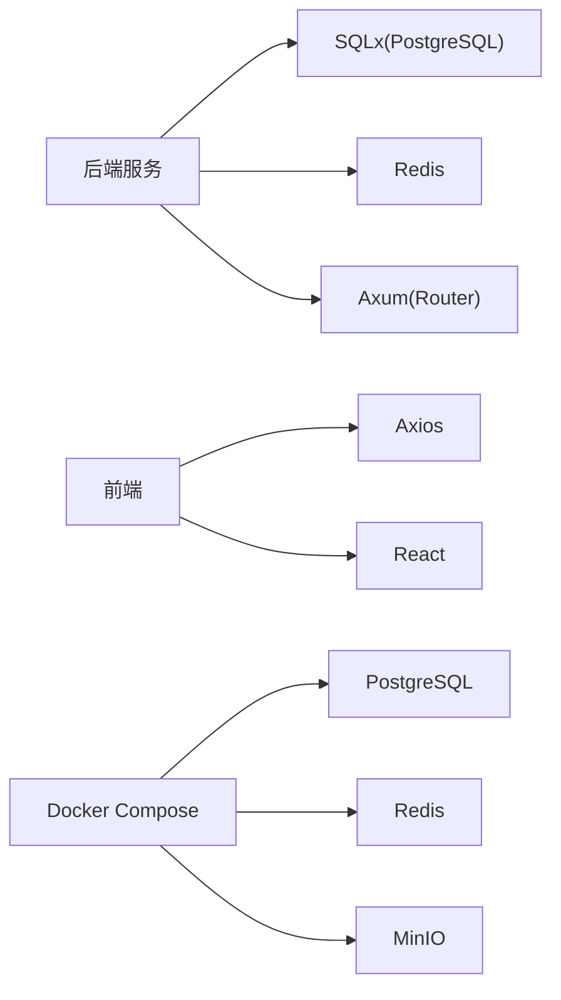

# 故障排除

<cite>
**本文引用的文件**
- [backend/core/src/main.rs](file://backend/core/src/main.rs)
- [backend/core/src/config.rs](file://backend/core/src/config.rs)
- [backend/core/src/state.rs](file://backend/core/src/state.rs)
- [backend/core/src/errors.rs](file://backend/core/src/errors.rs)
- [backend/core/src/db/mod.rs](file://backend/core/src/db/mod.rs)
- [backend/core/src/api/handlers/auth.rs](file://backend/core/src/api/handlers/auth.rs)
- [backend/core/src/bin/setup_admin.rs](file://backend/core/src/bin/setup_admin.rs)
- [docker/docker-compose.yml](file://docker/docker-compose.yml)
- [frontend/src/api/client.ts](file://frontend/src/api/client.ts)
- [frontend/vite.config.ts](file://frontend/vite.config.ts)
- [frontend/src/components/ErrorBoundary.tsx](file://frontend/src/components/ErrorBoundary.tsx)
- [backend/core/Cargo.toml](file://backend/core/Cargo.toml)
</cite>

## 目录
1. [简介](#简介)
2. [项目结构](#项目结构)
3. [核心组件](#核心组件)
4. [架构总览](#架构总览)
5. [详细组件分析](#详细组件分析)
6. [依赖关系分析](#依赖关系分析)
7. [性能考虑](#性能考虑)
8. [故障排除指南](#故障排除指南)
9. [结论](#结论)
10. [附录](#附录)

## 简介
本指南面向技术支持与运维人员，围绕 POMP 系统的启动失败、数据库连接问题、API 调用异常、前端页面加载问题等常见场景，提供系统化诊断方法与排查步骤。文档涵盖日志分析、性能监控、网络诊断、错误码含义与处理策略（业务错误、系统错误、网络错误），以及数据库查询优化、内存泄漏检测、并发问题排查等性能优化建议。

## 项目结构
POMP 采用前后端分离架构：
- 后端基于 Rust + Axum，使用 SQLx 连接 PostgreSQL，Redis 缓存，提供 REST API。
- 前端基于 React + Vite，通过代理访问后端 /api。
- Docker Compose 提供数据库、缓存、对象存储等基础设施。

图表来源
- [backend/core/src/main.rs:42-270](file://backend/core/src/main.rs#L42-L270)
- [backend/core/src/state.rs:10-26](file://backend/core/src/state.rs#L10-L26)
- [backend/core/src/db/mod.rs:25-44](file://backend/core/src/db/mod.rs#L25-L44)
- [docker/docker-compose.yml:34-46](file://docker/docker-compose.yml#L34-L46)
- [frontend/vite.config.ts:12-19](file://frontend/vite.config.ts#L12-L19)
- [frontend/src/api/client.ts:1-41](file://frontend/src/api/client.ts#L1-L41)

章节来源
- [backend/core/src/main.rs:16-277](file://backend/core/src/main.rs#L16-L277)
- [docker/docker-compose.yml:1-50](file://docker/docker-compose.yml#L1-L50)
- [frontend/vite.config.ts:1-20](file://frontend/vite.config.ts#L1-L20)

## 核心组件
- 应用入口与路由：负责初始化日志、读取配置、连接数据库与 Redis、执行迁移、注册路由并启动服务。
- 应用状态：集中持有配置、数据库连接池、Redis 客户端与各业务服务实例。
- 错误体系：统一错误类型与 HTTP 状态映射，标准化响应格式。
- 数据库层：提供连接池创建与连通性测试方法。
- 前端客户端：统一基地址、超时、鉴权头注入与 401 自动登出逻辑；错误边界捕获渲染期错误。

章节来源
- [backend/core/src/main.rs:16-277](file://backend/core/src/main.rs#L16-L277)
- [backend/core/src/state.rs:10-88](file://backend/core/src/state.rs#L10-L88)
- [backend/core/src/errors.rs:6-78](file://backend/core/src/errors.rs#L6-L78)
- [backend/core/src/db/mod.rs:25-44](file://backend/core/src/db/mod.rs#L25-L44)
- [frontend/src/api/client.ts:1-41](file://frontend/src/api/client.ts#L1-L41)

## 架构总览
后端以 Axum Router 为中心，按模块注册 API 路由；每个处理器通过 State 访问 AppState，进而访问数据库、Redis 与各服务。前端通过 Vite 代理将 /api 请求转发至后端 8000 端口。

图表来源
- [backend/core/src/main.rs:82-200](file://backend/core/src/main.rs#L82-L200)
- [backend/core/src/state.rs:10-26](file://backend/core/src/state.rs#L10-L26)
- [backend/core/src/api/handlers/auth.rs:82-200](file://backend/core/src/api/handlers/auth.rs#L82-L200)

## 详细组件分析

### 后端启动与健康检查
- 启动流程：初始化日志、加载配置、连接数据库并执行迁移、连接 Redis、构建 AppState、注册路由、监听 8000 端口。
- 健康检查：提供 /health 接口返回服务状态与时间戳。
- 常见问题：端口占用、环境变量缺失、数据库/Redis 不可达、迁移失败。

图表来源
- [backend/core/src/main.rs:16-41](file://backend/core/src/main.rs#L16-L41)
- [backend/core/src/main.rs:26-284](file://backend/core/src/main.rs#L26-L284)

章节来源
- [backend/core/src/main.rs:16-277](file://backend/core/src/main.rs#L16-L277)

### 配置加载与默认值
- 支持从 .env 加载环境变量，包含数据库 URL、Redis URL、JWT 密钥与过期时间、AI 服务相关参数等。
- 若未提供，使用内置默认值（例如本地开发默认数据库与 Redis 地址）。

章节来源
- [backend/core/src/config.rs:96-115](file://backend/core/src/config.rs#L96-L115)

### 应用状态与依赖注入
- AppState 持有 Config、DbPool、Redis Client 与多个业务服务实例，通过 Builder 模式构建。
- 初始化时尝试预热帮助内容，便于快速可用。

章节来源
- [backend/core/src/state.rs:10-88](file://backend/core/src/state.rs#L10-L88)

### 错误体系与响应格式
- 统一错误类型覆盖数据库、Redis、外部服务、认证、授权、验证、未找到、内部错误、请求参数错误、业务服务错误等。
- 将错误映射为标准 HTTP 状态码，并返回统一的 JSON 结构（success、data、error）。

图表来源
- [backend/core/src/errors.rs:6-78](file://backend/core/src/errors.rs#L6-L78)
- [backend/core/src/errors.rs:82-106](file://backend/core/src/errors.rs#L82-L106)

章节来源
- [backend/core/src/errors.rs:6-78](file://backend/core/src/errors.rs#L6-L78)

### 数据库连接与池化
- 提供连接池创建与连通性测试方法，默认最大连接数较高，适合并发场景。
- 建议在启动阶段进行连通性测试，避免运行期突发错误。

章节来源
- [backend/core/src/db/mod.rs:25-44](file://backend/core/src/db/mod.rs#L25-L44)

### 认证与登录流程
- 登录处理器支持内置 admin 快捷登录与普通用户校验。
- 成功登录后签发 JWT 并更新最近登录时间。
- 失败场景返回相应 HTTP 状态码（如 401、403）。

图表来源
- [backend/core/src/api/handlers/auth.rs:82-200](file://backend/core/src/api/handlers/auth.rs#L82-L200)

章节来源
- [backend/core/src/api/handlers/auth.rs:82-200](file://backend/core/src/api/handlers/auth.rs#L82-L200)

### 前端代理与拦截器
- Vite 代理将 /api 请求转发至后端 8000 端口。
- Axios 拦截器自动注入 Authorization 头；当收到 401 且非用户信息接口时，清理本地 token 并跳转登录页。
- 错误边界组件在开发环境下展示错误详情，便于定位问题。

章节来源
- [frontend/vite.config.ts:12-19](file://frontend/vite.config.ts#L12-L19)
- [frontend/src/api/client.ts:1-41](file://frontend/src/api/client.ts#L1-L41)
- [frontend/src/components/ErrorBoundary.tsx:47-86](file://frontend/src/components/ErrorBoundary.tsx#L47-L86)

## 依赖关系分析
- 后端依赖：Axum、SQLx、Redis、Tokio、Tracing、Reqwest、Dotenv、Envy、Jsonwebtoken、Bcrypt 等。
- 前端依赖：React、Axios、Radix UI、Tailwind、Zustand 等。
- 基础设施：PostgreSQL、Redis、MinIO 通过 Docker Compose 提供。

图表来源
- [backend/core/Cargo.toml:15-49](file://backend/core/Cargo.toml#L15-L49)
- [frontend/package.json:13-42](file://frontend/package.json#L13-L42)
- [docker/docker-compose.yml:34-46](file://docker/docker-compose.yml#L34-L46)

章节来源
- [backend/core/Cargo.toml:15-49](file://backend/core/Cargo.toml#L15-L49)
- [frontend/package.json:13-42](file://frontend/package.json#L13-L42)

## 性能考虑
- 数据库连接池：默认最大连接数较高，需结合并发负载与数据库性能评估，必要时调整。
- 查询优化：对高频查询建立合适索引，避免 N+1 查询，使用分页与限制返回字段。
- 缓存策略：利用 Redis 缓存热点数据与会话信息，降低数据库压力。
- 并发与异步：后端基于 Tokio 异步运行，注意避免阻塞操作与死锁。
- 内存与 GC：关注长生命周期对象与大对象释放，定期巡检内存占用。
- 网络与超时：前端 Axios 默认超时较长，可根据网络环境调整；后端对外部服务调用也应设置合理超时。

[本节为通用指导，不直接分析具体文件]

## 故障排除指南

### 一、启动失败
常见症状
- 服务无法启动或立即退出
- 控制台无日志输出或报错

排查步骤
1. 检查日志
   - 查看启动日志中是否完成“Running database migrations...”与“Database migrations completed”
   - 关注数据库连接与 Redis 连接初始化信息
2. 环境变量与配置
   - 确认 .env 文件存在且包含必要的数据库/Redis/JWT/AI 服务参数
   - 使用默认值进行最小化验证（如本地默认数据库与 Redis 地址）
3. 端口占用
   - 确保 8000 端口未被占用
4. Docker 基础设施
   - 使用 docker-compose 启动数据库与缓存服务，确认容器健康状态
5. 依赖安装
   - 后端依赖 Rust 工具链与 Cargo；前端依赖 Node.js 与包管理器

章节来源
- [backend/core/src/main.rs:16-41](file://backend/core/src/main.rs#L16-L41)
- [backend/core/src/config.rs:96-115](file://backend/core/src/config.rs#L96-L115)
- [docker/docker-compose.yml:15-32](file://docker/docker-compose.yml#L15-L32)

### 二、数据库连接问题
常见症状
- 启动时报数据库连接失败
- 运行期出现查询超时或连接耗尽

排查步骤
1. 连通性测试
   - 在启动阶段执行数据库连通性测试
   - 使用 psql 或 SQL 客户端验证连接字符串与凭据
2. 连接池配置
   - 检查最大连接数与超时设置，结合并发负载调整
3. 迁移失败
   - 查看迁移日志，确认迁移脚本与数据库版本一致
4. 权限与网络
   - 确认数据库用户权限与网络可达性（Docker 网络）

章节来源
- [backend/core/src/db/mod.rs:25-44](file://backend/core/src/db/mod.rs#L25-L44)
- [backend/core/src/main.rs:23-28](file://backend/core/src/main.rs#L23-L28)

### 三、API 调用异常
常见症状
- 400 参数错误、401 未认证、403 禁止访问、404 未找到、500 内部错误、502 外部服务错误

排查步骤
1. 错误码与响应
   - 统一响应结构包含 success、data、error 字段
   - 根据错误类型判断是业务错误还是系统错误
2. 认证与授权
   - 登录成功后检查 token 是否正确注入到 Authorization 头
   - 401 时检查前端拦截器是否触发自动登出
3. 业务错误
   - 如用户未激活、权限不足、数据不存在等，依据处理器返回信息定位
4. 外部服务
   - AI 图像生成、外部模型服务调用失败时，检查服务地址与密钥

章节来源
- [backend/core/src/errors.rs:54-78](file://backend/core/src/errors.rs#L54-L78)
- [frontend/src/api/client.ts:22-38](file://frontend/src/api/client.ts#L22-L38)
- [backend/core/src/api/handlers/auth.rs:82-200](file://backend/core/src/api/handlers/auth.rs#L82-L200)

### 四、前端页面加载问题
常见症状
- 页面空白、白屏、无限加载
- 登录后仍提示未登录或频繁跳转

排查步骤
1. 代理配置
   - 确认 Vite 代理已将 /api 转发至后端 8000 端口
2. 网络与跨域
   - 检查浏览器开发者工具 Network 面板，确认请求是否到达后端
   - 关注 CORS 与证书问题
3. 鉴权与路由
   - 检查本地存储中的 token 是否存在
   - 401 时前端拦截器会自动清除 token 并跳转登录页
4. 错误边界
   - 开发环境下错误边界会显示错误详情，辅助定位

章节来源
- [frontend/vite.config.ts:12-19](file://frontend/vite.config.ts#L12-L19)
- [frontend/src/api/client.ts:11-38](file://frontend/src/api/client.ts#L11-L38)
- [frontend/src/components/ErrorBoundary.tsx:47-86](file://frontend/src/components/ErrorBoundary.tsx#L47-L86)

### 五、日志分析
- 后端日志
  - 使用 tracing_subscriber 输出结构化日志，按环境变量过滤级别
  - 关注启动阶段的配置加载、数据库连接、迁移、Redis 初始化
- 前端日志
  - 浏览器控制台与网络面板，结合错误边界输出定位问题

章节来源
- [backend/core/src/main.rs:18-21](file://backend/core/src/main.rs#L18-L21)
- [frontend/src/components/ErrorBoundary.tsx:58-64](file://frontend/src/components/ErrorBoundary.tsx#L58-L64)

### 六、性能监控与优化
- 数据库
  - 分析慢查询日志，为高频查询建立索引
  - 使用分页与投影减少数据传输
- 缓存
  - 利用 Redis 缓存热点数据与会话，降低数据库压力
- 并发
  - 合理设置连接池大小，避免过度并发导致资源争用
- 内存
  - 监控内存占用，识别潜在泄漏路径
- 网络
  - 设置合理的超时与重试策略，避免请求堆积

[本节为通用指导，不直接分析具体文件]

### 七、错误代码与处理策略
- 400 请求参数错误：检查请求体与查询参数，修正后再试
- 401 未认证：确认 token 存在且未过期，重新登录获取新 token
- 403 禁止访问：检查用户权限与角色，确认授权范围
- 404 未找到：确认资源 ID 与路径正确
- 500 内部错误：查看后端日志定位具体错误位置
- 502 外部服务错误：检查外部服务可用性与网络连通性

章节来源
- [backend/core/src/errors.rs:54-78](file://backend/core/src/errors.rs#L54-L78)

### 八、管理员账户初始化
- 使用独立二进制初始化 admin 用户，便于快速验证登录流程
- 初始化后可在测试环境中直接使用默认凭证登录

章节来源
- [backend/core/src/bin/setup_admin.rs:16-40](file://backend/core/src/bin/setup_admin.rs#L16-L40)

## 结论
通过系统化的启动检查、配置验证、日志分析与性能优化手段，可有效定位并解决 POMP 系统在启动、数据库、API 与前端加载方面的常见问题。建议在生产环境中启用健康检查、完善的日志与告警、合理的缓存与数据库优化策略，并建立标准化的排障流程与回滚预案。

## 附录

### A. 常用命令与检查清单
- 后端启动
  - cargo run --bin sksfems_backend
- 前端启动
  - npm run dev
- Docker 基础设施
  - docker-compose up -d
- 数据库连通性
  - psql -h localhost -p 5432 -U <user> -d <db>
- Redis 连通性
  - redis-cli -h localhost -p 6379 ping

[本节为通用指导，不直接分析具体文件]