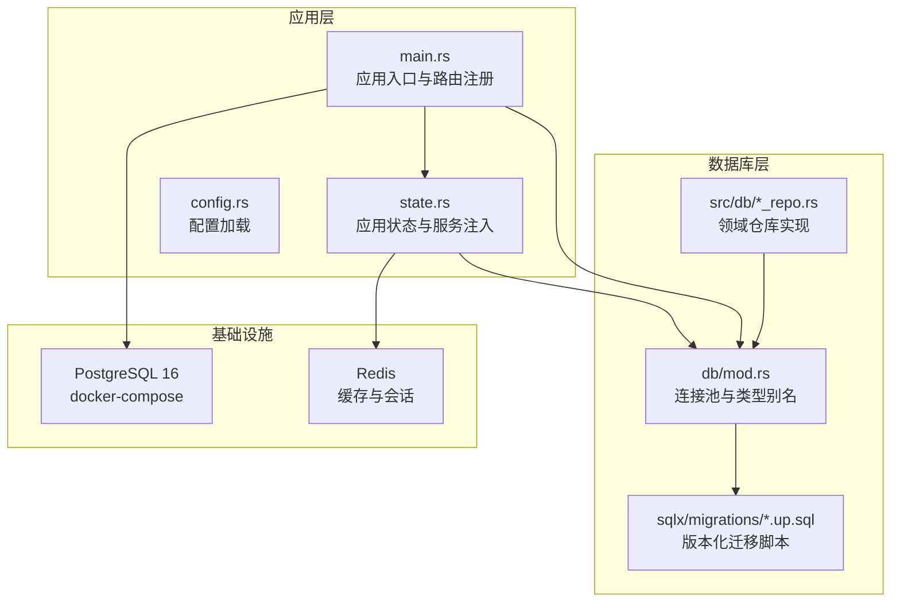
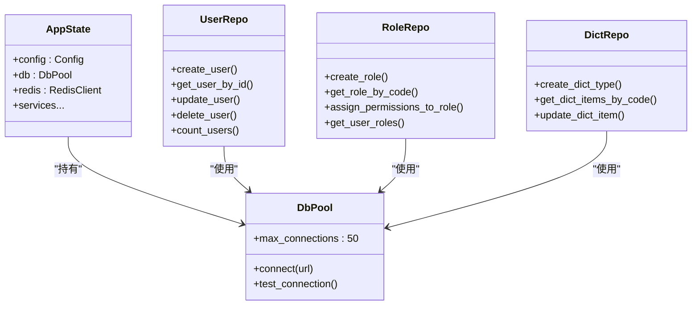
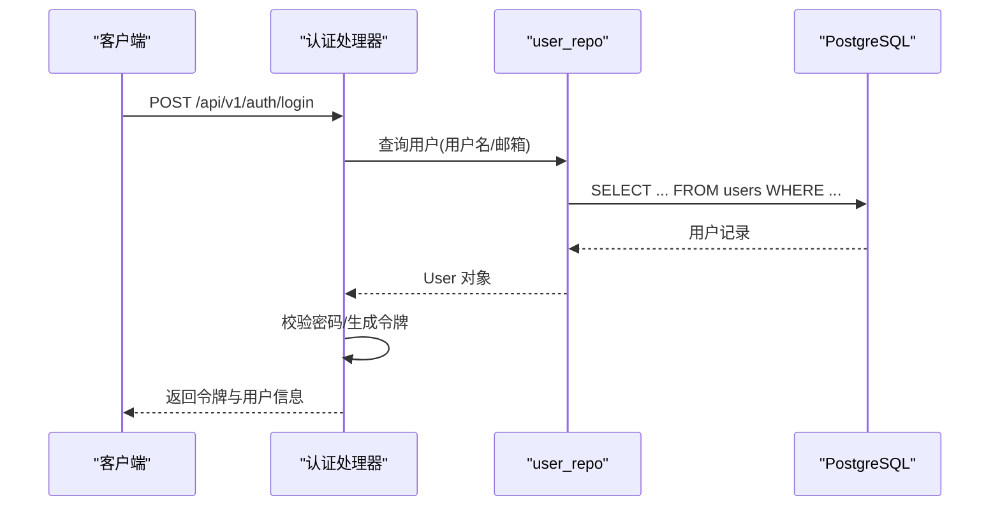
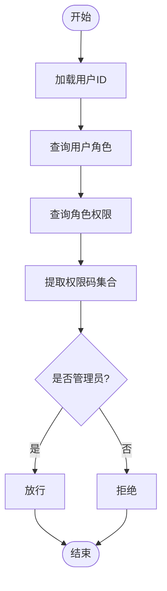
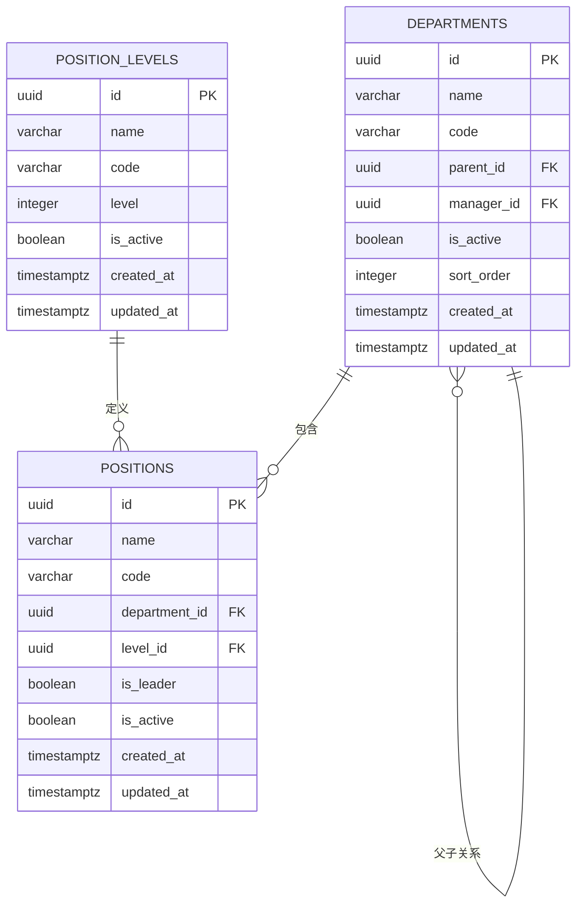
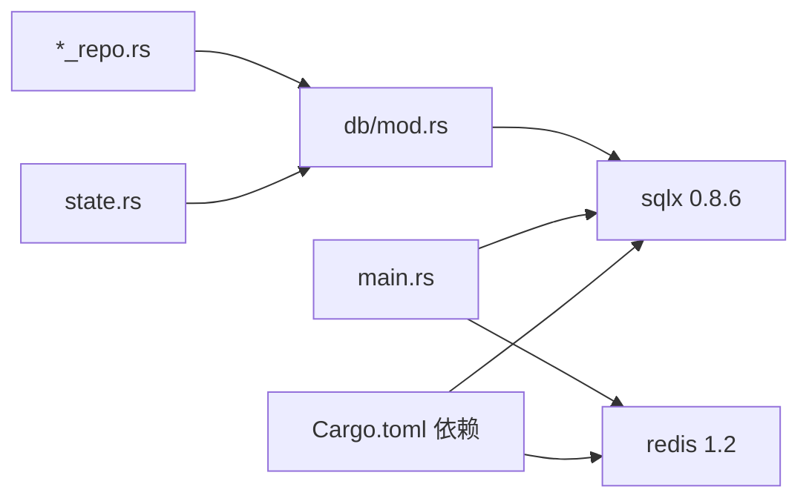

# 数据库架构概览

<cite>
**本文档引用的文件**
- [Cargo.toml](file://backend/core/Cargo.toml)
- [config.rs](file://backend/core/src/config.rs)
- [db/mod.rs](file://backend/core/src/db/mod.rs)
- [state.rs](file://backend/core/src/state.rs)
- [main.rs](file://backend/core/src/main.rs)
- [docker-compose.yml](file://docker/docker-compose.yml)
- [00000000000000_create_users_table.up.sql](file://backend/core/sqlx/migrations/00000000000000_create_users_table.up.sql)
- [021_create_roles_and_permissions_tables.up.sql](file://backend/core/sqlx/migrations/021_create_roles_and_permissions_tables.up.sql)
- [026_create_organization_tables.up.sql](file://backend/core/sqlx/migrations/026_create_organization_tables.up.sql)
- [user_repo.rs](file://backend/core/src/db/user_repo.rs)
- [role_repo.rs](file://backend/core/src/db/role_repo.rs)
- [dict_repo.rs](file://backend/core/src/db/dict_repo.rs)
</cite>

## 目录
1. [简介](#简介)
2. [项目结构](#项目结构)
3. [核心组件](#核心组件)
4. [架构总览](#架构总览)
5. [详细组件分析](#详细组件分析)
6. [依赖关系分析](#依赖关系分析)
7. [性能考虑](#性能考虑)
8. [故障排除指南](#故障排除指南)
9. [结论](#结论)

## 简介
本文件面向数据库管理员与开发者，系统性梳理 POMP 系统基于 PostgreSQL 的数据库架构设计与运维实践。内容涵盖数据库连接池配置、事务管理、并发控制、设计原则与最佳实践、版本控制与迁移管理、监控与备份恢复以及性能优化等关键主题，帮助读者快速理解并高效使用该数据库架构。

## 项目结构
POMP 后端采用 Rust + SQLx + Axum 架构，数据库层通过 SQLx 的 Postgres 驱动与连接池进行统一管理；数据库迁移脚本集中于 sqlx/migrations 目录，按版本号顺序执行；应用启动时自动运行迁移，确保数据库结构与代码一致。

**图表来源**
- [main.rs:16-37](file://backend/core/src/main.rs#L16-L37)
- [state.rs:10-26](file://backend/core/src/state.rs#L10-L26)
- [db/mod.rs:25-37](file://backend/core/src/db/mod.rs#L25-L37)
- [docker-compose.yml:4-19](file://docker/docker-compose.yml#L4-L19)

**章节来源**
- [main.rs:16-37](file://backend/core/src/main.rs#L16-L37)
- [state.rs:10-26](file://backend/core/src/state.rs#L10-L26)
- [db/mod.rs:25-37](file://backend/core/src/db/mod.rs#L25-L37)
- [docker-compose.yml:4-19](file://docker/docker-compose.yml#L4-L19)

## 核心组件
- 连接池与类型别名
  - 通过 PgPoolOptions 创建连接池，最大连接数配置为 50，满足中等规模并发需求。
  - 提供测试连接函数，用于启动阶段验证数据库连通性。
- 配置管理
  - 默认数据库 URL 指向本地 PostgreSQL 实例，便于开发环境快速启动。
  - 支持从 .env 文件与环境变量加载配置。
- 应用状态
  - AppState 将数据库连接池、Redis 客户端与各类服务封装为共享状态，便于各处理器使用。
- 迁移管理
  - 启动时自动执行 sqlx/migrations 下的迁移脚本，保证数据库结构一致性。

**章节来源**
- [db/mod.rs:25-44](file://backend/core/src/db/mod.rs#L25-L44)
- [config.rs:96-115](file://backend/core/src/config.rs#L96-L115)
- [state.rs:10-26](file://backend/core/src/state.rs#L10-L26)
- [main.rs:23-28](file://backend/core/src/main.rs#L23-L28)

## 架构总览
POMP 的数据库架构围绕 PostgreSQL 展开，采用“连接池 + 领域仓库”的分层设计：
- 连接池层：统一管理数据库连接，限制最大连接数，避免资源耗尽。
- 仓库层：每个业务域（用户、角色权限、字典、GIS 等）提供独立的仓库模块，封装 CRUD 与复杂查询。
- 迁移层：版本化迁移脚本，确保数据库结构随代码演进而同步。
- 并发控制：通过连接池并发与 SQL 约束实现一致性；未显式使用分布式锁，依赖数据库事务与唯一约束保障数据完整性。

**图表来源**
- [db/mod.rs:25-44](file://backend/core/src/db/mod.rs#L25-L44)
- [state.rs:10-26](file://backend/core/src/state.rs#L10-L26)
- [user_repo.rs:7-541](file://backend/core/src/db/user_repo.rs#L7-L541)
- [role_repo.rs:7-391](file://backend/core/src/db/role_repo.rs#L7-L391)
- [dict_repo.rs:9-268](file://backend/core/src/db/dict_repo.rs#L9-L268)

## 详细组件分析

### 用户管理子系统
- 表结构与索引
  - users 表启用 UUID 扩展，主键为 UUID，默认生成；用户名与邮箱唯一；为活跃状态、状态、创建时间建立索引，支撑高频查询。
- 仓库能力
  - 支持按 ID、用户名、邮箱查询；分页查询；批量统计；状态变更（激活、审批、拒绝）；删除级联清理相关内容。
- 设计要点
  - 使用 COALESCE 更新字段，避免空值覆盖；返回完整实体对象，便于上层处理。

**图表来源**
- [user_repo.rs:117-167](file://backend/core/src/db/user_repo.rs#L117-L167)
- [00000000000000_create_users_table.up.sql:4-26](file://backend/core/sqlx/migrations/00000000000000_create_users_table.up.sql#L4-L26)

**章节来源**
- [user_repo.rs:7-541](file://backend/core/src/db/user_repo.rs#L7-L541)
- [00000000000000_create_users_table.up.sql:4-26](file://backend/core/sqlx/migrations/00000000000000_create_users_table.up.sql#L4-L26)

### 角色权限子系统
- 表结构与索引
  - roles、permissions、user_roles、role_permissions 四表关联，角色与权限多对多，用户与角色多对多；为关联字段建立复合索引，加速权限查询。
- 仓库能力
  - 角色 CRUD、权限分配/移除、用户角色查询、用户权限码集合获取、管理员判定等。
- 设计要点
  - 使用 ON CONFLICT DO NOTHING 避免重复插入；权限码去重查询，减少冗余结果。

**图表来源**
- [role_repo.rs:324-390](file://backend/core/src/db/role_repo.rs#L324-L390)
- [021_create_roles_and_permissions_tables.up.sql:1-127](file://backend/core/sqlx/migrations/021_create_roles_and_permissions_tables.up.sql#L1-L127)

**章节来源**
- [role_repo.rs:7-391](file://backend/core/src/db/role_repo.rs#L7-L391)
- [021_create_roles_and_permissions_tables.up.sql:1-127](file://backend/core/sqlx/migrations/021_create_roles_and_permissions_tables.up.sql#L1-L127)

### 组织架构子系统
- 表结构与外键
  - departments、positions、position_levels 三表，支持部门树形结构与职位层级；动态添加外键约束，确保引用完整性。
- 仓库能力
  - 部门 CRUD、父子关系查询、职位与层级管理；为 parent_id、manager_id、department_id、level_id 建立索引。
- 设计要点
  - 使用 DO $$ ... $$ 动态 DDL，避免依赖顺序导致的约束失败。

**图表来源**
- [026_create_organization_tables.up.sql:1-73](file://backend/core/sqlx/migrations/026_create_organization_tables.up.sql#L1-L73)

**章节来源**
- [026_create_organization_tables.up.sql:1-73](file://backend/core/sqlx/migrations/026_create_organization_tables.up.sql#L1-L73)

### 字典管理子系统
- 仓库能力
  - 字典类型与条目 CRUD、分类过滤、层级查询、默认项标记、激活状态控制。
- 设计要点
  - 使用 query_as 自动映射结构体，简化 ORM 映射；条件查询支持可选参数，灵活组合过滤条件。

**章节来源**
- [dict_repo.rs:9-268](file://backend/core/src/db/dict_repo.rs#L9-L268)

## 依赖关系分析
- 外部依赖
  - SQLx 0.8.6（Postgres、chrono、uuid、json、bigdecimal、migrate），启用 runtime-tokio-rustls 与迁移特性。
  - Redis 客户端用于缓存与会话，与数据库连接池并行存在。
- 内部依赖
  - main.rs 依赖配置加载与迁移执行；AppState 将数据库连接池注入各服务；各 *_repo.rs 依赖 DbPool 执行 SQL。

**图表来源**
- [Cargo.toml:15-48](file://backend/core/Cargo.toml#L15-L48)
- [main.rs:23-31](file://backend/core/src/main.rs#L23-L31)
- [db/mod.rs:25-37](file://backend/core/src/db/mod.rs#L25-L37)

**章节来源**
- [Cargo.toml:15-48](file://backend/core/Cargo.toml#L15-L48)
- [main.rs:23-31](file://backend/core/src/main.rs#L23-L31)
- [db/mod.rs:25-37](file://backend/core/src/db/mod.rs#L25-L37)

## 性能考虑
- 连接池与并发
  - 最大连接数 50，适合中等并发场景；可根据实际负载调整 max_connections。
  - 建议配合连接池健康检查与超时配置，避免慢查询拖垮连接池。
- 索引策略
  - users 表已为常用过滤字段建立索引；建议对高频查询字段（如组织架构的 parent_id、manager_id）保持索引，避免全表扫描。
- 查询优化
  - 分页查询使用 LIMIT/OFFSET，注意大数据量时的 OFFSET 成本；可考虑基于游标或基于索引的键集分页。
  - 复合查询尽量使用复合索引，减少回表次数。
- 事务与锁
  - 未发现显式长事务与悲观锁使用；建议对批量更新/删除操作使用事务包裹，减少锁竞争。
- 缓存与数据库协同
  - Redis 作为缓存层，建议对热点数据（如字典项、权限码）做缓存，降低数据库压力。

[本节为通用性能建议，不直接分析具体文件]

## 故障排除指南
- 启动失败（数据库不可达）
  - 检查 .env 或环境变量中的 DATABASE_URL 是否正确；确认 PostgreSQL 容器已启动并通过健康检查。
  - 使用 test_db_connection 验证连接可用性。
- 迁移失败
  - 查看迁移日志，确认迁移脚本语法与 PostgreSQL 版本兼容；确保迁移目录下脚本命名符合顺序规则。
- 权限问题
  - 确认用户角色与权限分配正确；使用 get_user_permission_codes 获取用户权限码集合核对。
- 性能问题
  - 使用 EXPLAIN 分析慢查询；检查索引是否被使用；评估是否需要新增索引或重构查询。

**章节来源**
- [db/mod.rs:39-44](file://backend/core/src/db/mod.rs#L39-L44)
- [docker-compose.yml:15-19](file://docker/docker-compose.yml#L15-L19)

## 结论
POMP 的数据库架构以 PostgreSQL 为核心，结合 SQLx 连接池与版本化迁移，形成清晰、可维护的数据层。通过合理的索引策略、事务管理与并发控制，满足业务增长与稳定性要求。建议在生产环境中进一步完善监控告警、备份恢复与容量规划，确保系统长期稳定运行。