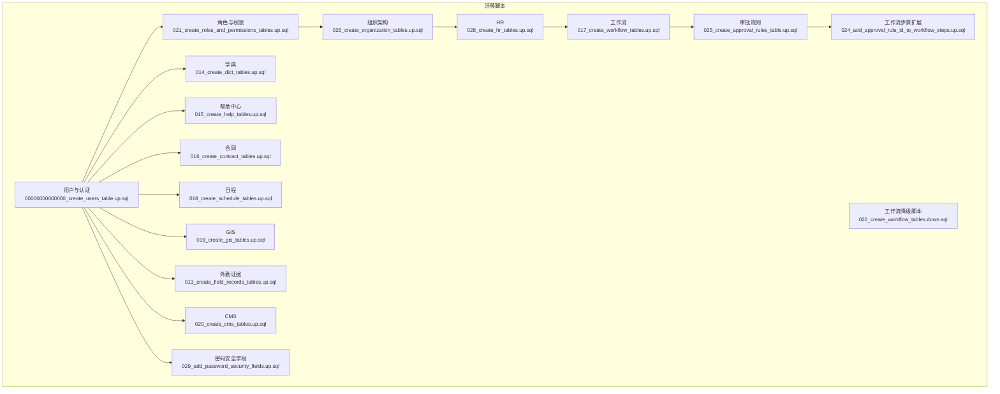
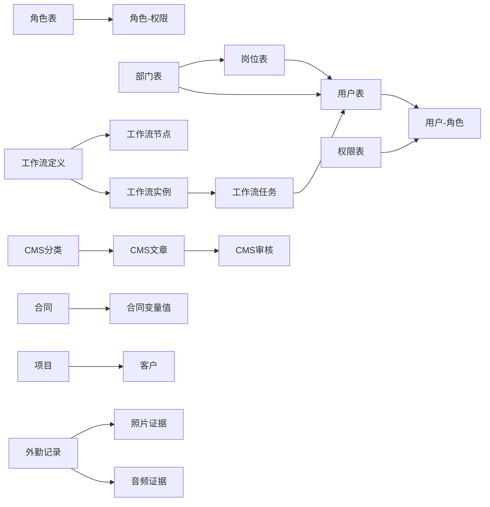

# 数据库设计

<cite>
**本文引用的文件**
- [00000000000000_create_users_table.up.sql](file://backend/core/sqlx/migrations/00000000000000_create_users_table.up.sql)
- [013_create_field_records_tables.up.sql](file://backend/core/sqlx/migrations/013_create_field_records_tables.up.sql)
- [014_create_dict_tables.up.sql](file://backend/core/sqlx/migrations/014_create_dict_tables.up.sql)
- [015_create_help_tables.up.sql](file://backend/core/sqlx/migrations/015_create_help_tables.up.sql)
- [016_create_contract_tables.up.sql](file://backend/core/sqlx/migrations/016_create_contract_tables.up.sql)
- [017_create_workflow_tables.up.sql](file://backend/core/sqlx/migrations/017_create_workflow_tables.up.sql)
- [018_create_schedule_tables.up.sql](file://backend/core/sqlx/migrations/018_create_schedule_tables.up.sql)
- [019_create_gis_tables.up.sql](file://backend/core/sqlx/migrations/019_create_gis_tables.up.sql)
- [020_create_cms_tables.up.sql](file://backend/core/sqlx/migrations/020_create_cms_tables.up.sql)
- [021_create_roles_and_permissions_tables.up.sql](file://backend/core/sqlx/migrations/021_create_roles_and_permissions_tables.up.sql)
- [022_create_workflow_tables.down.sql](file://backend/core/sqlx/migrations/022_create_workflow_tables.down.sql)
- [024_add_approval_rule_id_to_workflow_steps.up.sql](file://backend/core/sqlx/migrations/024_add_approval_rule_id_to_workflow_steps.up.sql)
- [025_create_approval_rules_table.up.sql](file://backend/core/sqlx/migrations/025_create_approval_rules_table.up.sql)
- [026_create_organization_tables.up.sql](file://backend/core/sqlx/migrations/026_create_organization_tables.up.sql)
- [028_create_hr_tables.up.sql](file://backend/core/sqlx/migrations/028_create_hr_tables.up.sql)
- [029_add_password_security_fields.up.sql](file://backend/core/sqlx/migrations/029_add_password_security_fields.up.sql)
</cite>

## 目录
1. [简介](#简介)
2. [项目结构](#项目结构)
3. [核心组件](#核心组件)
4. [架构总览](#架构总览)
5. [详细组件分析](#详细组件分析)
6. [依赖关系分析](#依赖关系分析)
7. [性能考虑](#性能考虑)
8. [故障排查指南](#故障排查指南)
9. [结论](#结论)
10. [附录](#附录)

## 简介
本文件为 POMP 系统的数据库设计与维护指南，面向数据库管理员与后端开发者，围绕基于 PostgreSQL 的关系型数据库进行系统化设计说明。内容涵盖数据库架构设计原则、表结构设计、索引策略、约束定义、业务模块映射、迁移管理策略、查询优化、事务与并发控制、安全与权限控制、审计与备份建议等。

## 项目结构
数据库层采用 SQLx 迁移脚本进行版本化管理，迁移文件按业务域分组，形成清晰的演进路径。整体结构遵循“按模块拆分 + 统一迁移管理”的组织方式，便于团队协作与回滚。

图表来源
- [00000000000000_create_users_table.up.sql:1-26](file://backend/core/sqlx/migrations/00000000000000_create_users_table.up.sql#L1-L26)
- [021_create_roles_and_permissions_tables.up.sql:1-127](file://backend/core/sqlx/migrations/021_create_roles_and_permissions_tables.up.sql#L1-L127)
- [026_create_organization_tables.up.sql:1-73](file://backend/core/sqlx/migrations/026_create_organization_tables.up.sql#L1-L73)
- [028_create_hr_tables.up.sql:1-60](file://backend/core/sqlx/migrations/028_create_hr_tables.up.sql#L1-L60)
- [017_create_workflow_tables.up.sql:1-107](file://backend/core/sqlx/migrations/017_create_workflow_tables.up.sql#L1-L107)
- [025_create_approval_rules_table.up.sql:1-46](file://backend/core/sqlx/migrations/025_create_approval_rules_table.up.sql#L1-L46)
- [024_add_approval_rule_id_to_workflow_steps.up.sql:1-13](file://backend/core/sqlx/migrations/024_add_approval_rule_id_to_workflow_steps.up.sql#L1-L13)
- [014_create_dict_tables.up.sql:1-64](file://backend/core/sqlx/migrations/014_create_dict_tables.up.sql#L1-L64)
- [015_create_help_tables.up.sql:1-55](file://backend/core/sqlx/migrations/015_create_help_tables.up.sql#L1-L55)
- [016_create_contract_tables.up.sql:1-88](file://backend/core/sqlx/migrations/016_create_contract_tables.up.sql#L1-L88)
- [018_create_schedule_tables.up.sql:1-37](file://backend/core/sqlx/migrations/018_create_schedule_tables.up.sql#L1-L37)
- [019_create_gis_tables.up.sql:1-118](file://backend/core/sqlx/migrations/019_create_gis_tables.up.sql#L1-L118)
- [013_create_field_records_tables.up.sql:1-50](file://backend/core/sqlx/migrations/013_create_field_records_tables.up.sql#L1-L50)
- [020_create_cms_tables.up.sql:1-88](file://backend/core/sqlx/migrations/020_create_cms_tables.up.sql#L1-L88)
- [029_add_password_security_fields.up.sql:1-16](file://backend/core/sqlx/migrations/029_add_password_security_fields.up.sql#L1-L16)
- [022_create_workflow_tables.down.sql:1-15](file://backend/core/sqlx/migrations/022_create_workflow_tables.down.sql#L1-L15)

章节来源
- [00000000000000_create_users_table.up.sql:1-26](file://backend/core/sqlx/migrations/00000000000000_create_users_table.up.sql#L1-L26)
- [021_create_roles_and_permissions_tables.up.sql:1-127](file://backend/core/sqlx/migrations/021_create_roles_and_permissions_tables.up.sql#L1-L127)

## 核心组件
本节概述数据库层的核心表与职责边界，并给出设计原则与约束策略。

- 设计原则
  - 使用 UUID 主键统一跨模块关联，避免序列依赖与冲突。
  - 以“软删除/状态位”替代物理删除，保留审计线索。
  - 通过触发器统一维护 updated_at 字段，减少应用侧负担。
  - 为高频查询字段建立索引，平衡写入与读取性能。
  - 明确外键约束与级联策略，保证数据一致性。
  - 对 JSONB/文本字段使用必要校验与长度限制，避免膨胀。

- 关键表与职责
  - 用户与认证：用户基本信息、登录态与安全字段。
  - 角色与权限：RBAC 权限模型，支持资源+动作授权。
  - 组织架构：部门、职位级别与岗位，支撑 HR 与审批。
  - HR：员工考勤、请假流程与工作流集成。
  - 工作流：流程定义、节点、实例与任务，支持审批规则。
  - 审批规则：按规则类型、部门、岗位、条件表达式配置审批路径。
  - 字典：树形字典类型与字典项，支持分类与排序。
  - 帮助中心：分类与文章，支持标签与发布状态。
  - 合同：模板与合同实体，支持变量渲染与状态管理。
  - 日程：会议/任务/提醒，支持重复与提醒。
  - GIS：客户、项目、仓库、人员与位置历史。
  - 外勤证据：照片与音频证据，关联外勤记录。
  - CMS：内容分类、文章与审核流程。

章节来源
- [00000000000000_create_users_table.up.sql:1-26](file://backend/core/sqlx/migrations/00000000000000_create_users_table.up.sql#L1-L26)
- [014_create_dict_tables.up.sql:1-64](file://backend/core/sqlx/migrations/014_create_dict_tables.up.sql#L1-L64)
- [015_create_help_tables.up.sql:1-55](file://backend/core/sqlx/migrations/015_create_help_tables.up.sql#L1-L55)
- [016_create_contract_tables.up.sql:1-88](file://backend/core/sqlx/migrations/016_create_contract_tables.up.sql#L1-L88)
- [017_create_workflow_tables.up.sql:1-107](file://backend/core/sqlx/migrations/017_create_workflow_tables.up.sql#L1-L107)
- [018_create_schedule_tables.up.sql:1-37](file://backend/core/sqlx/migrations/018_create_schedule_tables.up.sql#L1-L37)
- [019_create_gis_tables.up.sql:1-118](file://backend/core/sqlx/migrations/019_create_gis_tables.up.sql#L1-L118)
- [013_create_field_records_tables.up.sql:1-50](file://backend/core/sqlx/migrations/013_create_field_records_tables.up.sql#L1-L50)
- [020_create_cms_tables.up.sql:1-88](file://backend/core/sqlx/migrations/020_create_cms_tables.up.sql#L1-L88)
- [021_create_roles_and_permissions_tables.up.sql:1-127](file://backend/core/sqlx/migrations/021_create_roles_and_permissions_tables.up.sql#L1-L127)
- [026_create_organization_tables.up.sql:1-73](file://backend/core/sqlx/migrations/026_create_organization_tables.up.sql#L1-L73)
- [028_create_hr_tables.up.sql:1-60](file://backend/core/sqlx/migrations/028_create_hr_tables.up.sql#L1-L60)
- [029_add_password_security_fields.up.sql:1-16](file://backend/core/sqlx/migrations/029_add_password_security_fields.up.sql#L1-L16)

## 架构总览
下图展示各业务模块之间的数据关系与关键外键约束，体现从用户到组织、HR、工作流、审批规则、内容与地理信息的完整链路。

```mermaid
erDiagram
USERS {
uuid id PK
varchar username UK
varchar email UK
varchar password_hash
varchar name
varchar phone
varchar avatar
boolean is_superuser
boolean is_active
varchar status
timestamptz created_at
timestamptz updated_at
}
ROLES {
uuid id PK
varchar name
varchar code UK
text description
boolean is_active
boolean is_system
timestamptz created_at
timestamptz updated_at
}
USER_ROLES {
uuid id PK
uuid user_id FK
uuid role_id FK
timestamptz assigned_at
uuid assigned_by
}
PERMISSIONS {
uuid id PK
varchar name
varchar code UK
varchar resource
varchar action
uuid parent_id FK
timestamptz created_at
}
ROLE_PERMISSIONS {
uuid id PK
uuid role_id FK
uuid permission_id FK
}
DEPARTMENTS {
uuid id PK
varchar name
varchar code
uuid parent_id FK
uuid manager_id FK
text description
boolean is_active
integer sort_order
timestamptz created_at
timestamptz updated_at
}
POSITION_LEVELS {
uuid id PK
varchar name
varchar code
integer level
text description
boolean is_active
timestamptz created_at
timestamptz updated_at
}
POSITIONS {
uuid id PK
varchar name
varchar code
uuid department_id FK
uuid level_id FK
text description
boolean is_leader
boolean is_active
timestamptz created_at
timestamptz updated_at
}
USERS ||--o{ USER_ROLES : "has"
ROLES ||--o{ USER_ROLES : "assigned"
ROLES ||--o{ ROLE_PERMISSIONS : "grants"
PERMISSIONS ||--o{ ROLE_PERMISSIONS : "granted_to"
DEPARTMENTS ||--o{ POSITIONS : "contains"
USERS ||--o{ ATTENDANCE_RECORDS : "has"
POSITIONS ||--o{ USERS : "occupies"
WORKFLOW_DEFINITIONS {
uuid id PK
varchar code UK
varchar name
text description
varchar business_type
varchar version
boolean is_active
boolean is_default
timestamptz created_at
timestamptz updated_at
}
WORKFLOW_NODES {
uuid id PK
uuid workflow_id FK
varchar node_code
varchar node_name
varchar node_type
varchar approval_type
varchar approver_type
text approver_config
integer sort_order
boolean is_required
timestamptz created_at
timestamptz updated_at
}
WORKFLOW_INSTANCES {
uuid id PK
uuid workflow_id FK
uuid initiator_id FK
varchar status
varchar business_id
varchar business_type
varchar business_title
jsonb data
timestamptz created_at
timestamptz updated_at
timestamptz completed_at
}
WORKFLOW_TASKS {
uuid id PK
uuid instance_id FK
uuid node_id FK
varchar node_code
varchar node_name
uuid assignee_id FK
varchar assignee_name
varchar status
text comment
timestamptz processed_at
timestamptz created_at
timestamptz updated_at
}
APPROVAL_RULES {
uuid id PK
varchar name
varchar code
varchar rule_type
varchar workflow_type
integer node_order
uuid position_level_id FK
uuid department_id FK
uuid specific_user_id FK
integer min_approvers
varchar approval_mode
text condition_expression
boolean is_active
timestamptz created_at
timestamptz updated_at
}
WORKFLOW_STEPS {
uuid id PK
uuid workflow_id FK
varchar step_code
varchar step_name
varchar step_type
uuid approval_rule_id FK
integer sort_order
timestamptz created_at
timestamptz updated_at
}
WORKFLOW_STEPS ||--o{ WORKFLOW_TASKS : "generates"
WORKFLOW_DEFINITIONS ||--o{ WORKFLOW_NODES : "contains"
WORKFLOW_DEFINITIONS ||--o{ WORKFLOW_INSTANCES : "instantiates"
WORKFLOW_INSTANCES ||--o{ WORKFLOW_TASKS : "contains"
ATTENDANCE_RECORDS {
uuid id PK
uuid user_id FK
date attendance_date
timestamptz check_in_time
timestamptz check_out_time
varchar check_in_location
varchar check_out_location
varchar status
decimal work_hours
integer late_minutes
integer early_leave_minutes
decimal overtime_hours
text remark
timestamptz created_at
timestamptz updated_at
}
LEAVE_REQUESTS {
uuid id PK
uuid user_id FK
varchar leave_type
date start_date
date end_date
decimal total_days
text reason
varchar status
uuid workflow_instance_id FK
uuid approved_by FK
timestamptz approved_at
text remark
timestamptz created_at
timestamptz updated_at
}
CMS_CATEGORIES {
uuid id PK
varchar name
varchar code UK
text description
uuid parent_id FK
uuid department_id FK
integer sort_order
boolean is_active
timestamptz created_at
timestamptz updated_at
}
CMS_ARTICLES {
uuid id PK
uuid category_id FK
uuid author_id FK
varchar title
varchar slug UK
text summary
text content
varchar cover_image
uuid department_id FK
varchar status
integer view_count
boolean is_top
timestamptz published_at
integer review_timeout_days
timestamptz review_reminded_at
timestamptz created_at
timestamptz updated_at
}
CMS_ARTICLE_REVIEWS {
uuid id PK
uuid article_id FK
uuid reviewer_id FK
varchar status
text comment
timestamptz created_at
}
FIELD_RECORDS {
uuid id PK
uuid user_id FK
varchar task_title
text task_description
decimal latitude
decimal longitude
varchar location_name
varchar address
varchar status
timestamptz created_at
timestamptz updated_at
}
PHOTO_EVIDENCES {
uuid id PK
uuid field_record_id FK
varchar file_name
varchar file_path
bigint file_size
varchar content_type
text description
decimal latitude
decimal longitude
timestamptz created_at
}
AUDIO_EVIDENCES {
uuid id PK
uuid field_record_id FK
varchar file_name
varchar file_path
bigint file_size
integer duration
varchar content_type
text description
decimal latitude
decimal longitude
timestamptz created_at
}
SCHEDULE_EVENTS {
uuid id PK
varchar title
text description
varchar event_type
timestamptz start_time
timestamptz end_time
boolean is_all_day
varchar location
uuid organizer_id FK
jsonb participant_ids
integer reminder_minutes
boolean is_recurring
text recurrence_rule
varchar status
varchar color
timestamptz created_at
timestamptz updated_at
}
GIS_CUSTOMERS {
varchar id PK
varchar name
double precision longitude
double precision latitude
varchar customer_type
varchar contact_person
varchar contact_phone
text address
varchar level
varchar status
timestamptz created_at
timestamptz updated_at
}
GIS_PROJECTS {
varchar id PK
varchar name
double precision longitude
double precision latitude
varchar project_type
varchar status
varchar customer_id FK
timestamptz start_date
timestamptz end_date
decimal budget
text description
timestamptz created_at
timestamptz updated_at
}
GIS_WAREHOUSES {
varchar id PK
varchar name
double precision longitude
double precision latitude
varchar warehouse_type
varchar capacity
text address
varchar manager_name
varchar manager_phone
varchar status
timestamptz created_at
timestamptz updated_at
}
GIS_PERSONNEL {
varchar id PK
varchar name
double precision longitude
double precision latitude
varchar personnel_type
varchar position
varchar department
varchar phone
varchar status
timestamptz last_location_time
timestamptz created_at
timestamptz updated_at
}
GIS_LOCATION_HISTORY {
varchar id PK
varchar entity_type
varchar entity_id
double precision longitude
double precision latitude
text address
timestamptz location_time
text remarks
timestamptz created_at
}
CONTRACT_TEMPLATES {
uuid id PK
varchar code UK
varchar name
text description
varchar contract_type
varchar category
text content
text variables
varchar version
boolean is_active
boolean is_system
integer sort_order
timestamptz created_at
timestamptz updated_at
}
CONTRACTS {
uuid id PK
varchar code UK
varchar name
text description
varchar contract_type
varchar category
text content
text content_rendered
varchar status
varchar first_party
varchar second_party
numeric amount
varchar currency
timestamptz start_date
timestamptz end_date
timestamptz sign_date
uuid project_id
uuid created_by
varchar risk_level
timestamptz created_at
timestamptz updated_at
}
CONTRACT_VARIABLE_VALUES {
uuid id PK
uuid contract_id FK
varchar variable_key
text variable_value
varchar variable_type
timestamptz created_at
}
DICT_TYPES {
uuid id PK
varchar code UK
varchar name
text description
varchar category
uuid parent_id FK
integer sort_order
boolean is_system
boolean is_active
timestamptz created_at
timestamptz updated_at
}
DICT_ITEMS {
uuid id PK
uuid dict_type_id FK
varchar code
varchar name
text value
integer sort_order
boolean is_default
boolean is_active
timestamptz created_at
timestamptz updated_at
}
HELP_CATEGORIES {
uuid id PK
varchar code UK
varchar name
varchar icon
text description
integer sort_order
boolean is_active
timestamptz created_at
timestamptz updated_at
}
HELP_ARTICLES {
uuid id PK
uuid category_id FK
varchar slug UK
varchar title
text content
varchar author
varchar tags
integer view_count
boolean is_published
boolean is_featured
integer sort_order
timestamptz created_at
timestamptz updated_at
}
```

图表来源
- [00000000000000_create_users_table.up.sql:1-26](file://backend/core/sqlx/migrations/00000000000000_create_users_table.up.sql#L1-L26)
- [014_create_dict_tables.up.sql:1-64](file://backend/core/sqlx/migrations/014_create_dict_tables.up.sql#L1-L64)
- [015_create_help_tables.up.sql:1-55](file://backend/core/sqlx/migrations/015_create_help_tables.up.sql#L1-L55)
- [016_create_contract_tables.up.sql:1-88](file://backend/core/sqlx/migrations/016_create_contract_tables.up.sql#L1-L88)
- [017_create_workflow_tables.up.sql:1-107](file://backend/core/sqlx/migrations/017_create_workflow_tables.up.sql#L1-L107)
- [018_create_schedule_tables.up.sql:1-37](file://backend/core/sqlx/migrations/018_create_schedule_tables.up.sql#L1-L37)
- [019_create_gis_tables.up.sql:1-118](file://backend/core/sqlx/migrations/019_create_gis_tables.up.sql#L1-L118)
- [013_create_field_records_tables.up.sql:1-50](file://backend/core/sqlx/migrations/013_create_field_records_tables.up.sql#L1-L50)
- [020_create_cms_tables.up.sql:1-88](file://backend/core/sqlx/migrations/020_create_cms_tables.up.sql#L1-L88)
- [021_create_roles_and_permissions_tables.up.sql:1-127](file://backend/core/sqlx/migrations/021_create_roles_and_permissions_tables.up.sql#L1-L127)
- [026_create_organization_tables.up.sql:1-73](file://backend/core/sqlx/migrations/026_create_organization_tables.up.sql#L1-L73)
- [028_create_hr_tables.up.sql:1-60](file://backend/core/sqlx/migrations/028_create_hr_tables.up.sql#L1-L60)
- [029_add_password_security_fields.up.sql:1-16](file://backend/core/sqlx/migrations/029_add_password_security_fields.up.sql#L1-L16)

## 详细组件分析

### 用户与认证模块
- 表结构要点
  - 用户主表包含身份标识、安全字段与状态位；启用 UUID 扩展生成主键。
  - 密码安全字段用于强制变更密码、记录最近一次修改与登录时间。
  - 为用户名、邮箱、状态、活跃度、创建时间建立索引，提升登录与筛选效率。
- 约束与触发器
  - 使用唯一索引保障用户名与邮箱唯一性。
  - 可结合应用逻辑实现登录失败次数与锁定策略（建议在应用层实现）。
- 安全建议
  - 登录态与会话存储建议独立于用户表，避免敏感信息泄露。
  - 强制密码变更策略需配合前端引导与审计日志。

章节来源
- [00000000000000_create_users_table.up.sql:1-26](file://backend/core/sqlx/migrations/00000000000000_create_users_table.up.sql#L1-L26)
- [029_add_password_security_fields.up.sql:1-16](file://backend/core/sqlx/migrations/029_add_password_security_fields.up.sql#L1-L16)

### 角色与权限模块
- 表结构要点
  - 角色表与权限表支持树形父子关系，权限以资源+动作组合编码。
  - 用户-角色与角色-权限多对多关联，支持默认内置角色与权限初始化。
- 索引策略
  - 用户-角色与角色-权限表均建立双向索引，加速授权判定。
  - 权限表按资源+动作联合索引，便于快速匹配。
- 集成点
  - 与用户表、组织架构表可扩展关联，实现基于部门/岗位的权限继承。

章节来源
- [021_create_roles_and_permissions_tables.up.sql:1-127](file://backend/core/sqlx/migrations/021_create_roles_and_permissions_tables.up.sql#L1-L127)

### 组织架构模块
- 表结构要点
  - 部门支持父子层级与负责人；职位级别与岗位分别抽象层级与具体岗位。
  - 岗位与部门、职位级别建立外键关系，确保组织数据一致性。
- 索引策略
  - 部门父节点与负责人、岗位部门与级别建立索引，支撑组织查询与权限计算。
- 扩展建议
  - 可引入组织维度的权限继承策略，结合角色与权限表实现更细粒度控制。

章节来源
- [026_create_organization_tables.up.sql:1-73](file://backend/core/sqlx/migrations/026_create_organization_tables.up.sql#L1-L73)

### HR 模块
- 表结构要点
  - 在用户表新增员工编号、入职日期、职位外键与状态字段，实现 HR 基础信息与用户体系打通。
  - 考勤记录表支持每日唯一约束，避免重复录入；请假申请与工作流实例关联，实现流程化审批。
- 索引策略
  - 考勤按用户与日期、状态建立索引；请假按用户、状态与起止日期建立索引。
- 流程集成
  - 请假申请与工作流实例关联，便于追踪审批过程与结果。

章节来源
- [028_create_hr_tables.up.sql:1-60](file://backend/core/sqlx/migrations/028_create_hr_tables.up.sql#L1-L60)

### 工作流与审批规则模块
- 表结构要点
  - 工作流定义、节点、实例与任务构成完整的流程生命周期；任务与用户、节点建立关联。
  - 审批规则表支持按规则类型、部门、岗位、特定用户与条件表达式配置审批路径。
  - 工作流步骤扩展字段支持绑定审批规则，增强灵活性。
- 索引策略
  - 实例按业务标识、类型、发起人与状态建立索引；任务按实例、处理人与状态建立索引。
  - 审批规则按编码、类型、工作流类型与状态建立索引。
- 降级策略
  - 提供工作流降级脚本，便于回滚至旧版结构。

章节来源
- [017_create_workflow_tables.up.sql:1-107](file://backend/core/sqlx/migrations/017_create_workflow_tables.up.sql#L1-L107)
- [025_create_approval_rules_table.up.sql:1-46](file://backend/core/sqlx/migrations/025_create_approval_rules_table.up.sql#L1-L46)
- [024_add_approval_rule_id_to_workflow_steps.up.sql:1-13](file://backend/core/sqlx/migrations/024_add_approval_rule_id_to_workflow_steps.up.sql#L1-L13)
- [022_create_workflow_tables.down.sql:1-15](file://backend/core/sqlx/migrations/022_create_workflow_tables.down.sql#L1-L15)

### 字典模块
- 表结构要点
  - 字典类型支持树形结构与分类；字典项按类型与编码唯一，支持系统/默认标记。
  - 通过触发器统一维护 updated_at，减少应用侧复杂度。
- 索引策略
  - 类型与项均按分类、编码、状态建立索引，满足高频查询场景。

章节来源
- [014_create_dict_tables.up.sql:1-64](file://backend/core/sqlx/migrations/014_create_dict_tables.up.sql#L1-L64)

### 帮助中心模块
- 表结构要点
  - 分类与文章分离，支持标签、置顶、浏览量与发布状态；文章与作者、分类建立外键。
  - 通过触发器统一维护更新时间。
- 索引策略
  - 分类按编码与状态；文章按分类、状态、slug、置顶建立索引。

章节来源
- [015_create_help_tables.up.sql:1-55](file://backend/core/sqlx/migrations/015_create_help_tables.up.sql#L1-L55)

### 合同模块
- 表结构要点
  - 模板与合同实体分离，支持变量与渲染内容；合同按类型、分类、状态、时间范围建立索引。
  - 变量值表按合同与键建立索引，支持动态内容生成。
- 触发器
  - 通过触发器统一维护更新时间。

章节来源
- [016_create_contract_tables.up.sql:1-88](file://backend/core/sqlx/migrations/016_create_contract_tables.up.sql#L1-L88)

### 日程模块
- 表结构要点
  - 支持会议、任务、提醒事件类型，参与者以 JSONB 存储；重复与提醒规则可配置。
  - 按组织者、起止时间与状态建立索引，满足日程查询与提醒服务。
- 触发器
  - 通过触发器统一维护更新时间。

章节来源
- [018_create_schedule_tables.up.sql:1-37](file://backend/core/sqlx/migrations/018_create_schedule_tables.up.sql#L1-L37)

### GIS 模块
- 表结构要点
  - 客户、项目、仓库、人员与位置历史五表，支持地理坐标与状态管理。
  - 项目与客户建立外键关系，位置历史按实体类型+ID与时间建立索引。
- 示例数据
  - 迁移脚本包含示例客户、项目、仓库与人员数据，便于演示与测试。

章节来源
- [019_create_gis_tables.up.sql:1-118](file://backend/core/sqlx/migrations/019_create_gis_tables.up.sql#L1-L118)

### 外勤证据模块
- 表结构要点
  - 外勤记录与照片、音频证据三表，证据表按外勤记录建立索引，支持外勤过程留痕。
- 关系
  - 证据表外键级联删除，确保数据整洁。

章节来源
- [013_create_field_records_tables.up.sql:1-50](file://backend/core/sqlx/migrations/013_create_field_records_tables.up.sql#L1-L50)

### CMS 模块
- 表结构要点
  - 分类支持父子层级与部门维度；文章与作者、分类、部门建立外键。
  - 审核流程表记录审核意见与状态，支持多级审核。
- 索引策略
  - 分类按编码、父节点与部门；文章按分类、作者、状态、slug、置顶建立索引。

章节来源
- [020_create_cms_tables.up.sql:1-88](file://backend/core/sqlx/migrations/020_create_cms_tables.up.sql#L1-L88)

## 依赖关系分析
- 外键依赖
  - 用户与角色/权限：用户-角色、角色-权限多对多；用户与组织：用户-岗位。
  - 工作流：定义-节点-实例-任务；任务与用户、节点关联。
  - HR：用户与岗位、考勤与请假。
  - 内容：分类-文章-审核。
  - GIS：项目与客户。
- 级联策略
  - 多数删除采用级联或设空，保持引用完整性；字典项与合同变量值按需级联。
- 循环依赖
  - 当前结构未见循环外键依赖，但组织与权限存在“可选外键”，需谨慎处理空值。

图表来源
- [021_create_roles_and_permissions_tables.up.sql:1-127](file://backend/core/sqlx/migrations/021_create_roles_and_permissions_tables.up.sql#L1-L127)
- [026_create_organization_tables.up.sql:1-73](file://backend/core/sqlx/migrations/026_create_organization_tables.up.sql#L1-L73)
- [017_create_workflow_tables.up.sql:1-107](file://backend/core/sqlx/migrations/017_create_workflow_tables.up.sql#L1-L107)
- [020_create_cms_tables.up.sql:1-88](file://backend/core/sqlx/migrations/020_create_cms_tables.up.sql#L1-L88)
- [016_create_contract_tables.up.sql:1-88](file://backend/core/sqlx/migrations/016_create_contract_tables.up.sql#L1-L88)
- [019_create_gis_tables.up.sql:1-118](file://backend/core/sqlx/migrations/019_create_gis_tables.up.sql#L1-L118)
- [013_create_field_records_tables.up.sql:1-50](file://backend/core/sqlx/migrations/013_create_field_records_tables.up.sql#L1-L50)

## 性能考虑
- 查询优化
  - 为高频过滤字段建立单列或联合索引，如用户状态、合同状态、日程时间范围、GIS实体类型与时间。
  - 对 JSONB 字段（如日程参与者）可考虑使用 GIN 索引（需根据实际查询模式评估）。
  - 利用覆盖索引减少回表，提升热点查询性能。
- 事务与并发
  - 将短事务最小化，避免长事务持有锁；对批量导入使用批量插入与事务包裹。
  - 对唯一约束冲突采用 ON CONFLICT DO NOTHING 或 DO UPDATE，减少重试开销。
- 写入优化
  - 合理拆分大表，使用分区（按时间）降低维护成本。
  - 控制 JSONB/文本字段膨胀，定期 VACUUM/ANALYZE 与 REINDEX。
- 缓存与读写分离
  - 对只读报表与静态字典数据引入缓存；读写分离可减轻主库压力（需结合应用层路由）。
- 监控与调优
  - 结合 EXPLAIN/EXPLAIN ANALYZE 分析慢查询；关注锁等待与 WAL 压力。

## 故障排查指南
- 常见问题定位
  - 唯一约束冲突：检查用户名/邮箱、合同编码、字典项唯一性。
  - 外键约束失败：确认被引用对象是否存在且状态有效。
  - 触发器未生效：检查触发器函数是否存在以及表名/列名是否正确。
- 回滚与修复
  - 使用对应 down 脚本回滚到上一个稳定版本；注意数据丢失风险。
  - 对误删数据可通过备份恢复，建议开启 WAL 归档与 PITR。
- 审计与日志
  - 建议在应用层记录关键操作审计日志；数据库层面可利用逻辑复制或审计插件（如 audit trigger）。

章节来源
- [022_create_workflow_tables.down.sql:1-15](file://backend/core/sqlx/migrations/022_create_workflow_tables.down.sql#L1-L15)

## 结论
本设计以模块化迁移脚本驱动数据库演进，围绕用户、组织、HR、工作流、审批规则、内容与地理信息构建了完整的业务数据模型。通过统一的 UUID 主键、完善的索引策略、明确的外键与级联规则，以及触发器维护机制，既保证了数据一致性，也为后续扩展提供了清晰路径。建议在生产环境中配套完善的备份、监控与权限控制策略，持续优化查询与事务性能。

## 附录
- 迁移管理最佳实践
  - 版本命名：采用递增序号+语义化名称，确保可读性与顺序性。
  - up/down 成对：每个 up 脚本必须有对应的 down 脚本，便于回滚。
  - 幂等性：使用 IF NOT EXISTS 与 ON CONFLICT DO NOTHING，避免重复执行导致异常。
  - 测试环境：先在测试环境验证，再灰度到生产。
- 数据备份与恢复
  - 建议采用逻辑备份（如 pg_dump/pg_restore）与物理备份（如基础备份+WAL归档）结合。
  - 定期验证恢复流程，确保可恢复到指定时间点（PITR）。
- 安全与合规
  - 最小权限原则：数据库账号按职责分配，避免超级权限滥用。
  - 加密传输：生产连接启用 SSL/TLS；敏感字段加密存储（需应用层配合）。
  - 审计日志：记录关键 DDL/DML 操作，定期审查。