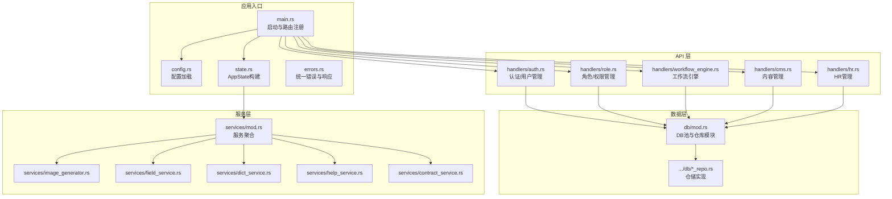
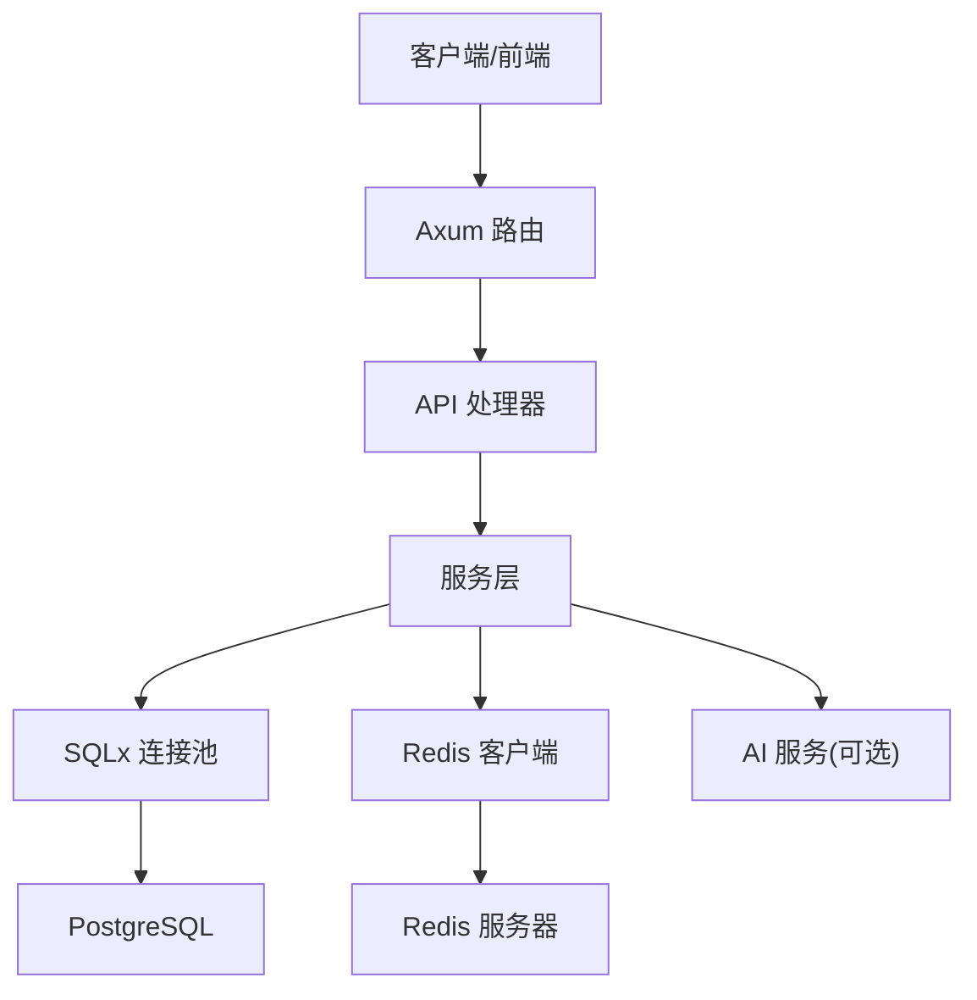
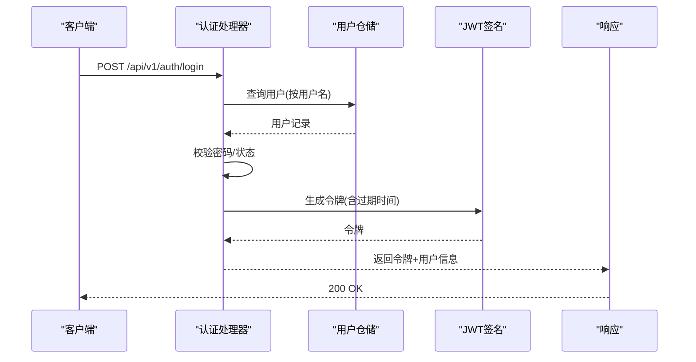
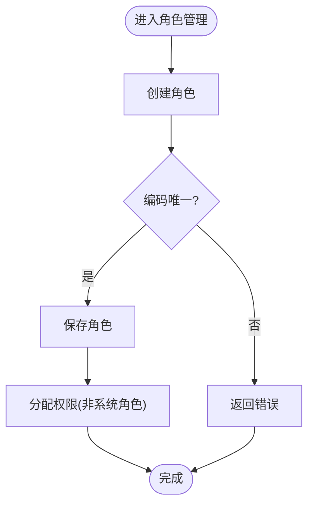
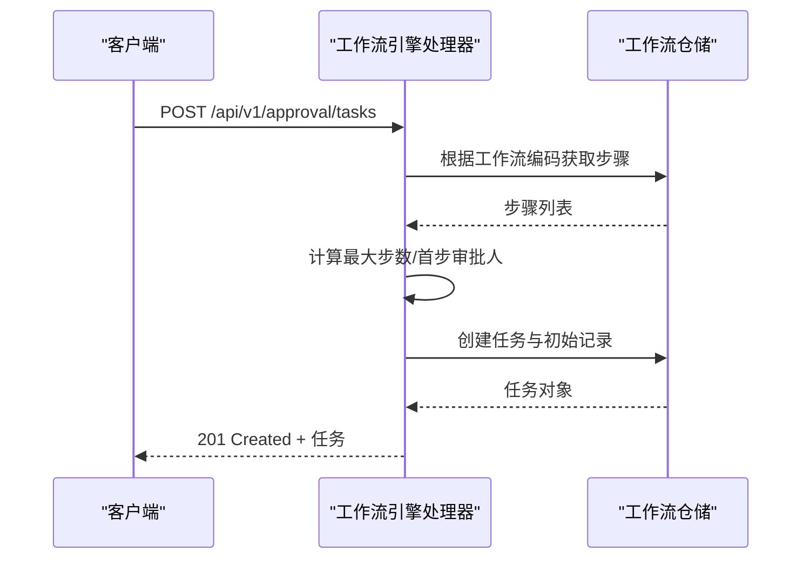
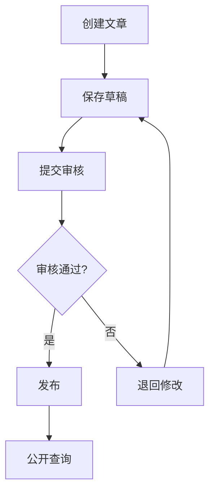
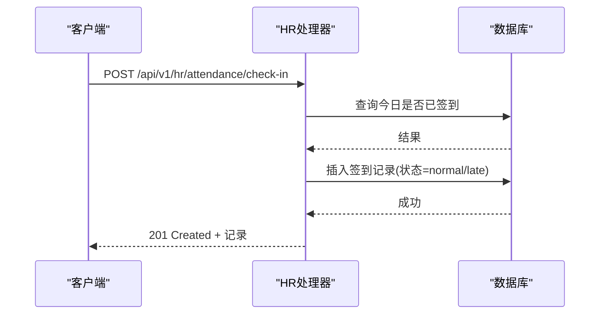
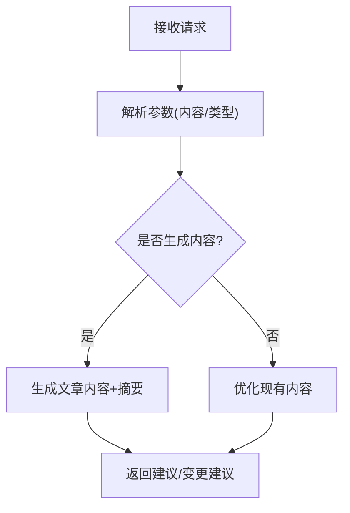
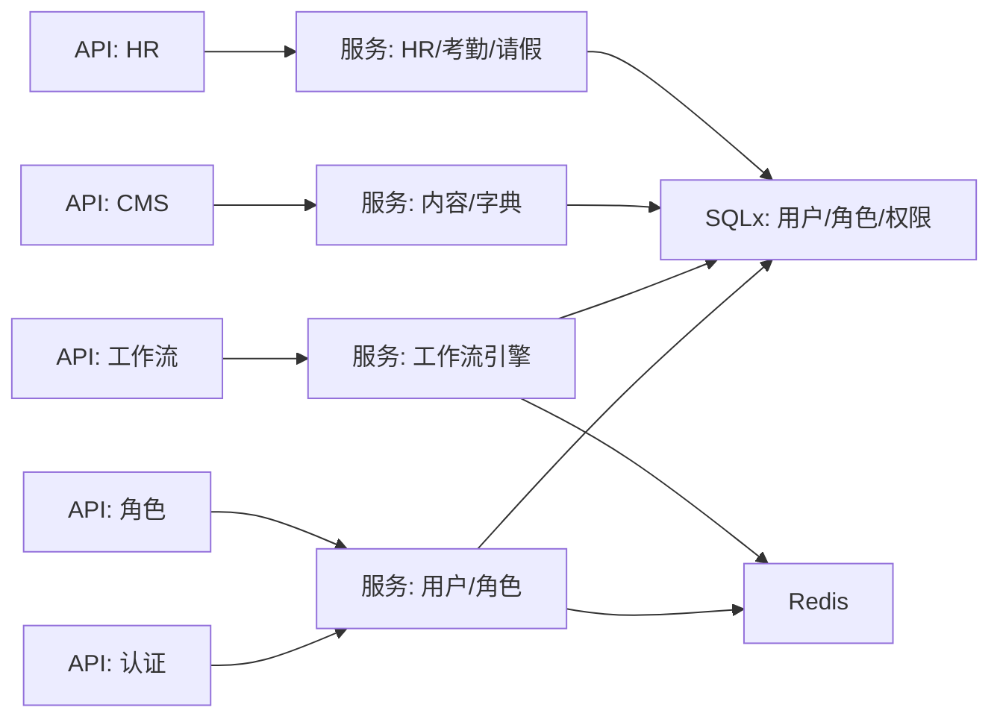

# 核心功能模块

<cite>
**本文引用的文件**
- [Cargo.toml](file://backend/core/Cargo.toml)
- [main.rs](file://backend/core/src/main.rs)
- [lib.rs](file://backend/core/src/lib.rs)
- [config.rs](file://backend/core/src/config.rs)
- [state.rs](file://backend/core/src/state.rs)
- [errors.rs](file://backend/core/src/errors.rs)
- [setup_admin.rs](file://backend/core/src/bin/setup_admin.rs)
- [auth.rs](file://backend/core/src/api/handlers/auth.rs)
- [role.rs](file://backend/core/src/api/handlers/role.rs)
- [workflow_engine.rs](file://backend/core/src/api/handlers/workflow_engine.rs)
- [cms.rs](file://backend/core/src/api/handlers/cms.rs)
- [hr.rs](file://backend/core/src/api/handlers/hr.rs)
- [mod.rs](file://backend/core/src/api/mod.rs)
- [db_mod.rs](file://backend/core/src/db/mod.rs)
- [services_mod.rs](file://backend/core/src/services/mod.rs)
</cite>

## 目录
1. [引言](#引言)
2. [项目结构](#项目结构)
3. [核心组件](#核心组件)
4. [架构总览](#架构总览)
5. [详细组件分析](#详细组件分析)
6. [依赖分析](#依赖分析)
7. [性能考虑](#性能考虑)
8. [故障排查指南](#故障排查指南)
9. [结论](#结论)
10. [附录](#附录)

## 引言
本文件面向POMP企业管理系统的核心功能模块，系统性梳理用户认证、权限管理、工作流审批、内容管理、HR管理、GIS管理、AI集成等模块的设计理念、数据模型、业务流程与API接口，阐明模块间依赖关系与协作机制，并提供扩展指南、配置选项、性能与安全建议，帮助开发者快速理解与二次开发。

## 项目结构
后端采用Rust语言与Axum框架构建，以模块化方式组织业务层（API Handlers）、数据层（DB Repositories）与服务层（Services），并通过统一的AppState注入配置、数据库连接池、Redis客户端与各类服务实例。主程序负责加载环境配置、执行数据库迁移、初始化AppState并启动HTTP服务。

图表来源
- [main.rs:1-372](file://backend/core/src/main.rs#L1-L372)
- [config.rs:1-116](file://backend/core/src/config.rs#L1-L116)
- [state.rs:1-88](file://backend/core/src/state.rs#L1-L88)
- [errors.rs:1-106](file://backend/core/src/errors.rs#L1-L106)
- [db_mod.rs:1-44](file://backend/core/src/db/mod.rs#L1-L44)
- [services_mod.rs:1-8](file://backend/core/src/services/mod.rs#L1-L8)

章节来源
- [main.rs:1-372](file://backend/core/src/main.rs#L1-L372)
- [lib.rs:1-12](file://backend/core/src/lib.rs#L1-L12)
- [Cargo.toml:1-52](file://backend/core/Cargo.toml#L1-L52)

## 核心组件
- 配置系统：集中管理数据库URL、Redis URL、JWT密钥与过期时间、AI服务相关参数（Together/HuggingFace/Ollama等）。
- 应用状态：封装配置、数据库连接池、Redis客户端与服务实例（图像生成、外勤、字典、帮助、合同等），并负责初始化默认帮助内容。
- 错误与响应：统一的AppError枚举与ApiResponse包装，标准化HTTP状态码与错误返回格式。
- 启动与路由：主程序加载配置、执行数据库迁移、构建AppState并注册全部业务路由。

章节来源
- [config.rs:1-116](file://backend/core/src/config.rs#L1-L116)
- [state.rs:1-88](file://backend/core/src/state.rs#L1-L88)
- [errors.rs:1-106](file://backend/core/src/errors.rs#L1-L106)
- [main.rs:1-372](file://backend/core/src/main.rs#L1-L372)

## 架构总览
系统采用分层架构：
- 表现层：Axum路由与处理器，负责请求解析、鉴权、调用服务层并返回JSON响应。
- 服务层：封装业务规则与跨仓库协调，如工作流引擎、外勤记录、字典、帮助、合同等。
- 数据层：SQLx连接池访问PostgreSQL，仓储模式隔离SQL细节。
- 缓存层：Redis用于会话、临时数据与可能的缓存策略。
- 外部集成：AI服务（Together、HuggingFace、Ollama）通过配置驱动。

图表来源
- [main.rs:42-270](file://backend/core/src/main.rs#L42-L270)
- [state.rs:10-26](file://backend/core/src/state.rs#L10-L26)

## 详细组件分析

### 用户认证系统
- 职责：用户登录、注册、修改密码、用户信息查询、用户生命周期管理（审批、启用/停用）。
- 关键流程：
  - 登录：校验用户名/密码，生成JWT令牌；管理员账户特殊处理；普通用户更新最近登录时间。
  - 注册：校验用户名/邮箱唯一性，生成密码哈希，创建待审批用户。
  - 修改密码：基于JWT解码获取用户ID，校验旧密码强度，更新密码哈希。
  - 用户管理：管理员审批、启用/停用、删除、批量查询。
- 数据模型：用户实体、角色与权限关联、用户状态与审计字段。
- API概览（节选）：
  - POST /api/v1/auth/login
  - POST /api/v1/auth/register
  - POST /api/v1/auth/change-password
  - GET /api/v1/users/{user_id}/info
  - GET /api/v1/auth/users
  - POST /api/v1/auth/users
  - PUT /api/v1/auth/users/{user_id}
  - DELETE /api/v1/auth/users/{user_id}
  - PATCH /api/v1/auth/users/{user_id}/status
  - POST /api/v1/auth/users/approve
  - GET /api/v1/auth/users/pending

图表来源
- [auth.rs:82-202](file://backend/core/src/api/handlers/auth.rs#L82-L202)

章节来源
- [auth.rs:1-640](file://backend/core/src/api/handlers/auth.rs#L1-L640)

### 权限管理系统
- 职责：角色管理（CRUD、激活/停用）、权限分配与回收、系统内置角色保护。
- 关键流程：
  - 创建角色：校验名称/编码唯一性，标记系统/激活状态。
  - 分配权限：校验非系统角色，批量设置角色权限。
  - 查询：支持分页、获取所有权限、按ID获取角色详情。
- 数据模型：角色、权限、角色-权限关联。
- API概览（节选）：
  - GET/POST /api/v1/roles
  - GET /api/v1/roles/active
  - GET/PUT/DELETE /api/v1/roles/{id}
  - GET /api/v1/roles/{id}/permissions
  - POST /api/v1/roles/{id}/permissions
  - GET /api/v1/permissions

图表来源
- [role.rs:104-131](file://backend/core/src/api/handlers/role.rs#L104-L131)
- [role.rs:215-238](file://backend/core/src/api/handlers/role.rs#L215-L238)

章节来源
- [role.rs:1-251](file://backend/core/src/api/handlers/role.rs#L1-L251)

### 工作流审批系统（工作流引擎）
- 职责：工作流定义与版本管理、步骤配置（审批人、超时）、任务创建与流转、模板化申请。
- 关键流程：
  - 工作流：创建/更新/删除（系统工作流不可删）、查询系统/自定义工作流。
  - 步骤：调整审批人、重置配置、调整超时。
  - 任务：创建任务（按模板或直接）、查询我的任务/我发起的任务、审批/拒绝。
  - 模板：创建/删除/应用模板，动态填充标题。
- 数据模型：工作流、步骤、任务、任务记录、模板。
- API概览（节选）：
  - GET/POST /api/v1/workflows
  - GET /api/v1/workflows/system|custom
  - GET/PUT/DELETE /api/v1/workflows/{id}
  - GET /api/v1/workflows/{id}/steps
  - POST /api/v1/workflow-steps/adjust-approver
  - POST /api/v1/workflow-steps/adjust-timeout
  - POST /api/v1/approval/tasks
  - GET /api/v1/approval/tasks
  - GET /api/v1/approval/tasks/{id}
  - POST /api/v1/approval/tasks/{id}/approve|reject
  - GET /api/v1/approval/users/{user_id}/tasks|created
  - GET/POST /api/v1/approval/templates
  - DELETE /api/v1/approval/templates/{id}
  - POST /api/v1/approval/templates/{id}/apply

图表来源
- [workflow_engine.rs:205-247](file://backend/core/src/api/handlers/workflow_engine.rs#L205-L247)

章节来源
- [workflow_engine.rs:1-474](file://backend/core/src/api/handlers/workflow_engine.rs#L1-L474)

### 内容管理系统（CMS）
- 职责：文章分类、文章增删改查、提交审核、审核流程、公开文章查询。
- 关键流程：
  - 分类：树形结构、部门绑定、排序。
  - 文章：作者ID、标题、摘要、内容、封面、状态流转（草稿/审核中/已发布）。
  - 审核：提交审核、审核通过/驳回、查看审核历史。
- 数据模型：分类、文章、审核记录。
- API概览（节选）：
  - GET/POST /api/v1/cms/categories
  - GET/POST /api/v1/cms/articles
  - GET/PUT /api/v1/cms/articles/{id}
  - POST /api/v1/cms/articles/{id}/submit-review
  - POST /api/v1/cms/articles/{id}/review
  - GET /api/v1/cms/articles/{id}/reviews
  - GET /api/v1/cms/articles/pending-review|reviewed
  - GET /api/v1/articles
  - GET /api/v1/cms/public/articles

图表来源
- [cms.rs:133-156](file://backend/core/src/api/handlers/cms.rs#L133-L156)
- [cms.rs:201-228](file://backend/core/src/api/handlers/cms.rs#L201-L228)
- [cms.rs:236-269](file://backend/core/src/api/handlers/cms.rs#L236-L269)

章节来源
- [cms.rs:1-337](file://backend/core/src/api/handlers/cms.rs#L1-L337)

### HR管理系统
- 职责：员工信息管理、考勤打卡、请假申请、与组织架构联动。
- 关键流程：
  - 员工：创建默认密码（工号@123），自动激活，支持更新与归档。
  - 考勤：当日仅允许一次签到/签退，计算工作时长、迟到/早退分钟数。
  - 请假：按天申请，状态流转（待审批/已批准/已拒绝）。
- 数据模型：用户表承载员工信息，attendance_records与leave_requests独立表存储考勤与请假。
- API概览（节选）：
  - GET/POST /api/v1/hr/employees
  - GET/PUT/DELETE /api/v1/hr/employees/{id}
  - POST /api/v1/hr/attendance/check-in|check-out
  - GET /api/v1/hr/attendance/records|today|statistics|month
  - POST/GET /api/v1/hr/leave

图表来源
- [hr.rs:442-528](file://backend/core/src/api/handlers/hr.rs#L442-L528)

章节来源
- [hr.rs:1-800](file://backend/core/src/api/handlers/hr.rs#L1-L800)

### GIS管理系统
- 职责：客户、项目、仓库、人员位置信息管理与定位更新。
- 关键流程：增删改查、定位更新、与地图前端组件配合。
- 数据模型：客户、项目、仓库、人员实体。
- API概览（节选）：
  - GET/POST /api/v1/gis/customers|projects|warehouses|personnel
  - GET/PUT/DELETE /api/v1/gis/{entity}/{id}
  - PUT /api/v1/gis/personnel/{id}/location

章节来源
- [main.rs:248-269](file://backend/core/src/main.rs#L248-L269)

### AI集成系统
- 职责：图像生成、文档AI优化、审批意见AI、会议纪要AI。
- 关键流程：
  - 图像生成：通过配置的AI服务URL与模型参数生成图片。
  - 文档优化：根据输入内容生成结构化建议与摘要。
  - 审批意见：生成/优化审批评论。
  - 会议纪要：生成/优化会议纪要。
- 数据模型：图像生成参数、文档内容、AI生成结果。
- API概览（节选）：
  - POST /api/v1/ai/generate-image
  - GET /api/v1/ai/status
  - POST /api/v1/document-ai/optimize
  - POST /api/v1/approval-comment/generate|optimize
  - POST /api/v1/meeting-minutes/generate|optimize

图表来源
- [main.rs:286-371](file://backend/core/src/main.rs#L286-L371)

章节来源
- [main.rs:69-72](file://backend/core/src/main.rs#L69-L72)
- [main.rs:286-371](file://backend/core/src/main.rs#L286-L371)

## 依赖分析
- 组件耦合：
  - API处理器依赖AppState中的服务实例与数据库连接池。
  - 服务层依赖仓储层进行数据访问，避免直接耦合SQLx。
  - AppState统一构建服务实例，减少全局状态分散。
- 外部依赖：
  - 数据库：PostgreSQL（SQLx）。
  - 缓存：Redis。
  - 认证：JWT。
  - AI：可选外部服务（Together、HuggingFace、Ollama）。
- 可能的循环依赖：当前结构清晰，API层不直接依赖服务层实现，服务层也不反向依赖API层。

图表来源
- [state.rs:58-86](file://backend/core/src/state.rs#L58-L86)
- [db_mod.rs:25-44](file://backend/core/src/db/mod.rs#L25-L44)

章节来源
- [state.rs:1-88](file://backend/core/src/state.rs#L1-L88)
- [db_mod.rs:1-44](file://backend/core/src/db/mod.rs#L1-L44)

## 性能考虑
- 数据库连接池：最大连接数配置为50，建议根据并发与数据库性能压测结果调整。
- 查询分页：角色与用户列表均支持分页参数，避免一次性返回大量数据。
- 缓存策略：Redis可用于会话、限流、热点数据缓存，需结合业务场景设计TTL与失效策略。
- IO密集：AI生成与外部服务调用应设置超时与熔断，避免阻塞请求线程。
- 日志与追踪：统一使用tracing，便于性能分析与问题定位。

## 故障排查指南
- 常见错误类型与映射：
  - 数据库错误：映射为500。
  - Redis错误：映射为500。
  - 外部服务错误：映射为502。
  - 认证/授权错误：映射为401/403。
  - 参数/未找到/内部错误：映射为400/404/500。
- 统一响应格式：success/data/error字段，便于前端一致处理。
- 建议排查步骤：
  - 检查数据库连接字符串与网络连通性。
  - 核对JWT密钥与过期时间配置。
  - 查看服务日志，定位具体错误来源。
  - 对AI相关接口，确认外部服务可用性与凭据。

章节来源
- [errors.rs:54-78](file://backend/core/src/errors.rs#L54-L78)
- [errors.rs:82-106](file://backend/core/src/errors.rs#L82-L106)

## 结论
POMP系统通过清晰的分层架构与模块化设计，实现了从认证授权到业务审批、内容管理、HR与GIS等多领域的统一支撑。借助AppState集中管理配置与服务、统一的错误与响应体系，系统具备良好的可维护性与扩展性。建议在生产环境中进一步完善缓存策略、监控告警与AI服务的降级方案。

## 附录

### 模块扩展指南
- 新增业务模块步骤：
  - 在db目录新增仓储模块与SQL迁移。
  - 在services目录新增服务实现。
  - 在api/handlers新增处理器与路由。
  - 在AppState中注册服务实例。
  - 在main.rs中注册路由。
- 自定义开发建议：
  - 优先使用仓储模式隔离SQL。
  - 所有对外接口统一返回ApiResponse。
  - 对敏感操作增加鉴权与审计。
  - 对外服务调用增加超时与重试策略。

### 配置选项
- 数据库与缓存：database_url、redis_url。
- 安全：jwt_secret、jwt_expire_hours。
- AI集成：together_api_key、together_api_url、huggingface_api_key、huggingface_api_url、ollama_api_url、ollama_model、ai_image_model、ai_image_size、ai_image_quality。
- 示例路径：[config.rs:1-116](file://backend/core/src/config.rs#L1-L116)

### 初始化与管理员账户
- 后台脚本用于创建管理员账户，便于首次部署快速上线。
- 示例路径：[setup_admin.rs:1-48](file://backend/core/src/bin/setup_admin.rs#L1-L48)