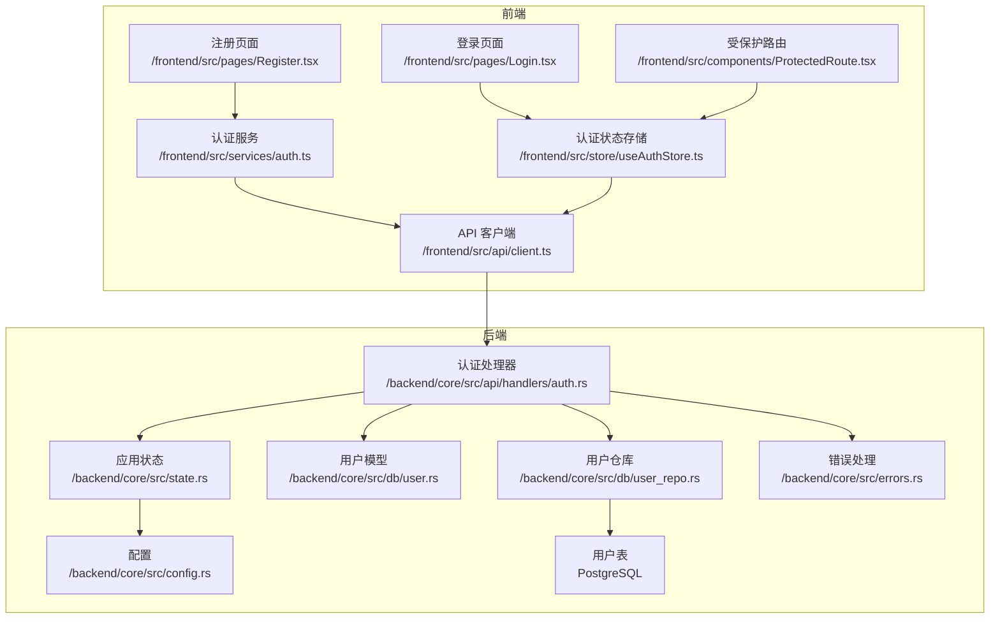
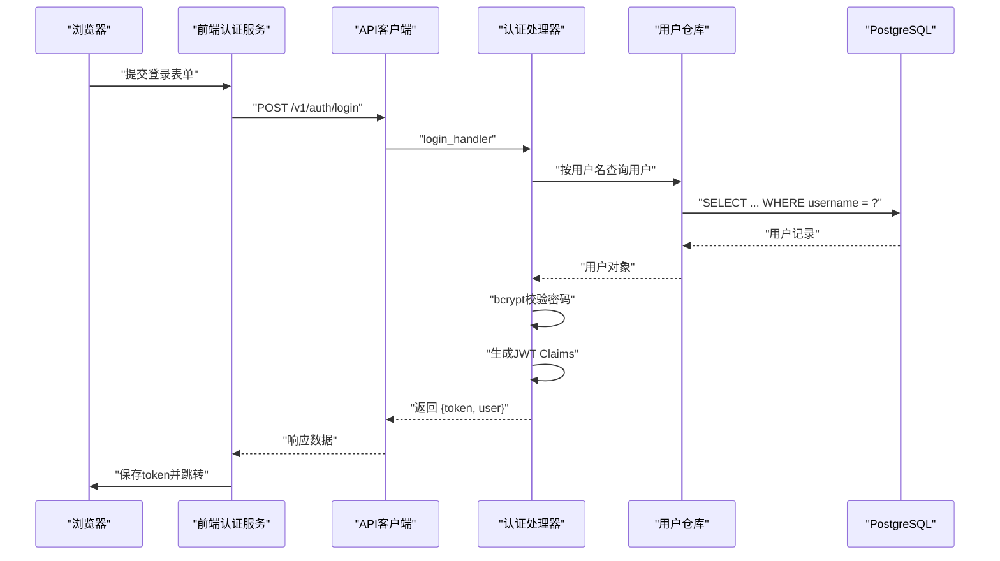
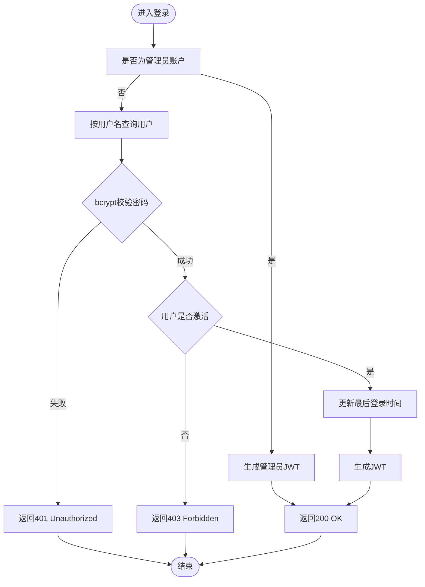
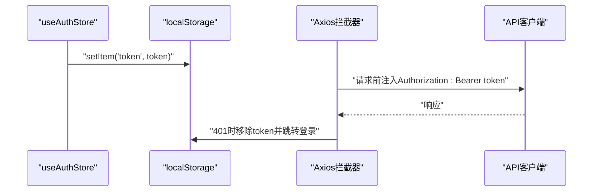
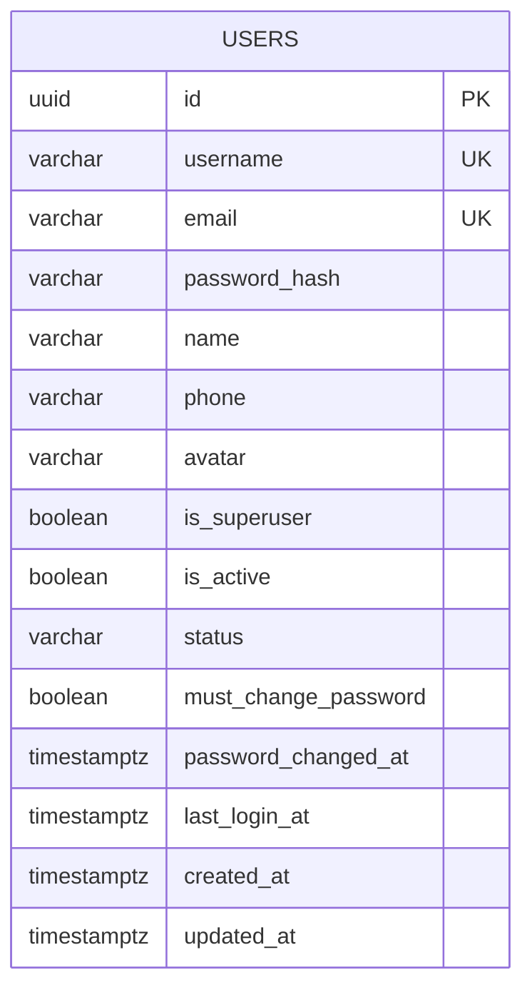
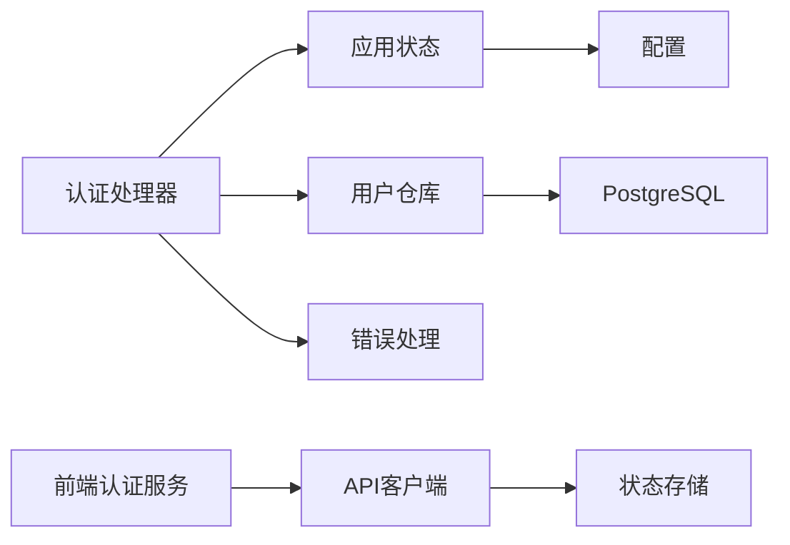

# 用户认证系统

<cite>
**本文档引用的文件**
- [backend/core/src/api/handlers/auth.rs](file://backend/core/src/api/handlers/auth.rs)
- [backend/core/src/db/user.rs](file://backend/core/src/db/user.rs)
- [backend/core/src/db/user_repo.rs](file://backend/core/src/db/user_repo.rs)
- [backend/core/src/state.rs](file://backend/core/src/state.rs)
- [backend/core/src/config.rs](file://backend/core/src/config.rs)
- [backend/core/src/errors.rs](file://backend/core/src/errors.rs)
- [backend/core/sqlx/migrations/00000000000000_create_users_table.up.sql](file://backend/core/sqlx/migrations/00000000000000_create_users_table.up.sql)
- [backend/core/sqlx/migrations/029_add_password_security_fields.up.sql](file://backend/core/sqlx/migrations/029_add_password_security_fields.up.sql)
- [frontend/src/services/auth.ts](file://frontend/src/services/auth.ts)
- [frontend/src/store/useAuthStore.ts](file://frontend/src/store/useAuthStore.ts)
- [frontend/src/api/client.ts](file://frontend/src/api/client.ts)
- [frontend/src/pages/Login.tsx](file://frontend/src/pages/Login.tsx)
- [frontend/src/pages/Register.tsx](file://frontend/src/pages/Register.tsx)
- [frontend/src/components/ProtectedRoute.tsx](file://frontend/src/components/ProtectedRoute.tsx)
</cite>

## 目录
1. [简介](#简介)
2. [项目结构](#项目结构)
3. [核心组件](#核心组件)
4. [架构总览](#架构总览)
5. [详细组件分析](#详细组件分析)
6. [依赖关系分析](#依赖关系分析)
7. [性能考虑](#性能考虑)
8. [故障排除指南](#故障排除指南)
9. [结论](#结论)
10. [附录：API接口文档与使用示例](#附录api接口文档与使用示例)

## 简介
本文件面向POMP系统的用户认证子系统，围绕JWT令牌认证、密码加密策略、会话管理、用户注册与登录流程进行深入说明。内容涵盖认证处理器实现细节、前端认证服务工作原理、用户数据模型与验证规则、认证中间件配置、安全最佳实践、错误处理机制，并提供完整的API接口文档与使用示例，帮助开发者理解与扩展认证功能。

## 项目结构
认证系统由后端Rust服务与前端TypeScript/React两部分组成，采用Axum框架提供REST API，PostgreSQL存储用户数据，Redis作为缓存（在应用状态中定义但未在认证流程中直接使用），前端通过Axios统一发起请求并在拦截器中注入认证头。

**图表来源**
- [frontend/src/api/client.ts:1-41](file://frontend/src/api/client.ts#L1-L41)
- [frontend/src/services/auth.ts:1-133](file://frontend/src/services/auth.ts#L1-L133)
- [frontend/src/store/useAuthStore.ts:1-148](file://frontend/src/store/useAuthStore.ts#L1-L148)
- [frontend/src/pages/Login.tsx:1-115](file://frontend/src/pages/Login.tsx#L1-L115)
- [frontend/src/pages/Register.tsx:1-183](file://frontend/src/pages/Register.tsx#L1-L183)
- [frontend/src/components/ProtectedRoute.tsx:1-29](file://frontend/src/components/ProtectedRoute.tsx#L1-L29)
- [backend/core/src/api/handlers/auth.rs:1-640](file://backend/core/src/api/handlers/auth.rs#L1-L640)
- [backend/core/src/db/user_repo.rs:1-541](file://backend/core/src/db/user_repo.rs#L1-L541)
- [backend/core/src/db/user.rs:1-55](file://backend/core/src/db/user.rs#L1-L55)
- [backend/core/src/state.rs:1-88](file://backend/core/src/state.rs#L1-L88)
- [backend/core/src/config.rs:1-116](file://backend/core/src/config.rs#L1-L116)
- [backend/core/src/errors.rs:1-106](file://backend/core/src/errors.rs#L1-L106)

**章节来源**
- [backend/core/src/api/handlers/auth.rs:1-640](file://backend/core/src/api/handlers/auth.rs#L1-L640)
- [backend/core/src/db/user_repo.rs:1-541](file://backend/core/src/db/user_repo.rs#L1-L541)
- [backend/core/src/db/user.rs:1-55](file://backend/core/src/db/user.rs#L1-L55)
- [backend/core/src/state.rs:1-88](file://backend/core/src/state.rs#L1-L88)
- [backend/core/src/config.rs:1-116](file://backend/core/src/config.rs#L1-L116)
- [backend/core/src/errors.rs:1-106](file://backend/core/src/errors.rs#L1-L106)
- [frontend/src/services/auth.ts:1-133](file://frontend/src/services/auth.ts#L1-L133)
- [frontend/src/store/useAuthStore.ts:1-148](file://frontend/src/store/useAuthStore.ts#L1-L148)
- [frontend/src/api/client.ts:1-41](file://frontend/src/api/client.ts#L1-L41)
- [frontend/src/pages/Login.tsx:1-115](file://frontend/src/pages/Login.tsx#L1-L115)
- [frontend/src/pages/Register.tsx:1-183](file://frontend/src/pages/Register.tsx#L1-L183)
- [frontend/src/components/ProtectedRoute.tsx:1-29](file://frontend/src/components/ProtectedRoute.tsx#L1-L29)

## 核心组件
- 认证处理器：负责登录、注册、修改密码、用户信息查询与管理等接口逻辑，使用JWT进行身份签发与校验。
- 用户仓库：封装数据库访问，提供用户增删改查、唯一性校验、状态变更等操作。
- 用户模型：定义用户实体及创建/更新参数的数据结构。
- 应用状态与配置：集中管理JWT密钥、过期时间、数据库连接池等全局配置。
- 前端认证服务：封装API调用、本地存储令牌、请求拦截器自动注入Authorization头。
- 错误处理：统一返回格式与HTTP状态码映射，便于前后端一致性处理。

**章节来源**
- [backend/core/src/api/handlers/auth.rs:82-202](file://backend/core/src/api/handlers/auth.rs#L82-L202)
- [backend/core/src/db/user_repo.rs:48-86](file://backend/core/src/db/user_repo.rs#L48-L86)
- [backend/core/src/db/user.rs:5-55](file://backend/core/src/db/user.rs#L5-L55)
- [backend/core/src/state.rs:10-26](file://backend/core/src/state.rs#L10-L26)
- [backend/core/src/config.rs:3-46](file://backend/core/src/config.rs#L3-L46)
- [frontend/src/services/auth.ts:72-132](file://frontend/src/services/auth.ts#L72-L132)
- [frontend/src/api/client.ts:11-38](file://frontend/src/api/client.ts#L11-L38)
- [backend/core/src/errors.rs:54-78](file://backend/core/src/errors.rs#L54-L78)

## 架构总览
认证系统采用前后端分离架构，前端通过Axios客户端统一发起请求，后端Axum路由分发到认证处理器，处理器读取配置与数据库连接池，调用仓库层执行业务操作，最终返回统一格式的响应。

**图表来源**
- [frontend/src/services/auth.ts:72-75](file://frontend/src/services/auth.ts#L72-L75)
- [frontend/src/api/client.ts:11-20](file://frontend/src/api/client.ts#L11-L20)
- [backend/core/src/api/handlers/auth.rs:82-202](file://backend/core/src/api/handlers/auth.rs#L82-L202)
- [backend/core/src/db/user_repo.rs:117-141](file://backend/core/src/db/user_repo.rs#L117-L141)

## 详细组件分析

### 认证处理器（JWT与密码策略）
- 登录流程
  - 特殊管理员账户校验（硬编码判断），通过则直接签发JWT。
  - 普通用户：按用户名查询用户，bcrypt校验密码；若用户未激活返回禁止访问；成功后生成JWT并更新最后登录时间。
  - JWT载荷包含sub（用户名）、user_id（UUID）、is_superuser、iat/exp等。
- 修改密码
  - 从Authorization头解析Bearer Token，解码JWT获取用户标识。
  - 校验旧密码，验证新密码长度（至少6位），bcrypt加密后写回数据库。
- 注册
  - 校验用户名与邮箱唯一性，bcrypt加密密码后插入用户表，初始状态为“pending”，等待审批。
- 用户信息查询
  - 从请求头解析JWT，校验用户ID与路径参数一致后返回用户信息。

**图表来源**
- [backend/core/src/api/handlers/auth.rs:82-202](file://backend/core/src/api/handlers/auth.rs#L82-L202)
- [backend/core/src/db/user_repo.rs:117-141](file://backend/core/src/db/user_repo.rs#L117-L141)

**章节来源**
- [backend/core/src/api/handlers/auth.rs:82-202](file://backend/core/src/api/handlers/auth.rs#L82-L202)
- [backend/core/src/api/handlers/auth.rs:210-295](file://backend/core/src/api/handlers/auth.rs#L210-L295)
- [backend/core/src/api/handlers/auth.rs:297-333](file://backend/core/src/api/handlers/auth.rs#L297-L333)
- [backend/core/src/api/handlers/auth.rs:335-370](file://backend/core/src/api/handlers/auth.rs#L335-L370)

### 密码加密策略
- 使用bcrypt对密码进行哈希存储，默认成本参数。
- 新密码强度要求：长度至少6位。
- 密码修改流程中先验证旧密码，再加密新密码入库。

**章节来源**
- [backend/core/src/api/handlers/auth.rs:7-12](file://backend/core/src/api/handlers/auth.rs#L7-L12)
- [backend/core/src/api/handlers/auth.rs:259-269](file://backend/core/src/api/handlers/auth.rs#L259-L269)

### 会话管理
- 无服务端会话：采用JWT无状态令牌，前端本地存储token。
- 请求拦截器：自动在Authorization头添加Bearer token。
- 响应拦截器：401时清理本地token并跳转登录页（避免循环跳转）。
- 前端状态：使用Zustand存储用户信息、认证状态与token，支持初始化加载与登出清理。

**图表来源**
- [frontend/src/store/useAuthStore.ts:63-89](file://frontend/src/store/useAuthStore.ts#L63-L89)
- [frontend/src/api/client.ts:11-38](file://frontend/src/api/client.ts#L11-L38)

**章节来源**
- [frontend/src/store/useAuthStore.ts:17-32](file://frontend/src/store/useAuthStore.ts#L17-L32)
- [frontend/src/store/useAuthStore.ts:63-89](file://frontend/src/store/useAuthStore.ts#L63-L89)
- [frontend/src/api/client.ts:11-38](file://frontend/src/api/client.ts#L11-L38)

### 用户数据模型与验证规则
- 用户模型字段：id、username、email、password_hash、name、phone、avatar、is_superuser、is_active、status、must_change_password、password_changed_at、last_login_at、created_at、updated_at。
- 创建/更新参数：CreateUser、UpdateUser、RegisterUser。
- 数据库约束：username与email唯一，状态枚举包括pending/approved/rejected/archived。
- 验证规则：注册时用户名与邮箱唯一性检查；密码长度至少6位；用户需被审批激活后方可登录。

**图表来源**
- [backend/core/sqlx/migrations/00000000000000_create_users_table.up.sql:4-18](file://backend/core/sqlx/migrations/00000000000000_create_users_table.up.sql#L4-L18)
- [backend/core/sqlx/migrations/029_add_password_security_fields.up.sql:1-16](file://backend/core/sqlx/migrations/029_add_password_security_fields.up.sql#L1-L16)
- [backend/core/src/db/user.rs:5-22](file://backend/core/src/db/user.rs#L5-L22)

**章节来源**
- [backend/core/src/db/user.rs:5-55](file://backend/core/src/db/user.rs#L5-L55)
- [backend/core/src/db/user_repo.rs:48-86](file://backend/core/src/db/user_repo.rs#L48-L86)
- [backend/core/sqlx/migrations/00000000000000_create_users_table.up.sql:4-26](file://backend/core/sqlx/migrations/00000000000000_create_users_table.up.sql#L4-L26)
- [backend/core/sqlx/migrations/029_add_password_security_fields.up.sql:1-16](file://backend/core/sqlx/migrations/029_add_password_security_fields.up.sql#L1-L16)

### 认证中间件与安全配置
- JWT配置：密钥与过期时间来自配置文件，处理器中用于签名与验证。
- 中间件：Axios请求拦截器自动注入Authorization头；响应拦截器处理401并重定向。
- 路由保护：受保护路由组件根据认证状态与管理员权限进行跳转控制。

**章节来源**
- [backend/core/src/config.rs:3-46](file://backend/core/src/config.rs#L3-L46)
- [backend/core/src/state.rs:10-26](file://backend/core/src/state.rs#L10-L26)
- [frontend/src/api/client.ts:11-38](file://frontend/src/api/client.ts#L11-L38)
- [frontend/src/components/ProtectedRoute.tsx:9-27](file://frontend/src/components/ProtectedRoute.tsx#L9-L27)

## 依赖关系分析
- 认证处理器依赖应用状态中的配置（jwt_secret、jwt_expire_hours）与数据库连接池。
- 用户仓库依赖SQLx进行数据库操作，提供用户CRUD与唯一性校验。
- 前端认证服务依赖API客户端，API客户端依赖Axios与本地存储。
- 错误处理模块提供统一的错误类型与HTTP状态码映射。

**图表来源**
- [backend/core/src/api/handlers/auth.rs:14-18](file://backend/core/src/api/handlers/auth.rs#L14-L18)
- [backend/core/src/state.rs:10-26](file://backend/core/src/state.rs#L10-L26)
- [backend/core/src/config.rs:3-46](file://backend/core/src/config.rs#L3-L46)
- [backend/core/src/db/user_repo.rs:1-6](file://backend/core/src/db/user_repo.rs#L1-L6)
- [frontend/src/services/auth.ts:1-1](file://frontend/src/services/auth.ts#L1-L1)
- [frontend/src/api/client.ts:1-1](file://frontend/src/api/client.ts#L1-L1)
- [backend/core/src/errors.rs:54-78](file://backend/core/src/errors.rs#L54-L78)

**章节来源**
- [backend/core/src/api/handlers/auth.rs:14-18](file://backend/core/src/api/handlers/auth.rs#L14-L18)
- [backend/core/src/db/user_repo.rs:1-6](file://backend/core/src/db/user_repo.rs#L1-L6)
- [frontend/src/services/auth.ts:1-1](file://frontend/src/services/auth.ts#L1-L1)
- [frontend/src/api/client.ts:1-1](file://frontend/src/api/client.ts#L1-L1)
- [backend/core/src/errors.rs:54-78](file://backend/core/src/errors.rs#L54-L78)

## 性能考虑
- JWT无状态设计降低服务端会话开销，适合水平扩展。
- bcrypt成本参数影响CPU与内存消耗，建议在生产环境评估并调整。
- 数据库索引覆盖常用查询（username、email、is_active、status、时间戳），有助于提升查询性能。
- 前端仅在必要时拉取用户信息，避免重复请求。

[本节为通用指导，无需特定文件引用]

## 故障排除指南
- 401未授权
  - 检查前端是否正确注入Authorization头。
  - 确认JWT密钥与过期时间配置一致。
  - 响应拦截器会在401时清理token并跳转登录页。
- 403禁止访问
  - 用户未激活或审批未通过。
- 密码错误
  - 确认旧密码校验与新密码长度规则。
- 数据库错误
  - 统一由错误处理模块转换为标准响应格式。

**章节来源**
- [frontend/src/api/client.ts:22-38](file://frontend/src/api/client.ts#L22-L38)
- [backend/core/src/api/handlers/auth.rs:138-141](file://backend/core/src/api/handlers/auth.rs#L138-L141)
- [backend/core/src/api/handlers/auth.rs:254-256](file://backend/core/src/api/handlers/auth.rs#L254-L256)
- [backend/core/src/errors.rs:54-78](file://backend/core/src/errors.rs#L54-L78)

## 结论
POMP认证系统以JWT为核心，结合bcrypt密码哈希与严格的前端拦截器机制，实现了无状态、可扩展且易维护的认证方案。通过清晰的模块划分与统一的错误处理，系统具备良好的可演进性与安全性。建议在生产环境中强化密钥管理、引入速率限制与审计日志，并持续优化密码策略与数据库索引。

[本节为总结性内容，无需特定文件引用]

## 附录：API接口文档与使用示例

### 接口概览
- 登录
  - 方法：POST
  - 路径：/v1/auth/login
  - 请求体：包含username与password
  - 成功响应：返回token与用户信息
- 注册
  - 方法：POST
  - 路径：/v1/auth/register
  - 请求体：包含username、password、可选email、name
  - 成功响应：返回用户信息与提示消息
- 修改密码
  - 方法：POST
  - 路径：/v1/auth/change-password
  - 请求体：包含old_password与new_password
  - 成功响应：返回成功消息
- 获取用户信息
  - 方法：GET
  - 路径：/v1/users/{id}/info
  - 成功响应：返回用户信息
- 获取用户列表
  - 方法：GET
  - 路径：/v1/auth/users?page=&pageSize=
  - 成功响应：返回分页数据
- 获取所有用户
  - 方法：GET
  - 路径：/v1/users/all
  - 成功响应：返回用户数组
- 获取待审批用户
  - 方法：GET
  - 路径：/v1/auth/users/pending
  - 成功响应：返回用户数组
- 创建用户
  - 方法：POST
  - 路径：/v1/auth/users
  - 成功响应：返回创建的用户
- 审批用户
  - 方法：POST
  - 路径：/v1/auth/users/approve
  - 成功响应：返回用户与消息
- 更新用户
  - 方法：PUT
  - 路径：/v1/auth/users/{id}
  - 成功响应：返回更新后的用户
- 删除用户
  - 方法：DELETE
  - 路径：/v1/auth/users/{id}
  - 成功响应：返回成功消息
- 更新用户状态
  - 方法：PATCH
  - 路径：/v1/auth/users/{id}/status
  - 成功响应：返回更新后的用户

**章节来源**
- [frontend/src/services/auth.ts:72-132](file://frontend/src/services/auth.ts#L72-L132)
- [backend/core/src/api/handlers/auth.rs:404-441](file://backend/core/src/api/handlers/auth.rs#L404-L441)
- [backend/core/src/api/handlers/auth.rs:443-457](file://backend/core/src/api/handlers/auth.rs#L443-L457)
- [backend/core/src/api/handlers/auth.rs:459-473](file://backend/core/src/api/handlers/auth.rs#L459-L473)
- [backend/core/src/api/handlers/auth.rs:475-512](file://backend/core/src/api/handlers/auth.rs#L475-L512)
- [backend/core/src/api/handlers/auth.rs:514-544](file://backend/core/src/api/handlers/auth.rs#L514-L544)
- [backend/core/src/api/handlers/auth.rs:546-584](file://backend/core/src/api/handlers/auth.rs#L546-L584)
- [backend/core/src/api/handlers/auth.rs:586-604](file://backend/core/src/api/handlers/auth.rs#L586-L604)
- [backend/core/src/api/handlers/auth.rs:606-639](file://backend/core/src/api/handlers/auth.rs#L606-L639)

### 使用示例
- 登录
  - 前端：调用登录函数，接收token与用户信息，保存至本地存储。
  - 后端：校验密码，签发JWT，返回结果。
- 注册
  - 前端：提交注册表单，等待管理员审批。
  - 后端：校验唯一性，bcrypt加密，插入pending状态用户。
- 修改密码
  - 前端：携带旧密码与新密码，提交修改请求。
  - 后端：解码JWT获取用户ID，校验旧密码，更新新密码与标志位。

**章节来源**
- [frontend/src/pages/Login.tsx:21-46](file://frontend/src/pages/Login.tsx#L21-L46)
- [frontend/src/pages/Register.tsx:22-56](file://frontend/src/pages/Register.tsx#L22-L56)
- [frontend/src/services/auth.ts:72-75](file://frontend/src/services/auth.ts#L72-L75)
- [backend/core/src/api/handlers/auth.rs:210-295](file://backend/core/src/api/handlers/auth.rs#L210-L295)