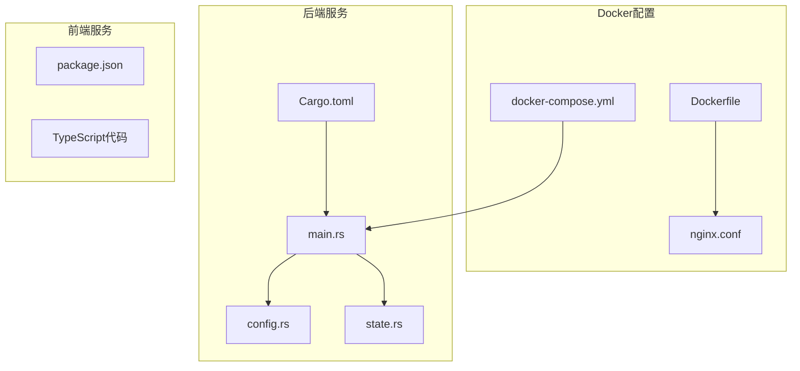
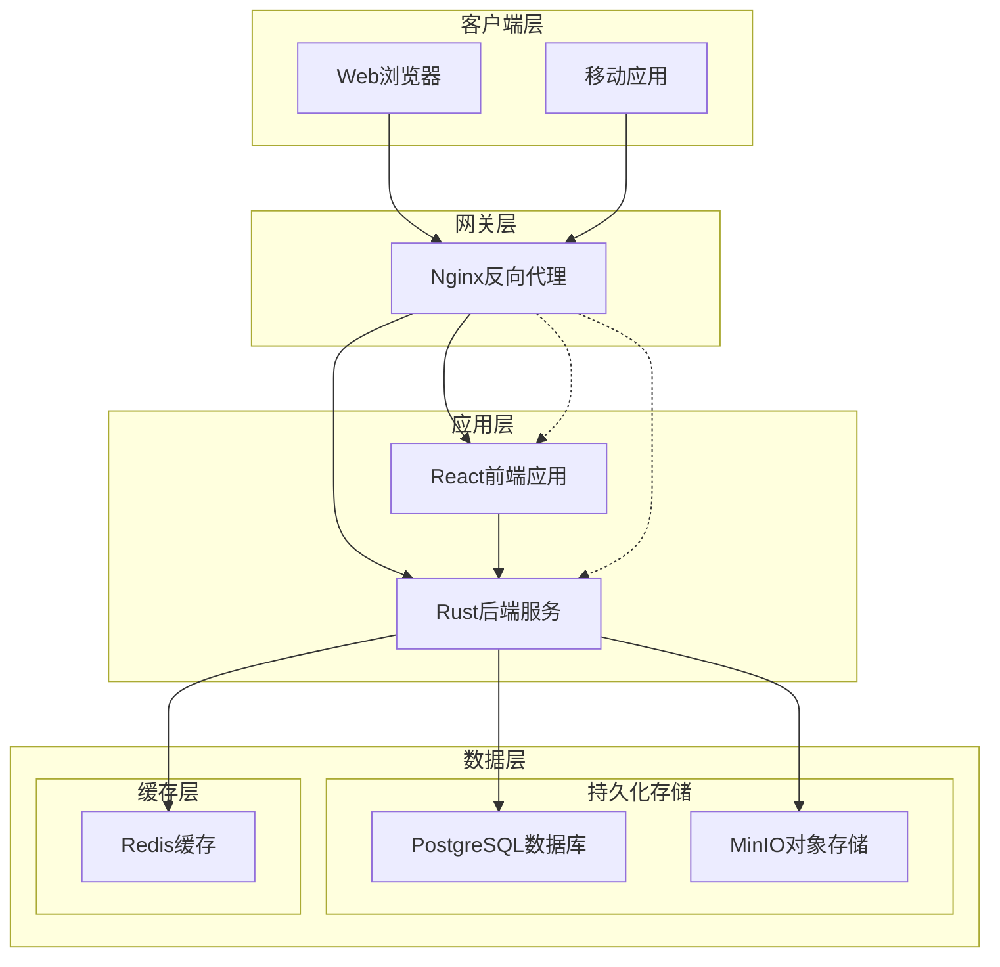
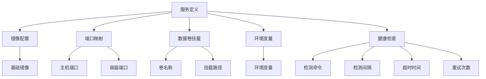
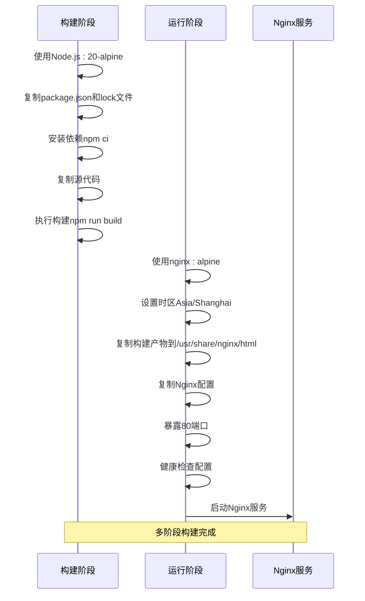
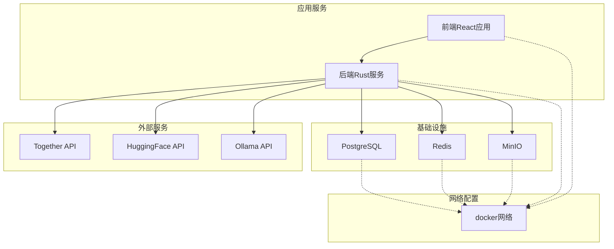

# Docker容器化部署

<cite>
**本文引用的文件**
- [docker-compose.yml](file://docker/docker-compose.yml)
- [Dockerfile](file://frontend/Dockerfile)
- [nginx.conf](file://frontend/nginx.conf)
- [main.rs](file://backend/core/src/main.rs)
- [config.rs](file://backend/core/src/config.rs)
- [state.rs](file://backend/core/src/state.rs)
- [Cargo.toml](file://backend/core/Cargo.toml)
- [ci.yml](file://.github/workflows/ci.yml)
</cite>

## 目录
1. [简介](#简介)
2. [项目结构](#项目结构)
3. [核心组件](#核心组件)
4. [架构概览](#架构概览)
5. [详细组件分析](#详细组件分析)
6. [依赖关系分析](#依赖关系分析)
7. [性能考虑](#性能考虑)
8. [故障排除指南](#故障排除指南)
9. [结论](#结论)
10. [附录](#附录)

## 简介

POMP系统是一个基于Rust后端和React前端的企业管理系统。本文档提供了完整的Docker容器化部署指南，包括基础设施服务（PostgreSQL数据库、Redis缓存、MinIO对象存储）和应用服务（后端Rust服务、前端React应用）的容器化配置。

该系统采用现代化的微服务架构，通过Docker Compose进行编排，实现了高可用性和可扩展性的容器化部署。

## 项目结构

POMP项目的Docker相关文件分布如下：



**图表来源**
- [docker-compose.yml:1-50](file://docker/docker-compose.yml#L1-L50)
- [Dockerfile:1-41](file://frontend/Dockerfile#L1-L41)
- [main.rs:1-372](file://backend/core/src/main.rs#L1-L372)

**章节来源**
- [docker-compose.yml:1-50](file://docker/docker-compose.yml#L1-L50)
- [Dockerfile:1-41](file://frontend/Dockerfile#L1-L41)

## 核心组件

### 基础设施服务

#### PostgreSQL数据库服务
- **镜像**: postgres:16-alpine
- **端口映射**: 5432:5432
- **数据卷**: postgres_data
- **环境变量**: 用户名、密码、数据库名
- **健康检查**: 每10秒检查一次数据库连接

#### Redis缓存服务
- **镜像**: redis:7-alpine
- **端口映射**: 6379:6379
- **数据卷**: redis_data
- **健康检查**: 每10秒执行ping命令

#### MinIO对象存储服务
- **镜像**: minio/minio:latest
- **端口映射**: 9000:9000, 9001:9001
- **数据卷**: minio_data
- **环境变量**: root用户和密码

### 应用服务

#### 后端Rust服务
- **监听端口**: 8000
- **健康检查端点**: /health
- **数据库连接**: PostgreSQL
- **缓存连接**: Redis

#### 前端React应用
- **镜像**: 多阶段构建（Node.js + Nginx）
- **端口**: 80
- **静态资源**: dist目录
- **API代理**: 到后端服务的代理配置

**章节来源**
- [docker-compose.yml:4-45](file://docker/docker-compose.yml#L4-L45)
- [main.rs:39-41](file://backend/core/src/main.rs#L39-L41)

## 架构概览

POMP系统的容器化架构采用分层设计，实现了服务间的松耦合和高内聚：



**图表来源**
- [docker-compose.yml:3-45](file://docker/docker-compose.yml#L3-L45)
- [nginx.conf:24-31](file://frontend/nginx.conf#L24-L31)
- [main.rs:42-270](file://backend/core/src/main.rs#L42-L270)

## 详细组件分析

### Docker Compose配置详解

#### 服务定义结构
每个服务都遵循统一的配置模式：



**图表来源**
- [docker-compose.yml:4-45](file://docker/docker-compose.yml#L4-L45)

#### PostgreSQL服务配置
- **镜像选择**: postgres:16-alpine（轻量级Alpine Linux）
- **环境配置**: 包含用户名、密码、数据库名
- **数据持久化**: 使用命名卷postgres_data
- **网络访问**: 仅映射到本地主机端口5432

#### Redis服务配置
- **镜像选择**: redis:7-alpine
- **数据持久化**: 使用命名卷redis_data
- **健康检查**: 使用redis-cli ping命令

#### MinIO服务配置
- **镜像选择**: minio/minio:latest
- **命令参数**: 启动服务器并启用Web控制台
- **端口配置**: 9000（API端口）、9001（控制台端口）
- **认证配置**: root用户凭据

**章节来源**
- [docker-compose.yml:4-45](file://docker/docker-compose.yml#L4-L45)

### 前端Docker镜像构建

前端应用采用多阶段Dockerfile构建策略：



**图表来源**
- [Dockerfile:1-41](file://frontend/Dockerfile#L1-L41)

#### 构建阶段特性
- **基础镜像**: node:20-alpine（Alpine Linux上的Node.js 20）
- **依赖安装**: 使用npm ci确保确定性安装
- **构建优化**: 只复制必要的文件进行构建

#### 运行阶段特性
- **基础镜像**: nginx:alpine（生产环境Nginx）
- **时区配置**: 设置为Asia/Shanghai
- **静态资源**: 将构建产物复制到Nginx默认目录
- **健康检查**: 使用wget进行HTTP健康检查

**章节来源**
- [Dockerfile:1-41](file://frontend/Dockerfile#L1-L41)
- [nginx.conf:1-39](file://frontend/nginx.conf#L1-L39)

### 后端Rust服务配置

后端服务基于Axum框架构建，提供RESTful API服务：

```mermaid
classDiagram
class AppState {
+Config config
+DbPool db
+redis : : Client redis
+ImageGenerator image_generator
+FieldService field_service
+DictService dict_service
+HelpService help_service
+ContractService contract_service
+builder() AppStateBuilder
}
class Config {
+u16 server_port
+String database_url
+String redis_url
+String jwt_secret
+i64 jwt_expire_hours
+String together_api_key
+String huggingface_api_key
+load() Config
}
class AppStateBuilder {
+config(Config) AppStateBuilder
+db(DbPool) AppStateBuilder
+redis(redis : : Client) AppStateBuilder
+build() AppState
}
AppState --> Config : "使用"
AppState --> AppStateBuilder : "构建"
AppStateBuilder --> Config : "接收"
AppStateBuilder --> DbPool : "接收"
AppStateBuilder --> redis : : Client : "接收"
```

**图表来源**
- [state.rs:10-87](file://backend/core/src/state.rs#L10-L87)
- [config.rs:3-46](file://backend/core/src/config.rs#L3-L46)

#### 配置管理
- **环境变量加载**: 通过dotenv和envy库加载
- **默认值配置**: 为所有配置项提供合理的默认值
- **数据库连接**: 默认连接到localhost:5432
- **Redis连接**: 默认连接到localhost:6379

#### 服务状态管理
- **应用状态**: 使用Arc包装的共享状态
- **服务注入**: 通过AppStateBuilder注入各种服务
- **异步初始化**: 支持异步服务初始化

**章节来源**
- [config.rs:96-115](file://backend/core/src/config.rs#L96-L115)
- [state.rs:22-87](file://backend/core/src/state.rs#L22-L87)

### API路由配置

后端服务提供丰富的API路由，覆盖系统的所有核心功能：

```mermaid
graph LR
subgraph "认证管理"
Auth[/api/v1/auth/*]
Users[/api/v1/users/*]
end
subgraph "内容管理"
CMS[/api/v1/cms/*]
Media[/api/v1/media/*]
Articles[/api/v1/articles/*]
end
subgraph "物料管理"
Materials[/api/v1/materials/*]
end
subgraph "工作流管理"
Workflows[/api/v1/workflows/*]
Tasks[/api/v1/approval/tasks/*]
Templates[/api/v1/approval/templates/*]
end
subgraph "组织架构"
Org[/api/v1/organization/*]
Departments[/api/v1/departments/*]
Positions[/api/v1/organization/positions/*]
end
subgraph "HR管理"
HR[/api/v1/hr/*]
Attendance[/api/v1/hr/attendance/*]
Leave[/api/v1/hr/leave/*]
end
subgraph "GIS管理"
GIS[/api/v1/gis/*]
Customers[/api/v1/gis/customers/*]
Projects[/api/v1/gis/projects/*]
Warehouses[/api/v1/gis/warehouses/*]
Personnel[/api/v1/gis/personnel/*]
end
subgraph "其他功能"
Dict[/api/v1/dicts/*]
Schedule[/api/v1/schedule/*]
Help[/api/v1/help/*]
Website[/api/v1/website/*]
Dashboard[/api/v1/dashboard/*]
end
```

**图表来源**
- [main.rs:42-270](file://backend/core/src/main.rs#L42-L270)

**章节来源**
- [main.rs:42-270](file://backend/core/src/main.rs#L42-L270)

## 依赖关系分析

### 容器间依赖关系



**图表来源**
- [docker-compose.yml:3-45](file://docker/docker-compose.yml#L3-L45)
- [config.rs:20-45](file://backend/core/src/config.rs#L20-L45)

### 依赖管理策略

#### 后端依赖
- **Web框架**: Axum 0.8.9（高性能异步web框架）
- **数据库**: SQLx 0.8.6（类型安全的SQL查询库）
- **缓存**: Redis 1.2（内存数据结构存储）
- **认证**: JWT（JSON Web Token）
- **日志**: Tracing + Tracing-subscriber

#### 前端依赖
- **UI框架**: React 18.2.0 + Radix UI
- **状态管理**: Zustand
- **地图**: OpenLayers 10.9.0
- **图表**: Recharts
- **构建工具**: Vite 5.2.0

**章节来源**
- [Cargo.toml:15-48](file://backend/core/Cargo.toml#L15-L48)
- [package.json:13-42](file://frontend/package.json#L13-L42)

## 性能考虑

### 容器性能优化

#### 数据库连接池
- **最大连接数**: 50个并发连接
- **连接复用**: 通过PgPool实现连接池管理
- **超时配置**: 合理的连接超时设置

#### 缓存策略
- **Redis连接**: 使用连接管理器
- **缓存键设计**: 遵循最佳实践的键命名规范
- **过期策略**: 为不同类型的缓存设置合适的过期时间

#### 健康检查优化
- **检查间隔**: 10秒的合理检查频率
- **超时设置**: 5秒的超时时间
- **重试次数**: 5次重试确保稳定性

### 前端性能优化

#### 构建优化
- **多阶段构建**: 减少最终镜像大小
- **静态资源缓存**: 1年的长期缓存策略
- **Gzip压缩**: 启用Gzip压缩减少传输体积

#### 运行时优化
- **Nginx配置**: 生产环境优化的Nginx设置
- **SPA支持**: 完整的单页应用路由支持
- **API代理**: 开发环境的API代理配置

## 故障排除指南

### 常见问题诊断

#### 数据库连接问题
1. **检查PostgreSQL服务状态**
   ```bash
   docker compose ps postgres
   ```

2. **验证数据库连接**
   ```bash
   docker compose exec postgres pg_isready
   ```

3. **查看数据库日志**
   ```bash
   docker compose logs postgres
   ```

#### 缓存连接问题
1. **检查Redis服务状态**
   ```bash
   docker compose ps redis
   ```

2. **验证Redis连接**
   ```bash
   docker compose exec redis redis-cli ping
   ```

3. **查看Redis日志**
   ```bash
   docker compose logs redis
   ```

#### 对象存储问题
1. **检查MinIO服务状态**
   ```bash
   docker compose ps minio
   ```

2. **访问控制台**
   ```
   http://localhost:9001
   ```

3. **查看MinIO日志**
   ```bash
   docker compose logs minio
   ```

#### 应用服务问题
1. **检查后端服务状态**
   ```bash
   docker compose ps backend
   ```

2. **查看应用日志**
   ```bash
   docker compose logs backend
   ```

3. **健康检查**
   ```bash
   curl http://localhost:8000/health
   ```

### 网络问题排查

#### 端口冲突
1. **检查端口占用**
   ```bash
   netstat -tulpn | grep -E '(5432|6379|9000|9001|8000|80)'
   ```

2. **修改端口映射**
   ```yaml
   # 在docker-compose.yml中修改端口映射
   ports:
     - "5433:5432"  # 修改PostgreSQL端口
   ```

#### 网络连接问题
1. **检查容器网络**
   ```bash
   docker network ls
   ```

2. **测试容器间连接**
   ```bash
   docker compose exec backend ping postgres
   docker compose exec backend ping redis
   docker compose exec backend ping minio
   ```

### 数据持久化问题

#### 卷管理
1. **查看现有卷**
   ```bash
   docker volume ls
   ```

2. **清理未使用的卷**
   ```bash
   docker volume prune
   ```

3. **备份数据卷**
   ```bash
   docker run --rm -v postgres_data:/data -v $(pwd):/backup alpine tar czf /backup/postgres_backup.tar.gz -C /data .
   ```

## 结论

POMP系统的Docker容器化部署提供了完整的企业级解决方案，具有以下优势：

### 架构优势
- **模块化设计**: 清晰的服务分离和职责划分
- **可扩展性**: 支持水平扩展和负载均衡
- **高可用性**: 健康检查和自动恢复机制
- **安全性**: 网络隔离和访问控制

### 运维优势
- **简化部署**: 一键启动所有服务
- **版本管理**: 容器镜像版本控制
- **监控集成**: 内置健康检查和日志记录
- **故障恢复**: 自动重启和数据持久化

### 开发效率
- **快速迭代**: 容器化开发环境
- **一致性**: 开发、测试、生产环境一致
- **协作便利**: 标准化的部署流程

该部署方案为企业提供了可靠的数字化转型基础设施，支持业务的持续发展和创新。

## 附录

### 部署命令参考

#### 启动所有服务
```bash
docker compose up -d
```

#### 查看服务状态
```bash
docker compose ps
```

#### 查看日志
```bash
docker compose logs -f
```

#### 停止所有服务
```bash
docker compose down
```

#### 重启特定服务
```bash
docker compose restart postgres
docker compose restart redis
docker compose restart minio
```

### 环境变量配置

#### 数据库配置
```bash
POSTGRES_USER=sksfems
POSTGRES_PASSWORD=sksfems  
POSTGRES_DB=sksfems
```

#### 缓存配置
```bash
REDIS_URL=redis://redis:6379
```

#### 对象存储配置
```bash
MINIO_ROOT_USER=minioadmin
MINIO_ROOT_PASSWORD=minioadmin
```

### 健康检查端点

#### 后端服务健康检查
```bash
curl http://localhost:8000/health
```

#### 前端服务健康检查
```bash
curl http://localhost/health
```

### 监控和调试

#### 实时日志
```bash
docker compose logs -f --tail=100
```

#### 容器资源使用
```bash
docker stats
```

#### 网络连接测试
```bash
docker compose exec backend ping postgres
docker compose exec backend ping redis
docker compose exec backend ping minio
```