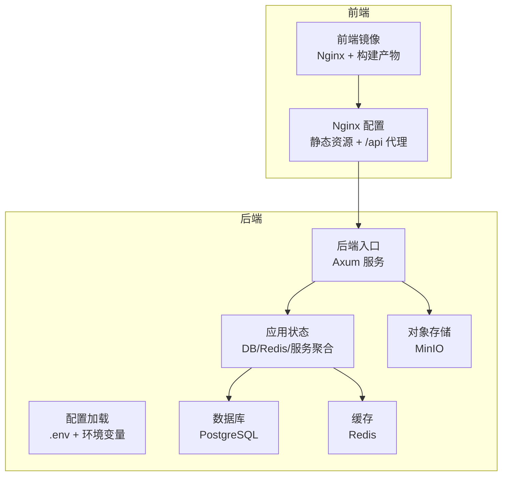
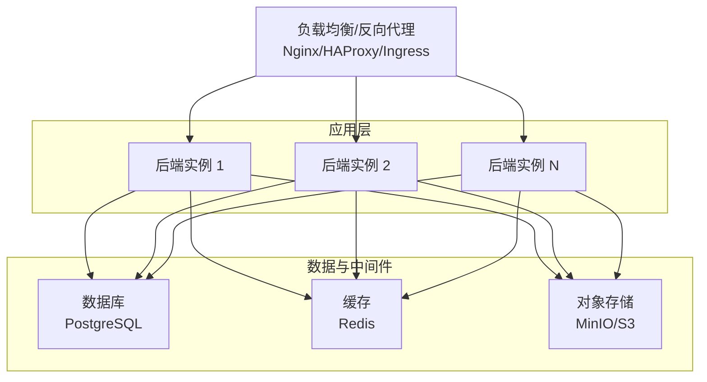
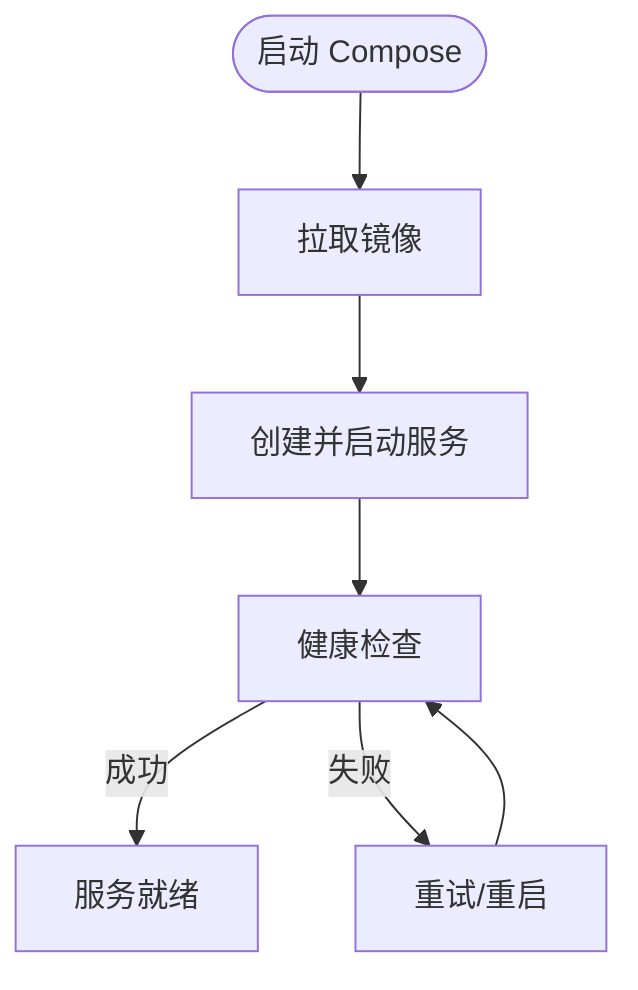
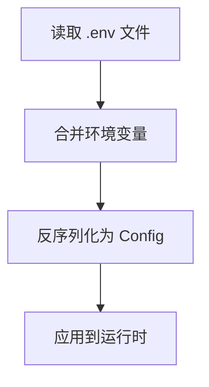
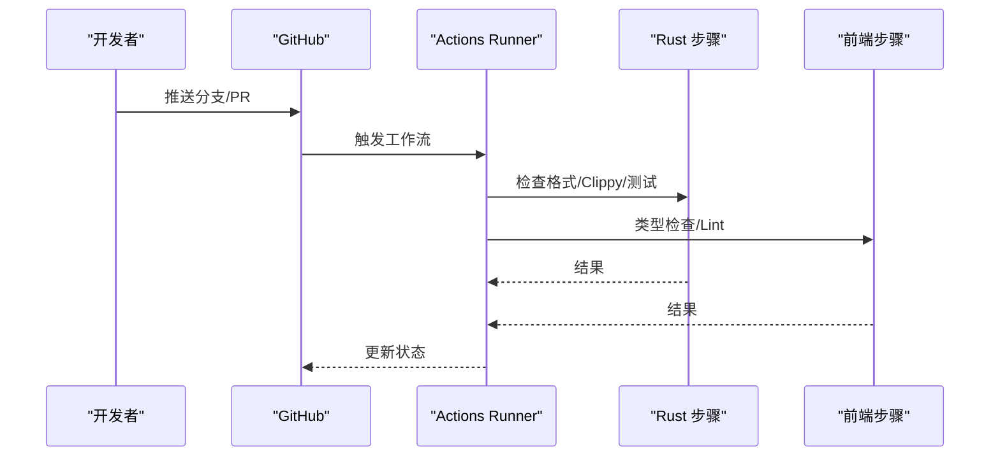
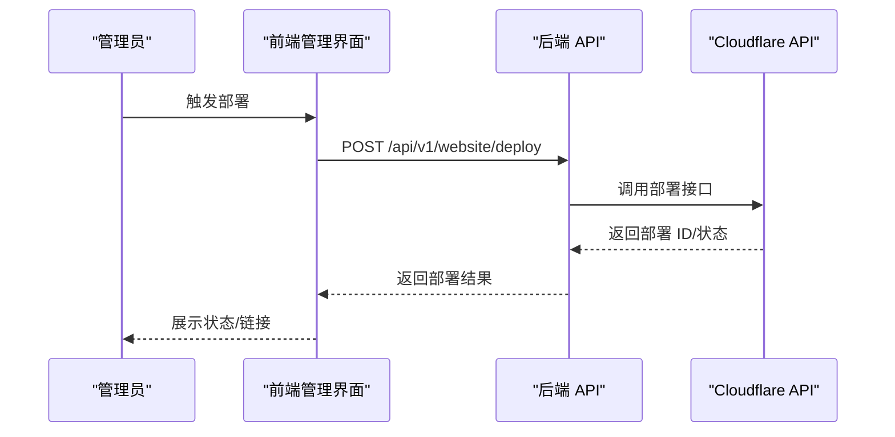
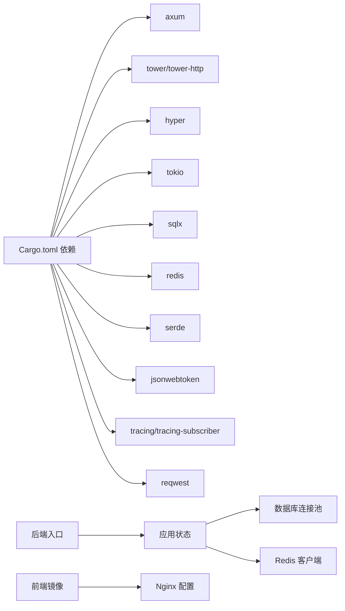

# 部署与运维

<cite>
**本文引用的文件**
- [docker-compose.yml](file://docker/docker-compose.yml)
- [ci.yml](file://.github/workflows/ci.yml)
- [Cargo.toml](file://backend/core/Cargo.toml)
- [Dockerfile（前端）](file://frontend/Dockerfile)
- [Nginx 配置](file://frontend/nginx.conf)
- [配置加载（Rust）](file://backend/core/src/config.rs)
- [应用状态（Rust）](file://backend/core/src/state.rs)
- [后端入口（Rust）](file://backend/core/src/main.rs)
- [.gitignore](file://.gitignore)
- [网站管理前端组件](file://frontend/src/pages/WebsiteManagement.tsx)
- [网站 API 类型定义](file://frontend/src/services/website.ts)
- [数据库连接池（Rust）](file://backend/core/src/db/mod.rs)
- [帮助中心初始化（Rust）](file://backend/core/src/services/help_service.rs)
- [认证处理器（Rust）](file://backend/core/src/api/handlers/auth.rs)
- [仪表盘处理器（Rust）](file://backend/core/src/api/handlers/dashboard.rs)
- [网站发布处理器（Rust）](file://backend/core/src/api/handlers/website.rs)
- [组织架构迁移（SQL）](file://backend/core/sqlx/migrations/026_create_organization_tables.up.sql)
</cite>

## 目录
1. [引言](#引言)
2. [项目结构](#项目结构)
3. [核心组件](#核心组件)
4. [架构总览](#架构总览)
5. [详细组件分析](#详细组件分析)
6. [依赖关系分析](#依赖关系分析)
7. [性能考虑](#性能考虑)
8. [故障排除指南](#故障排除指南)
9. [结论](#结论)
10. [附录](#附录)

## 引言
本文件面向运维工程师，提供 POMP 系统的完整部署与运维指导。内容覆盖 Docker 容器化部署、服务编排、环境配置、网络与存储、CI/CD 流水线、生产环境部署（服务器、负载均衡、SSL、监控告警）、数据库备份恢复、日志与性能监控、故障排除、性能调优与安全加固等。

## 项目结构
- 后端采用 Rust + Axum，使用 SQLx 连接 PostgreSQL，集成 Redis 缓存；提供丰富的业务 API（工作流、HR、GIS、CMS、字典、日程等）。
- 前端采用 React/Vite + TailwindCSS，打包后由 Nginx 提供静态托管，并通过 /api 代理转发至后端。
- 使用 Docker Compose 编排数据库（PostgreSQL）、缓存（Redis）、对象存储（MinIO）等基础设施。
- GitHub Actions 提供 CI 流水线，分别对后端（Rust）与前端（React）进行格式校验、静态检查、类型检查与测试。

图表来源
- [Dockerfile（前端）:1-41](file://frontend/Dockerfile#L1-L41)
- [Nginx 配置:1-39](file://frontend/nginx.conf#L1-L39)
- [后端入口（Rust）:1-372](file://backend/core/src/main.rs#L1-L372)
- [配置加载（Rust）:1-116](file://backend/core/src/config.rs#L1-L116)
- [应用状态（Rust）:1-88](file://backend/core/src/state.rs#L1-L88)
- [docker-compose.yml:1-50](file://docker/docker-compose.yml#L1-L50)

章节来源
- [docker-compose.yml:1-50](file://docker/docker-compose.yml#L1-L50)
- [Dockerfile（前端）:1-41](file://frontend/Dockerfile#L1-L41)
- [Nginx 配置:1-39](file://frontend/nginx.conf#L1-L39)
- [后端入口（Rust）:1-372](file://backend/core/src/main.rs#L1-L372)
- [配置加载（Rust）:1-116](file://backend/core/src/config.rs#L1-L116)
- [应用状态（Rust）:1-88](file://backend/core/src/state.rs#L1-L88)

## 核心组件
- 容器编排：PostgreSQL、Redis、MinIO 通过 Compose 管理，持久化卷用于数据持久化。
- 前端镜像：基于 Node 构建，Nginx 运行，内置健康检查与静态资源缓存。
- 后端服务：Axum 路由聚合，SQLx 迁移与连接池，Redis 缓存，JWT 认证，AI 图像生成与文档优化辅助。
- CI/CD：GitHub Actions 分别对后端与前端执行格式、静态检查、类型检查与测试。

章节来源
- [docker-compose.yml:1-50](file://docker/docker-compose.yml#L1-L50)
- [Dockerfile（前端）:1-41](file://frontend/Dockerfile#L1-L41)
- [Nginx 配置:1-39](file://frontend/nginx.conf#L1-L39)
- [后端入口（Rust）:1-372](file://backend/core/src/main.rs#L1-L372)
- [配置加载（Rust）:1-116](file://backend/core/src/config.rs#L1-L116)
- [应用状态（Rust）:1-88](file://backend/core/src/state.rs#L1-L88)
- [ci.yml:1-63](file://.github/workflows/ci.yml#L1-L63)

## 架构总览
下图展示生产环境典型拓扑：反向代理（Nginx/负载均衡）前置，后端多实例横向扩展，共享数据库与缓存，对象存储用于媒体资源。

图表来源
- [后端入口（Rust）:1-372](file://backend/core/src/main.rs#L1-L372)
- [数据库连接池（Rust）:1-44](file://backend/core/src/db/mod.rs#L1-L44)
- [docker-compose.yml:1-50](file://docker/docker-compose.yml#L1-L50)

## 详细组件分析

### Docker 容器化与服务编排
- Compose 服务
  - PostgreSQL：映射端口 5432，使用命名卷持久化数据，健康检查使用 pg_isready。
  - Redis：映射端口 6379，持久化卷，健康检查 ping。
  - MinIO：对外提供 9000/9001 端口，根账号凭据默认，持久化卷。
- 前端镜像
  - 多阶段构建：Node 构建产物，Nginx 运行，暴露 80 端口，健康检查通过 wget 探测 /health。
  - Nginx 配置启用 gzip、静态资源一年缓存、SPA 路由回退到 index.html，并可选将 /api 代理到后端。
- 后端镜像
  - 默认监听 8000 端口，提供 /health 健康检查；生产中建议通过反向代理暴露 80/443 并开启 TLS。

图表来源
- [docker-compose.yml:1-50](file://docker/docker-compose.yml#L1-L50)
- [Nginx 配置:33-38](file://frontend/nginx.conf#L33-L38)
- [后端入口（Rust）:279-284](file://backend/core/src/main.rs#L279-L284)

章节来源
- [docker-compose.yml:1-50](file://docker/docker-compose.yml#L1-L50)
- [Dockerfile（前端）:1-41](file://frontend/Dockerfile#L1-L41)
- [Nginx 配置:1-39](file://frontend/nginx.conf#L1-L39)
- [后端入口（Rust）:279-284](file://backend/core/src/main.rs#L279-L284)

### 环境配置与密钥管理
- 配置来源优先级：.env 文件（位于项目根） → 环境变量（通过 dotenv 加载），最终由 envy 反序列化为 Config 结构体。
- 关键配置项：数据库连接串、Redis 连接串、JWT 密钥与过期小时数、AI 服务地址与模型、时区等。
- 建议
  - 生产环境将敏感信息置于密钥管理服务（如 KMS、Vault）或 CI/CD 的机密变量中，避免提交到仓库。
  - .env 文件已加入忽略列表，确保不会被版本控制跟踪。

图表来源
- [配置加载（Rust）:96-115](file://backend/core/src/config.rs#L96-L115)

章节来源
- [配置加载（Rust）:1-116](file://backend/core/src/config.rs#L1-L116)
- [.gitignore:6-10](file://.gitignore#L6-L10)

### CI/CD 流水线
- 后端（Rust）
  - 安装稳定工具链，缓存依赖，格式检查、Clippy 警告即停止、测试全部通过。
- 前端（React）
  - 设置 Node.js 20，安装依赖，类型检查、ESLint 检查通过。
- 建议
  - 在 PR 中增加构建产物扫描与安全审计。
  - 将构建产物与测试报告归档，便于追溯。

图表来源
- [ci.yml:1-63](file://.github/workflows/ci.yml#L1-L63)

章节来源
- [ci.yml:1-63](file://.github/workflows/ci.yml#L1-L63)

### 生产环境部署指南
- 服务器准备
  - 操作系统：推荐 Ubuntu 22.04 LTS 或同等发行版。
  - 时间同步：启用 NTP，确保时区正确（Asia/Shanghai）。
  - 防火墙：开放 80/443（反向代理），限制数据库与缓存端口仅内网访问。
- 反向代理与负载均衡
  - 使用 Nginx/HAProxy/Ingress 暴露 80/443，启用 HTTP/2 与 TLS。
  - 配置健康检查路径（/health），后端实例健康检查由 Compose/容器健康探针保障。
- SSL 证书
  - 使用 ACME 自动签发（Let’s Encrypt），或内部 CA 签发，统一管理证书与私钥。
- 存储与持久化
  - 数据库与缓存使用独立持久卷或云盘，定期快照备份。
  - 对象存储建议使用 S3 兼容服务，配置跨域与访问控制。
- 扩容与高可用
  - 后端多实例水平扩展，共享数据库与缓存。
  - 使用服务发现与自动伸缩策略（CPU/内存/请求延迟）。

章节来源
- [Nginx 配置:1-39](file://frontend/nginx.conf#L1-L39)
- [docker-compose.yml:1-50](file://docker/docker-compose.yml#L1-L50)

### 数据库备份与恢复
- 备份策略
  - 全量备份：每周一次，增量备份：每日一次。
  - 备份保留周期：至少 4 周全量 + 30 天增量，满足 RPO/RTO。
- 备份介质
  - 本地磁带/磁盘阵列 + 云对象存储（S3），异地容灾。
- 恢复演练
  - 定期进行恢复演练，验证备份完整性与恢复时间。
- 迁移与版本演进
  - 使用 SQLx 迁移脚本管理数据库版本，生产前先在预生产验证。
  - 外键约束与索引变更需评估锁与停机窗口。

章节来源
- [数据库连接池（Rust）:30-44](file://backend/core/src/db/mod.rs#L30-L44)
- [组织架构迁移（SQL）:47-73](file://backend/core/sqlx/migrations/026_create_organization_tables.up.sql#L47-L73)

### 日志与性能监控
- 日志
  - 后端：使用 tracing-subscriber 输出结构化日志，按环境过滤级别。
  - 前端：Nginx 访问/错误日志，结合 ELK/EFK 或 Loki/Grafana 进行集中收集。
- 指标
  - CPU/内存/磁盘/网络 I/O、数据库连接数、Redis 命中率、请求延迟与错误率。
- 告警
  - 阈值告警：健康检查失败、错误率突增、队列堆积、磁盘空间不足。
  - 通知渠道：邮件、IM、电话，分级处理。

章节来源
- [后端入口（Rust）:16-21](file://backend/core/src/main.rs#L16-L21)
- [Nginx 配置:33-38](file://frontend/nginx.conf#L33-L38)

### 网站发布与部署流水线
- 前端构建与发布
  - 前端通过 Vite 构建，Nginx 部署静态站点。
  - /api 代理到后端，生产中建议在反向代理层统一处理。
- 后端发布
  - 通过 CI 构建镜像并推送至镜像仓库，再由编排系统拉起新版本。
  - 使用蓝绿/金丝雀发布策略，结合健康检查与回滚机制。
- 网站管理
  - 后端提供网站设置、生成、预览、部署与部署历史查询接口。
  - 前端页面展示部署历史与状态，支持访问线上链接与查看错误信息。

图表来源
- [网站发布处理器（Rust）:467-527](file://backend/core/src/api/handlers/website.rs#L467-L527)
- [网站管理前端组件:339-385](file://frontend/src/pages/WebsiteManagement.tsx#L339-L385)
- [网站 API 类型定义:18-60](file://frontend/src/services/website.ts#L18-L60)

章节来源
- [网站发布处理器（Rust）:467-527](file://backend/core/src/api/handlers/website.rs#L467-L527)
- [网站管理前端组件:35-385](file://frontend/src/pages/WebsiteManagement.tsx#L35-L385)
- [网站 API 类型定义:1-60](file://frontend/src/services/website.ts#L1-L60)

### 认证与会话
- JWT 签发与校验
  - 登录成功后签发 JWT，包含用户标识、过期时间等声明。
  - 建议使用 HS256 并妥善保管密钥，定期轮换。
- 会话与缓存
  - 登录态可结合 Redis 缓存，实现黑名单与快速校验。
- 安全加固
  - 强制 HTTPS、安全头、CORS 白名单、速率限制、防爆破策略。

章节来源
- [认证处理器（Rust）:89-187](file://backend/core/src/api/handlers/auth.rs#L89-L187)
- [配置加载（Rust）:14-18](file://backend/core/src/config.rs#L14-L18)

### AI 功能与资源管理
- AI 图像生成与文档优化
  - 后端提供图像生成与文档优化接口，可对接 Together/HuggingFace/Ollama 等服务。
  - 建议为外部服务配置超时、重试与熔断，避免级联故障。
- 对象存储
  - 媒体资源上传与访问通过 MinIO/S3 管理，注意访问权限与生命周期策略。

章节来源
- [后端入口（Rust）:69-72](file://backend/core/src/main.rs#L69-L72)
- [配置加载（Rust）:20-45](file://backend/core/src/config.rs#L20-L45)
- [docker-compose.yml:34-46](file://docker/docker-compose.yml#L34-L46)

## 依赖关系分析

图表来源
- [Cargo.toml:15-49](file://backend/core/Cargo.toml#L15-L49)
- [后端入口（Rust）:1-372](file://backend/core/src/main.rs#L1-L372)
- [应用状态（Rust）:1-88](file://backend/core/src/state.rs#L1-L88)
- [数据库连接池（Rust）:1-44](file://backend/core/src/db/mod.rs#L1-L44)
- [Dockerfile（前端）:1-41](file://frontend/Dockerfile#L1-L41)
- [Nginx 配置:1-39](file://frontend/nginx.conf#L1-L39)

章节来源
- [Cargo.toml:1-52](file://backend/core/Cargo.toml#L1-L52)
- [后端入口（Rust）:1-372](file://backend/core/src/main.rs#L1-L372)
- [应用状态（Rust）:1-88](file://backend/core/src/state.rs#L1-L88)
- [数据库连接池（Rust）:1-44](file://backend/core/src/db/mod.rs#L1-L44)
- [Dockerfile（前端）:1-41](file://frontend/Dockerfile#L1-L41)
- [Nginx 配置:1-39](file://frontend/nginx.conf#L1-L39)

## 性能考虑
- 连接池与并发
  - 数据库最大连接数建议与硬件资源匹配，避免过度竞争。
  - 后端实例数量与 CPU/内存成正比，结合 QPS 与 P95/P99 延迟调整。
- 缓存策略
  - Redis 缓存热点数据与会话，设置合理过期时间与淘汰策略。
- 静态资源
  - 启用 gzip/压缩与长期缓存，减少带宽与延迟。
- 数据库优化
  - 索引与查询计划审查，慢查询日志分析，分区与物化视图按需使用。

## 故障排除指南
- 健康检查失败
  - 检查容器健康探针与端口映射，确认服务监听地址与端口。
  - 查看后端日志与 Nginx 访问/错误日志。
- 数据库连接异常
  - 核对数据库 URL、凭据与网络连通性；检查连接池上限与空闲回收。
- Redis 不可用
  - 检查 Redis 服务状态、持久化与内存使用；必要时清理过期键。
- 前端无法访问 API
  - 确认 /api 代理配置与后端服务可达；检查 CORS 与安全头。
- JWT 登录失败
  - 校验密钥一致性、过期时间与签名算法；检查客户端时间同步。
- 网站发布失败
  - 检查 Cloudflare 凭据与项目名；查看部署历史中的错误信息。

章节来源
- [后端入口（Rust）:279-284](file://backend/core/src/main.rs#L279-L284)
- [Nginx 配置:24-31](file://frontend/nginx.conf#L24-L31)
- [认证处理器（Rust）:89-187](file://backend/core/src/api/handlers/auth.rs#L89-L187)
- [网站发布处理器（Rust）:467-527](file://backend/core/src/api/handlers/website.rs#L467-L527)

## 结论
通过容器化编排、标准化 CI/CD、完善的监控告警与备份策略，POMP 系统可在生产环境中实现高可用、可扩展与易运维。建议持续优化数据库与缓存策略，强化安全与合规，定期演练故障恢复，确保业务连续性。

## 附录
- 快速检查清单
  - 环境变量与密钥：完成且未提交到仓库。
  - 健康检查：所有服务 /health 可达。
  - 数据库迁移：最新迁移已执行。
  - 备份：最近一次全量/增量备份成功。
  - 监控：关键指标与告警已配置。
  - SSL：证书有效且自动续期。