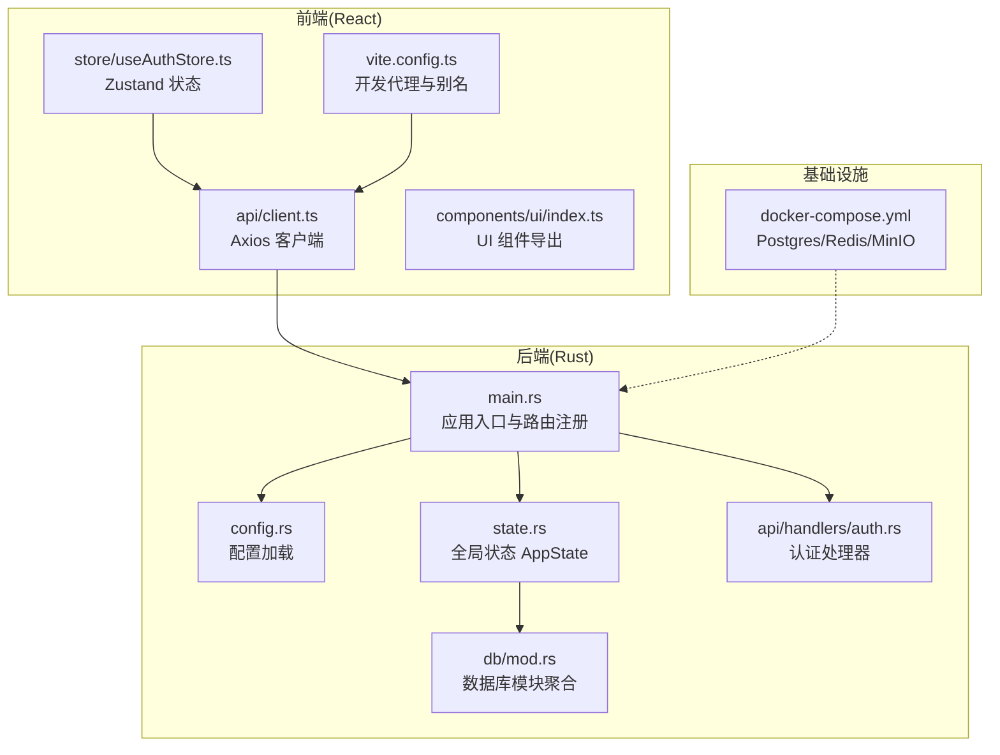
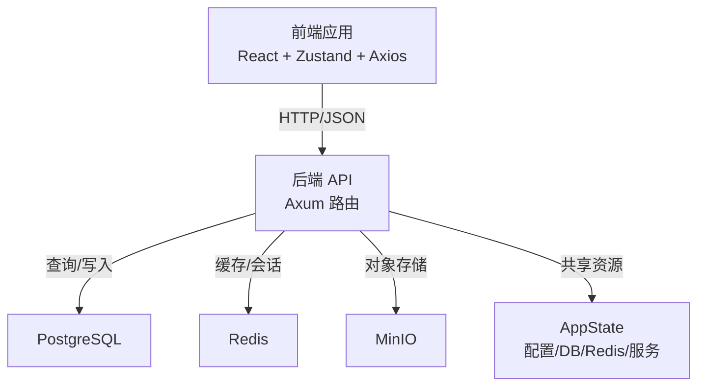
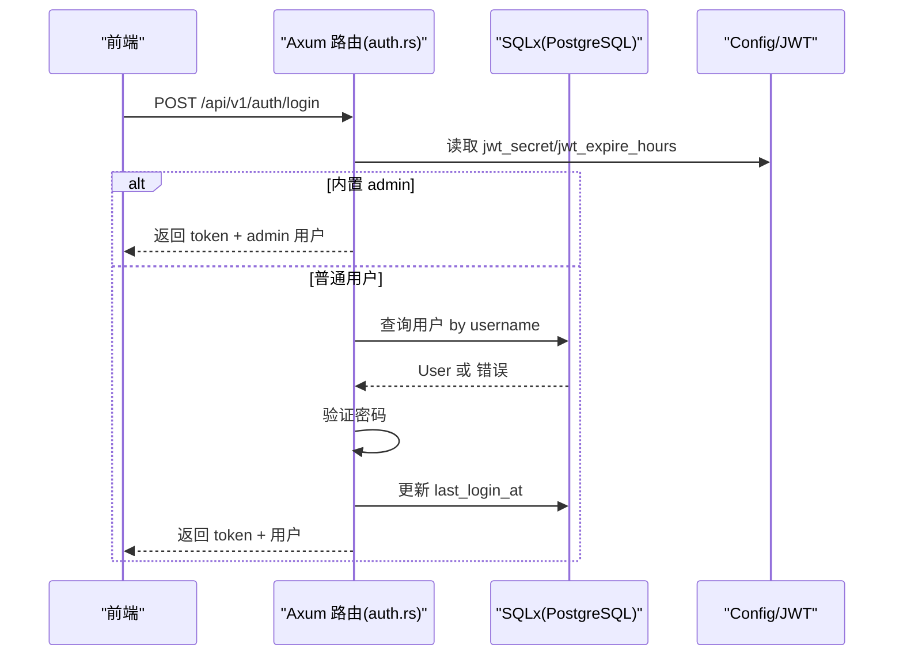
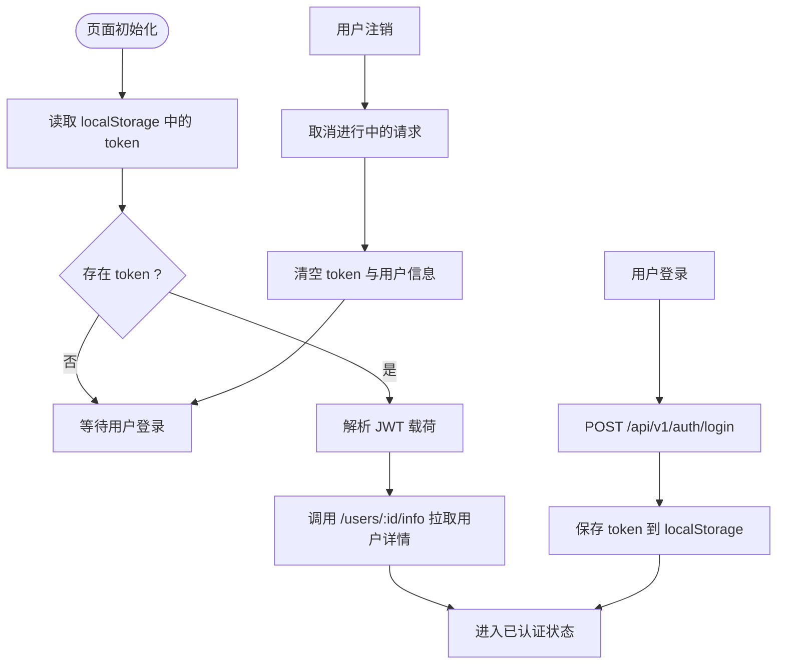
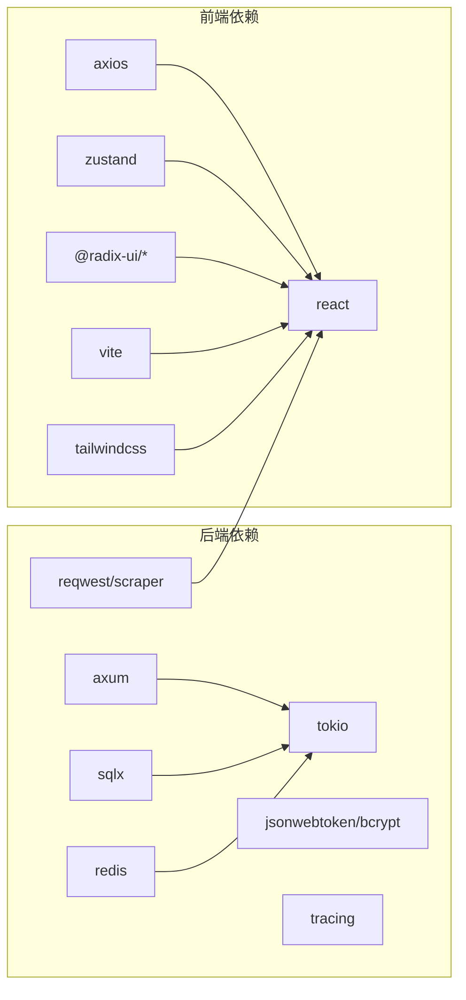

# 技术栈说明

<cite>
**本文引用的文件**
- [Cargo.toml](file://backend/core/Cargo.toml)
- [main.rs](file://backend/core/src/main.rs)
- [config.rs](file://backend/core/src/config.rs)
- [state.rs](file://backend/core/src/state.rs)
- [mod.rs](file://backend/core/src/db/mod.rs)
- [user_repo.rs](file://backend/core/src/db/user_repo.rs)
- [client.ts](file://frontend/src/api/client.ts)
- [useAuthStore.ts](file://frontend/src/store/useAuthStore.ts)
- [index.ts](file://frontend/src/components/ui/index.ts)
- [vite.config.ts](file://frontend/vite.config.ts)
- [docker-compose.yml](file://docker/docker-compose.yml)
- [auth.rs](file://backend/core/src/api/handlers/auth.rs)
</cite>

## 目录
1. [引言](#引言)
2. [项目结构](#项目结构)
3. [核心组件](#核心组件)
4. [架构总览](#架构总览)
5. [详细组件分析](#详细组件分析)
6. [依赖分析](#依赖分析)
7. [性能考虑](#性能考虑)
8. [故障排查指南](#故障排查指南)
9. [结论](#结论)
10. [附录](#附录)

## 引言
本文件面向 POMP 项目的后端与前端技术栈，系统性阐述 Rust + Axum + Tokio + SQLx + PostgreSQL + Redis + MinIO 的后端技术组合，以及 React 18 + Vite + Ant Design + Zustand + Axios 的前端技术组合。文档重点说明各组件的职责边界、协作关系、集成方式与选型优势，并提供最佳实践建议与排障指引。

## 项目结构
后端采用 Rust 单体库/二进制模式，统一管理 API 路由、数据库访问层、服务层与全局状态；前端采用 React 18 + Vite 的现代工程化方案，配合 TypeScript、TailwindCSS 与 Radix UI 组件体系。容器编排通过 Docker Compose 提供 PostgreSQL、Redis、MinIO 的本地开发环境。



**图表来源**
- [main.rs:1-372](file://backend/core/src/main.rs#L1-L372)
- [config.rs:1-116](file://backend/core/src/config.rs#L1-L116)
- [state.rs:1-88](file://backend/core/src/state.rs#L1-L88)
- [mod.rs:1-44](file://backend/core/src/db/mod.rs#L1-L44)
- [auth.rs:1-200](file://backend/core/src/api/handlers/auth.rs#L1-L200)
- [client.ts:1-41](file://frontend/src/api/client.ts#L1-L41)
- [useAuthStore.ts:1-148](file://frontend/src/store/useAuthStore.ts#L1-L148)
- [index.ts:1-14](file://frontend/src/components/ui/index.ts#L1-L14)
- [vite.config.ts:1-20](file://frontend/vite.config.ts#L1-L20)
- [docker-compose.yml:1-50](file://docker/docker-compose.yml#L1-L50)

**章节来源**
- [main.rs:1-372](file://backend/core/src/main.rs#L1-L372)
- [vite.config.ts:1-20](file://frontend/vite.config.ts#L1-L20)
- [docker-compose.yml:1-50](file://docker/docker-compose.yml#L1-L50)

## 核心组件
- 后端核心
  - Rust + Tokio：异步运行时与并发模型
  - Axum：高性能 Web 框架，内置路由与中间件生态
  - SQLx：类型安全的 SQL ORM，支持 PostgreSQL、异步连接池
  - Redis：缓存与会话存储
  - PostgreSQL：关系型数据库，配合迁移脚本与连接池
  - MinIO：对象存储（用于媒体资源）
- 前端核心
  - React 18：函数式组件与并发渲染
  - Vite：快速构建与热更新
  - Ant Design（Radix UI）：可访问性与一致性 UI 组件
  - Zustand：轻量级状态管理
  - Axios：HTTP 客户端与拦截器

**章节来源**
- [Cargo.toml:15-49](file://backend/core/Cargo.toml#L15-L49)
- [main.rs:1-372](file://backend/core/src/main.rs#L1-L372)
- [config.rs:1-116](file://backend/core/src/config.rs#L1-L116)
- [state.rs:1-88](file://backend/core/src/state.rs#L1-L88)
- [mod.rs:1-44](file://backend/core/src/db/mod.rs#L1-L44)
- [docker-compose.yml:1-50](file://docker/docker-compose.yml#L1-L50)
- [package.json:1-60](file://frontend/package.json#L1-L60)
- [client.ts:1-41](file://frontend/src/api/client.ts#L1-L41)
- [useAuthStore.ts:1-148](file://frontend/src/store/useAuthStore.ts#L1-L148)
- [index.ts:1-14](file://frontend/src/components/ui/index.ts#L1-L14)
- [vite.config.ts:1-20](file://frontend/vite.config.ts#L1-L20)

## 架构总览
后端以 AppState 为中心，集中持有配置、数据库连接池、Redis 客户端与各类服务实例；Axum 路由在启动时注册，统一注入 State 以访问共享资源。前端通过 Axios 客户端与后端交互，Zustand 管理认证态与视图状态，Vite 提供开发代理与构建能力。Docker Compose 提供 PostgreSQL、Redis、MinIO 的本地可用环境。



**图表来源**
- [main.rs:42-270](file://backend/core/src/main.rs#L42-L270)
- [state.rs:10-26](file://backend/core/src/state.rs#L10-L26)
- [docker-compose.yml:4-46](file://docker/docker-compose.yml#L4-L46)
- [client.ts:3-9](file://frontend/src/api/client.ts#L3-L9)

## 详细组件分析

### 后端：Rust + Tokio + Axum + SQLx + PostgreSQL + Redis + MinIO
- 运行时与框架
  - Tokio 提供异步运行时，支持全功能特性集，满足高并发 I/O 密集场景
  - Axum 提供类型安全路由、提取器与中间件，简化请求处理链路
- 数据层
  - SQLx 作为 ORM，启用 PostgreSQL、chrono、uuid、json、bigdecimal 等特性，配合迁移脚本与连接池
  - 数据库模块聚合位于 db/mod.rs，按领域拆分仓库层（如 user_repo.rs）
- 缓存与对象存储
  - Redis 客户端通过 tokio-compat 与连接管理器集成
  - MinIO 在 Compose 中提供对象存储能力，便于媒体资源上传与访问
- 全局状态与配置
  - AppState 聚合配置、DB、Redis 与服务实例，Builder 模式保证初始化顺序与错误传播
  - Config 支持 .env 加载与环境变量反序列化，提供默认值与可选 AI 服务配置

```mermaid
classDiagram
class Config {
+u16 server_port
+String database_url
+String redis_url
+String jwt_secret
+i64 jwt_expire_hours
+String together_api_key
+String huggingface_api_key
+String ai_image_model
+String ai_image_size
+String ai_image_quality
+String ollama_api_url
+String ollama_model
+load() Config
}
class AppState {
+Arc~Config~ config
+DbPool db
+Arc~redis : : Client~ redis
+Arc~ImageGenerator~ image_generator
+Arc~FieldService~ field_service
+Arc~DictService~ dict_service
+Arc~HelpService~ help_service
+Arc~ContractService~ contract_service
+builder() AppStateBuilder
}
class AppStateBuilder {
+config(Config) Self
+db(DbPool) Self
+redis(redis : : Client) Self
+build() Arc~AppState~
}
AppState --> Config : "持有"
AppStateBuilder --> Config : "构建"
AppStateBuilder --> DbPool : "构建"
AppStateBuilder --> redis : : Client : "构建"
```

**图表来源**
- [config.rs:3-46](file://backend/core/src/config.rs#L3-L46)
- [state.rs:10-26](file://backend/core/src/state.rs#L10-L26)
- [state.rs:28-57](file://backend/core/src/state.rs#L28-L57)

**章节来源**
- [Cargo.toml:15-49](file://backend/core/Cargo.toml#L15-L49)
- [main.rs:16-37](file://backend/core/src/main.rs#L16-L37)
- [config.rs:96-115](file://backend/core/src/config.rs#L96-L115)
- [state.rs:58-86](file://backend/core/src/state.rs#L58-L86)
- [mod.rs:25-37](file://backend/core/src/db/mod.rs#L25-L37)
- [docker-compose.yml:4-46](file://docker/docker-compose.yml#L4-L46)

### 后端：认证与用户管理 API 流程
- 登录流程
  - 接收用户名/密码，校验是否为内置 admin 账号；否则查询数据库用户并验证密码
  - 成功后签发 JWT，返回用户信息与令牌
  - 更新最近登录时间
- 数据访问
  - user_repo 提供基于 SQLx 的用户 CRUD 与查询，返回强类型 User 结构



**图表来源**
- [auth.rs:82-200](file://backend/core/src/api/handlers/auth.rs#L82-L200)
- [user_repo.rs:117-141](file://backend/core/src/db/user_repo.rs#L117-L141)
- [config.rs:14-18](file://backend/core/src/config.rs#L14-L18)

**章节来源**
- [auth.rs:82-200](file://backend/core/src/api/handlers/auth.rs#L82-L200)
- [user_repo.rs:7-86](file://backend/core/src/db/user_repo.rs#L7-L86)
- [user_repo.rs:117-141](file://backend/core/src/db/user_repo.rs#L117-L141)

### 前端：Axios 客户端与 Zustand 认证状态
- Axios 客户端
  - baseURL 指向 /api，统一设置 Content-Type，注入 Authorization 头
  - 统一处理 401 无权限：清理本地 token 并跳转登录页
- Zustand 认证 Store
  - 初始化：从 localStorage 读取 token，解析 JWT 并拉取用户详情
  - 登录：调用 /api/v1/auth/login，持久化 token，更新认证态
  - 注销：中止进行中的请求，清理 token 与状态
- UI 组件
  - components/ui/index.ts 汇总导出常用 UI 组件，配合 TailwindCSS 与 Radix UI



**图表来源**
- [client.ts:11-38](file://frontend/src/api/client.ts#L11-L38)
- [useAuthStore.ts:40-61](file://frontend/src/store/useAuthStore.ts#L40-L61)
- [useAuthStore.ts:63-89](file://frontend/src/store/useAuthStore.ts#L63-L89)
- [useAuthStore.ts:136-144](file://frontend/src/store/useAuthStore.ts#L136-L144)

**章节来源**
- [client.ts:1-41](file://frontend/src/api/client.ts#L1-L41)
- [useAuthStore.ts:1-148](file://frontend/src/store/useAuthStore.ts#L1-L148)
- [index.ts:1-14](file://frontend/src/components/ui/index.ts#L1-L14)
- [vite.config.ts:12-19](file://frontend/vite.config.ts#L12-L19)

## 依赖分析
- 后端依赖
  - 运行时与框架：tokio、axum、tower、tower-http、hyper
  - 数据库与 ORM：sqlx(含 postgres、chrono、uuid、json、bigdecimal、migrate)
  - 缓存：redis(tokio-comp、connection-manager)
  - 安全与加密：bcrypt、jsonwebtoken(rust_crypto)
  - 工具与观测：serde、serde_json、tracing、tracing-subscriber、anyhow、thiserror
  - 网络与爬虫：reqwest、scraper、url、base64、urlencoding
- 前端依赖
  - React 生态：react、react-dom、react-router-dom
  - UI 组件：@radix-ui/*、lucide-react、recharts、sonner
  - 状态管理：zustand
  - 构建与工具：vite、@vitejs/plugin-react、eslint、typescript、tailwindcss
  - HTTP 客户端：axios
  - 地图：ol



**图表来源**
- [Cargo.toml:15-49](file://backend/core/Cargo.toml#L15-L49)
- [package.json:13-58](file://frontend/package.json#L13-L58)

**章节来源**
- [Cargo.toml:15-49](file://backend/core/Cargo.toml#L15-L49)
- [package.json:13-58](file://frontend/package.json#L13-L58)

## 性能考虑
- 后端
  - 使用 SQLx 连接池与异步查询，避免阻塞；合理设置最大连接数与超时
  - Redis 连接管理器减少连接开销；对热点数据进行缓存命中优化
  - Axum 路由按模块拆分，避免单文件过大导致编译与维护困难
- 前端
  - Vite 开发服务器热更新与按需打包；生产构建开启 Tree-shaking 与压缩
  - Zustand 仅存放必要状态，避免过度订阅导致重渲染
  - Axios 请求拦截器统一处理鉴权头与错误，减少重复代码

## 故障排查指南
- 后端
  - 数据库连接失败：检查 DATABASE_URL 与网络连通；确认 migrations 是否成功执行
  - Redis 连接异常：核对 REDIS_URL 与容器健康检查；确认连接池配置
  - JWT 签发失败：核对 JWT_SECRET 与过期时间配置
- 前端
  - 401 未授权：确认 localStorage 中 token 是否存在；检查 Axios 请求拦截器是否注入 Authorization
  - 开发代理无效：确认 vite.config.ts 中 /api 代理目标与端口一致
  - UI 组件缺失：检查 components/ui/index.ts 导出路径与命名

**章节来源**
- [config.rs:96-115](file://backend/core/src/config.rs#L96-L115)
- [client.ts:11-38](file://frontend/src/api/client.ts#L11-L38)
- [vite.config.ts:12-19](file://frontend/vite.config.ts#L12-L19)
- [docker-compose.yml:15-32](file://docker/docker-compose.yml#L15-L32)

## 结论
POMP 采用“Rust + Axum + Tokio + SQLx + PostgreSQL + Redis + MinIO”的后端技术栈，具备类型安全、并发高效、生态完备的优势；前端采用“React 18 + Vite + Ant Design + Zustand + Axios”，强调组件化与现代化构建。两者通过清晰的职责划分与统一的 API 协议协同工作，适合构建中大型企业级管理系统。

## 附录
- 技术选型决策依据
  - Rust：内存安全、零成本抽象、高性能；适合高并发与长生命周期服务
  - Axum：类型安全路由、中间件生态、易于测试与演进
  - SQLx：编译期 SQL 校验、异步连接池、多数据类型支持
  - PostgreSQL：成熟稳定、ACID、扩展性强、生态完善
  - Redis：高性能缓存与会话存储，支持多种数据结构
  - MinIO：S3 兼容的对象存储，适合媒体与静态资源
  - React 18：并发渲染、自动批处理、更好的用户体验
  - Vite：更快的冷启动与热更新，开发体验优秀
  - Ant Design（Radix UI）：可访问性与一致性，降低设计与开发成本
  - Zustand：轻量、易用、无需 Provider 包装
  - Axios：拦截器与错误处理统一，适配 REST API
- 最佳实践建议
  - 后端：严格区分路由层、服务层与数据层；使用 AppState 统一注入；为关键路径增加 tracing；对敏感字段使用 bcrypt；对高频查询使用 Redis 缓存
  - 前端：按页面拆分组件与服务；Zustand 仅存放跨页面共享状态；Axios 统一错误处理；Vite 代理仅在开发环境使用；UI 组件封装可复用逻辑