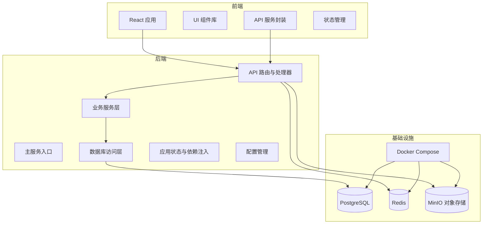
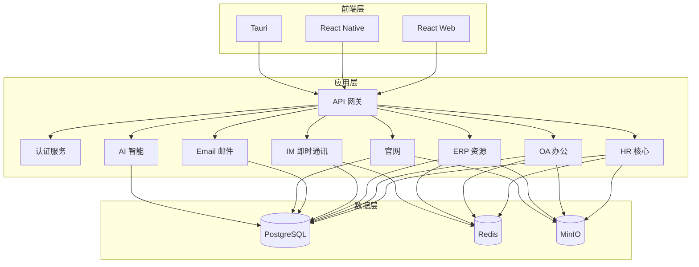
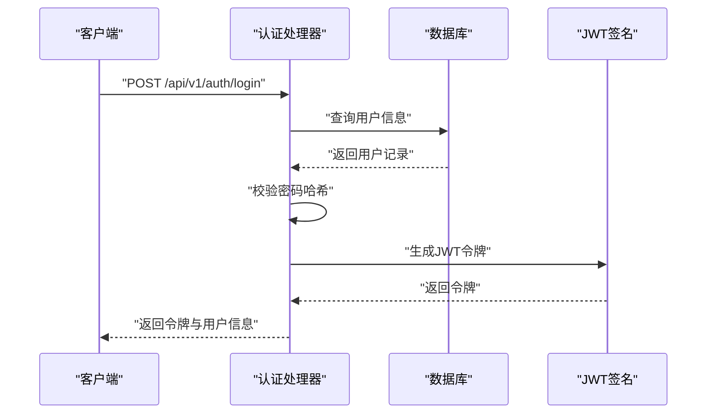
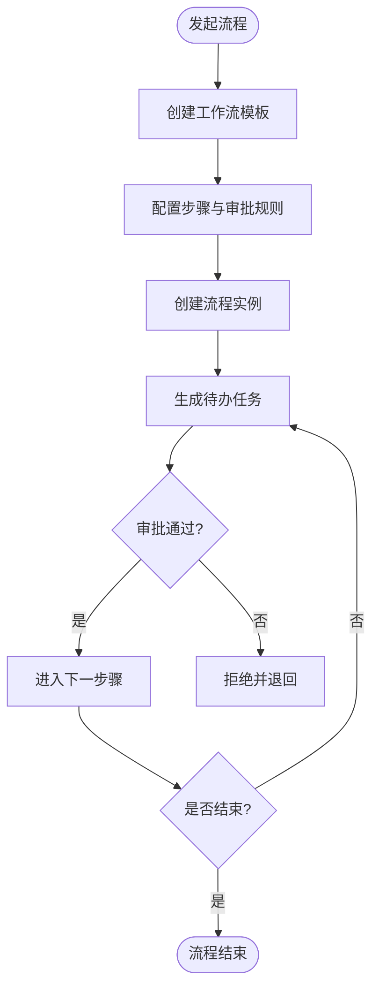
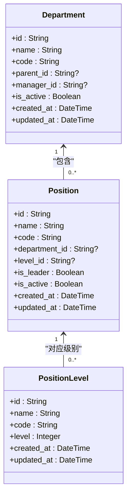
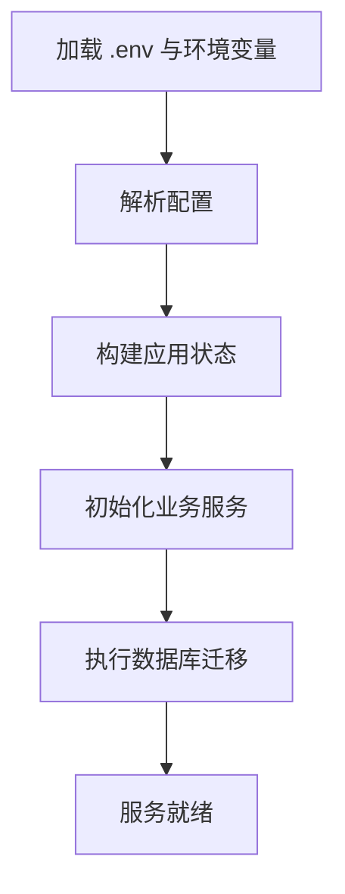
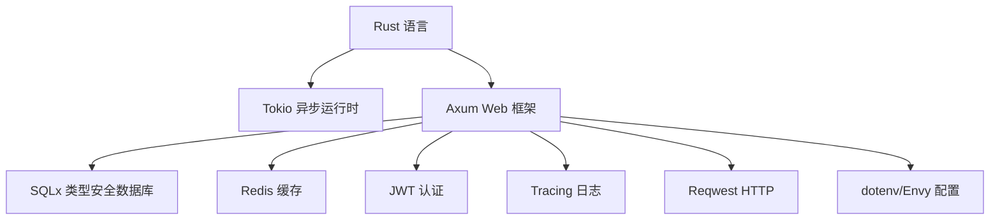

# 项目介绍

<cite>
**本文引用的文件**
- [README.md](file://README.md)
- [ems_architecture.md](file://docs/ems_architecture.md)
- [SKSF_EMS_Core_Design.md](file://docs/SKSF_EMS_Core_Design.md)
- [Cargo.toml](file://backend/core/Cargo.toml)
- [main.rs](file://backend/core/src/main.rs)
- [config.rs](file://backend/core/src/config.rs)
- [state.rs](file://backend/core/src/state.rs)
- [db/mod.rs](file://backend/core/src/db/mod.rs)
- [services/mod.rs](file://backend/core/src/services/mod.rs)
- [api/handlers/mod.rs](file://backend/core/src/api/handlers/mod.rs)
- [api/handlers/auth.rs](file://backend/core/src/api/handlers/auth.rs)
- [api/handlers/workflow_engine.rs](file://backend/core/src/api/handlers/workflow_engine.rs)
- [api/handlers/organization.rs](file://backend/core/src/api/handlers/organization.rs)
- [docker-compose.yml](file://docker/docker-compose.yml)
- [package.json](file://frontend/package.json)
</cite>

## 目录
1. [引言](#引言)
2. [项目结构](#项目结构)
3. [核心组件](#核心组件)
4. [架构总览](#架构总览)
5. [详细组件分析](#详细组件分析)
6. [依赖分析](#依赖分析)
7. [性能考量](#性能考量)
8. [故障排查指南](#故障排查指南)
9. [结论](#结论)
10. [附录](#附录)

## 引言
本项目是为河北三楷深发科技股份有限公司（新三板上市企业）打造的一体化企业信息管理系统（SKSF-EMS）。系统以“流程驱动、数据集中、智能赋能、多端统一”为核心理念，围绕HR、ERP、OA、IM、Email、官网、AI等模块进行统一管理，旨在打通业务孤岛、提升管理效率、优化工作流程、增强数据安全性，并满足上市企业的合规与审计要求。

系统采用现代化技术栈：后端基于Rust语言与Axum框架，前端采用React 18 + TypeScript，数据库为PostgreSQL，缓存与中间件包含Redis、MinIO等，同时提供AI智能助手与GIS空间可视化能力，形成统一的企业管理生态。

## 项目结构
项目采用前后端分离与模块化设计，后端以“API层-服务层-数据层”分层，前端以页面与组件模块划分，配合Docker编排实现快速部署与运行。

**图表来源**
- [main.rs:42-270](file://backend/core/src/main.rs#L42-L270)
- [db/mod.rs:25-44](file://backend/core/src/db/mod.rs#L25-L44)
- [docker-compose.yml:1-50](file://docker/docker-compose.yml#L1-L50)

**章节来源**
- [README.md:24-41](file://README.md#L24-L41)
- [main.rs:42-270](file://backend/core/src/main.rs#L42-L270)
- [docker-compose.yml:1-50](file://docker/docker-compose.yml#L1-L50)

## 核心组件
- 后端主服务与路由：负责统一API入口、健康检查、数据库迁移与服务启动。
- 应用状态与依赖注入：集中管理配置、数据库连接池、Redis客户端与各类业务服务。
- 配置管理：支持从环境变量与.env文件加载配置，涵盖数据库、缓存、JWT、AI服务等。
- 数据层：基于SQLx的数据库访问层，提供统一的连接池与连接测试。
- 业务服务层：封装字段管理、字典、帮助中心、合同、图像生成等业务能力。
- API处理器：按模块划分，覆盖认证、组织架构、工作流引擎、HR、OA、GIS、AI等。

**章节来源**
- [main.rs:16-41](file://backend/core/src/main.rs#L16-L41)
- [state.rs:10-26](file://backend/core/src/state.rs#L10-L26)
- [config.rs:96-115](file://backend/core/src/config.rs#L96-L115)
- [db/mod.rs:25-44](file://backend/core/src/db/mod.rs#L25-L44)
- [services/mod.rs:1-8](file://backend/core/src/services/mod.rs#L1-L8)
- [api/handlers/mod.rs:1-22](file://backend/core/src/api/handlers/mod.rs#L1-L22)

## 架构总览
系统采用分层解耦、异步优先、流程驱动的设计原则，前端通过REST API与后端交互，后端通过服务层与数据层协作，配合Redis、PostgreSQL、MinIO等中间件与对象存储，实现高可用、可扩展的企业管理平台。

**图表来源**
- [ems_architecture.md:8-75](file://docs/ems_architecture.md#L8-L75)
- [main.rs:42-270](file://backend/core/src/main.rs#L42-L270)

**章节来源**
- [ems_architecture.md:1-309](file://docs/ems_architecture.md#L1-L309)

## 详细组件分析

### 认证与授权模块
- 功能要点：支持用户名密码登录、JWT令牌签发与校验、用户状态与权限标识、登录时间更新。
- 安全设计：密码使用哈希校验；JWT配置可从环境变量读取；支持管理员账户与普通用户区分。
- 业务价值：统一身份认证、细粒度权限控制、登录审计与会话管理。

**图表来源**
- [api/handlers/auth.rs:82-200](file://backend/core/src/api/handlers/auth.rs#L82-L200)

**章节来源**
- [api/handlers/auth.rs:1-200](file://backend/core/src/api/handlers/auth.rs#L1-L200)
- [config.rs:96-115](file://backend/core/src/config.rs#L96-L115)

### 工作流引擎模块
- 功能要点：工作流模板管理、步骤配置、审批人调整、超时设置、任务创建与审批。
- 设计亮点：支持系统工作流与自定义工作流；步骤级审批人与超时策略可灵活调整。
- 业务价值：标准化审批流程、降低人工干预、提升审批效率与透明度。

**图表来源**
- [api/handlers/workflow_engine.rs:28-200](file://backend/core/src/api/handlers/workflow_engine.rs#L28-L200)

**章节来源**
- [api/handlers/workflow_engine.rs:1-200](file://backend/core/src/api/handlers/workflow_engine.rs#L1-L200)

### 组织架构模块
- 功能要点：部门管理、职位管理、职位级别管理、审批规则管理。
- 设计亮点：树形结构的部门层级、职位与部门/级别的关联、状态与排序控制。
- 业务价值：清晰的组织关系、规范的岗位管理、统一的审批规则。

**图表来源**
- [api/handlers/organization.rs:16-51](file://backend/core/src/api/handlers/organization.rs#L16-L51)

**章节来源**
- [api/handlers/organization.rs:1-200](file://backend/core/src/api/handlers/organization.rs#L1-L200)

### 配置与应用状态
- 配置管理：支持从环境变量与.env文件加载数据库、Redis、JWT、AI服务等配置。
- 应用状态：集中管理数据库连接池、Redis客户端、图像生成、字段管理、字典、帮助中心、合同等服务实例。
- 初始化：服务启动时自动执行数据库迁移，并尝试初始化默认帮助内容。

**图表来源**
- [config.rs:96-115](file://backend/core/src/config.rs#L96-L115)
- [state.rs:58-86](file://backend/core/src/state.rs#L58-L86)
- [main.rs:23-28](file://backend/core/src/main.rs#L23-L28)

**章节来源**
- [config.rs:1-116](file://backend/core/src/config.rs#L1-L116)
- [state.rs:1-88](file://backend/core/src/state.rs#L1-L88)
- [main.rs:16-41](file://backend/core/src/main.rs#L16-L41)

### 数据层与依赖注入
- 数据库连接池：通过SQLx创建最大连接数为50的PostgreSQL连接池。
- 依赖注入：通过AppStateBuilder将配置、数据库、Redis等依赖注入到各业务服务。
- 服务初始化：在应用状态构建完成后，初始化图像生成、字段管理、字典、帮助中心、合同等服务。

**章节来源**
- [db/mod.rs:25-44](file://backend/core/src/db/mod.rs#L25-L44)
- [state.rs:22-86](file://backend/core/src/state.rs#L22-L86)

## 依赖分析
后端采用Rust生态中的高性能异步运行时Tokio与Web框架Axum，结合SQLx实现类型安全的数据库访问，Redis提供缓存与会话存储，JWT实现认证授权，Tracing提供结构化日志，Reqwest用于HTTP客户端调用，dotenv与envy用于配置加载。

**图表来源**
- [Cargo.toml:15-52](file://backend/core/Cargo.toml#L15-L52)

**章节来源**
- [Cargo.toml:1-52](file://backend/core/Cargo.toml#L1-L52)

## 性能考量
- 异步与并发：基于Tokio的异步运行时与SQLx的异步数据库访问，提升高并发下的吞吐能力。
- 缓存策略：Redis作为缓存层，减少数据库压力，提升热点数据访问速度。
- 数据库优化：连接池最大连接数为50，支持高并发场景；迁移文件具备幂等性，避免重复执行导致的性能问题。
- 前端优化：React + Vite + TailwindCSS，支持按需加载与组件懒加载，提升首屏渲染与交互性能。

**章节来源**
- [db/mod.rs:30-37](file://backend/core/src/db/mod.rs#L30-L37)
- [README.md:43-96](file://README.md#L43-L96)
- [package.json:1-60](file://frontend/package.json#L1-L60)

## 故障排查指南
- 健康检查：访问后端健康接口确认服务状态。
- 数据库连接：检查PostgreSQL连接字符串与端口映射，确保容器健康检查通过。
- 缓存与会话：确认Redis连接地址与端口，确保缓存可用。
- 配置加载：检查.env文件是否存在且包含必要配置项（数据库URL、Redis URL、JWT密钥等）。
- 日志与追踪：通过Tracing输出的日志定位问题，关注错误堆栈与异常信息。

**章节来源**
- [main.rs:279-284](file://backend/core/src/main.rs#L279-L284)
- [docker-compose.yml:1-50](file://docker/docker-compose.yml#L1-L50)
- [config.rs:96-115](file://backend/core/src/config.rs#L96-L115)

## 结论
本项目以Rust与Axum为核心，结合PostgreSQL、Redis、MinIO等中间件，构建了面向河北三楷深发科技股份有限公司的现代化企业信息管理系统。系统通过模块化设计与流程驱动，实现了组织管理、工作流审批、HR管理、OA办公、官网与AI智能等多领域的统一管理，显著提升了企业管理效率与数据安全性，并为未来的多端适配与生态扩展奠定了坚实基础。

## 附录
- 快速开始：启动基础设施（PostgreSQL、Redis、MinIO），运行后端服务，访问健康检查接口。
- API文档：提供认证、组织架构、工作流引擎等核心API的访问入口。
- 开发规范：遵循Git提交信息格式，确保代码与文档的规范性。

**章节来源**
- [README.md:43-125](file://README.md#L43-L125)