# 项目概述

<cite>
**本文引用的文件**
- [backend/core/src/main.rs](file://backend/core/src/main.rs)
- [backend/core/Cargo.toml](file://backend/core/Cargo.toml)
- [backend/core/src/state.rs](file://backend/core/src/state.rs)
- [backend/core/src/config.rs](file://backend/core/src/config.rs)
- [backend/core/src/db/mod.rs](file://backend/core/src/db/mod.rs)
- [backend/core/src/api/mod.rs](file://backend/core/src/api/mod.rs)
- [backend/core/src/services/mod.rs](file://backend/core/src/services/mod.rs)
- [backend/core/sqlx/migrations/00000000000000_create_users_table.up.sql](file://backend/core/sqlx/migrations/00000000000000_create_users_table.up.sql)
- [backend/core/sqlx/migrations/021_create_roles_and_permissions_tables.up.sql](file://backend/core/sqlx/migrations/021_create_roles_and_permissions_tables.up.sql)
- [backend/core/sqlx/migrations/026_create_organization_tables.up.sql](file://backend/core/sqlx/migrations/026_create_organization_tables.up.sql)
- [frontend/src/App.tsx](file://frontend/src/App.tsx)
- [frontend/src/services/auth.ts](file://frontend/src/services/auth.ts)
- [frontend/src/store/useAuthStore.ts](file://frontend/src/store/useAuthStore.ts)
- [frontend/package.json](file://frontend/package.json)
- [docker/docker-compose.yml](file://docker/docker-compose.yml)
</cite>

## 目录
1. [引言](#引言)
2. [项目结构](#项目结构)
3. [核心组件](#核心组件)
4. [架构总览](#架构总览)
5. [详细组件分析](#详细组件分析)
6. [依赖分析](#依赖分析)
7. [性能考虑](#性能考虑)
8. [故障排除指南](#故障排除指南)
9. [结论](#结论)
10. [附录](#附录)

## 引言
本项目是一个基于 Rust + Axum 的后端服务与 React + TypeScript 前端的全栈企业管理系统，旨在为企业提供统一的数字化管理平台。系统围绕用户认证与权限管理、工作流审批、内容管理、HR管理、GIS管理、AI集成等核心能力构建，具备可扩展的企业级特性与现代化开发体验。

项目采用前后端分离架构：
- 后端：Rust + Axum 提供高性能、类型安全的 HTTP 服务；SQLx + PostgreSQL 存储业务数据；Redis 缓存与会话管理；环境变量驱动的配置体系。
- 前端：React + TypeScript 构建组件化界面；Axios 进行 API 通信；Zustand 管理全局状态；Radix UI + Tailwind 构建一致的 UI 体验。

技术选型优势：
- Rust：内存安全、零成本抽象、并发模型优秀，适合构建高可靠、高性能的服务端。
- Axum：基于 Tokio 的异步运行时，路由清晰、中间件生态完善，便于构建现代 Web API。
- React：组件化开发、声明式 UI、强大的生态系统，适合快速迭代的企业管理界面。
- PostgreSQL + SQLx：成熟的 SQL 生态与类型安全的查询编译期校验，保障数据一致性与开发效率。
- Redis：缓存与会话存储，提升系统响应速度与用户体验。
- Docker Compose：一键拉起数据库、缓存与对象存储，简化本地与生产部署。

## 项目结构
项目采用“前后端分离 + 数据库迁移 + 配置驱动”的组织方式：
- backend/core：后端核心工程，包含 API 路由、数据库连接与迁移、服务层、状态管理与配置加载。
- frontend：前端工程，包含页面、组件、服务层、状态管理与类型定义。
- docker：容器编排，提供数据库、缓存与对象存储的本地运行环境。
- GitHub Actions：CI 流水线，保证代码质量与自动化测试。

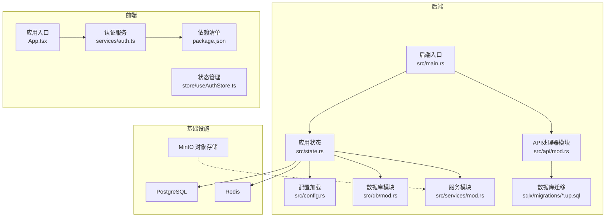

图表来源
- [backend/core/src/main.rs:1-372](file://backend/core/src/main.rs#L1-L372)
- [backend/core/src/state.rs:1-88](file://backend/core/src/state.rs#L1-L88)
- [backend/core/src/config.rs:1-116](file://backend/core/src/config.rs#L1-L116)
- [backend/core/src/db/mod.rs:1-44](file://backend/core/src/db/mod.rs#L1-L44)
- [backend/core/src/api/mod.rs:1-2](file://backend/core/src/api/mod.rs#L1-L2)
- [backend/core/src/services/mod.rs:1-8](file://backend/core/src/services/mod.rs#L1-L8)
- [frontend/src/App.tsx:1-356](file://frontend/src/App.tsx#L1-L356)
- [frontend/src/services/auth.ts:1-133](file://frontend/src/services/auth.ts#L1-L133)
- [frontend/src/store/useAuthStore.ts:1-148](file://frontend/src/store/useAuthStore.ts#L1-L148)
- [frontend/package.json:1-60](file://frontend/package.json#L1-L60)
- [docker/docker-compose.yml:1-50](file://docker/docker-compose.yml#L1-L50)

章节来源
- [backend/core/src/main.rs:1-372](file://backend/core/src/main.rs#L1-L372)
- [frontend/src/App.tsx:1-356](file://frontend/src/App.tsx#L1-L356)
- [docker/docker-compose.yml:1-50](file://docker/docker-compose.yml#L1-L50)

## 核心组件
- 应用入口与路由
  - 后端通过 main.rs 注册全部 API 路由，覆盖用户认证、角色权限、工作流审批、内容管理、HR、GIS、字典、网站管理、帮助中心、日程、外勤记录、AI 助手等模块。
  - 前端通过 App.tsx 统一管理路由与受保护页面，支持工作台与门户两种视图模式。
- 应用状态与配置
  - state.rs 定义 AppState，集中持有数据库连接池、Redis 客户端、图像生成器、各类服务实例等，通过 Builder 模式进行初始化。
  - config.rs 通过环境变量加载配置，支持数据库、Redis、JWT、AI 接口等参数。
- 数据访问与迁移
  - db/mod.rs 暴露各业务域的数据访问模块，统一使用 SQLx 连接池。
  - sqlx/migrations/* 提供数据库结构与初始数据的版本化管理，涵盖用户、角色权限、组织架构等核心表。
- 服务层与工具
  - services/mod.rs 汇聚内容爬虫、图像生成、字段服务、字典服务、帮助服务、合同服务、工作流服务、Cloudflare 发布等能力。
- 前端服务与状态
  - services/auth.ts 定义认证相关的 API 请求封装。
  - store/useAuthStore.ts 使用 Zustand 管理登录态、用户信息与令牌解析。

章节来源
- [backend/core/src/main.rs:1-372](file://backend/core/src/main.rs#L1-L372)
- [backend/core/src/state.rs:1-88](file://backend/core/src/state.rs#L1-L88)
- [backend/core/src/config.rs:1-116](file://backend/core/src/config.rs#L1-L116)
- [backend/core/src/db/mod.rs:1-44](file://backend/core/src/db/mod.rs#L1-L44)
- [backend/core/src/services/mod.rs:1-8](file://backend/core/src/services/mod.rs#L1-L8)
- [frontend/src/App.tsx:1-356](file://frontend/src/App.tsx#L1-L356)
- [frontend/src/services/auth.ts:1-133](file://frontend/src/services/auth.ts#L1-L133)
- [frontend/src/store/useAuthStore.ts:1-148](file://frontend/src/store/useAuthStore.ts#L1-L148)

## 架构总览
系统采用分层架构：
- 表现层：前端 React 应用负责用户交互与状态管理。
- API 层：后端 Axum 路由处理请求，调用服务层与数据层。
- 服务层：封装业务逻辑，如工作流引擎、AI 生成、内容爬取等。
- 数据层：SQLx 连接池访问 PostgreSQL，Redis 缓存热点数据。
- 基础设施：Docker Compose 提供数据库、缓存与对象存储。

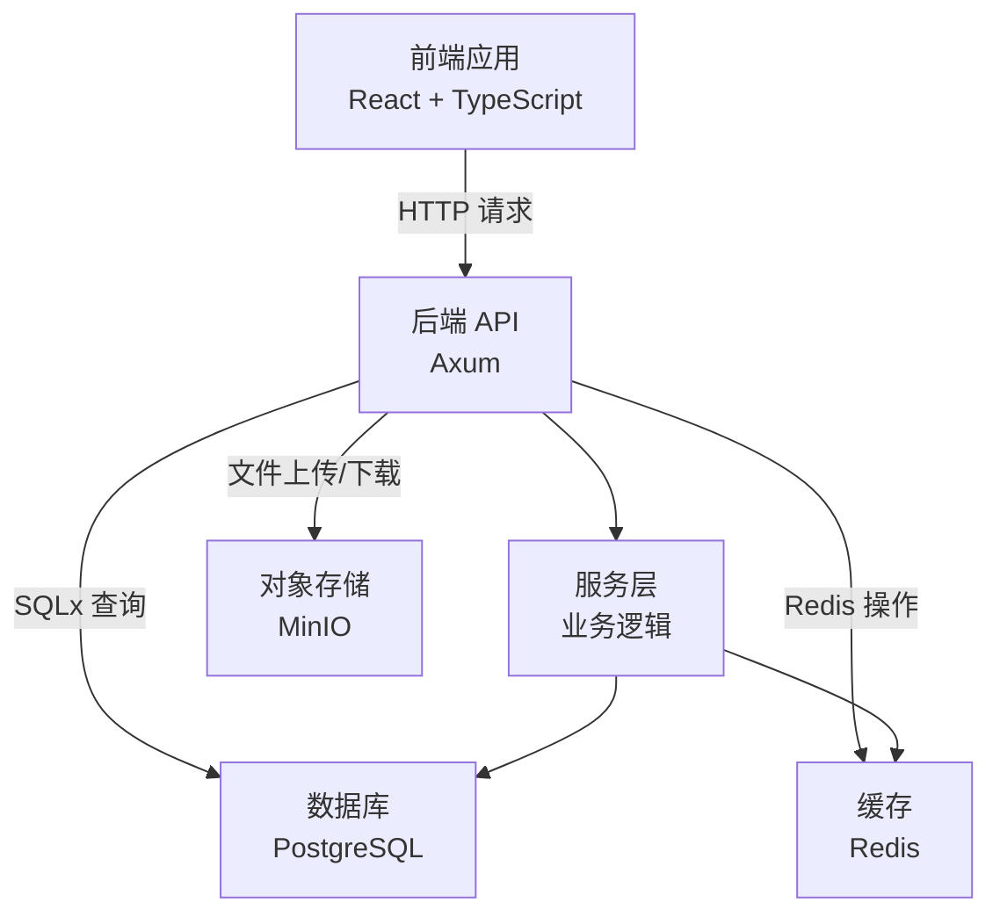

图表来源
- [backend/core/src/main.rs:1-372](file://backend/core/src/main.rs#L1-L372)
- [backend/core/src/state.rs:1-88](file://backend/core/src/state.rs#L1-L88)
- [docker/docker-compose.yml:1-50](file://docker/docker-compose.yml#L1-L50)

## 详细组件分析

### 认证与权限模块
- 用户认证
  - 后端提供登录、注册、修改密码、用户增删改查、用户状态变更、用户审批等接口。
  - 前端通过 services/auth.ts 封装请求，store/useAuthStore.ts 管理登录态与用户信息。
- 角色与权限
  - 数据库迁移中定义角色、权限与关联表，支持系统内置角色与权限，并自动为管理员分配全部权限。
  - 前端路由中通过 requireAdmin 等守卫实现页面级权限控制。

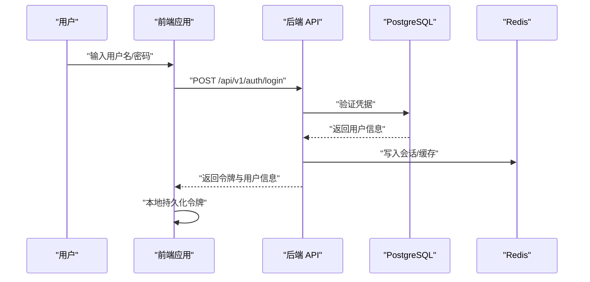

图表来源
- [backend/core/src/main.rs:84-96](file://backend/core/src/main.rs#L84-L96)
- [frontend/src/services/auth.ts:72-75](file://frontend/src/services/auth.ts#L72-L75)
- [frontend/src/store/useAuthStore.ts:63-89](file://frontend/src/store/useAuthStore.ts#L63-L89)

章节来源
- [backend/core/src/main.rs:84-96](file://backend/core/src/main.rs#L84-L96)
- [frontend/src/services/auth.ts:1-133](file://frontend/src/services/auth.ts#L1-L133)
- [frontend/src/store/useAuthStore.ts:1-148](file://frontend/src/store/useAuthStore.ts#L1-L148)
- [backend/core/sqlx/migrations/021_create_roles_and_permissions_tables.up.sql:1-127](file://backend/core/sqlx/migrations/021_create_roles_and_permissions_tables.up.sql#L1-L127)

### 工作流审批模块
- 工作流引擎
  - 支持工作流定义、步骤调整、审批任务创建与处理、模板管理等。
- 审批评论与会议纪要
  - 提供 AI 生成审批意见与优化建议、会议纪要生成与优化。

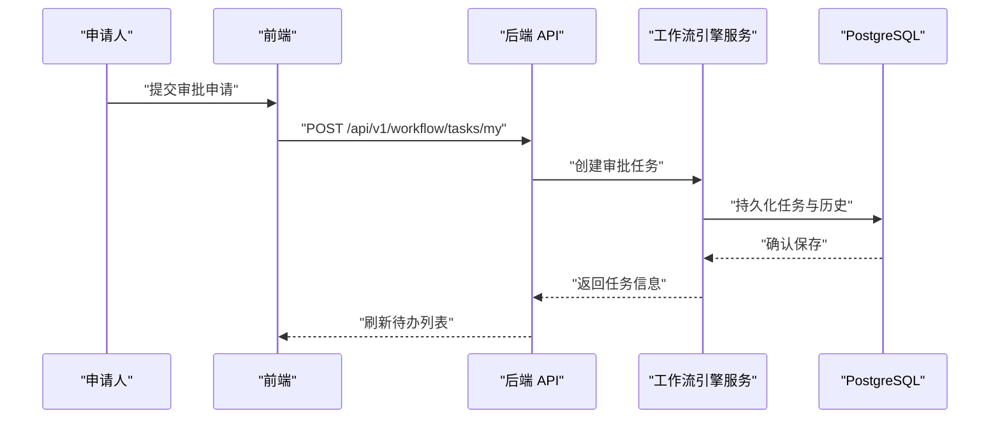

图表来源
- [backend/core/src/main.rs:186-192](file://backend/core/src/main.rs#L186-L192)
- [backend/core/src/api/mod.rs:1-2](file://backend/core/src/api/mod.rs#L1-L2)

章节来源
- [backend/core/src/main.rs:112-137](file://backend/core/src/main.rs#L112-L137)
- [backend/core/src/main.rs:186-192](file://backend/core/src/main.rs#L186-L192)

### 内容管理与网站管理模块
- CMS
  - 支持分类、文章的 CRUD、审阅流程、公开接口等。
- 网站管理
  - 支持站点设置、预览、生成与部署、部署历史查询。

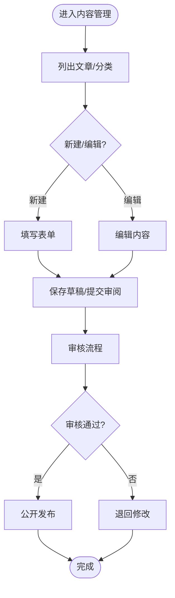

图表来源
- [backend/core/src/main.rs:51-64](file://backend/core/src/main.rs#L51-L64)
- [backend/core/src/main.rs:213-219](file://backend/core/src/main.rs#L213-L219)

章节来源
- [backend/core/src/main.rs:51-64](file://backend/core/src/main.rs#L51-L64)
- [backend/core/src/main.rs:213-219](file://backend/core/src/main.rs#L213-L219)

### HR 管理模块
- 员工信息、职位与考勤、请假等管理能力，支持考勤签到/签退、记录查询、统计与月度报表。

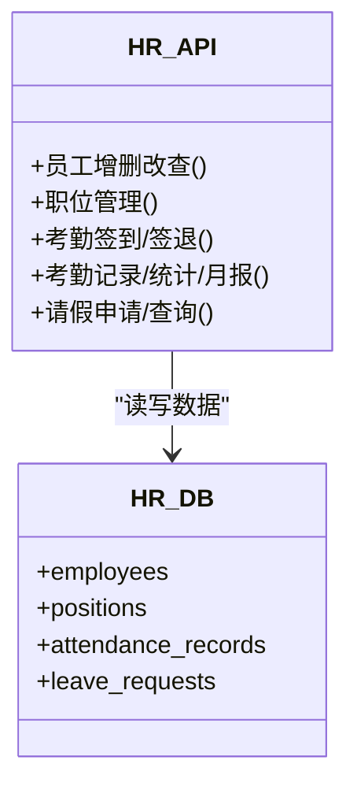

图表来源
- [backend/core/src/main.rs:164-183](file://backend/core/src/main.rs#L164-L183)

章节来源
- [backend/core/src/main.rs:164-183](file://backend/core/src/main.rs#L164-L183)

### GIS 管理模块
- 客户、项目、仓库、人员位置管理，支持位置更新与查询。

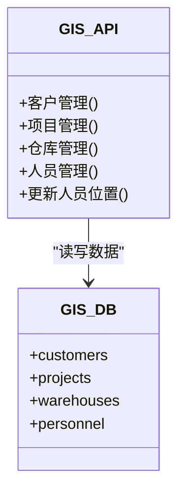

图表来源
- [backend/core/src/main.rs:248-269](file://backend/core/src/main.rs#L248-L269)

章节来源
- [backend/core/src/main.rs:248-269](file://backend/core/src/main.rs#L248-L269)

### AI 集成模块
- 图像生成、文档优化、审批意见生成、会议纪要生成与优化等。
- 配置支持 Together、HuggingFace、Ollama 等多种 AI 服务。

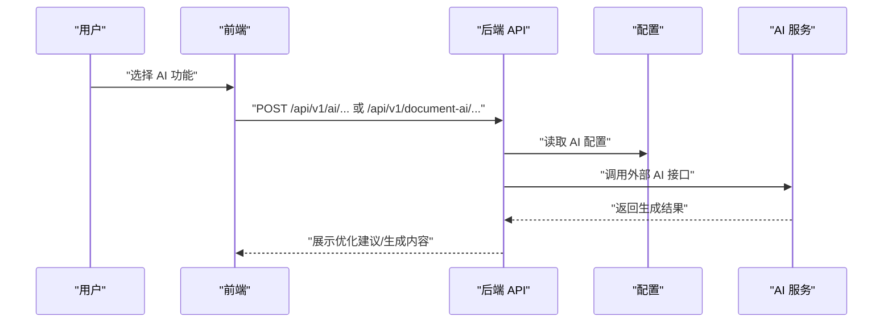

图表来源
- [backend/core/src/main.rs:68-72](file://backend/core/src/main.rs#L68-L72)
- [backend/core/src/main.rs:286-343](file://backend/core/src/main.rs#L286-L343)
- [backend/core/src/config.rs:1-116](file://backend/core/src/config.rs#L1-L116)

章节来源
- [backend/core/src/main.rs:68-72](file://backend/core/src/main.rs#L68-L72)
- [backend/core/src/main.rs:286-343](file://backend/core/src/main.rs#L286-L343)
- [backend/core/src/config.rs:1-116](file://backend/core/src/config.rs#L1-L116)

## 依赖分析
- 后端依赖
  - Axum、Tokio、SQLx、Redis、Serde、JSON Web Token、Tracing 等，构成高性能、可观测、类型安全的后端基础。
- 前端依赖
  - React、React Router、Axios、Radix UI、Tailwind、Zustand、Recharts、OpenLayers 等，构建现代化、可维护的前端体验。
- 基础设施依赖
  - Docker Compose 提供 PostgreSQL、Redis、MinIO 的本地运行环境。

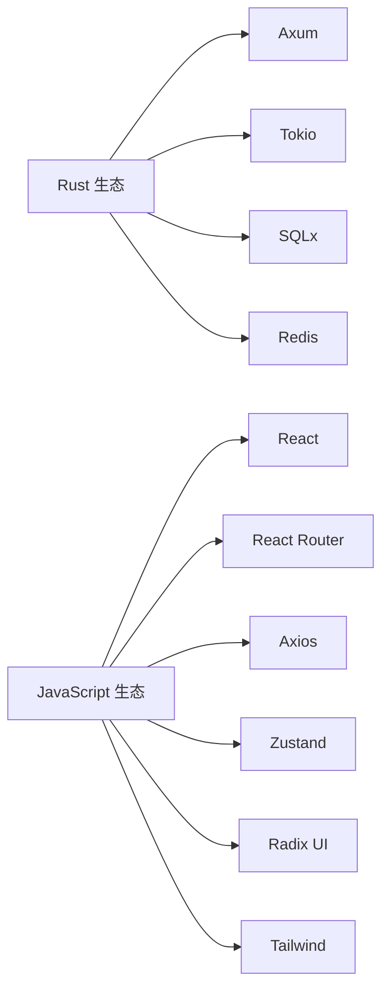

图表来源
- [backend/core/Cargo.toml:15-52](file://backend/core/Cargo.toml#L15-L52)
- [frontend/package.json:13-60](file://frontend/package.json#L13-L60)

章节来源
- [backend/core/Cargo.toml:15-52](file://backend/core/Cargo.toml#L15-L52)
- [frontend/package.json:13-60](file://frontend/package.json#L13-L60)

## 性能考虑
- 并发与异步
  - 后端基于 Tokio 异步运行时，Axum 路由处理高并发请求；SQLx 连接池限制最大连接数，避免资源耗尽。
- 缓存策略
  - Redis 用于会话与热点数据缓存，减少数据库压力；建议对高频查询结果进行缓存。
- 数据库设计
  - 迁移文件中为常用查询字段建立索引，提升查询性能；合理拆分业务表，避免大表扫描。
- 前端性能
  - 组件按需加载与懒加载路由，减少首屏体积；使用 Tailwind 与 Radix UI 减少自定义样式开销。
- 部署建议
  - 使用 Docker Compose 统一环境；生产环境建议启用 HTTPS、连接池优化与监控告警。

## 故障排除指南
- 后端启动失败
  - 检查数据库连接字符串与 Redis 地址是否正确；确认 .env 文件已加载；查看迁移是否成功执行。
- 前端登录异常
  - 检查本地存储中的令牌是否存在且未过期；确认后端 JWT 密钥与过期时间配置；核对路由守卫是否正确。
- 数据库连接问题
  - 使用迁移脚本验证表结构；检查索引是否存在；确认外键约束是否满足。
- AI 接口错误
  - 核对 AI 服务密钥与地址配置；检查网络连通性；查看服务端日志定位问题。

章节来源
- [backend/core/src/config.rs:1-116](file://backend/core/src/config.rs#L1-L116)
- [backend/core/src/state.rs:58-86](file://backend/core/src/state.rs#L58-L86)
- [frontend/src/store/useAuthStore.ts:1-148](file://frontend/src/store/useAuthStore.ts#L1-L148)

## 结论
本项目以 Rust + Axum 为核心后端，配合 React + TypeScript 前端，构建了功能完备、可扩展的企业管理系统。通过清晰的模块划分、完善的数据库迁移与配置体系、以及现代化的前端开发体验，项目既适合初学者理解企业级系统的架构与实现，也为有经验的开发者提供了可扩展的技术基座。建议在生产环境中进一步完善监控、日志与安全策略，并持续演进业务模块以满足企业不断变化的需求。

## 附录
- 部署架构图（概念示意）
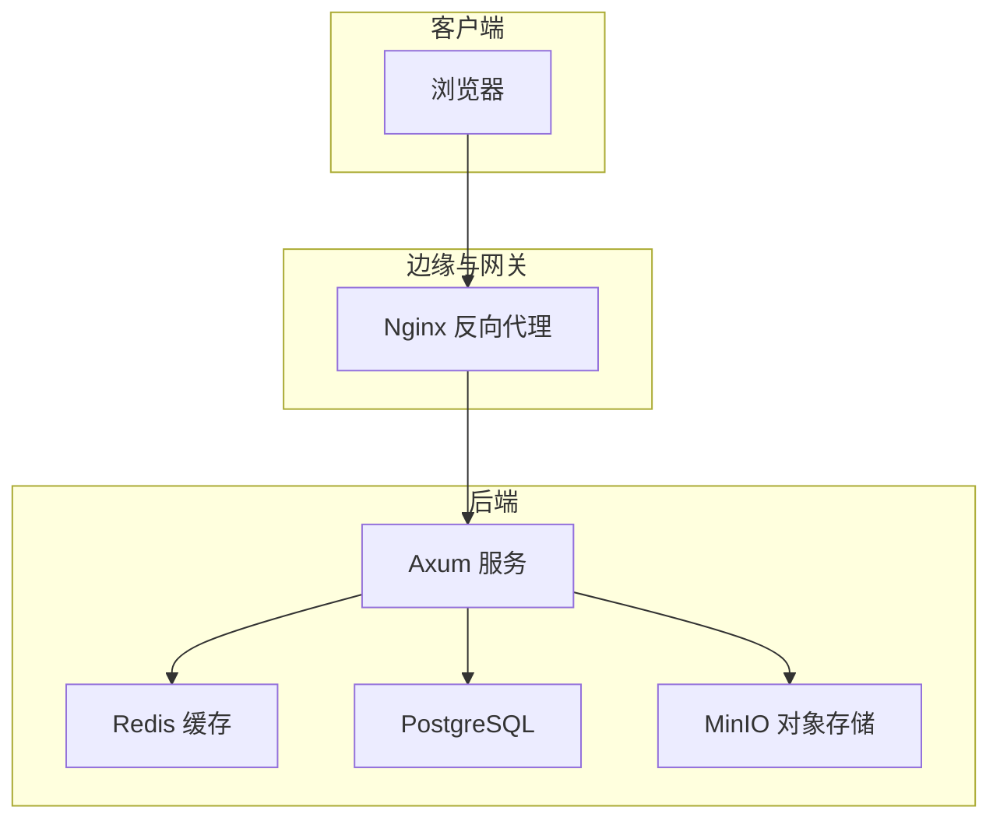

- 数据流向图（概念示意）
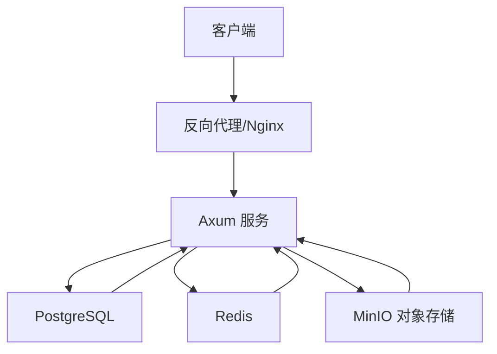