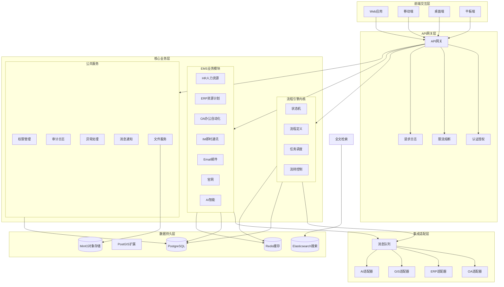
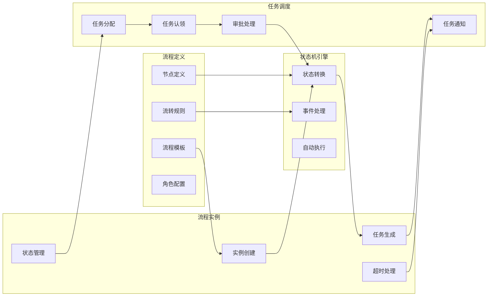

# 河北三楷深发科技股份有限公司 - 企业管理系统核心设计方案

## 1. 项目概述

### 1.1 项目背景

河北三楷深发科技股份有限公司（新三板上市企业）是一家专注于混凝土外加剂研发生产、保温材料制造、高铁工程施工及技术服务的综合性企业。为满足企业业务发展需要，结合新三板上市规范要求，打造一套统一的企业管理信息系统。

### 1.2 核心目标

1. **打通业务孤岛**：整合行政、HR、财务、法务、营销、生产、工程、供应链等核心业务
2. **流程自动化**：基于Rust流程中台实现跨系统流程自动化
3. **GIS空间可视化**：集成开源GIS组件，实现外勤管理、项目定位、资产追踪
4. **AI智能赋能**：集成本地大模型，提供智能助手、数据分析、内容生成等功能
5. **多端统一**：支持Web、移动端、桌面端多端访问
6. **上市合规**：满足新三板企业管理规范和审计要求

### 1.3 核心价值

- **统一入口**：一站式企业管理平台
- **流程驱动**：以流程为核心的业务流转
- **数据集中**：统一数据存储和分析
- **高效协作**：IM、Email、审批等一体化协作
- **智能决策**：AI辅助分析和决策支持

---

## 2. 整体架构设计

### 2.1 系统分层架构



### 2.2 架构设计原则

1. **分层解耦**：各层职责清晰，松耦合高内聚
2. **异步优先**：采用消息队列实现异步解耦
3. **流程驱动**：以Rust流程中台为核心引擎
4. **高可用**：集群部署、负载均衡、自动故障转移
5. **可扩展**：模块化设计，支持功能扩展
6. **安全合规**：满足安全要求和上市合规

---

## 3. 核心业务模块设计

### 3.1 七大管理模块（三楷深发定制）

#### 3.1.1 行政综合管理模块

| 功能模块 | 功能描述 |
|---------|---------|
| **组织架构** | 部门设置、层级调整、岗位编制 |
| **制度管理** | 制度制定、修订、公示、归档（生产/工程专项） |
| **公文管理** | 发文拟稿、审批、传阅、归档 |
| **通知公告** | 内部通知、外部公示、紧急通知发布 |
| **证照资质** | 营业执照、生产许可证、工程资质、高新企业等管理 |
| **固定资产** | 办公设备、生产设备、工程器具、车辆管理 |
| **办公用品** | 采购、入库、领用、盘点 |
| **后勤保障** | 厂区保洁、安保、水电、食堂、宿舍 |
| **档案管理** | 电子/纸质档案，生产记录、工程资料 |
| **企业文化** | 活动策划、员工关怀、宣传推广 |

#### 3.1.2 人力资源管理模块

| 功能模块 | 功能描述 |
|---------|---------|
| **员工档案** | 全员档案、研发/技术/工程专项档案 |
| **人事异动** | 入职/离职/调岗/晋升审批 |
| **劳动合同** | 合同签订、续签、解除（含劳务派遣、工程外包） |
| **资质管理** | 研发人员职称、工程人员执业资格、特种作业证书 |
| **招聘管理** | 岗位发布、简历筛选、面试安排（重点研发、生产、工程） |
| **培训管理** | 新员工培训、岗位技能、研发/工程专项、安全培训 |
| **考勤管理** | 全员考勤、车间/工程现场考勤、请假加班出差 |
| **薪酬管理** | 薪资核算、发放、台账、绩效奖金（区分岗位体系） |
| **绩效考核** | 考核方案、评分、结果统计、反馈 |

#### 3.1.3 财务管理模块

| 功能模块 | 功能描述 |
|---------|---------|
| **出纳收支** | 日常收支、银行对账、现金管理 |
| **会计账务** | 凭证录入、账簿管理、结账（符合上市规范） |
| **费用报销** | 员工报销、部门费用、工程费用、生产费用审批 |
| **应收账款** | 客户回款、对账、逾期提醒、坏账处理 |
| **应付账款** | 供应商付款、对账、付款审批（化工原料、设备、工程） |
| **税务管理** | 发票管理、纳税申报、税务筹划（高新技术优惠） |
| **成本核算** | 生产成本、工程成本、研发成本核算 |
| **预算管理** | 年度/季度预算、执行跟踪、调整、分析 |
| **资金管理** | 资金计划、调配、融资管理 |

#### 3.1.4 合同法务管理模块

| 功能模块 | 功能描述 |
|---------|---------|
| **合同模板** | 采购、销售、工程施工、技术服务、研发合作等模板 |
| **合同录入** | 手动录入、批量导入，关联客户/供应商/项目 |
| **合同评审** | 分级评审、多部门协同、意见反馈、评审记录 |
| **合同审批** | 按金额/类型分级审批、驳回/通过、流程痕迹 |
| **合同履约** | 进度节点、付款节点、交货节点跟踪、异常预警 |
| **法务合规** | 合同合规审查、风险排查、知识产权、涉密管理 |
| **纠纷处理** | 纠纷登记、证据收集、协商/诉讼、结果归档 |
| **用印管理** | 用印申请、审批、用印记录，关联合同 |
| **工程合同** | 分包合同、劳务合同、材料供货合同专项管理 |

#### 3.1.5 市场营销管理模块

| 功能模块 | 功能描述 |
|---------|---------|
| **客户管理** | 高铁建设、建筑企业、市政等客户档案、跟进、分级 |
| **供应商管理** | 原料、设备、工程分包商准入、评估、台账 |
| **市场推广** | 产品推广（外加剂、保温材料）、业务推广（工程、服务） |
| **渠道管理** | 销售渠道、工程合作渠道开发维护 |
| **招投标管理** | 招标信息收集、投标文件编制、开标跟踪、中标记录 |
| **商机管理** | 商机录入、跟进、转化、统计（重点高铁、市政） |
| **商务谈判** | 客户/供应商/分包商谈判记录、报价管理 |
| **报价管理** | 材料报价、工程报价单编制审核 |
| **销售订单** | 材料销售、技术服务订单录入跟踪 |

#### 3.1.6 项目&生产运营模块

**生产管理（生产部）**
| 功能模块 | 功能描述 |
|---------|---------|
| **生产计划** | 年度/月度/周计划、批次计划，结合订单和原料 |
| **生产排程** | 生产线排程、设备调度、人员排班（3条外加剂线、岩棉线） |
| **车间执行** | 生产任务下达、过程跟踪、记录填写（原料、搅拌、检测、包装） |
| **质量管控** | 原料检测、过程检测、成品检测，不合格品处理 |
| **设备管理** | 生产线设备、检测设备台账、维保计划、维修申请 |
| **安全生产** | 车间安全、操作规范、安全培训、检查、隐患整改 |

**工程项目管理（工程部）**
| 功能模块 | 功能描述 |
|---------|---------|
| **工程立项** | 立项申请、审批、档案（高铁维护、超低能耗建筑） |
| **施工计划** | 施工方案、进度计划、里程碑、人员/机具/材料调配 |
| **现场管理** | 人员派工、签到、施工记录、进度跟踪、安全、文明施工 |
| **工程质量** | 质量检查、隐蔽工程验收、安全巡查、隐患整改 |
| **工程验收** | 分项验收、竣工验收、验收报告、工程结算、回款跟踪 |
| **资料归档** | 施工图纸、验收记录、检测报告、结算资料统一归档 |
| **GIS外勤** | 外勤人员定位、轨迹追踪、现场签到、就近派工 |

**研发协同管理（研发中心）**
| 功能模块 | 功能描述 |
|---------|---------|
| **研发项目** | 研发立项、计划、进度、成果跟踪 |
| **技术资料** | 研发报告、配方资料、检测数据、专利管理 |
| **实验室管理** | 实验室设备、试剂、检测流程、检测记录 |

#### 3.1.7 供应链管理模块

| 功能模块 | 功能描述 |
|---------|---------|
| **采购需求** | 生产原料、工程材料、设备/耗材需求提交审核 |
| **采购计划** | 结合生产计划、工程计划制定采购计划和预算 |
| **采购执行** | 供应商比价、招标、合同签订、到货验收、入库 |
| **采购台账** | 采购记录、费用、付款记录统计分析 |
| **库存管理** | 原料、半成品、成品、工程材料、耗材台账、入库出库、盘点 |
| **库存预警** | 低库存、过期原料/材料、库存积压预警 |
| **设备管理** | 生产设备、工程机具、实验室设备台账、维保、报废 |
| **耗材管理** | 生产耗材、工程耗材、实验室试剂、办公耗材 |
| **GIS仓储** | 仓库位置可视化、库存分布展示、物流追踪 |

### 3.2 GIS地理信息模块

#### 3.2.1 核心功能

| 功能类别 | 功能描述 |
|---------|---------|
| **地图展示** | OpenStreetMap开源底图、天地图、卫星影像切换 |
| **数据标注** | 客户位置、供应商位置、仓库位置、工程项目标注 |
| **外勤管理** | 外勤人员实时定位、轨迹追踪、电子围栏、就近派工 |
| **空间查询** | 按区域检索业务数据、就近客户查询 |
| **空间统计** | 区域销售统计、项目分布统计、客户热力图 |
| **资产位置** | 生产设备、工程车辆、实验室设备位置管理 |
| **路径规划** | 配送路线优化、巡检路线规划 |

#### 3.2.2 技术实现

- **GIS服务端**：GeoServer开源地理空间服务器
- **GIS桌面端**：QGIS桌面工具
- **GIS前端**：OpenLayers WebGIS框架
- **空间数据库**：PostgreSQL + PostGIS扩展
- **底图资源**：OpenStreetMap、天地图公共服务

### 3.3 AI智能助手模块

#### 3.3.1 核心功能

| 功能类别 | 功能描述 |
|---------|---------|
| **智能问答** | 系统操作问题解答、业务流程咨询、政策制度查询 |
| **内容生成** | 文档优化、方案报告生成、产品描述撰写 |
| **文生图** | 产品宣传配图、设计灵感参考、施工现场示意 |
| **数据分析** | 业务数据智能分析、销售预测、异常预警 |
| **流程辅助** | 流程模板推荐、审批意见辅助生成 |

#### 3.3.2 技术实现

- **本地大模型**：Ollama + Qwen2.5-7B/14B
- **向量数据库**：后期扩展RAG功能
- **集成方式**：API封装，前端统一调用

---

## 4. Rust流程中台核心设计

### 4.1 流程引擎架构



### 4.2 核心能力

1. **状态机驱动**：基于状态机实现流程节点跳转
2. **适配器模式**：对接OA、ERP、GIS等系统
3. **异步解耦**：基于RabbitMQ的消息驱动
4. **幂等性保证**：防止重复处理
5. **事务控制**：确保数据一致性
6. **超时处理**：自动提醒和超时自动处理

### 4.3 预置流程模板

| 流程模板 | 流程节点 | 适用场景 |
|---------|---------|---------|
| **费用报销** | 申请人 → 部门经理 → 财务 → 总经理（>1万） | 日常费用报销 |
| **采购申请** | 需求部门 → 采购 → 财务 → 总经理（>5万） | 原料、设备采购 |
| **项目立项** | 项目经理 → 工程部 → 技术评审 → 财务 → 总经理 → 董事长（>500万） | 工程项目立项 |
| **合同审批** | 起草 → 法务评审 → 财务 → 总经理 → 用印 | 销售/采购/工程合同 |
| **请假审批** | 员工 → 直接主管 → 部门经理 → HR备案 | 事假、病假、年假 |
| **入职审批** | HR → 部门经理 → 总经理 → 账号创建 | 新员工入职 |

---

## 5. 技术栈设计

### 5.1 后端技术栈（Rust）

| 技术类别 | 技术选型 | 版本/说明 |
|---------|---------|---------|
| **开发语言** | Rust | 1.75+ |
| **Web框架** | Axum | 0.7+ |
| **异步运行时** | Tokio | 1.0+ |
| **数据库** | PostgreSQL | 15+，主从架构 |
| **空间扩展** | PostGIS | 3.4+ |
| **ORM/数据访问** | SQLx + SeaORM | 异步、类型安全 |
| **缓存** | Redis | 7.0+，主从 + Sentinel |
| **消息队列** | RabbitMQ + lapin | 3.12+，集群 + 镜像队列 |
| **全文搜索** | Elasticsearch | 8.0+ |
| **对象存储** | MinIO | 2024+ |
| **认证授权** | JWT + OAuth2 | axum-jwt |
| **序列化** | Serde | 1.0+ |
| **日志** | Tracing | 结构化日志 |
| **HTTP客户端** | Reqwest | 异步客户端 |
| **GIS服务** | GeoServer | 开源地理服务器 |

### 5.2 前端技术栈

| 技术类别 | 技术选型 | 说明 |
|---------|---------|---------|
| **Web应用** | React 18 + TypeScript + Vite | 管理后台 |
| **移动端** | React Native | iOS/Android |
| **桌面端** | Tauri + React | Windows/macOS/Linux |
| **UI框架** | TailwindCSS | 原子化CSS |
| **状态管理** | Redux Toolkit | 全局状态 |
| **图表组件** | ECharts | 数据可视化 |
| **GIS组件** | OpenLayers | 地图展示 |
| **HTTP请求** | Axios | API调用 |

### 5.3 AI技术栈

| 技术类别 | 技术选型 | 说明 |
|---------|---------|---------|
| **本地模型服务** | Ollama | 开源模型管理 |
| **大模型** | Qwen2.5-7B/14B-Instruct | 通义千问开源模型 |
| **向量数据库** | Qdrant（可选） | RAG功能 |
| **AI API** | 自定义Axum封装 | 统一API接口 |

### 5.4 部署技术栈

| 技术类别 | 技术选型 | 说明 |
|---------|---------|---------|
| **容器化** | Docker | 应用容器化 |
| **编排** | Kubernetes | 容器编排（可选） |
| **反向代理** | Nginx | 负载均衡 |
| **监控** | Prometheus + Grafana | 系统监控 |
| **日志** | ELK Stack | 日志收集分析 |

---

## 6. API设计规范

### 6.1 API架构

```
/api/v1/
├── auth/              # 认证授权
├── users/             # 用户管理
├── organization/      # 组织架构（部门、职位、审批规则）
├── hr/                # 人力资源
├── erp/               # ERP模块
├── oa/                # OA模块
├── workflow/          # 流程引擎
├── im/                # 即时通讯
├── email/             # 邮件
├── gis/               # GIS模块
├── ai/                # AI智能
├── cms/               # 内容管理
├── admin/             # 系统管理
└── help/              # 帮助中心
```

### 6.2 响应格式规范

**成功响应：**
```json
{
  "code": 200,
  "message": "success",
  "data": { ... },
  "timestamp": 1778537324
}
```

**失败响应：**
```json
{
  "code": 400,
  "message": "Invalid parameter",
  "error": "具体错误信息",
  "timestamp": 1778537324
}
```

### 6.3 核心API示例

#### 6.3.1 流程引擎API

| 接口 | 方法 | 说明 |
|-----|------|------|
| `/api/v1/workflow/definitions` | GET | 获取流程模板列表 |
| `/api/v1/workflow/definitions` | POST | 创建流程模板 |
| `/api/v1/workflow/definitions/{id}` | PUT | 更新流程模板 |
| `/api/v1/workflow/instances` | POST | 发起流程实例 |
| `/api/v1/workflow/instances/{id}` | GET | 获取流程实例详情 |
| `/api/v1/workflow/tasks` | GET | 获取待办任务 |
| `/api/v1/workflow/tasks/{id}/approve` | POST | 审批任务 |

#### 6.3.2 GIS API

| 接口 | 方法 | 说明 |
|-----|------|------|
| `/api/v1/gis/locations` | POST | 上报位置 |
| `/api/v1/gis/locations/{user_id}/track` | GET | 获取轨迹 |
| `/api/v1/gis/markers` | GET | 获取标注点 |
| `/api/v1/gis/markers` | POST | 创建标注点 |
| `/api/v1/gis/geocode` | POST | 地址解析（转经纬度） |

#### 6.3.3 AI API

| 接口 | 方法 | 说明 |
|-----|------|------|
| `/api/v1/ai/chat` | POST | 智能问答 |
| `/api/v1/ai/generate-image` | POST | 文生图 |
| `/api/v1/ai/models` | GET | 获取模型列表 |
| `/api/v1/ai/health` | GET | 健康检查 |

---

## 7. 数据模型设计

### 7.1 核心表设计

#### 7.1.1 用户与组织架构

| 表名 | 说明 |
|-----|------|
| `users` | 用户表（含员工信息） |
| `roles` | 角色表 |
| `permissions` | 权限表 |
| `departments` | 部门表 |
| `position_levels` | 职位级别表 |
| `positions` | 职位表 |

#### 7.1.2 流程引擎

| 表名 | 说明 |
|-----|------|
| `workflows` | 工作流定义表 |
| `workflow_steps` | 工作流步骤表 |
| `approval_rules` | 审批规则表 |
| `workflow_instances` | 流程实例表 |
| `workflow_tasks` | 待办任务表 |
| `approval_records` | 审批记录表 |

#### 7.1.3 业务模块

| 表名 | 说明 |
|-----|------|
| `employees` | 员工详情表 |
| `attendance_records` | 考勤记录表 |
| `leave_requests` | 请假申请表 |
| `contracts` | 合同表 |
| `projects` | 项目表 |
| `customers` | 客户表 |
| `suppliers` | 供应商表 |
| `products` | 产品表 |
| `orders` | 订单表 |
| `inventory` | 库存表 |

#### 7.1.4 GIS相关

| 表名 | 说明 |
|-----|------|
| `location_records` | 位置记录表 |
| `gis_markers` | GIS标注点表 |
| `geo_fences` | 电子围栏表 |

#### 7.1.5 帮助与配置

| 表名 | 说明 |
|-----|------|
| `help_categories` | 帮助分类表 |
| `help_articles` | 帮助文章表 |
| `dict_types` | 字典类型表 |
| `dict_items` | 字典项表 |

### 7.2 字典数据规范

| 字典类型编码 | 字典项示例 |
|-------------|-----------|
| `workflow_status` | draft/active/inactive |
| `approval_status` | pending/processing/approved/rejected |
| `approval_mode` | any/all/majority |
| `leave_type` | 事假/病假/年假/产假/婚假 |
| `contract_type` | 销售/采购/工程/劳务/技术 |
| `project_type` | 高铁维护/建筑保温/超低能耗/改造维修 |
| `product_category` | 混凝土外加剂/保温材料/原料/设备 |

---

## 8. 配置管理设计

### 8.1 配置中心

提供统一的配置管理界面，包含：

1. **系统配置**：系统名称、Logo、版权信息
2. **安全配置**：密码策略、登录限制、JWT配置
3. **邮件配置**：SMTP服务器、端口、发件人
4. **文件配置**：存储路径、文件大小限制、允许类型
5. **通知配置**：通知模板、通知渠道
6. **GIS配置**：地图底图、API密钥

### 8.2 系统初始化配置清单

| 配置类别 | 必需配置项 | 状态 |
|---------|----------|------|
| **系统基础** | 系统名称、Logo、版权信息 | ✅ 已配置 |
| **安全** | JWT密钥、密码策略、登录限制 | ✅ 已配置 |
| **邮件** | SMTP服务器、端口、发件人、密码 | ✅ 已配置 |
| **存储** | 文件存储路径、大小限制、类型 | ✅ 已配置 |
| **角色权限** | 角色定义、权限定义、角色-权限映射 | ✅ 已配置 |
| **工作流** | 审批规则、工作流定义 | ✅ 已配置 |
| **组织架构** | 部门、职位、职位级别 | ✅ 已配置 |
| **字典数据** | 字典类型、字典项 | ✅ 已配置 |
| **帮助中心** | 分类、文章 | ✅ 已配置 |

---

## 9. 安全设计

### 9.1 认证授权

- **认证方式**：JWT + OAuth2
- **多因素认证**：密码 + 验证码（可选）
- **权限模型**：RBAC（基于角色的访问控制）
- **API限流**：防止滥用
- **Token有效期**：24小时，支持刷新

### 9.2 数据安全

- **传输加密**：HTTPS/TLS
- **存储加密**：敏感数据加密存储
- **数据脱敏**：展示时脱敏处理
- **定期备份**：数据库、文件系统定期备份
- **审计日志**：记录所有关键操作

### 9.3 网络安全

- **内网部署**：核心服务不暴露公网
- **防火墙**：网络访问控制
- **IP白名单**：外部系统接口限制
- **WAF**：Web应用防火墙（可选）

---

## 10. 部署架构

### 10.1 部署方案

```mermaid
flowchart TB
    subgraph 客户端["客户端层"]
        Browser[浏览器]
        Phone[手机端]
        PC[桌面端]
    end

    subgraph 接入层["接入层"]
        Nginx[Nginx<br/>负载均衡]
    end

    subgraph 应用层["应用层"]
        App1[EMS服务实例1]
        App2[EMS服务实例2]
        GeoServer[GeoServer]
    end

    subgraph 中间件层["中间件层"]
        Redis[(Redis集群<br/>主从+Sentinel)]
        RabbitMQ[(RabbitMQ集群<br/>镜像队列)]
        Elasticsearch[(Elasticsearch)]
        MinIO[(MinIO对象存储)]
    end

    subgraph 数据层["数据层"]
        PGMaster[(PostgreSQL<br/>主库)]
        PGSlaver[(PostgreSQL<br/>从库)]
    end

    Browser & Phone & PC --> Nginx
    Nginx --> App1 & App2
    App1 & App2 --> GeoServer
    App1 & App2 --> Redis & RabbitMQ & Elasticsearch & MinIO
    App1 & App2 --> PG Master
    PG Master -.->|数据同步| PGSlaver
```

### 10.2 环境配置

| 环境 | 用途 | 配置 |
|-----|------|------|
| 开发 | 本地调试 | 单节点 |
| 测试 | 功能测试 | 模拟生产环境 |
| 预发布 | 性能测试 | 与生产一致 |
| 生产 | 正式运行 | 高可用集群 |

---

## 11. 实施计划

### 11.1 阶段规划

| 阶段 | 时间 | 核心内容 |
|-----|------|---------|
| **Phase 1** | 1-2个月 | 基础架构搭建（后端框架、前端框架、数据库、中间件） |
| **Phase 2** | 3-4个月 | 核心模块开发（流程引擎、HR、配置管理、帮助中心） |
| **Phase 3** | 5-6个月 | 业务模块开发（行政、财务、法务、营销） |
| **Phase 4** | 7-8个月 | 生产/工程/供应链模块、GIS集成 |
| **Phase 5** | 9-10个月 | AI模块、IM/Email、多端适配 |
| **Phase 6** | 11-12个月 | 测试优化、部署上线、培训 |

### 11.2 关键里程碑

| 里程碑 | 时间 | 交付物 |
|-------|------|-------|
| M1 | 第2个月 | 基础架构完成 |
| M2 | 第4个月 | 核心流程+HR可用 |
| M3 | 第6个月 | 5大模块上线 |
| M4 | 第8个月 | 生产/工程/GIS上线 |
| M5 | 第10个月 | AI+多端完成 |
| M6 | 第12个月 | 全系统正式上线 |

---

## 12. 风险与应对

| 风险类别 | 风险描述 | 风险等级 | 应对措施 |
|---------|---------|---------|---------|
| **技术风险** | Rust技术栈学习曲线高 | 中 | 技术培训、代码规范、结对编程 |
| **进度风险** | 功能多、周期长、延期风险 | 中 | 敏捷开发、分阶段交付、优先级管理 |
| **集成风险** | GIS、AI等第三方集成复杂 | 中 | 前期验证、原型开发、备选方案 |
| **性能风险** | 大数据量、高并发 | 中 | 性能测试、缓存优化、集群部署 |
| **安全风险** | 上市企业安全合规要求高 | 高 | 安全审计、渗透测试、定期加固 |
| **数据风险** | 数据迁移、数据一致性 | 高 | 数据备份、验证、回滚方案 |

---

## 13. 总结

本核心设计方案基于河北三楷深发科技股份有限公司的业务特点和需求，整合了EMS企业管理系统、Rust流程中台、GIS地理信息、AI智能助手等多个系统的能力，形成了统一的企业管理平台。

### 核心亮点

1. **Rust流程引擎**：高性能、高可靠的流程中台核心
2. **七大业务模块**：覆盖三楷深发全部核心业务
3. **GIS空间可视化**：解决外勤、项目、资产的空间管理需求
4. **AI智能赋能**：本地大模型提供智能助手和分析能力
5. **多端统一**：Web、移动、桌面端全面覆盖
6. **上市合规**：满足新三板企业管理和审计要求

### 后续迭代方向

- Phase 1：基础架构和核心流程
- Phase 2：业务模块和GIS集成
- Phase 3：AI功能和高级特性
- Phase 4：性能优化和生态建设

---

**文档版本**：v1.0  
**创建日期**：2026-05-12  
**适用项目**：河北三楷深发EMS系统  
**文档状态**：✅ 核心设计方案
