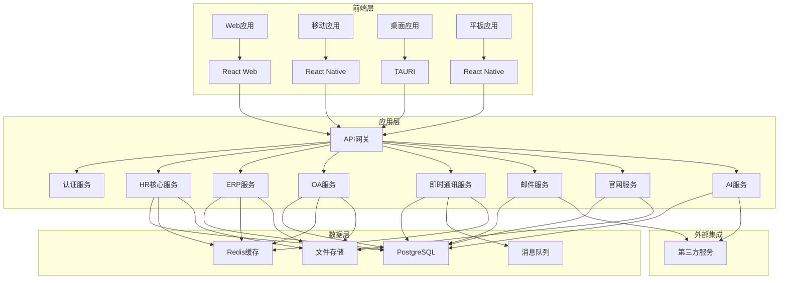
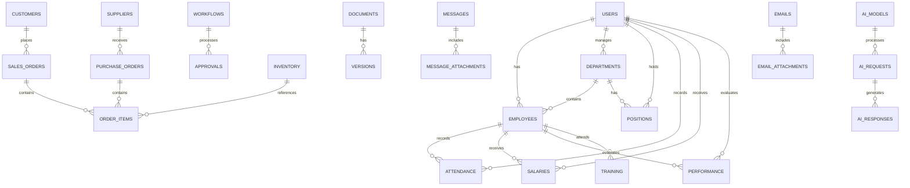

# EMS系统架构设计

## 1. 项目概述
EMS（Enterprise Management System）是一个集成了ERP、OA、IM、Email、官网、AI功能的企业管理系统，支持多端访问（手机端、平板端、web端、桌面端），以HR系统和主要信息为核心模块，具有高度可扩展性。

## 2. 架构设计

### 2.1 整体架构

### 2.2 技术栈
- **前端**：
  - Web端：React@18 + TypeScript + TailwindCSS + Vite
  - 移动端：React Native + TypeScript
  - 桌面端：TAURI + React + TypeScript
- **后端**：
  - 核心框架：Rust + Axum@0.7+
  - API网关：Axum + Tower
  - 认证：JWT + OAuth2
- **数据层**：
  - 主数据库：PostgreSQL
  - 缓存：Redis
  - 消息队列：RabbitMQ
  - 文件存储：MinIO/S3
- **AI集成**：
  - 本地模型：llama.cpp
  - 云服务：OpenAI API

## 3. 核心模块设计

### 3.1 HR核心模块
- **员工管理**：基本信息、档案、合同管理
- **考勤管理**：打卡、请假、加班、排班
- **薪资管理**：工资计算、发放、税务
- **招聘管理**：职位发布、简历筛选、面试流程
- **培训管理**：课程、考试、证书
- **绩效考核**：KPI设置、评估、反馈

### 3.2 ERP模块
- **财务管理**：会计、预算、报表
- **采购管理**：供应商、采购订单、库存
- **销售管理**：客户、销售订单、回款
- **库存管理**：仓库、物料、出入库
- **生产管理**：生产计划、工单、BOM

### 3.3 OA模块
- **流程管理**：审批流程、工作流引擎
- **文档管理**：知识库、文档版本控制
- **会议管理**：会议安排、纪要、任务
- **公告管理**：公司通知、新闻发布

### 3.4 IM模块
- **即时通讯**：文字、语音、视频
- **群聊**：部门群、项目群
- **文件传输**：文档、图片、视频
- **消息通知**：系统消息、业务提醒

### 3.5 Email模块
- **邮件系统**：收发邮件、邮件模板
- **邮件营销**：批量发送、效果分析
- **邮件集成**：与OA、CRM集成

### 3.6 官网模块
- **内容管理**：新闻、产品、招聘
- **用户管理**：访客、潜在客户
- **SEO优化**：搜索引擎优化
- **数据分析**：访问统计、转化分析

### 3.7 AI模块
- **智能助手**：问答、文档摘要
- **数据分析**：业务数据智能分析
- **流程优化**：智能推荐、自动化
- **预测分析**：销售预测、人力资源规划

## 4. 多端适配设计

### 4.1 响应式设计
- **Web端**：桌面优先，支持1024px以上屏幕
- **平板端**：768px-1023px屏幕适配
- **移动端**：320px-767px屏幕适配
- **桌面端**：TAURI原生应用，支持Windows、macOS、Linux

### 4.2 技术实现
- **前端**：
  - 使用TailwindCSS实现响应式布局
  - React Native实现原生移动体验
  - TAURI实现跨平台桌面应用
- **后端**：
  - 统一API接口，支持不同设备访问
  - 设备检测与适配逻辑
  - 性能优化，针对不同网络环境

## 5. 可扩展性设计

### 5.1 模块化架构
- **微服务设计**：每个功能模块独立部署
- **插件系统**：支持第三方插件集成
- **API扩展**：RESTful API设计，支持版本控制
- **配置中心**：集中管理系统配置

### 5.2 数据扩展性
- **分库分表**：支持大数据量存储
- **数据分区**：按业务维度分区
- **缓存策略**：多级缓存设计
- **数据同步**：实时数据同步机制

## 6. 安全设计

### 6.1 认证与授权
- **多因素认证**：密码 + 验证码 + 生物识别
- **基于角色的权限控制**：RBAC模型
- **API权限**：细粒度API访问控制
- **会话管理**：安全的会话存储与过期机制

### 6.2 数据安全
- **数据加密**：传输加密、存储加密
- **数据备份**：定期备份、灾难恢复
- **审计日志**：操作记录、异常监控
- **合规性**：符合GDPR、ISO27001等标准

## 7. 性能优化

### 7.1 前端优化
- **代码分割**：按需加载
- **缓存策略**：资源缓存
- **懒加载**：图片、组件懒加载
- **WebWorker**：复杂计算移至后台

### 7.2 后端优化
- **数据库优化**：索引、查询优化
- **缓存优化**：Redis缓存策略
- **并发处理**：异步IO、线程池
- **负载均衡**：多实例部署

## 8. 部署与运维

### 8.1 部署策略
- **容器化**：Docker容器
- **编排**：Kubernetes
- **CI/CD**：自动化部署流程
- **环境隔离**：开发、测试、生产环境

### 8.2 监控与告警
- **系统监控**：CPU、内存、磁盘
- **应用监控**：API响应时间、错误率
- **日志管理**：集中式日志系统
- **告警机制**：异常自动告警

## 9. 数据模型设计

### 9.1 核心数据模型

### 9.2 数据模型详情
- **用户管理**：用户基本信息、权限、角色
- **HR管理**：员工档案、考勤、薪资、绩效
- **ERP管理**：客户、供应商、订单、库存
- **OA管理**：流程、文档、会议、公告
- **IM管理**：消息、群聊、文件传输
- **Email管理**：邮件、模板、发送记录
- **官网管理**：内容、用户、访问统计
- **AI管理**：模型、请求、响应、分析

## 10. API设计

### 10.1 API架构
- **RESTful API**：标准REST架构
- **GraphQL API**：支持复杂查询
- **WebSocket API**：实时通讯
- **gRPC API**：高性能内部服务通信

### 10.2 API版本控制
- **URL版本**：/api/v1/...
- **Header版本**：Accept-Version
- **向后兼容**：支持旧版本API

### 10.3 核心API示例
- **认证API**：登录、注册、刷新令牌
- **HR API**：员工管理、考勤管理、薪资管理
- **ERP API**：订单管理、库存管理、财务管理
- **OA API**：流程管理、文档管理、会议管理
- **IM API**：消息发送、群聊管理、文件传输
- **Email API**：邮件发送、模板管理、统计分析
- **官网API**：内容管理、用户管理、访问统计
- **AI API**：智能助手、数据分析、预测分析

## 11. 实施计划

### 11.1 阶段划分
1. **基础架构搭建**：前端框架、后端服务、数据库
2. **核心模块开发**：HR系统、认证系统、基础设置
3. **功能模块集成**：ERP、OA、IM、Email
4. **高级功能开发**：AI模块、官网系统
5. **多端适配**：Web、移动、桌面、平板
6. **测试与优化**：功能测试、性能优化、安全测试
7. **部署与运维**：生产环境部署、监控系统

### 11.2 技术债务管理
- **代码规范**：统一代码风格、代码审查
- **文档管理**：技术文档、API文档、用户手册
- **测试覆盖**：单元测试、集成测试、端到端测试
- **性能监控**：实时性能监控、优化建议

## 12. 总结

EMS系统采用现代化的技术栈和架构设计，实现了企业管理的全面数字化。通过模块化设计和微服务架构，确保了系统的可扩展性和灵活性。多端适配设计满足了不同设备的访问需求，AI功能为企业决策提供了智能支持。

系统以HR为核心，集成了ERP、OA、IM、Email、官网等功能，形成了一个完整的企业管理生态。通过严格的安全设计和性能优化，确保了系统的可靠性和高效性。

未来可以通过插件系统和API扩展，进一步丰富系统功能，满足企业不断发展的需求。