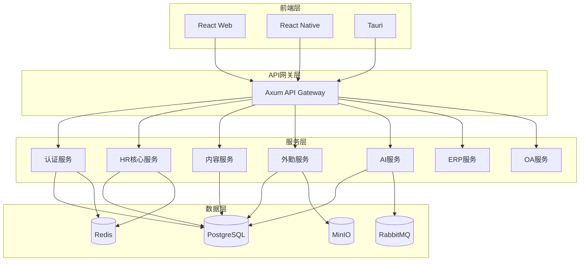
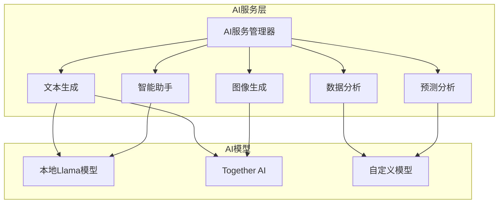
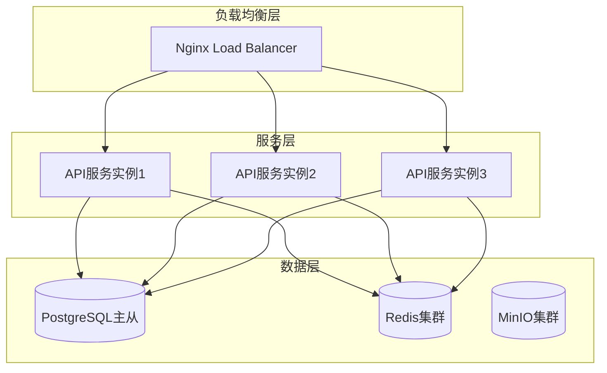
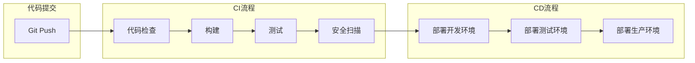

# EMS系统实施方案

## 1. 当前状态评估

### 1.1 已实现功能

| 模块 | 状态 | 说明 |
|------|------|------|
| **后端框架** | ✅ 已完成 | Rust + Axum 基础架构搭建完成 |
| **前端框架** | ✅ 已完成 | React + Vite + TailwindCSS |
| **认证系统** | ✅ 已完成 | JWT认证、用户管理 |
| **HR模块** | ⚠️ 部分完成 | 员工管理API已实现 |
| **CMS模块** | ✅ 已完成 | 文章管理、审核流程 |
| **外勤管理** | ✅ 已完成 | 定位、拍照、录音举证 |
| **AI文生图** | ✅ 已完成 | Together AI FLUX模型集成 |
| **数据库** | ✅ 已完成 | PostgreSQL + Redis配置完成 |

### 1.2 待实现功能

| 模块 | 优先级 | 说明 |
|------|--------|------|
| **ERP模块** | 高 | 财务、采购、销售、库存 |
| **OA模块** | 高 | 审批流程、文档管理、会议管理 |
| **IM模块** | 中 | 即时通讯、群聊、文件传输 |
| **Email模块** | 中 | 邮件系统、邮件营销 |
| **官网模块** | 中 | 内容管理、SEO优化 |
| **AI智能助手** | 高 | 问答、文档摘要、数据分析 |
| **多端适配** | 中 | React Native、TAURI |

---

## 2. 架构改进方案

### 2.1 整体架构调整

### 2.2 AI模块扩展设计

---

## 3. AI功能实施方案

### 3.1 现有AI功能优化

| 功能 | 当前状态 | 改进方案 |
|------|----------|----------|
| **文生图** | 使用FLUX模型 | 添加更多模型选择、支持自定义尺寸 |
| **文章优化** | 基础优化 | 扩展为完整的内容助手 |
| **审核辅助** | 待实现 | AI辅助内容审核 |

### 3.2 新增AI功能

| 功能 | 描述 | 优先级 |
|------|------|--------|
| **智能问答** | 基于企业知识库的问答系统 | 高 |
| **文档摘要** | 自动生成文档摘要 | 高 |
| **数据分析** | 业务数据智能分析报表 | 高 |
| **预测分析** | 销售预测、人力资源规划 | 中 |
| **智能推荐** | 内容推荐、岗位推荐 | 中 |

### 3.3 AI服务API设计

| API端点 | 方法 | 功能 |
|---------|------|------|
| `/api/v1/ai/generate-image` | POST | 文生图 |
| `/api/v1/ai/generate-text` | POST | 文本生成 |
| `/api/v1/ai/summarize` | POST | 文档摘要 |
| `/api/v1/ai/analyze` | POST | 数据分析 |
| `/api/v1/ai/chat` | POST | 智能问答 |
| `/api/v1/ai/predict` | POST | 预测分析 |
| `/api/v1/ai/models` | GET | 获取可用模型列表 |
| `/api/v1/ai/status` | GET | AI服务状态 |

---

## 4. 实施计划

### 4.1 阶段划分（12周计划）

#### 阶段一：基础架构优化（第1-2周）
| 任务 | 负责人 | 完成标准 |
|------|--------|----------|
| 重构API网关 | 后端开发 | 统一路由、中间件 |
| 完善认证系统 | 后端开发 | OAuth2支持、权限细化 |
| 配置中心 | 后端开发 | 集中配置管理 |

#### 阶段二：核心模块完善（第3-6周）
| 任务 | 负责人 | 完成标准 |
|------|--------|----------|
| HR模块完善 | 全栈开发 | 考勤、薪资、绩效 |
| OA审批流程 | 全栈开发 | 工作流引擎 |
| 文档管理系统 | 全栈开发 | 知识库、版本控制 |

#### 阶段三：AI模块扩展（第7-9周）
| 任务 | 负责人 | 完成标准 |
|------|--------|----------|
| 智能助手开发 | AI开发 | 问答、摘要功能 |
| 数据分析模块 | AI开发 | 业务报表分析 |
| 预测分析模块 | AI开发 | 销售预测、HR规划 |
| 模型管理界面 | 前端开发 | 模型配置、监控 |

#### 阶段四：ERP模块开发（第10-11周）
| 任务 | 负责人 | 完成标准 |
|------|--------|----------|
| 采购管理 | 全栈开发 | 供应商、采购订单 |
| 库存管理 | 全栈开发 | 仓库、物料管理 |
| 销售管理 | 全栈开发 | 客户、销售订单 |

#### 阶段五：测试与部署（第12周）
| 任务 | 负责人 | 完成标准 |
|------|--------|----------|
| 功能测试 | 测试人员 | 全量测试用例通过 |
| 性能优化 | 全栈开发 | 响应时间达标 |
| 安全审计 | 安全工程师 | 漏洞扫描通过 |

### 4.2 里程碑

| 里程碑 | 时间 | 交付物 |
|--------|------|--------|
| M1 | 第2周 | API网关重构完成 |
| M2 | 第6周 | HR+OA模块上线 |
| M3 | 第9周 | AI模块上线 |
| M4 | 第11周 | ERP模块上线 |
| M5 | 第12周 | 系统正式上线 |

---

## 5. 技术债务管理

### 5.1 代码规范
- 统一Rust代码风格（rustfmt）
- 统一TypeScript代码风格（ESLint）
- 代码审查流程

### 5.2 测试覆盖
- 单元测试：80%覆盖率
- 集成测试：核心API覆盖
- E2E测试：关键业务流程

### 5.3 文档管理
- API文档：OpenAPI规范
- 技术文档：架构说明、数据库设计
- 用户文档：操作手册

---

## 6. 部署与运维

### 6.1 部署架构

### 6.2 CI/CD流程

---

## 7. 风险评估

| 风险 | 概率 | 影响 | 应对措施 |
|------|------|------|----------|
| AI服务成本 | 中 | 高 | 设置使用限额、监控告警 |
| 性能瓶颈 | 中 | 中 | 缓存策略、负载均衡 |
| 数据安全 | 低 | 高 | 加密传输、定期审计 |
| 技术复杂度 | 中 | 中 | 模块化设计、代码审查 |

---

## 8. 资源需求

### 8.1 人力配置

| 角色 | 人数 | 职责 |
|------|------|------|
| 后端开发 | 2人 | Rust服务开发 |
| 前端开发 | 2人 | React/Web开发 |
| AI开发 | 1人 | AI模型集成 |
| 测试工程师 | 1人 | 测试用例编写 |
| DevOps | 1人 | 部署运维 |

### 8.2 基础设施

| 资源 | 配置 | 用途 |
|------|------|------|
| 服务器 | 4核8G x 3 | API服务 |
| 数据库 | PostgreSQL 16 | 主从复制 |
| 缓存 | Redis 7 | 集群模式 |
| 对象存储 | MinIO | 文件存储 |
| 消息队列 | RabbitMQ | 异步任务 |

---

## 9. 总结

本实施方案基于现有项目基础，参考EMS架构设计文档，制定了12周的实施计划：

1. **架构优化**：完善API网关、认证系统
2. **核心模块**：HR、OA、ERP完整实现
3. **AI扩展**：智能助手、数据分析、预测分析
4. **多端适配**：Web优先，后续扩展移动端

通过模块化设计和微服务架构，确保系统的可扩展性和灵活性，为企业提供全面的数字化管理解决方案。