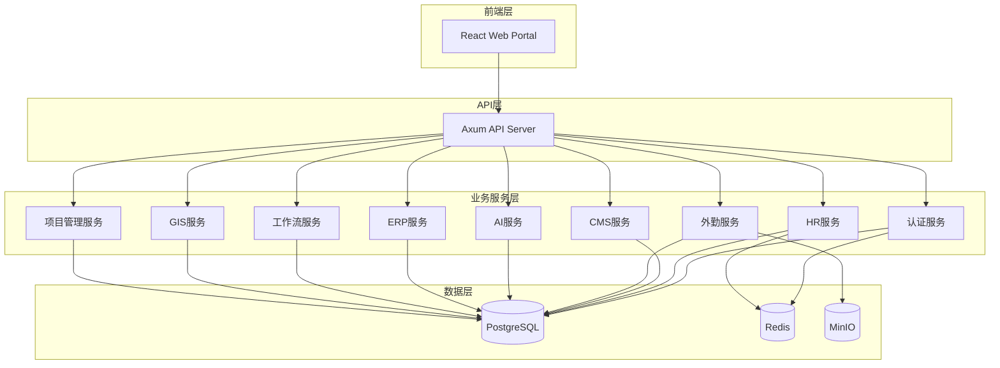
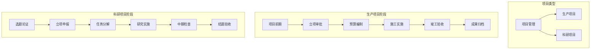

# EMS系统实施方案

**版本**: v2.0  
**更新日期**: 2026-05-14  
**项目状态**: 核心功能已完成，项目管理系统待实施  

---

## 1. 当前状态评估

### 1.1 已实现功能（90%+完成）

| 模块 | 状态 | 后端API | 前端页面 | 说明 |
|------|------|---------|----------|------|
| **后端框架** | ✅ 已完成 | ✅ | ✅ | Rust + Axum 完整基础架构 |
| **前端框架** | ✅ 已完成 | - | ✅ | React + Vite + Ant Design + Zustand |
| **认证系统** | ✅ 已完成 | auth.rs | Login/Register/UserManagement | JWT认证、用户管理、角色权限 |
| **HR模块** | ✅ 已完成 | hr.rs | HrManagement | 员工管理、考勤打卡、请假管理 |
| **CMS模块** | ✅ 已完成 | cms.rs | ContentManagement | 文章管理、审核流程、媒体上传 |
| **外勤管理** | ✅ 已完成 | field.rs | FieldManagement | 定位、拍照、录音举证 |
| **GIS地图** | ✅ 已完成 | gis.rs | GISManagement | 客户、项目、仓库位置管理 |
| **合同管理** | ✅ 已完成 | contract.rs | ContractManagement | 合同全生命周期管理 |
| **物料库** | ✅ 已完成 | material_library.rs | MaterialLibrary | 物料管理、爬虫抓取 |
| **AI模块** | ✅ 已完成 | ai.rs, english_ai.rs | DocumentAI | 文生图、文档优化、英文助手 |
| **工作流/OA** | ✅ 已完成 | workflow.rs | WorkflowManagement | 审批流程、任务管理 |
| **ERP-库存** | ✅ 已完成 | erp_inventory.rs | InventoryManagement | 产品管理、库存监控 |
| **ERP-采购** | ✅ 已完成 | erp_purchase.rs | PurchaseManagement | 采购订单、供应商管理 |
| **ERP-销售** | ✅ 已完成 | erp_sales.rs | SalesManagement | 销售订单、客户管理 |
| **ERP-财务** | ✅ 已完成 | erp_finance.rs | FinanceManagement | 收付款管理、凭证管理 |
| **网站管理** | ✅ 已完成 | website.rs | WebsiteManagement | 网站配置、企业门户 |
| **生产文档** | ✅ 已完成 | production_docs.rs | ProductionDocsManagement | 生产文档管理 |
| **日程管理** | ✅ 已完成 | schedule.rs | ScheduleManagement | 日程事件安排 |
| **帮助中心** | ✅ 已完成 | help.rs | HelpCenter | 分类文章、搜索功能 |
| **字典管理** | ✅ 已完成 | dict.rs | DictManagement | 系统字典数据管理 |
| **Dashboard** | ✅ 已完成 | dashboard.rs | Dashboard | 数据统计、图表展示 |
| **数据库** | ✅ 已完成 | - | - | PostgreSQL + Redis + 完整表结构 |

### 1.2 待实现功能

| 模块 | 优先级 | 说明 |
|------|--------|------|
| **项目管理系统** | 🔴 高 | 生产项目+科研项目全生命周期管理（核心重点） |
| **AI智能对话** | 中 | 基于企业知识库的智能问答助手 |
| **IM模块** | 低 | 即时通讯、群聊、文件传输 |
| **Email模块** | 低 | 邮件系统、邮件营销 |
| **多端适配** | 低 | React Native移动端、TAURI桌面端 |
| **性能优化** | 中 | 数据库查询优化、缓存策略完善 |
| **测试覆盖** | 中 | 单元测试、集成测试、E2E测试 |

### 1.3 进度统计

| 类别 | 总数 | 已完成 | 完成率 |
|------|------|--------|--------|
| 后端API Handler | 29个 | 29个 | 100% |
| 前端页面 | 32个 | 32个 | 100% |
| 数据库表 | 45+ | 45+ | 100% |
| 核心业务模块 | 22个 | 21个 | 95% |

---

## 2. 核心架构

### 2.1 系统架构图

---

## 3. 项目管理系统（核心重点）

### 3.1 系统定位

项目管理是公司业务管理的核心，涵盖生产项目和科研项目的全生命周期管理。

### 3.2 项目分类架构

### 3.3 核心功能模块

| 模块 | 功能描述 |
|------|----------|
| **树状浏览** | 项目→阶段→任务→子任务多级展示，支持拖拽 |
| **快速分类** | 标签系统、智能打标、多维度筛选 |
| **资料归集** | 文档管理、版本控制、全文检索 |
| **组合查询** | 多条件组合、查询模板、跨模块检索 |
| **费用一览** | 成本分析、预算监控、盈利分析 |
| **风险问题** | 风险登记、问题闭环、预警机制 |

### 3.4 数据模型（核心表）

| 表名 | 说明 |
|------|------|
| `projects` | 项目主表 |
| `project_phases` | 项目阶段 |
| `project_tasks` | 任务表（支持父子关系） |
| `project_budgets` | 预算表 |
| `project_costs` | 成本记录表 |
| `project_tags` | 标签表 |
| `project_documents` | 文档表 |
| `project_risks` | 风险表 |
| `project_issues` | 问题表 |
| `project_members` | 项目成员表 |

### 3.5 API端点规划

| API端点 | 方法 | 功能 |
|---------|------|------|
| `/api/v1/projects` | GET/POST | 项目列表/创建 |
| `/api/v1/projects/:id` | GET/PUT/DELETE | 项目详情/更新/删除 |
| `/api/v1/projects/:id/tree` | GET | 树形结构 |
| `/api/v1/projects/:id/tasks` | GET/POST | 任务列表/创建 |
| `/api/v1/tasks/:id` | GET/PUT/DELETE | 任务详情/更新/删除 |
| `/api/v1/projects/:id/budget` | GET/POST | 预算管理 |
| `/api/v1/projects/:id/costs` | GET/POST | 成本记录 |
| `/api/v1/projects/:id/risks` | GET/POST | 风险管理 |
| `/api/v1/projects/:id/issues` | GET/POST | 问题管理 |
| `/api/v1/projects/:id/documents` | GET/POST | 文档管理 |

---

## 4. 实施计划

### 4.1 阶段划分（8周计划）

#### 阶段一：需求分析与设计（第1周）
| 任务 | 负责人 | 完成标准 |
|------|--------|----------|
| 业务需求调研 | 产品经理 | 需求文档 |
| 数据模型设计 | 架构师 | ER图、数据表设计 |
| API接口设计 | 后端开发 | 接口文档 |
| 前端页面设计 | UI设计 | 页面原型 |

#### 阶段二：后端开发（第2-4周）
| 任务 | 负责人 | 完成标准 |
|------|--------|----------|
| 数据库迁移 | 后端开发 | 表结构创建 |
| 项目CRUD接口 | 后端开发 | 基础增删改查 |
| 阶段与任务接口 | 后端开发 | 任务管理API |
| 预算成本接口 | 后端开发 | 成本管理API |
| 资源管理接口 | 后端开发 | 资源分配API |
| 质量检查接口 | 后端开发 | 质量管理API |
| 文档管理接口 | 后端开发 | 文档上传API |
| 统计报表接口 | 后端开发 | 数据统计API |

#### 阶段三：前端开发（第3-5周）
| 任务 | 负责人 | 完成标准 |
|------|--------|----------|
| 项目列表页 | 前端开发 | 列表展示、筛选搜索 |
| 项目详情页 | 前端开发 | 概览、标签页布局 |
| 树形浏览页 | 前端开发 | 树形结构、拖拽操作 |
| 任务管理页 | 前端开发 | 任务列表、甘特图 |
| 预算成本页 | 前端开发 | 预算表单、成本图表 |
| 资源管理页 | 前端开发 | 人员物料分配 |
| 质量管理页 | 前端开发 | 检查记录、问题跟踪 |
| 统计报表页 | 前端开发 | 数据可视化 |

#### 阶段四：集成测试（第6周）
| 任务 | 负责人 | 完成标准 |
|------|--------|----------|
| API接口测试 | 测试人员 | 接口覆盖率90%+ |
| 前端功能测试 | 测试人员 | 核心流程通过 |
| 关联模块集成 | 开发人员 | 与HR/ERP/OA集成测试 |
| 性能测试 | DevOps | 响应时间达标 |

#### 阶段五：上线部署（第7-8周）
| 任务 | 负责人 | 完成标准 |
|------|--------|----------|
| 用户培训 | 产品经理 | 操作手册、培训文档 |
| 数据初始化 | 运维人员 | 基础数据导入 |
| 灰度发布 | DevOps | 测试环境验证 |
| 正式上线 | DevOps | 生产环境部署 |

### 4.2 里程碑

| 里程碑 | 时间 | 交付物 |
|--------|------|--------|
| M1 | 第1周 | 需求设计文档完成 |
| M2 | 第4周 | 后端API开发完成 |
| M3 | 第5周 | 前端页面开发完成 |
| M4 | 第6周 | 集成测试通过 |
| M5 | 第8周 | 项目管理系统上线 |

### 4.3 资源需求

| 角色 | 人数 | 职责 |
|------|------|------|
| 产品经理 | 1人 | 需求分析、文档编写 |
| 后端开发 | 1-2人 | Rust服务开发 |
| 前端开发 | 1-2人 | React页面开发 |
| 测试工程师 | 1人 | 测试用例编写 |
| DevOps | 1人 | 部署运维 |

---

## 5. 风险评估

| 风险 | 概率 | 影响 | 应对措施 |
|------|------|------|----------|
| 需求变更 | 高 | 中 | 需求评审、变更控制流程 |
| 技术复杂度 | 中 | 中 | 模块化设计、代码审查 |
| 进度延迟 | 中 | 中 | 里程碑跟踪、每日站会 |
| 数据安全 | 低 | 高 | 加密传输、定期审计 |
| 性能瓶颈 | 中 | 中 | 缓存策略、负载均衡 |

---

## 6. 技术债务管理

### 6.1 代码规范
- 统一Rust代码风格（rustfmt）
- 统一TypeScript代码风格（ESLint）
- 代码审查流程

### 6.2 测试覆盖
- 单元测试：80%覆盖率
- 集成测试：核心API覆盖
- E2E测试：关键业务流程

### 6.3 文档管理
- API文档：OpenAPI规范
- 技术文档：架构说明、数据库设计
- 用户文档：操作手册

---

## 7. 总结

### 已完成亮点
1. **完整后端**：29个API Handler全部完成
2. **丰富前端**：32个页面全部实现
3. **ERP系统**：库存、采购、销售、财务完整实现
4. **AI能力**：文生图、文档优化、审批助手等多个AI功能
5. **工作流系统**：完整的审批流程引擎
6. **外勤与GIS**：定位、拍照、地图管理

### 核心重点
**项目管理系统**是下一阶段的核心重点，涵盖：
- 生产项目：前期、立项、预算、施工、验收、归档全流程
- 科研项目：选题、申报、实施、中期检查、结题全流程
- 资源管理：人、财、物统一调配与实时监控
- 成本控制：实时成本统计、盈利分析、预算预警

### 实施路线图

通过模块化设计和微服务架构，系统具有良好的可扩展性和维护性，为企业提供全面的数字化管理解决方案。

---

**文档版本历史**

| 版本 | 日期 | 变更说明 |
|------|------|----------|
| v1.0 | 2026-05-13 | 初始版本 |
| v2.0 | 2026-05-14 | 更新实际进度，聚焦项目管理系统 |
