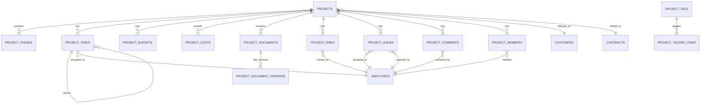

# 项目管理系统详细设计文档

**版本**: v1.0  
**创建日期**: 2026-05-13  
**状态**: 待评审  

---

## 目录

1. [概述](#1-概述)
2. [核心功能详细设计](#2-核心功能详细设计)
   2.1 [树状浏览](#21-树状浏览)
   2.2 [快速分类与标签系统](#22-快速分类与标签系统)
   2.3 [资料快速归集](#23-资料快速归集)
   2.4 [组合查询](#24-组合查询)
   2.5 [费用一览](#25-费用一览)
3. [扩展功能设计](#3-扩展功能设计)
   3.1 [甘特图可视化](#31-甘特图可视化)
   3.2 [风险与问题管理](#32-风险与问题管理)
   3.3 [团队协作](#33-团队协作)
4. [数据模型细化](#4-数据模型细化)
5. [API接口细化](#5-api接口细化)
6. [前端页面细化](#6-前端页面细化)
7. [性能优化方案](#7-性能优化方案)

---

## 1. 概述

项目管理系统是公司业务管理的核心，涵盖生产项目和科研项目的全生命周期管理。本设计文档详细描述了以下核心功能：

| 功能模块 | 核心能力 | 业务价值 |
|----------|----------|----------|
| 树状浏览 | 多级树形结构、拖拽操作 | 清晰展示项目层级关系 |
| 快速分类 | 标签系统、智能分类 | 快速定位和管理项目 |
| 资料归集 | 文档管理、版本控制 | 统一管理项目资料 |
| 组合查询 | 多条件筛选、保存模板 | 高效检索项目信息 |
| 费用一览 | 成本分析、预算监控 | 实时掌握项目成本 |

---

## 2. 核心功能详细设计

### 2.1 树状浏览

#### 2.1.1 功能概述

树状浏览提供项目、阶段、任务的多级层级展示，支持无限层级嵌套。

#### 2.1.2 功能特性

| 特性 | 描述 | 交互方式 |
|------|------|----------|
| 多级展开/折叠 | 支持项目→阶段→任务→子任务的无限层级 | 点击展开/折叠图标 |
| 树形拖拽 | 支持任务拖拽调整层级和顺序 | 鼠标拖拽 |
| 树形搜索 | 在树形结构中快速定位节点 | 输入框搜索，高亮匹配项 |
| 批量选择 | 支持选中多个节点进行批量操作 | Ctrl+点击多选 |
| 上下文菜单 | 右键弹出操作菜单 | 右键点击节点 |

#### 2.1.3 数据结构

```typescript
interface TreeNode {
  id: string;
  name: string;
  type: 'project' | 'phase' | 'task' | 'subtask';
  parentId: string | null;
  status: 'pending' | 'in_progress' | 'completed' | 'blocked';
  progress: number; // 0-100
  children?: TreeNode[];
  expanded?: boolean;
  selected?: boolean;
}
```

#### 2.1.4 操作接口

| 操作 | 说明 | 参数 |
|------|------|------|
| `expand(nodeId)` | 展开节点 | nodeId: string |
| `collapse(nodeId)` | 折叠节点 | nodeId: string |
| `expandAll()` | 展开所有节点 | 无 |
| `collapseAll()` | 折叠所有节点 | 无 |
| `moveNode(nodeId, targetParentId, index)` | 移动节点 | nodeId, targetParentId, index |
| `search(keyword)` | 搜索节点 | keyword: string |

---

### 2.2 快速分类与标签系统

#### 2.2.1 功能概述

标签系统允许用户自定义标签，对项目和任务进行分类管理。

#### 2.2.2 标签分类

| 标签类别 | 说明 | 示例标签 |
|----------|------|----------|
| 优先级 | 任务优先级 | 紧急、高、中、低 |
| 类型 | 任务类型 | 开发、测试、文档、会议 |
| 状态 | 自定义状态 | 待确认、进行中、待审核 |
| 风险 | 风险等级 | 高风险、中风险、低风险 |
| 自定义 | 用户自定义 | 重点项目、战略项目 |

#### 2.2.3 功能特性

| 特性 | 描述 |
|------|------|
| 标签创建 | 用户可创建自定义标签 |
| 标签分组 | 标签按类别管理 |
| 智能打标 | 根据规则自动打标签 |
| 标签统计 | 按标签维度统计 |
| 标签筛选 | 按标签筛选项目/任务 |

#### 2.2.4 数据结构

```typescript
interface Tag {
  id: string;
  name: string;
  color: string; // 标签颜色
  category: string; // 标签类别
  description: string;
  createdAt: Date;
}

interface TaggedItem {
  tagId: string;
  itemId: string; // 项目或任务ID
  itemType: 'project' | 'task';
  addedAt: Date;
}
```

#### 2.2.5 智能打标规则

| 规则 | 触发条件 | 自动标签 |
|------|----------|----------|
| 超预算预警 | 实际成本 > 预算的110% | 超预算 |
| 延期预警 | 任务逾期 > 3天 | 延期风险 |
| 高优先级 | 优先级=紧急且逾期 | 重点关注 |
| 里程碑临近 | 里程碑日期 < 7天 | 即将到期 |

---

### 2.3 资料快速归集

#### 2.3.1 功能概述

资料归集提供项目文档的统一管理，支持版本控制和全文检索。

#### 2.3.2 文档分类

| 文档类型 | 说明 | 存储格式 |
|----------|------|----------|
| 项目文档 | 立项书、方案、报告 | PDF、Word、Excel |
| 过程记录 | 会议纪要、日志 | Markdown、文本 |
| 成果文件 | 竣工资料、研究成果 | 任意格式 |
| 图片视频 | 现场照片、视频 | JPG、PNG、MP4 |

#### 2.3.3 功能特性

| 特性 | 描述 |
|------|------|
| 智能关联 | 上传文件自动识别关联项目/任务 |
| 版本管理 | 文档版本历史、对比、回滚 |
| 全文检索 | 支持文档内容搜索 |
| 权限控制 | 细粒度文档权限 |
| 预览功能 | 在线预览文档 |

#### 2.3.4 数据结构

```typescript
interface Document {
  id: string;
  projectId: string;
  taskId?: string;
  title: string;
  type: 'project' | 'meeting' | 'report' | 'image' | 'video' | 'other';
  filePath: string; // MinIO路径
  size: number; // 文件大小（字节）
  version: number;
  uploadedBy: string;
  uploadedAt: Date;
  tags: string[];
}

interface DocumentVersion {
  id: string;
  documentId: string;
  version: number;
  filePath: string;
  changeLog: string;
  createdAt: Date;
  createdBy: string;
}
```

#### 2.3.5 全文检索能力

| 支持格式 | 说明 |
|----------|------|
| PDF | 提取文本内容建立索引 |
| Word | 提取文本内容 |
| Excel | 提取单元格内容 |
| Markdown | 直接索引 |
| 图片 | OCR识别（可选） |

---

### 2.4 组合查询

#### 2.4.1 功能概述

组合查询支持多条件逻辑组合，快速定位目标项目/任务。

#### 2.4.2 查询维度

| 维度 | 字段 | 操作符 |
|------|------|--------|
| 基本信息 | 项目名称、编号 | 包含、等于、不等于 |
| 状态 | 项目状态、任务状态 | 等于、不等于、在列表中 |
| 时间 | 创建时间、开始时间、结束时间 | 大于、小于、在范围内 |
| 人员 | 负责人、成员 | 等于、包含 |
| 成本 | 预算、实际成本 | 大于、小于、等于 |
| 标签 | 标签名称 | 包含、不包含 |

#### 2.4.3 功能特性

| 特性 | 描述 |
|------|------|
| 多条件组合 | 支持 AND/OR 逻辑 |
| 保存模板 | 常用查询保存为模板 |
| 动态筛选 | 实时更新结果 |
| 跨模块查询 | 关联客户、合同等 |
| 导出结果 | 支持Excel/PDF导出 |

#### 2.4.4 查询模板管理

```typescript
interface QueryTemplate {
  id: string;
  name: string;
  description: string;
  query: QueryCondition;
  shared: boolean;
  createdAt: Date;
  createdBy: string;
}

interface QueryCondition {
  conditions: Condition[];
  logic: 'AND' | 'OR';
}

interface Condition {
  field: string;
  operator: '=' | '<>' | '>' | '<' | '>=' | '<=' | 'LIKE' | 'IN';
  value: string | number | Date | string[];
}
```

#### 2.4.5 常用查询模板示例

| 模板名称 | 查询条件 | 使用场景 |
|----------|----------|----------|
| 我的进行中任务 | 负责人=当前用户 AND 状态=进行中 | 个人任务管理 |
| 超预算项目 | 实际成本 > 预算 * 1.1 | 成本监控 |
| 本周到期任务 | 截止日期 >= 本周一 AND 截止日期 <= 本周日 | 周报准备 |
| 风险项目 | 标签包含"高风险" | 风险管理 |

---

### 2.5 费用一览

#### 2.5.1 功能概述

费用一览提供项目成本的全面视图，支持预算监控和成本分析。

#### 2.5.2 费用分类

| 费用类别 | 说明 | 示例 |
|----------|------|------|
| 人工成本 | 人员工资、加班费 | 项目经理工资、加班补贴 |
| 物料成本 | 原材料、设备采购 | 水泥、钢筋、设备 |
| 外包成本 | 外包服务费用 | 设计外包、咨询服务 |
| 差旅费用 | 交通、住宿、餐饮 | 机票、酒店、餐费 |
| 其他费用 | 水电费、办公费等 | 水电费、办公用品 |

#### 2.5.3 功能特性

| 特性 | 描述 |
|------|------|
| 成本瀑布图 | 各项费用占比可视化 |
| 预算执行率 | 实时显示预算使用情况 |
| 成本趋势 | 费用变化趋势图表 |
| 费用对比 | 项目间成本对比 |
| 成本预警 | 超预算自动提醒 |

#### 2.5.4 成本分析指标

| 指标 | 计算公式 | 说明 |
|------|----------|------|
| 预算执行率 | 实际成本 / 预算 * 100% | 预算使用比例 |
| 成本偏差 | 实际成本 - 预算 | 成本差异 |
| 成本偏差率 | (实际成本 - 预算) / 预算 * 100% | 偏差比例 |
| 挣值 | 已完成工作量 * 预算 | 项目价值 |
| 进度偏差 | 挣值 - 计划价值 | 进度差异 |

#### 2.5.5 数据结构

```typescript
interface CostRecord {
  id: string;
  projectId: string;
  category: 'labor' | 'material' | 'outsourcing' | 'travel' | 'other';
  amount: number;
  description: string;
  date: Date;
  invoiceNo?: string;
  createdBy: string;
}

interface Budget {
  id: string;
  projectId: string;
  category: string;
  amount: number;
  description: string;
  createdAt: Date;
}

interface CostSummary {
  projectId: string;
  totalBudget: number;
  totalActual: number;
  budgetExecutionRate: number;
  costVariance: number;
  costVarianceRate: number;
  categoryBreakdown: { category: string; budget: number; actual: number }[];
}
```

---

## 3. 扩展功能设计

### 3.1 甘特图可视化

#### 3.1.1 功能概述

甘特图提供项目进度的时间轴可视化展示。

#### 3.1.2 功能特性

| 特性 | 描述 |
|------|------|
| 交互式甘特图 | 拖拽调整任务时间 |
| 资源负载视图 | 显示人员/设备负载 |
| 关键路径标识 | 自动识别关键路径 |
| 里程碑标注 | 重要节点可视化 |
| 时间缩放 | 支持日/周/月视图 |

#### 3.1.3 甘特图数据结构

```typescript
interface GanttTask {
  id: string;
  name: string;
  startDate: Date;
  endDate: Date;
  progress: number;
  dependencies: string[]; // 依赖任务ID
  resource?: string; // 负责人ID
  type: 'task' | 'milestone';
  color?: string;
}
```

---

### 3.2 风险与问题管理

#### 3.2.1 功能概述

风险与问题管理提供项目风险识别、评估和跟踪能力。

#### 3.2.2 功能特性

| 特性 | 描述 |
|------|------|
| 风险登记 | 识别、评估项目风险 |
| 问题闭环 | 问题上报→分配→处理→验收 |
| 预警机制 | 风险阈值自动触发通知 |
| 风险报表 | 风险分布、趋势分析 |

#### 3.2.3 数据结构

```typescript
interface Risk {
  id: string;
  projectId: string;
  title: string;
  description: string;
  probability: 'low' | 'medium' | 'high'; // 发生概率
  impact: 'low' | 'medium' | 'high'; // 影响程度
  riskLevel: 'low' | 'medium' | 'high' | 'critical'; // 综合风险等级
  mitigationPlan: string; // 缓解措施
  owner: string; // 负责人
  status: 'identified' | 'monitoring' | 'resolved' | 'closed';
  createdAt: Date;
}

interface Issue {
  id: string;
  projectId: string;
  taskId?: string;
  title: string;
  description: string;
  severity: 'low' | 'medium' | 'high' | 'critical';
  status: 'open' | 'assigned' | 'in_progress' | 'resolved' | 'closed';
  assignee: string;
  reporter: string;
  createdAt: Date;
  resolvedAt?: Date;
}
```

---

### 3.3 团队协作

#### 3.3.1 功能概述

团队协作功能支持项目成员之间的高效沟通和协作。

#### 3.3.2 功能特性

| 特性 | 描述 |
|------|------|
| @提及功能 | 任务中@相关人员 |
| 消息通知 | 实时推送任务变更 |
| 团队看板 | 成员工作负载视图 |
| 周报自动生成 | 基于任务完成情况 |
| 在线讨论 | 项目/任务讨论区 |

#### 3.3.3 数据结构

```typescript
interface Notification {
  id: string;
  userId: string;
  type: 'task_assigned' | 'task_completed' | 'comment_mentioned' | 'approval_required';
  message: string;
  link: string;
  read: boolean;
  createdAt: Date;
}

interface Comment {
  id: string;
  projectId?: string;
  taskId?: string;
  content: string;
  author: string;
  mentions: string[]; // @提及的用户ID
  createdAt: Date;
}
```

---

## 4. 数据模型细化

### 4.1 核心数据表

| 表名 | 说明 | 关键字段 |
|------|------|----------|
| `projects` | 项目主表 | id, name, type, status, department_id, manager_id, start_date, end_date, budget, description |
| `project_phases` | 项目阶段 | id, project_id, name, description, order_num, start_date, end_date, status |
| `project_tasks` | 任务表 | id, project_id, phase_id, parent_id, name, description, assignee_id, status, priority, start_date, end_date, progress |
| `project_budgets` | 预算表 | id, project_id, category, amount, description, created_at |
| `project_costs` | 成本记录表 | id, project_id, category, amount, description, date, invoice_no, created_by |
| `project_tags` | 标签表 | id, name, color, category, description |
| `project_tagged_items` | 标签关联表 | id, tag_id, item_id, item_type |
| `project_documents` | 文档表 | id, project_id, task_id, title, type, file_path, size, version, uploaded_by, uploaded_at |
| `project_document_versions` | 文档版本表 | id, document_id, version, file_path, change_log, created_at, created_by |
| `project_risks` | 风险表 | id, project_id, title, description, probability, impact, risk_level, mitigation_plan, owner, status |
| `project_issues` | 问题表 | id, project_id, task_id, title, description, severity, status, assignee, reporter, created_at, resolved_at |
| `project_comments` | 评论表 | id, project_id, task_id, content, author, mentions, created_at |
| `project_members` | 项目成员表 | id, project_id, user_id, role, joined_at |

### 4.2 ER关系图



---

## 5. API接口细化

### 5.1 项目管理API

| API端点 | 方法 | 功能 | 参数 |
|---------|------|------|------|
| `/api/v1/projects` | GET | 获取项目列表 | page, size, status, type, keyword |
| `/api/v1/projects` | POST | 创建项目 | name, type, department_id, manager_id, start_date, end_date, budget, description |
| `/api/v1/projects/:id` | GET | 获取项目详情 | id |
| `/api/v1/projects/:id` | PUT | 更新项目 | name, status, manager_id, end_date, budget, description |
| `/api/v1/projects/:id` | DELETE | 删除项目 | id |
| `/api/v1/projects/:id/tree` | GET | 获取项目树形结构 | id |
| `/api/v1/projects/:id/members` | GET | 获取项目成员 | id |
| `/api/v1/projects/:id/members` | POST | 添加项目成员 | user_id, role |
| `/api/v1/projects/:id/members/:user_id` | DELETE | 移除项目成员 | user_id |

### 5.2 任务管理API

| API端点 | 方法 | 功能 | 参数 |
|---------|------|------|------|
| `/api/v1/projects/:id/tasks` | GET | 获取任务列表 | project_id, status, assignee_id |
| `/api/v1/projects/:id/tasks` | POST | 创建任务 | phase_id, parent_id, name, description, assignee_id, priority, start_date, end_date |
| `/api/v1/tasks/:id` | GET | 获取任务详情 | id |
| `/api/v1/tasks/:id` | PUT | 更新任务 | name, status, progress, assignee_id, end_date |
| `/api/v1/tasks/:id` | DELETE | 删除任务 | id |
| `/api/v1/tasks/:id/move` | PUT | 移动任务 | target_parent_id, index |

### 5.3 标签管理API

| API端点 | 方法 | 功能 | 参数 |
|---------|------|------|------|
| `/api/v1/tags` | GET | 获取标签列表 | category |
| `/api/v1/tags` | POST | 创建标签 | name, color, category, description |
| `/api/v1/tags/:id` | PUT | 更新标签 | name, color, category, description |
| `/api/v1/tags/:id` | DELETE | 删除标签 | id |
| `/api/v1/tags/:id/items` | POST | 为项目/任务打标签 | item_id, item_type |
| `/api/v1/tags/:id/items/:item_id` | DELETE | 移除标签 | item_id |

### 5.4 文档管理API

| API端点 | 方法 | 功能 | 参数 |
|---------|------|------|------|
| `/api/v1/projects/:id/documents` | GET | 获取项目文档 | project_id |
| `/api/v1/projects/:id/documents` | POST | 上传文档 | file, title, type, task_id |
| `/api/v1/documents/:id` | GET | 获取文档详情 | id |
| `/api/v1/documents/:id` | PUT | 更新文档信息 | title, tags |
| `/api/v1/documents/:id` | DELETE | 删除文档 | id |
| `/api/v1/documents/:id/versions` | GET | 获取文档版本历史 | id |
| `/api/v1/documents/:id/versions/:version` | GET | 获取指定版本 | version |
| `/api/v1/documents/:id/versions/:version/restore` | POST | 回滚到指定版本 | version |

### 5.5 查询API

| API端点 | 方法 | 功能 | 参数 |
|---------|------|------|------|
| `/api/v1/search/projects` | POST | 组合查询项目 | conditions, logic, page, size |
| `/api/v1/search/tasks` | POST | 组合查询任务 | conditions, logic, page, size |
| `/api/v1/query-templates` | GET | 获取查询模板列表 | 无 |
| `/api/v1/query-templates` | POST | 创建查询模板 | name, description, query |
| `/api/v1/query-templates/:id` | PUT | 更新查询模板 | name, description, query |
| `/api/v1/query-templates/:id` | DELETE | 删除查询模板 | id |

### 5.6 成本管理API

| API端点 | 方法 | 功能 | 参数 |
|---------|------|------|------|
| `/api/v1/projects/:id/budget` | GET | 获取项目预算 | project_id |
| `/api/v1/projects/:id/budget` | POST | 创建预算 | category, amount, description |
| `/api/v1/projects/:id/costs` | GET | 获取成本记录 | project_id, category, start_date, end_date |
| `/api/v1/projects/:id/costs` | POST | 添加成本记录 | category, amount, description, date, invoice_no |
| `/api/v1/projects/:id/costs/summary` | GET | 获取成本汇总 | project_id |

### 5.7 风险与问题API

| API端点 | 方法 | 功能 | 参数 |
|---------|------|------|------|
| `/api/v1/projects/:id/risks` | GET | 获取项目风险 | project_id |
| `/api/v1/projects/:id/risks` | POST | 创建风险 | title, description, probability, impact, mitigation_plan, owner |
| `/api/v1/risks/:id` | PUT | 更新风险 | title, description, probability, impact, status |
| `/api/v1/risks/:id` | DELETE | 删除风险 | id |
| `/api/v1/projects/:id/issues` | GET | 获取项目问题 | project_id, status, severity |
| `/api/v1/projects/:id/issues` | POST | 创建问题 | title, description, severity, assignee |
| `/api/v1/issues/:id` | PUT | 更新问题 | title, description, status, assignee |
| `/api/v1/issues/:id` | DELETE | 删除问题 | id |

---

## 6. 前端页面细化

### 6.1 页面结构

| 页面路径 | 页面名称 | 功能描述 |
|----------|----------|----------|
| `/projects` | 项目列表页 | 项目卡片列表、搜索筛选、创建入口、统计卡片 |
| `/projects/tree` | 树形浏览页 | 项目树形结构展示、拖拽操作、快速定位 |
| `/projects/:id` | 项目详情页 | 项目概览、进度、成本、资源、风险汇总 |
| `/projects/:id/phases` | 阶段管理页 | 阶段列表、新增/编辑/删除阶段 |
| `/projects/:id/tasks` | 任务管理页 | 任务列表、甘特图、任务分配、状态更新 |
| `/projects/:id/budget` | 预算管理页 | 预算编制、成本统计、预算执行率 |
| `/projects/:id/resources` | 资源管理页 | 人员分配、物料领用、设备调度 |
| `/projects/:id/quality` | 质量管理页 | 质量检查、安全隐患、问题跟踪 |
| `/projects/:id/documents` | 文档管理页 | 文档列表、上传下载、版本管理 |
| `/projects/:id/risks` | 风险管理页 | 风险登记、评估、跟踪 |
| `/projects/statistics` | 统计报表页 | 全局统计、成本分析、进度分析 |

### 6.2 页面详细设计

#### 6.2.1 项目列表页

```
┌─────────────────────────────────────────────────────────────┐
│  搜索框 │ 筛选按钮 │  创建项目按钮                            │
├─────────────────────────────────────────────────────────────┤
│  ┌─────────────┐  ┌─────────────┐  ┌─────────────┐         │
│  │ 统计卡片1    │  │ 统计卡片2    │  │ 统计卡片3    │ ...     │
│  │ 项目总数    │  │ 进行中      │  │ 已完成      │         │
│  │    15      │  │    8        │  │    5        │         │
│  └─────────────┘  └─────────────┘  └─────────────┘         │
├─────────────────────────────────────────────────────────────┤
│  ┌───────────────────────────────────────────────────────┐ │
│  │ 项目卡片                                              │ │
│  │ ┌──────┐  项目编号: P2024001                         │ │
│  │ │ 图标 │  项目名称: 北京XX项目                         │ │
│  │ └──────┘  类型: 生产项目  │ 状态: 进行中              │ │
│  │           负责人: 张三     │ 进度: ████████████ 75%   │ │
│  │           预算: ¥1,000,000 │ 成本: ¥850,000          │ │
│  └───────────────────────────────────────────────────────┘ │
│  ┌───────────────────────────────────────────────────────┐ │
│  │ 项目卡片2 ...                                          │ │
│  └───────────────────────────────────────────────────────┘ │
├─────────────────────────────────────────────────────────────┤
│  分页控件                                                   │
└─────────────────────────────────────────────────────────────┘
```

#### 6.2.2 树形浏览页

```
┌─────────────────────────────────────────────────────────────┐
│  搜索框 │ 展开全部 │ 折叠全部 │  导出按钮                      │
├─────────────────────────────────────────────────────────────┤
│  ┌───────────────────────────────────────────────────────┐ │
│  │ [▶] 项目A                                              │ │
│  │   [▶] 阶段1                                            │ │
│  │     [▶] 任务1                                          │ │
│  │       ├─ 子任务1.1 ✓                                   │ │
│  │       └─ 子任务1.2 ⚠️                                  │ │
│  │     └─ 任务2 ○                                        │ │
│  │   └─ 阶段2 ○                                          │ │
│  │ [▼] 项目B                                              │ │
│  │   ├─ 阶段1 ✓                                          │ │
│  │   └─ 阶段2 ○                                          │ │
│  └───────────────────────────────────────────────────────┘ │
├─────────────────────────────────────────────────────────────┤
│  选中节点详情面板                                           │
└─────────────────────────────────────────────────────────────┘
```

#### 6.2.3 项目详情页

```
┌─────────────────────────────────────────────────────────────┐
│  项目名称 │ 状态标签 │ 负责人 │ 预算 │ 进度条                │
├─────────────────────────────────────────────────────────────┤
│  ┌──────┬──────┬──────┬──────┬──────┬──────┐             │
│  │ 概览 │ 进度 │ 成本 │ 资源 │ 风险 │ 文档 │             │
│  └──────┴──────┴──────┴──────┴──────┴──────┘             │
├─────────────────────────────────────────────────────────────┤
│  标签页内容区域                                             │
│  - 概览: 项目描述、关键日期、团队成员                        │
│  - 进度: 甘特图、里程碑状态                                 │
│  - 成本: 预算vs实际对比图表                                 │
│  - 资源: 人员分配、物料消耗                                 │
│  - 风险: 风险列表、预警状态                                 │
│  - 文档: 文档列表、上传入口                                 │
└─────────────────────────────────────────────────────────────┘
```

#### 6.2.4 费用一览页

```
┌─────────────────────────────────────────────────────────────┐
│  时间范围选择 │ 导出按钮                                     │
├─────────────────────────────────────────────────────────────┤
│  ┌───────────────────────────────────────────────────────┐ │
│  │ 成本统计卡片                                            │ │
│  │ ┌─────────┐ ┌─────────┐ ┌─────────┐ ┌─────────┐       │ │
│  │ │总预算  │ │已使用   │ │剩余    │ │执行率  │       │ │
│  │ │¥100万  │ │¥85万   │ │¥15万   │ │ 85%    │       │ │
│  │ └─────────┘ └─────────┘ └─────────┘ └─────────┘       │ │
│  └───────────────────────────────────────────────────────┘ │
├─────────────────────────────────────────────────────────────┤
│  ┌───────────────────────────────────────────────────────┐ │
│  │ 成本瀑布图 / 饼图                                       │ │
│  │ 显示各项费用占比                                        │ │
│  └───────────────────────────────────────────────────────┘ │
├─────────────────────────────────────────────────────────────┤
│  ┌───────────────────────────────────────────────────────┐ │
│  │ 成本明细表                                              │ │
│  │ 日期 │ 类别 │ 金额 │ 描述 │ 操作                        │ │
│  └───────────────────────────────────────────────────────┘ │
└─────────────────────────────────────────────────────────────┘
```

---

## 7. 性能优化方案

### 7.1 前端优化

| 优化项 | 实现方式 | 预期效果 |
|--------|----------|----------|
| 虚拟滚动 | 使用 react-window 库 | 大数据量列表流畅滚动 |
| 懒加载 | Intersection Observer API | 按需加载图片和组件 |
| 缓存策略 | localStorage + sessionStorage | 减少重复请求 |
| Web Worker | 复杂计算后台执行 | 不阻塞主线程 |
| 代码分割 | React.lazy + Suspense | 按需加载组件 |

### 7.2 后端优化

| 优化项 | 实现方式 | 预期效果 |
|--------|----------|----------|
| 数据库索引 | 高频查询字段建立索引 | 查询速度提升 |
| 分页优化 | Keyset分页替代offset分页 | 大数据量分页性能提升 |
| 缓存层 | Redis缓存热点数据 | 减少数据库查询 |
| 异步任务 | RabbitMQ异步处理 | 非实时操作异步化 |
| 读写分离 | 主库写、从库读 | 减轻主库压力 |

### 7.3 数据库优化

| 优化项 | 实现方式 | 适用场景 |
|--------|----------|----------|
| 索引优化 | B-tree索引、复合索引 | 高频查询 |
| 分区表 | 按时间/项目分区 | 历史数据查询 |
| 查询优化 | EXPLAIN分析、优化SQL | 慢查询优化 |
| 连接池 | PgBouncer连接池 | 高并发场景 |

### 7.4 优化路线图

| 阶段 | 优化重点 | 时间 |
|------|----------|------|
| 第一阶段 | 前端基础优化（虚拟滚动、懒加载） | 1-2周 |
| 第二阶段 | 后端索引优化、缓存策略 | 2-3周 |
| 第三阶段 | 数据库读写分离、异步任务 | 3-4周 |
| 第四阶段 | CDN加速、边缘计算 | 长期 |

---

## 附录

### A. 权限矩阵

| 角色 | 项目列表 | 创建项目 | 编辑项目 | 删除项目 | 任务管理 | 成本管理 | 风险管理 |
|------|----------|----------|----------|----------|----------|----------|----------|
| 管理员 | ✓ | ✓ | ✓ | ✓ | ✓ | ✓ | ✓ |
| 项目经理 | ✓ | ✓ | ✓ | ✓ | ✓ | ✓ | ✓ |
| 项目成员 | ✓ | ✗ | ✗ | ✗ | ✓ (分配的任务) | ✓ (查看) | ✓ (查看/上报) |
| 访客 | ✓ (公开项目) | ✗ | ✗ | ✗ | ✗ | ✗ | ✗ |

### B. 数据导出格式

| 格式 | 支持内容 | 说明 |
|------|----------|------|
| Excel (.xlsx) | 项目列表、任务列表、成本明细 | 包含表头、样式 |
| PDF | 项目报告、统计报表 | A4格式、分页 |
| CSV | 数据导出 | 简单格式、便于导入 |

---

**文档版本历史**

| 版本 | 日期 | 作者 | 变更说明 |
|------|------|------|----------|
| v1.0 | 2026-05-13 | 系统管理员 | 初始版本 |
